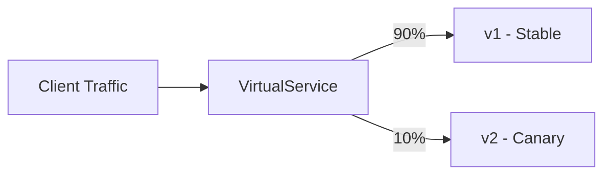

# How to Perform Gradual Traffic Shifting in Istio

Author: [nawazdhandala](https://github.com/nawazdhandala)

Tags: Istio, Service Mesh, Traffic Management, Canary Deployment, Kubernetes

Description: Step-by-step guide to gradually shifting traffic between service versions in Istio using weighted routing in VirtualService configurations.

---

Gradual traffic shifting is the practice of slowly moving traffic from one version of a service to another. Instead of flipping a switch and sending 100% of traffic to a new version, you start at 5%, watch for problems, then move to 10%, 25%, 50%, and finally 100%. If something goes wrong at any step, you roll back. Istio makes this straightforward with weighted routing in VirtualService resources.

## The Basic Concept

Istio's VirtualService allows you to assign weights to different destinations. A weight of 90 on v1 and 10 on v2 means roughly 90% of requests go to v1 and 10% go to v2. The weights do not have to add up to 100, but it is clearest when they do.



## Setting Up the Prerequisites

First, you need two versions of your service deployed with version labels:

```yaml
apiVersion: apps/v1
kind: Deployment
metadata:
  name: my-service-v1
  namespace: default
spec:
  replicas: 3
  selector:
    matchLabels:
      app: my-service
      version: v1
  template:
    metadata:
      labels:
        app: my-service
        version: v1
    spec:
      containers:
        - name: my-service
          image: my-service:1.0.0
          ports:
            - containerPort: 8080
---
apiVersion: apps/v1
kind: Deployment
metadata:
  name: my-service-v2
  namespace: default
spec:
  replicas: 1
  selector:
    matchLabels:
      app: my-service
      version: v2
  template:
    metadata:
      labels:
        app: my-service
        version: v2
    spec:
      containers:
        - name: my-service
          image: my-service:2.0.0
          ports:
            - containerPort: 8080
```

Next, define the subsets in a DestinationRule:

```yaml
apiVersion: networking.istio.io/v1beta1
kind: DestinationRule
metadata:
  name: my-service
  namespace: default
spec:
  host: my-service
  subsets:
    - name: v1
      labels:
        version: v1
    - name: v2
      labels:
        version: v2
```

## Step 1: Start with All Traffic to v1

Before deploying v2, make sure all traffic goes to v1:

```yaml
apiVersion: networking.istio.io/v1beta1
kind: VirtualService
metadata:
  name: my-service
  namespace: default
spec:
  hosts:
    - my-service
  http:
    - route:
        - destination:
            host: my-service
            subset: v1
          weight: 100
```

```bash
kubectl apply -f my-service-vs.yaml
```

## Step 2: Send 5% to v2

Deploy v2 and shift a small amount of traffic:

```yaml
apiVersion: networking.istio.io/v1beta1
kind: VirtualService
metadata:
  name: my-service
  namespace: default
spec:
  hosts:
    - my-service
  http:
    - route:
        - destination:
            host: my-service
            subset: v1
          weight: 95
        - destination:
            host: my-service
            subset: v2
          weight: 5
```

```bash
kubectl apply -f my-service-vs.yaml
```

Watch error rates and latency for v2. Compare them against v1 using Istio's metrics:

```bash
# Check error rates for both versions
# In Prometheus or Grafana:
# rate(istio_requests_total{destination_service="my-service",response_code=~"5.."}[5m])
# grouped by destination_version
```

## Step 3: Increase to 25%

If v2 looks healthy after 10-15 minutes:

```yaml
apiVersion: networking.istio.io/v1beta1
kind: VirtualService
metadata:
  name: my-service
  namespace: default
spec:
  hosts:
    - my-service
  http:
    - route:
        - destination:
            host: my-service
            subset: v1
          weight: 75
        - destination:
            host: my-service
            subset: v2
          weight: 25
```

## Step 4: Move to 50%

```yaml
apiVersion: networking.istio.io/v1beta1
kind: VirtualService
metadata:
  name: my-service
  namespace: default
spec:
  hosts:
    - my-service
  http:
    - route:
        - destination:
            host: my-service
            subset: v1
          weight: 50
        - destination:
            host: my-service
            subset: v2
          weight: 50
```

At this point, consider scaling v2 to match v1's replica count since it is now handling half the traffic.

```bash
kubectl scale deployment my-service-v2 --replicas=3
```

## Step 5: Complete the Shift to 100%

```yaml
apiVersion: networking.istio.io/v1beta1
kind: VirtualService
metadata:
  name: my-service
  namespace: default
spec:
  hosts:
    - my-service
  http:
    - route:
        - destination:
            host: my-service
            subset: v2
          weight: 100
```

After confirming everything is stable, clean up the old version:

```bash
kubectl delete deployment my-service-v1
```

## Rolling Back

If at any step you see problems with v2, roll back immediately:

```yaml
apiVersion: networking.istio.io/v1beta1
kind: VirtualService
metadata:
  name: my-service
  namespace: default
spec:
  hosts:
    - my-service
  http:
    - route:
        - destination:
            host: my-service
            subset: v1
          weight: 100
```

```bash
kubectl apply -f my-service-vs-rollback.yaml
```

Traffic shifts to v1 instantly. No need to redeploy anything. The v2 pods are still running but no longer receiving traffic.

## Automating Traffic Shifting

You can script the gradual shift:

```bash
#!/bin/bash
# gradual-shift.sh

STEPS=(5 10 25 50 75 100)
WAIT_MINUTES=10

for weight in "${STEPS[@]}"; do
  v1_weight=$((100 - weight))

  echo "Shifting to v2: ${weight}%, v1: ${v1_weight}%"

  kubectl apply -f - <<EOF
apiVersion: networking.istio.io/v1beta1
kind: VirtualService
metadata:
  name: my-service
  namespace: default
spec:
  hosts:
    - my-service
  http:
    - route:
        - destination:
            host: my-service
            subset: v1
          weight: ${v1_weight}
        - destination:
            host: my-service
            subset: v2
          weight: ${weight}
EOF

  echo "Waiting ${WAIT_MINUTES} minutes before next step..."
  sleep $((WAIT_MINUTES * 60))

  # Check error rate (simplified - use real monitoring in practice)
  ERROR_COUNT=$(kubectl exec deploy/my-service-v2 -c istio-proxy -- \
    curl -s localhost:15000/stats | grep "rq_5xx" | awk '{print $2}')

  if [ "$ERROR_COUNT" -gt 10 ]; then
    echo "High error rate detected! Rolling back."
    kubectl apply -f my-service-vs-rollback.yaml
    exit 1
  fi
done

echo "Traffic shift complete!"
```

## Traffic Shifting with Header-Based Routing

Sometimes you want specific users to test v2 before opening it to everyone:

```yaml
apiVersion: networking.istio.io/v1beta1
kind: VirtualService
metadata:
  name: my-service
  namespace: default
spec:
  hosts:
    - my-service
  http:
    # Internal testing - route to v2 based on header
    - match:
        - headers:
            x-test-version:
              exact: "v2"
      route:
        - destination:
            host: my-service
            subset: v2
    # Everything else - weighted routing
    - route:
        - destination:
            host: my-service
            subset: v1
          weight: 90
        - destination:
            host: my-service
            subset: v2
          weight: 10
```

This lets your team test v2 directly by adding the `x-test-version: v2` header, while external traffic gets 90/10 weighted routing.

## Monitoring During Traffic Shifts

Keep an eye on these metrics during each step:

```bash
# Error rate comparison between versions
# PromQL: sum(rate(istio_requests_total{response_code=~"5.."}[5m])) by (destination_version)

# Latency comparison
# PromQL: histogram_quantile(0.99, sum(rate(istio_request_duration_milliseconds_bucket[5m])) by (le, destination_version))

# Request volume per version (verify weights are working)
# PromQL: sum(rate(istio_requests_total[5m])) by (destination_version)
```

Verify the actual traffic distribution matches your configured weights. Small discrepancies are normal (a 90/10 split might show as 88/12), but large deviations could indicate a routing issue.

## Common Pitfalls

**Forgetting the DestinationRule.** Without subsets defined in a DestinationRule, the VirtualService has nowhere to route traffic. You will get 503 errors.

**Weights not adding up to 100.** While Istio normalizes the weights, it is clearest to always have them sum to 100.

**Not scaling the new version.** If v2 has 1 replica and you shift 50% of traffic to it, that single pod is handling as much traffic as 3 v1 pods combined. Scale v2 proportionally.

**Skipping monitoring between steps.** The whole point of gradual shifting is to catch problems early. If you rush through the steps, you might as well do a regular deployment.

Gradual traffic shifting is one of the most practical features of Istio. It turns deployments from anxiety-inducing events into controlled, observable processes. Take the time to set up proper monitoring at each step, and you will catch issues before they affect the majority of your users.
