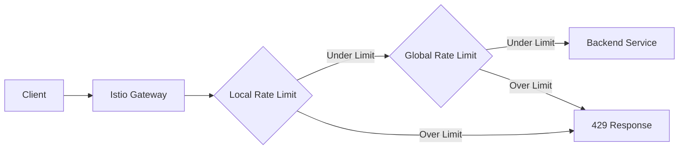

# How to Prevent DDoS Attacks with Istio Rate Limiting

Author: [nawazdhandala](https://github.com/nawazdhandala)

Tags: Istio, DDoS, Rate Limiting, Security, Kubernetes, Service Mesh

Description: Protect your microservices from DDoS attacks by configuring local and global rate limiting in Istio using EnvoyFilter and external rate limit services.

---

Distributed Denial of Service attacks are a real threat to any internet-facing application. When your services run behind Istio, you have built-in tools to throttle incoming traffic before it overwhelms your backends. Rate limiting won't stop a massive volumetric DDoS on its own (you still need upstream protection from your cloud provider or CDN), but it does a great job of protecting against application-layer attacks and preventing individual clients from hogging resources.

## Two Approaches to Rate Limiting in Istio

Istio supports two styles of rate limiting:

1. **Local rate limiting** - each Envoy proxy enforces limits independently based on its own token bucket. Simple to set up, no external dependencies.
2. **Global rate limiting** - all proxies talk to a central rate limit service that tracks counters across the entire mesh. More accurate, but requires deploying an external service.

Both have their place, and you can actually combine them for layered protection.

## Local Rate Limiting with EnvoyFilter

Local rate limiting runs entirely within each Envoy sidecar. The downside is that limits are per-pod, so if you have 10 replicas and set a limit of 100 requests per second, the effective cluster-wide limit is 1000 requests per second. Still, local limiting is fast and doesn't add network hops.

Here's how to set up local rate limiting on an ingress gateway:

```yaml
apiVersion: networking.istio.io/v1alpha3
kind: EnvoyFilter
metadata:
  name: local-ratelimit-gateway
  namespace: istio-system
spec:
  workloadSelector:
    labels:
      istio: ingressgateway
  configPatches:
    - applyTo: HTTP_FILTER
      match:
        context: GATEWAY
        listener:
          filterChain:
            filter:
              name: envoy.filters.network.http_connection_manager
              subFilter:
                name: envoy.filters.http.router
      patch:
        operation: INSERT_BEFORE
        value:
          name: envoy.filters.http.local_ratelimit
          typed_config:
            "@type": type.googleapis.com/udpa.type.v1.TypedStruct
            type_url: type.googleapis.com/envoy.extensions.filters.http.local_ratelimit.v3.LocalRateLimit
            value:
              stat_prefix: http_local_rate_limiter
              token_bucket:
                max_tokens: 1000
                tokens_per_fill: 1000
                fill_interval: 60s
              filter_enabled:
                runtime_key: local_rate_limit_enabled
                default_value:
                  numerator: 100
                  denominator: HUNDRED
              filter_enforced:
                runtime_key: local_rate_limit_enforced
                default_value:
                  numerator: 100
                  denominator: HUNDRED
              response_headers_to_add:
                - append_action: OVERWRITE_IF_EXISTS_OR_ADD
                  header:
                    key: x-local-rate-limit
                    value: "true"
```

This limits each gateway pod to 1000 requests per minute. When the limit is hit, Envoy returns a 429 Too Many Requests response.

## Per-Route Local Rate Limiting

You can also apply rate limits to specific routes rather than all traffic through the gateway:

```yaml
apiVersion: networking.istio.io/v1alpha3
kind: EnvoyFilter
metadata:
  name: local-ratelimit-per-route
  namespace: istio-system
spec:
  workloadSelector:
    labels:
      istio: ingressgateway
  configPatches:
    - applyTo: HTTP_ROUTE
      match:
        context: GATEWAY
        routeConfiguration:
          vhost:
            name: api.example.com:443
            route:
              action: ANY
      patch:
        operation: MERGE
        value:
          typed_per_filter_config:
            envoy.filters.http.local_ratelimit:
              "@type": type.googleapis.com/udpa.type.v1.TypedStruct
              type_url: type.googleapis.com/envoy.extensions.filters.http.local_ratelimit.v3.LocalRateLimit
              value:
                stat_prefix: http_local_rate_limiter
                token_bucket:
                  max_tokens: 100
                  tokens_per_fill: 100
                  fill_interval: 60s
```

This applies a tighter limit of 100 requests per minute to routes on the `api.example.com` virtual host.

## Global Rate Limiting

For accurate rate limiting across all pods, you need a global rate limit service. The most common choice is Envoy's reference implementation, `ratelimit`, backed by Redis.

First, deploy the rate limit service:

```yaml
apiVersion: apps/v1
kind: Deployment
metadata:
  name: ratelimit
  namespace: istio-system
spec:
  replicas: 2
  selector:
    matchLabels:
      app: ratelimit
  template:
    metadata:
      labels:
        app: ratelimit
    spec:
      containers:
        - name: ratelimit
          image: envoyproxy/ratelimit:latest
          ports:
            - containerPort: 8081
              name: grpc
          env:
            - name: RUNTIME_ROOT
              value: /data
            - name: RUNTIME_SUBDIRECTORY
              value: ratelimit
            - name: LOG_LEVEL
              value: info
            - name: REDIS_SOCKET_TYPE
              value: tcp
            - name: REDIS_URL
              value: redis.istio-system.svc.cluster.local:6379
            - name: USE_STATSD
              value: "false"
          volumeMounts:
            - name: config
              mountPath: /data/ratelimit/config
      volumes:
        - name: config
          configMap:
            name: ratelimit-config
---
apiVersion: v1
kind: Service
metadata:
  name: ratelimit
  namespace: istio-system
spec:
  selector:
    app: ratelimit
  ports:
    - port: 8081
      targetPort: 8081
      name: grpc
```

Next, create the rate limit configuration:

```yaml
apiVersion: v1
kind: ConfigMap
metadata:
  name: ratelimit-config
  namespace: istio-system
data:
  config.yaml: |
    domain: production-ratelimit
    descriptors:
      - key: PATH
        rate_limit:
          unit: minute
          requests_per_unit: 60
      - key: PATH
        value: "/api/login"
        rate_limit:
          unit: minute
          requests_per_unit: 10
      - key: remote_address
        rate_limit:
          unit: minute
          requests_per_unit: 300
```

This configuration sets different limits based on path and client IP. The login endpoint gets a stricter limit to prevent brute force attacks.

Now wire it into Istio with an EnvoyFilter:

```yaml
apiVersion: networking.istio.io/v1alpha3
kind: EnvoyFilter
metadata:
  name: global-ratelimit
  namespace: istio-system
spec:
  workloadSelector:
    labels:
      istio: ingressgateway
  configPatches:
    - applyTo: HTTP_FILTER
      match:
        context: GATEWAY
        listener:
          filterChain:
            filter:
              name: envoy.filters.network.http_connection_manager
              subFilter:
                name: envoy.filters.http.router
      patch:
        operation: INSERT_BEFORE
        value:
          name: envoy.filters.http.ratelimit
          typed_config:
            "@type": type.googleapis.com/envoy.extensions.filters.http.ratelimit.v3.RateLimit
            domain: production-ratelimit
            failure_mode_deny: false
            timeout: 0.25s
            rate_limit_service:
              grpc_service:
                envoy_grpc:
                  cluster_name: outbound|8081||ratelimit.istio-system.svc.cluster.local
                  authority: ratelimit.istio-system.svc.cluster.local
              transport_api_version: V3
    - applyTo: CLUSTER
      match:
        cluster:
          service: ratelimit.istio-system.svc.cluster.local
      patch:
        operation: ADD
        value:
          name: rate_limit_cluster
          type: STRICT_DNS
          connect_timeout: 10s
          lb_policy: ROUND_ROBIN
          http2_protocol_options: {}
          load_assignment:
            cluster_name: rate_limit_cluster
            endpoints:
              - lb_endpoints:
                  - endpoint:
                      address:
                        socket_address:
                          address: ratelimit.istio-system.svc.cluster.local
                          port_value: 8081
```

Notice `failure_mode_deny: false`. This means if the rate limit service is down, requests are allowed through. For DDoS protection, you might want to set this to `true`, but be aware that a failure in the rate limit service would then block all traffic.

## Rate Limiting by Client IP

For DDoS protection, limiting by source IP is critical. You need to configure Envoy to extract the client IP and use it as a rate limit descriptor:

```yaml
apiVersion: networking.istio.io/v1alpha3
kind: EnvoyFilter
metadata:
  name: ratelimit-actions
  namespace: istio-system
spec:
  workloadSelector:
    labels:
      istio: ingressgateway
  configPatches:
    - applyTo: VIRTUAL_HOST
      match:
        context: GATEWAY
        routeConfiguration:
          vhost:
            name: api.example.com:443
      patch:
        operation: MERGE
        value:
          rate_limits:
            - actions:
                - remote_address: {}
            - actions:
                - request_headers:
                    header_name: ":path"
                    descriptor_key: PATH
```

This sends both the client's remote address and the request path to the rate limit service as descriptors.

## Combining Local and Global Rate Limiting

The best protection uses both approaches. Local rate limiting provides a fast first line of defense with no external dependencies. Global rate limiting gives you accurate cross-cluster limits:



Set your local limits higher than your global limits. For example, local at 200 requests per minute per pod and global at 500 requests per minute total. The local limit catches aggressive bursts immediately, while the global limit ensures the overall rate stays controlled.

## Monitoring Rate Limit Effectiveness

Keep an eye on rate limit metrics to tune your thresholds:

```bash
kubectl exec -n istio-system deploy/istio-ingressgateway -- \
  pilot-agent request GET stats | grep ratelimit
```

Look at counters like `http_local_rate_limiter.http_local_rate_limit.rate_limited` to see how often limits are being hit.

You can also query these through Prometheus:

```promql
sum(rate(envoy_http_local_rate_limit_rate_limited{namespace="istio-system"}[5m]))
```

## Tips for DDoS Protection

Rate limiting is one piece of the puzzle. For solid DDoS protection with Istio, also consider:

- Set connection limits on your Gateway listeners to prevent connection exhaustion
- Use circuit breakers on your DestinationRules to protect backend services
- Put a CDN or cloud load balancer with DDoS protection in front of your Istio gateway
- Monitor traffic patterns and adjust rate limits based on normal traffic baselines

The goal is defense in depth. Rate limiting at the Istio layer handles application-level floods, while upstream network-level protection handles volumetric attacks.
