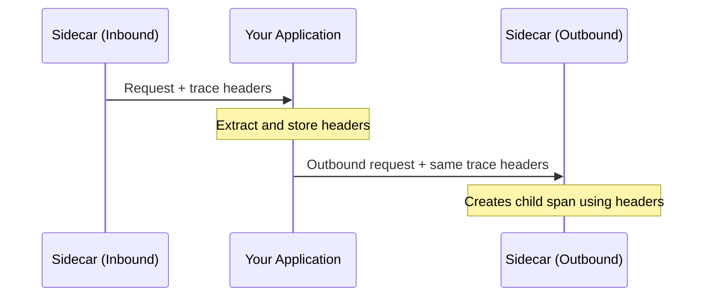

# How to Propagate Trace Headers in Istio Applications

Author: [nawazdhandala](https://github.com/nawazdhandala)

Tags: Istio, Trace Headers, Header Propagation, Distributed Tracing, Microservices

Description: A developer-focused guide on propagating trace headers correctly in Istio applications to ensure complete distributed traces across services.

---

This is the one thing about Istio tracing that surprises most developers: the mesh does not automatically connect traces across services. Yes, Istio's Envoy sidecars generate spans for every request. But if your application receives a request and then makes an outbound call to another service, the sidecar has no way to know those two things are related unless the application forwards the trace headers from the incoming request to the outgoing one.

If you skip header propagation, you'll end up with a bunch of disconnected single-span traces instead of a unified trace showing the full request path.

## What Headers Need Propagating?

Istio supports two trace header formats. You should propagate all of these to be safe:

**B3 Headers (Zipkin format):**
- `x-b3-traceid`
- `x-b3-spanid`
- `x-b3-parentspanid`
- `x-b3-sampled`
- `x-b3-flags`

**W3C Trace Context:**
- `traceparent`
- `tracestate`

**Envoy-specific:**
- `x-request-id`

There's also the single-header B3 format:
- `b3` (compact format: `{TraceId}-{SpanId}-{SamplingState}-{ParentSpanId}`)

The safest approach is to propagate all of them. That way, regardless of which format Istio is configured to use, your traces will work.

## The Propagation Pattern

The pattern is the same in every language:

1. Extract trace headers from the incoming request
2. Store them somewhere accessible (request context, thread local, etc.)
3. Attach them to every outgoing HTTP request



## Python Implementation

Using Flask and requests:

```python
from flask import Flask, request, g
import requests as http_client

app = Flask(__name__)

TRACE_HEADERS = [
    'x-request-id',
    'x-b3-traceid',
    'x-b3-spanid',
    'x-b3-parentspanid',
    'x-b3-sampled',
    'x-b3-flags',
    'traceparent',
    'tracestate',
    'b3',
]

@app.before_request
def extract_trace_headers():
    g.trace_headers = {}
    for header in TRACE_HEADERS:
        value = request.headers.get(header)
        if value is not None:
            g.trace_headers[header] = value


def call_service(url, method='GET', **kwargs):
    """Make an HTTP call with trace headers propagated."""
    headers = kwargs.pop('headers', {})
    headers.update(g.trace_headers)
    return http_client.request(method, url, headers=headers, **kwargs)


@app.route('/api/orders/<order_id>')
def get_order(order_id):
    # These calls will have trace headers attached automatically
    product = call_service(f'http://product-service/api/products/{order_id}')
    inventory = call_service(f'http://inventory-service/api/stock/{order_id}')

    return {
        'order_id': order_id,
        'product': product.json(),
        'inventory': inventory.json()
    }
```

## Go Implementation

```go
package main

import (
    "context"
    "io"
    "net/http"
)

var traceHeaders = []string{
    "x-request-id",
    "x-b3-traceid",
    "x-b3-spanid",
    "x-b3-parentspanid",
    "x-b3-sampled",
    "x-b3-flags",
    "traceparent",
    "tracestate",
    "b3",
}

type contextKey string

const traceContextKey contextKey = "trace-headers"

// Middleware extracts trace headers and stores them in context
func traceMiddleware(next http.Handler) http.Handler {
    return http.HandlerFunc(func(w http.ResponseWriter, r *http.Request) {
        headers := make(http.Header)
        for _, h := range traceHeaders {
            if val := r.Header.Get(h); val != "" {
                headers.Set(h, val)
            }
        }
        ctx := context.WithValue(r.Context(), traceContextKey, headers)
        next.ServeHTTP(w, r.WithContext(ctx))
    })
}

// CallService makes an HTTP request with propagated trace headers
func CallService(ctx context.Context, method, url string, body io.Reader) (*http.Response, error) {
    req, err := http.NewRequestWithContext(ctx, method, url, body)
    if err != nil {
        return nil, err
    }

    if headers, ok := ctx.Value(traceContextKey).(http.Header); ok {
        for _, h := range traceHeaders {
            if val := headers.Get(h); val != "" {
                req.Header.Set(h, val)
            }
        }
    }

    return http.DefaultClient.Do(req)
}

func main() {
    mux := http.NewServeMux()

    mux.HandleFunc("/api/orders/", func(w http.ResponseWriter, r *http.Request) {
        // Trace headers are automatically included
        resp, err := CallService(r.Context(), "GET", "http://product-service/api/products", nil)
        if err != nil {
            http.Error(w, err.Error(), 500)
            return
        }
        defer resp.Body.Close()

        w.Header().Set("Content-Type", "application/json")
        io.Copy(w, resp.Body)
    })

    handler := traceMiddleware(mux)
    http.ListenAndServe(":8080", handler)
}
```

## Node.js Implementation

```javascript
const express = require('express');
const axios = require('axios');

const app = express();

const TRACE_HEADERS = [
  'x-request-id',
  'x-b3-traceid',
  'x-b3-spanid',
  'x-b3-parentspanid',
  'x-b3-sampled',
  'x-b3-flags',
  'traceparent',
  'tracestate',
  'b3',
];

// Middleware to extract trace headers
app.use((req, res, next) => {
  req.traceHeaders = {};
  for (const header of TRACE_HEADERS) {
    const value = req.headers[header.toLowerCase()];
    if (value) {
      req.traceHeaders[header] = value;
    }
  }
  next();
});

// Helper function for outbound calls
function createServiceClient(req) {
  return axios.create({
    headers: req.traceHeaders,
  });
}

app.get('/api/orders/:id', async (req, res) => {
  const client = createServiceClient(req);

  try {
    const [product, inventory] = await Promise.all([
      client.get(`http://product-service/api/products/${req.params.id}`),
      client.get(`http://inventory-service/api/stock/${req.params.id}`),
    ]);

    res.json({
      orderId: req.params.id,
      product: product.data,
      inventory: inventory.data,
    });
  } catch (err) {
    res.status(500).json({ error: err.message });
  }
});

app.listen(8080);
```

## Java Spring Boot Implementation

Spring Boot with RestTemplate:

```java
@Configuration
public class TracingConfig {

    private static final List<String> TRACE_HEADERS = List.of(
        "x-request-id", "x-b3-traceid", "x-b3-spanid",
        "x-b3-parentspanid", "x-b3-sampled", "x-b3-flags",
        "traceparent", "tracestate", "b3"
    );

    @Bean
    public RestTemplate restTemplate() {
        RestTemplate restTemplate = new RestTemplate();
        restTemplate.getInterceptors().add((request, body, execution) -> {
            ServletRequestAttributes attrs =
                (ServletRequestAttributes) RequestContextHolder.getRequestAttributes();
            if (attrs != null) {
                HttpServletRequest incomingRequest = attrs.getRequest();
                for (String header : TRACE_HEADERS) {
                    String value = incomingRequest.getHeader(header);
                    if (value != null) {
                        request.getHeaders().set(header, value);
                    }
                }
            }
            return execution.execute(request, body);
        });
        return restTemplate;
    }
}
```

With WebClient (reactive):

```java
@Configuration
public class ReactiveTracingConfig {

    private static final List<String> TRACE_HEADERS = List.of(
        "x-request-id", "x-b3-traceid", "x-b3-spanid",
        "x-b3-parentspanid", "x-b3-sampled", "x-b3-flags",
        "traceparent", "tracestate", "b3"
    );

    @Bean
    public WebClient webClient() {
        return WebClient.builder()
            .filter((request, next) -> {
                return ServerWebExchangeContextFilter
                    .get(request.attribute("org.springframework.web.server.ServerWebExchange"))
                    .map(exchange -> {
                        ClientRequest.Builder builder = ClientRequest.from(request);
                        for (String header : TRACE_HEADERS) {
                            String value = exchange.getRequest().getHeaders().getFirst(header);
                            if (value != null) {
                                builder.header(header, value);
                            }
                        }
                        return next.exchange(builder.build());
                    })
                    .orElse(next.exchange(request));
            })
            .build();
    }
}
```

## Using OpenTelemetry SDK for Automatic Propagation

Instead of manually propagating headers, you can use the OpenTelemetry SDK, which handles propagation automatically:

Python:

```bash
pip install opentelemetry-api opentelemetry-sdk opentelemetry-instrumentation-flask opentelemetry-instrumentation-requests
```

```python
from opentelemetry import trace
from opentelemetry.sdk.trace import TracerProvider
from opentelemetry.instrumentation.flask import FlaskInstrumentor
from opentelemetry.instrumentation.requests import RequestsInstrumentor
from opentelemetry.sdk.trace.export import ConsoleSpanExporter, SimpleSpanProcessor

# Set up OpenTelemetry
provider = TracerProvider()
provider.add_span_processor(SimpleSpanProcessor(ConsoleSpanExporter()))
trace.set_tracer_provider(provider)

# Auto-instrument Flask and requests
FlaskInstrumentor().instrument_app(app)
RequestsInstrumentor().instrument()
```

This approach auto-propagates trace context for all instrumented HTTP clients without any manual header handling.

## Testing Your Propagation

To verify headers are being propagated correctly, use the httpbin service:

```bash
# Deploy httpbin if not already present
kubectl apply -f https://raw.githubusercontent.com/istio/istio/release-1.24/samples/httpbin/httpbin.yaml

# Send a request and check echoed headers
kubectl exec deploy/sleep -- curl -s http://httpbin:8000/headers | python3 -m json.tool
```

You should see B3 or W3C trace headers in the response. If your application calls httpbin, and httpbin's response shows the same trace ID that the original request had, propagation is working.

## Common Mistakes

**Forgetting async calls:** In async code (goroutines, promises, threads), the request context might not be available. Make sure trace headers are passed explicitly or stored in a context that's accessible from async workers.

**gRPC calls:** If your services communicate via gRPC, headers are called metadata. The propagation concept is the same, but the API is different:

```go
// gRPC metadata propagation
md, ok := metadata.FromIncomingContext(ctx)
if ok {
    outCtx := metadata.NewOutgoingContext(ctx, md)
    resp, err := client.GetProduct(outCtx, &pb.ProductRequest{Id: id})
}
```

**Missing headers on fan-out:** When a service makes multiple downstream calls in parallel, each call needs the trace headers. Make sure your HTTP client helper applies headers to every request, not just the first one.

## Summary

Header propagation is the developer's responsibility and it's the single most important thing to get right for distributed tracing in Istio. Pick the approach that fits your stack - manual header forwarding for simplicity, or OpenTelemetry SDK instrumentation for automation. Either way, test it by checking that trace IDs remain consistent across service boundaries. Without proper propagation, you're collecting spans but not traces.
