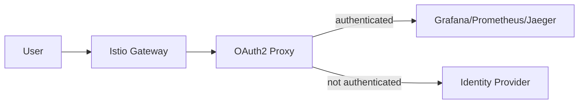

# How to Remotely Access Istio Telemetry Addons

Author: [nawazdhandala](https://github.com/nawazdhandala)

Tags: Istio, Telemetry, Remote Access, Prometheus, Grafana, Jaeger

Description: Methods for remotely accessing Istio telemetry addons like Prometheus, Grafana, Jaeger, and Kiali from outside the cluster.

---

Istio's telemetry addons (Prometheus, Grafana, Jaeger, Kiali) are installed as ClusterIP services by default. That means they're only accessible from inside the cluster. During development, `kubectl port-forward` works fine. But for team-wide access, on-call rotations, and dashboards on wall monitors, you need a more permanent solution.

This post covers the main approaches for remotely accessing Istio's telemetry addons, from the simplest (port-forward) to the most production-ready (Istio Gateway with authentication).

## Method 1: kubectl Port-Forward

The quickest way to access any addon. No configuration changes needed.

```bash
# Prometheus
kubectl port-forward svc/prometheus 9090:9090 -n istio-system

# Grafana
kubectl port-forward svc/grafana 3000:3000 -n istio-system

# Jaeger
kubectl port-forward svc/tracing 16686:16686 -n istio-system

# Kiali
kubectl port-forward svc/kiali 20001:20001 -n istio-system
```

Then open your browser to the respective localhost port.

### Pros
- Zero configuration
- Works immediately
- Secure (traffic goes through your kubeconfig credentials)

### Cons
- Only accessible from your machine
- Connection drops when your terminal closes
- Not shareable with the team

### Making Port-Forward More Reliable

For longer sessions, use `--address 0.0.0.0` to bind to all interfaces (if you need to share with others on your network) and add keepalive:

```bash
kubectl port-forward svc/grafana 3000:3000 -n istio-system --address 0.0.0.0
```

## Method 2: istioctl Dashboard Commands

Istio provides convenient commands that handle port-forwarding and open your browser:

```bash
istioctl dashboard prometheus
istioctl dashboard grafana
istioctl dashboard jaeger
istioctl dashboard kiali
```

These are just wrappers around port-forward with the correct ports pre-configured. Same limitations as manual port-forward, but slightly more convenient.

You can specify a custom port and binding address:

```bash
istioctl dashboard grafana --port 8080 --address 0.0.0.0
```

## Method 3: Kubernetes Ingress

If you already have an Ingress controller (NGINX, Traefik, etc.), you can create Ingress resources for the addons:

```yaml
apiVersion: networking.k8s.io/v1
kind: Ingress
metadata:
  name: grafana-ingress
  namespace: istio-system
  annotations:
    nginx.ingress.kubernetes.io/rewrite-target: /
spec:
  ingressClassName: nginx
  rules:
    - host: grafana.internal.example.com
      http:
        paths:
          - path: /
            pathType: Prefix
            backend:
              service:
                name: grafana
                port:
                  number: 3000
---
apiVersion: networking.k8s.io/v1
kind: Ingress
metadata:
  name: prometheus-ingress
  namespace: istio-system
  annotations:
    nginx.ingress.kubernetes.io/rewrite-target: /
spec:
  ingressClassName: nginx
  rules:
    - host: prometheus.internal.example.com
      http:
        paths:
          - path: /
            pathType: Prefix
            backend:
              service:
                name: prometheus
                port:
                  number: 9090
```

This works but bypasses Istio's traffic management. If you're running Istio, it makes more sense to use Istio's own Gateway.

## Method 4: Istio Gateway (Recommended)

The recommended approach for production is to expose addons through the Istio IngressGateway. This gives you all of Istio's features: TLS termination, authentication, rate limiting, and access logging.

### Step 1: Create a Gateway

```yaml
apiVersion: networking.istio.io/v1
kind: Gateway
metadata:
  name: telemetry-gateway
  namespace: istio-system
spec:
  selector:
    istio: ingressgateway
  servers:
    - port:
        number: 443
        name: https
        protocol: HTTPS
      tls:
        mode: SIMPLE
        credentialName: telemetry-tls-cert
      hosts:
        - "grafana.example.com"
        - "prometheus.example.com"
        - "jaeger.example.com"
        - "kiali.example.com"
```

### Step 2: Create VirtualServices

```yaml
apiVersion: networking.istio.io/v1
kind: VirtualService
metadata:
  name: grafana-vs
  namespace: istio-system
spec:
  hosts:
    - "grafana.example.com"
  gateways:
    - telemetry-gateway
  http:
    - route:
        - destination:
            host: grafana
            port:
              number: 3000
---
apiVersion: networking.istio.io/v1
kind: VirtualService
metadata:
  name: prometheus-vs
  namespace: istio-system
spec:
  hosts:
    - "prometheus.example.com"
  gateways:
    - telemetry-gateway
  http:
    - route:
        - destination:
            host: prometheus
            port:
              number: 9090
---
apiVersion: networking.istio.io/v1
kind: VirtualService
metadata:
  name: jaeger-vs
  namespace: istio-system
spec:
  hosts:
    - "jaeger.example.com"
  gateways:
    - telemetry-gateway
  http:
    - route:
        - destination:
            host: tracing
            port:
              number: 16686
---
apiVersion: networking.istio.io/v1
kind: VirtualService
metadata:
  name: kiali-vs
  namespace: istio-system
spec:
  hosts:
    - "kiali.example.com"
  gateways:
    - telemetry-gateway
  http:
    - route:
        - destination:
            host: kiali
            port:
              number: 20001
```

### Step 3: Set Up TLS

Create a TLS certificate secret. Using cert-manager:

```yaml
apiVersion: cert-manager.io/v1
kind: Certificate
metadata:
  name: telemetry-tls
  namespace: istio-system
spec:
  secretName: telemetry-tls-cert
  issuerRef:
    name: letsencrypt-prod
    kind: ClusterIssuer
  dnsNames:
    - grafana.example.com
    - prometheus.example.com
    - jaeger.example.com
    - kiali.example.com
```

Or create the secret manually:

```bash
kubectl create secret tls telemetry-tls-cert \
  --cert=tls.crt \
  --key=tls.key \
  -n istio-system
```

### Step 4: Add DNS Records

Point the DNS records for each subdomain to your Istio IngressGateway's external IP:

```bash
kubectl get svc istio-ingressgateway -n istio-system -o jsonpath='{.status.loadBalancer.ingress[0].ip}'
```

Create A records (or CNAME records) for each hostname.

## Method 5: NodePort Services

For clusters without a load balancer (bare metal, development), you can change the addon services to NodePort:

```bash
kubectl patch svc grafana -n istio-system -p '{"spec": {"type": "NodePort"}}'
kubectl patch svc prometheus -n istio-system -p '{"spec": {"type": "NodePort"}}'
```

Then access via `http://<node-ip>:<node-port>`.

This is simple but lacks security. Only use it in isolated development environments.

## Adding Authentication

Exposing telemetry addons without authentication is a security risk. Prometheus has no built-in auth. Grafana can be configured with its own auth, but it's better to handle authentication at the Istio level.

### OAuth2 Proxy

Deploy an OAuth2 Proxy in front of all addons. See the Kiali external authentication post for details. The basic pattern:



### Istio AuthorizationPolicy

For simple IP-based access control:

```yaml
apiVersion: security.istio.io/v1
kind: AuthorizationPolicy
metadata:
  name: telemetry-ip-whitelist
  namespace: istio-system
spec:
  selector:
    matchLabels:
      istio: ingressgateway
  action: ALLOW
  rules:
    - from:
        - source:
            remoteIpBlocks:
              - "10.0.0.0/8"
              - "192.168.1.0/24"
              - "203.0.113.50/32"
      to:
        - operation:
            hosts:
              - "grafana.example.com"
              - "prometheus.example.com"
              - "jaeger.example.com"
              - "kiali.example.com"
```

This restricts access to specific IP ranges (your office, VPN, etc.).

## Comparison of Methods

| Method | Security | Shared Access | Persistence | Effort |
|--------|----------|---------------|-------------|--------|
| Port-forward | High (kubeconfig) | No | No | None |
| istioctl dashboard | High (kubeconfig) | No | No | None |
| K8s Ingress | Medium | Yes | Yes | Low |
| Istio Gateway | High (TLS + Auth) | Yes | Yes | Medium |
| NodePort | Low | Yes | Yes | Low |

For production, the Istio Gateway approach is the clear winner. It gives you TLS, authentication, access logging, and all the other Istio features you already rely on for your application traffic.

## Troubleshooting

**Gateway returns 503**: The addon service might not be running. Check pod status:

```bash
kubectl get pods -n istio-system
```

**TLS certificate errors**: Make sure the certificate secret is in the `istio-system` namespace and the `credentialName` in the Gateway matches the secret name.

**Kiali redirects break**: Kiali needs to know its external URL. Set `server.web_fqdn` and `server.web_schema` in the Kiali CR.

**Grafana shows "Origin not allowed"**: Update Grafana's configuration to allow your domain. Set the `GF_SERVER_ROOT_URL` environment variable to match the external URL.

Picking the right access method depends on your security requirements and how many people need access. Start with port-forward for personal use, and move to Istio Gateway when the team needs shared access.
