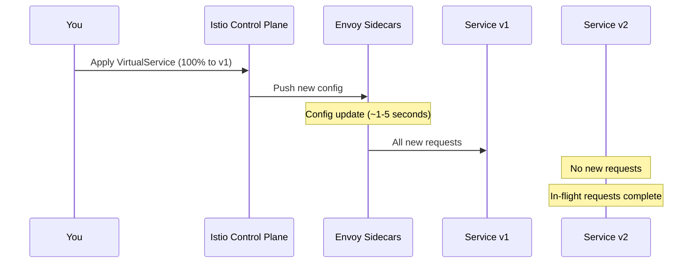

# How to Roll Back Traffic Shifting in Istio

Author: [nawazdhandala](https://github.com/nawazdhandala)

Tags: Istio, Traffic Shifting, Rollback, Kubernetes, Service Mesh, Incident Response

Description: Learn how to quickly roll back traffic shifting in Istio when a new service version causes issues, including emergency procedures and automation.

---

Things go wrong. You spent a week testing v2 in staging, did a careful canary rollout, and everything looked fine at 10% traffic. Then you bumped it to 50% and error rates spiked. Now you need to get back to v1 as fast as possible.

Rolling back traffic in Istio is quick and safe because you are not redeploying anything. You are just changing routing rules. The old version is still running, still has its pods warm, and can handle 100% of traffic immediately. This is one of the huge advantages of weight-based traffic shifting - rollback is a config change, not a deployment.

## The Fast Rollback

If you are in the middle of an incident, here is the quickest way to roll back. Apply a VirtualService that sends everything to v1:

```bash
kubectl apply -f - <<EOF
apiVersion: networking.istio.io/v1
kind: VirtualService
metadata:
  name: my-service
spec:
  hosts:
    - my-service
  http:
    - route:
        - destination:
            host: my-service
            subset: v1
          weight: 100
EOF
```

That is it. Within seconds, Envoy proxies across your mesh pick up the new configuration and stop sending traffic to v2. No pods restart, no deployments change, no downtime.

You can verify the rollback took effect:

```bash
istioctl x describe service my-service
```

And check that v2 is no longer receiving traffic:

```bash
kubectl logs -l app=my-service,version=v2 --tail=20
```

If v2 logs stop showing new requests, your rollback worked.

## Understanding What Happens During Rollback

When you change the VirtualService weights, Istio pushes the updated configuration to all Envoy sidecars in the mesh. This propagation typically takes 1-5 seconds depending on mesh size.



There is an important detail here: requests that are already in-flight to v2 will complete. Istio does not kill active connections. New requests go to v1, but existing v2 requests finish normally.

## Rolling Back from Different Stages

### Rolling Back from 10% on v2

You caught the issue early. Just set v2 weight back to 0:

```yaml
apiVersion: networking.istio.io/v1
kind: VirtualService
metadata:
  name: my-service
spec:
  hosts:
    - my-service
  http:
    - route:
        - destination:
            host: my-service
            subset: v1
          weight: 100
        - destination:
            host: my-service
            subset: v2
          weight: 0
```

### Rolling Back from 50/50

Same approach, just bring v1 back to 100%:

```yaml
    - route:
        - destination:
            host: my-service
            subset: v1
          weight: 100
```

### Rolling Back from 90% on v2

This one is trickier because most of your traffic is already on v2. When you flip back to v1, make sure v1 can handle the full load. Check that v1 still has enough replicas:

```bash
kubectl get deployment my-service-v1 -o jsonpath='{.spec.replicas}'
```

If v1 was scaled down during the migration, scale it back up first:

```bash
kubectl scale deployment my-service-v1 --replicas=5
```

Wait for pods to be ready:

```bash
kubectl rollout status deployment my-service-v1
```

Then apply the rollback:

```yaml
    - route:
        - destination:
            host: my-service
            subset: v1
          weight: 100
```

### Rolling Back After Full Migration to v2

If you already moved to 100% v2 and deleted the v1 deployment, things are more complicated. You need to redeploy v1:

```bash
kubectl apply -f my-service-v1-deployment.yaml
kubectl rollout status deployment my-service-v1
```

Then update the VirtualService to route to v1. This is why many teams keep v1 running (even at 0 traffic) for a few days after completing a migration.

## Keeping Rollback Ready

Here are some practices that make rollbacks smooth:

### Do Not Delete v1 Too Quickly

After you have moved all traffic to v2, keep v1 running for at least a few days. You can scale it down to save resources:

```bash
kubectl scale deployment my-service-v1 --replicas=1
```

But keep at least one replica warm. If something goes wrong with v2 that only shows up over time, you can quickly scale v1 back up and shift traffic.

### Store VirtualService Configs in Git

Keep your rollback configurations version-controlled:

```
istio-config/
  my-service/
    virtualservice-v1-100.yaml
    virtualservice-v1-90-v2-10.yaml
    virtualservice-v1-50-v2-50.yaml
    virtualservice-v2-100.yaml
```

During an incident, you can apply the rollback config directly:

```bash
kubectl apply -f istio-config/my-service/virtualservice-v1-100.yaml
```

No need to remember the exact YAML syntax when you are under pressure.

### Set Up a Rollback Script

Create a simple script your on-call team can run:

```bash
#!/bin/bash
# rollback.sh - Emergency traffic rollback

SERVICE=$1
NAMESPACE=${2:-default}

if [ -z "$SERVICE" ]; then
  echo "Usage: rollback.sh <service-name> [namespace]"
  exit 1
fi

echo "Rolling back $SERVICE in $NAMESPACE to v1..."

kubectl apply -n "$NAMESPACE" -f - <<EOF
apiVersion: networking.istio.io/v1
kind: VirtualService
metadata:
  name: $SERVICE
spec:
  hosts:
    - $SERVICE
  http:
    - route:
        - destination:
            host: $SERVICE
            subset: v1
          weight: 100
EOF

echo "Rollback applied. Verifying..."
sleep 3
istioctl x describe service "$SERVICE" -n "$NAMESPACE"
```

```bash
chmod +x rollback.sh
./rollback.sh my-service default
```

## Partial Rollback

Sometimes v2 is not completely broken - it just has issues at high traffic levels. In that case, you can do a partial rollback instead of going all the way to 0%:

```yaml
    - route:
        - destination:
            host: my-service
            subset: v1
          weight: 95
        - destination:
            host: my-service
            subset: v2
          weight: 5
```

This keeps a small trickle of traffic on v2 so you can continue debugging while keeping users mostly on the stable version.

## Verifying the Rollback

After applying a rollback, verify it is working:

**Check VirtualService config:**

```bash
kubectl get virtualservice my-service -o yaml
```

**Verify traffic distribution in Kiali or with Prometheus:**

```
sum(rate(istio_requests_total{destination_service="my-service.default.svc.cluster.local"}[1m])) by (destination_version)
```

**Watch v2 traffic drop to zero:**

```bash
watch -n 2 "kubectl logs -l app=my-service,version=v2 --tail=5"
```

**Check that error rates are recovering:**

```
sum(rate(istio_requests_total{destination_service="my-service.default.svc.cluster.local",response_code=~"5.*"}[1m]))
```

## Post-Rollback Steps

Once the immediate fire is out:

1. Document what went wrong and at what traffic percentage
2. Collect v2 logs and metrics from the incident window
3. Keep v2 pods running if you need to debug them
4. Update your runbook with the specific rollback steps
5. Consider adding automated rollback triggers for future deployments

Rollbacks in Istio are fast, safe, and non-disruptive. The key is being prepared: keep your v1 deployment running, store your routing configs in version control, and make sure your team knows how to apply a rollback under pressure. When things go sideways at 2 AM, a one-command rollback is exactly what you want.
