# How to Rotate Certificates Automatically in Istio

Author: [nawazdhandala](https://github.com/nawazdhandala)

Tags: Istio, Certificate Rotation, Security, MTLS, Kubernetes

Description: Understanding and configuring automatic certificate rotation in Istio for workload certificates and the root CA to maintain continuous mTLS.

---

Certificate rotation is one of those things that should just work in the background. In Istio, it mostly does. Workload certificates rotate automatically, and the self-signed root CA can be configured to rotate as well. But "it should work" and "I have verified it works" are very different things in production. This guide explains how rotation works, how to configure it, and how to make sure it does not break anything.

## How Workload Certificate Rotation Works

Every sidecar proxy in the mesh holds a workload certificate with a limited lifetime (24 hours by default). Before the certificate expires, the sidecar automatically requests a new one from istiod.

The rotation timeline:

1. Certificate is issued with a 24-hour TTL
2. At approximately 80% of the lifetime (about 19 hours), the sidecar generates a new CSR
3. The sidecar sends the CSR to istiod
4. Istiod signs and returns the new certificate
5. The sidecar hot-swaps the certificate without dropping connections
6. The old certificate is discarded

```mermaid
gantt
    title Workload Certificate Lifecycle (24h TTL)
    dateFormat HH:mm
    section Certificate
    Active certificate    :a1, 00:00, 19h
    Rotation window       :crit, a2, after a1, 5h
    New certificate       :a3, after a1, 24h
```



The key thing is that rotation happens inline with no restarts needed. Existing connections continue using the old certificate until they are naturally closed. New connections use the new certificate.

## Verifying Automatic Rotation

To confirm that rotation is happening, check the certificate details periodically:

```bash
# Check certificate serial number and expiry
istioctl proxy-config secret <pod-name> -n <namespace>
```

Run this a few times over 24 hours. The `SERIAL NUMBER` should change each time the certificate rotates.

For a more detailed check:

```bash
istioctl proxy-config secret <pod-name> -n <namespace> -o json | \
  jq -r '.dynamicActiveSecrets[] | select(.name=="default") | .secret.tlsCertificate.certificateChain.inlineBytes' | \
  base64 -d | openssl x509 -noout -serial -dates
```

You can also watch the proxy logs for rotation events:

```bash
kubectl logs <pod-name> -c istio-proxy | grep -i "SDS\|secret\|cert"
```

Look for messages about new secrets being received.

## Configuring the Rotation Grace Period

The default rotation happens at 80% of the certificate lifetime. You can adjust this behavior, though it is rarely necessary.

The sidecar proxy uses the SDS (Secret Discovery Service) protocol to manage certificates. The grace period is hardcoded to about 80% by default, but you can influence when rotation happens by adjusting the certificate TTL itself.

If you want faster rotation (more frequent certificate changes):

```yaml
apiVersion: apps/v1
kind: Deployment
metadata:
  name: sensitive-service
spec:
  template:
    metadata:
      annotations:
        proxy.istio.io/config: |
          proxyMetadata:
            SECRET_TTL: "1h"
```

With a 1-hour TTL, the certificate rotates approximately every 48 minutes.

## Root CA Rotation

For the self-signed root CA, rotation is more involved because changing the root CA affects the trust chain for every workload in the mesh.

### Automatic Self-Signed CA Rotation

Istio can automatically rotate the self-signed root CA. Configure it with these environment variables on istiod:

```yaml
apiVersion: install.istio.io/v1alpha1
kind: IstioOperator
spec:
  components:
    pilot:
      k8s:
        env:
        - name: CITADEL_SELF_SIGNED_CA_CERT_TTL
          value: "8760h"
        - name: CITADEL_SELF_SIGNED_ROOT_CERT_CHECK_INTERVAL
          value: "1h"
        - name: CITADEL_SELF_SIGNED_ROOT_CERT_GRACE_PERIOD_PERCENTILE
          value: "20"
```

When automatic rotation kicks in:

1. Istiod generates a new root CA certificate
2. Both the old and new root CAs are distributed to sidecars as trusted roots
3. New workload certificates are signed with the new CA
4. After all workloads have rotated their certificates, the old root CA is no longer needed
5. The old root is eventually removed from the trust bundle

This overlapping trust period is critical. Without it, rotating the root CA would break all existing connections.

### Manual Root CA Rotation (External CA)

If you are using an external CA (via the `cacerts` secret), rotation is manual:

**Step 1: Prepare the new CA certificate** (signed by the same root, or a new root if you are also rotating that).

**Step 2: Create a combined trust bundle** that includes both old and new root CAs:

```bash
cat old-root-cert.pem new-root-cert.pem > combined-root-cert.pem
```

**Step 3: Update the cacerts secret with the new intermediate CA but the combined root:**

```bash
kubectl create secret generic cacerts -n istio-system \
  --from-file=ca-cert.pem=new-ca-cert.pem \
  --from-file=ca-key.pem=new-ca-key.pem \
  --from-file=root-cert.pem=combined-root-cert.pem \
  --from-file=cert-chain.pem=new-cert-chain.pem \
  --dry-run=client -o yaml | kubectl apply -f -
```

**Step 4: Restart istiod:**

```bash
kubectl rollout restart deployment istiod -n istio-system
```

**Step 5: Wait for all workloads to rotate their certificates** (this takes up to one certificate lifetime, e.g., 24 hours).

**Step 6: After all workloads have new certificates, remove the old root from the trust bundle:**

```bash
kubectl create secret generic cacerts -n istio-system \
  --from-file=ca-cert.pem=new-ca-cert.pem \
  --from-file=ca-key.pem=new-ca-key.pem \
  --from-file=root-cert.pem=new-root-cert.pem \
  --from-file=cert-chain.pem=new-cert-chain.pem \
  --dry-run=client -o yaml | kubectl apply -f -

kubectl rollout restart deployment istiod -n istio-system
```

## Monitoring Rotation

Set up Prometheus alerts to catch rotation failures:

```yaml
groups:
- name: istio-cert-rotation
  rules:
  # Alert if workload certificates are close to expiry
  - alert: WorkloadCertExpiringTooSoon
    expr: |
      (envoy_server_days_until_first_cert_expiring < 0.1)
    for: 5m
    labels:
      severity: critical
    annotations:
      summary: "Workload certificate expiring in less than 2.4 hours"

  # Alert on CSR failures
  - alert: CSRProcessingFailures
    expr: |
      rate(citadel_server_csr_parsing_err_count[10m]) > 0
    for: 5m
    labels:
      severity: warning
    annotations:
      summary: "Certificate signing request failures detected"

  # Alert on root CA expiry
  - alert: RootCAExpiringSoon
    expr: |
      (citadel_server_root_cert_expiry_timestamp - time()) < 2592000
    for: 1h
    labels:
      severity: warning
    annotations:
      summary: "Root CA expires in less than 30 days"
```

Check the current rotation status across the mesh:

```bash
# See certificate ages across all pods in a namespace
for pod in $(kubectl get pods -n default -o jsonpath='{.items[*].metadata.name}'); do
  echo -n "$pod: "
  istioctl proxy-config secret $pod -n default 2>/dev/null | grep "default" | awk '{print $5, $6}'
done
```

## What Happens When Rotation Fails

If a sidecar cannot get a new certificate before the old one expires:

1. The sidecar continues to use the expired certificate
2. Peer sidecars may reject the expired certificate (depending on configuration)
3. mTLS connections fail
4. HTTP requests get connection errors

The most common causes of rotation failure:

- **Istiod is down** - If istiod is unavailable during the rotation window, CSRs cannot be processed
- **Network issues** - The sidecar cannot reach istiod
- **Resource exhaustion** - Istiod is overloaded and cannot process CSRs fast enough
- **Clock skew** - The pod's clock is significantly different from istiod's clock

## Recovering from Rotation Failures

If certificates have expired:

```bash
# Fastest fix: restart the affected pods
kubectl rollout restart deployment <deployment-name> -n <namespace>
```

New pods will get fresh certificates on startup.

If istiod was down and multiple workloads have expired certificates:

```bash
# Make sure istiod is running
kubectl get pods -n istio-system -l app=istiod

# Restart all pods in affected namespaces
kubectl rollout restart deployment --all -n default
```

## Testing Rotation Resilience

To test that your rotation setup handles failures gracefully:

1. Set a very short certificate TTL (e.g., 5 minutes) in a test environment
2. Observe multiple rotation cycles to confirm they succeed
3. Kill istiod during a rotation window and see what happens
4. Bring istiod back and verify that pending rotations complete

```bash
# Set short TTL for testing
kubectl set env deployment/istiod -n istio-system DEFAULT_WORKLOAD_CERT_TTL=5m

# Watch certificate changes
watch -n 30 "istioctl proxy-config secret <pod-name> -n default 2>/dev/null | grep default"
```

Automatic certificate rotation in Istio is robust and well-tested, but it requires monitoring to catch edge cases. Set up alerts for certificate expiry and CSR failures, verify rotation is happening in your environment, and have a runbook ready for when things go wrong.
