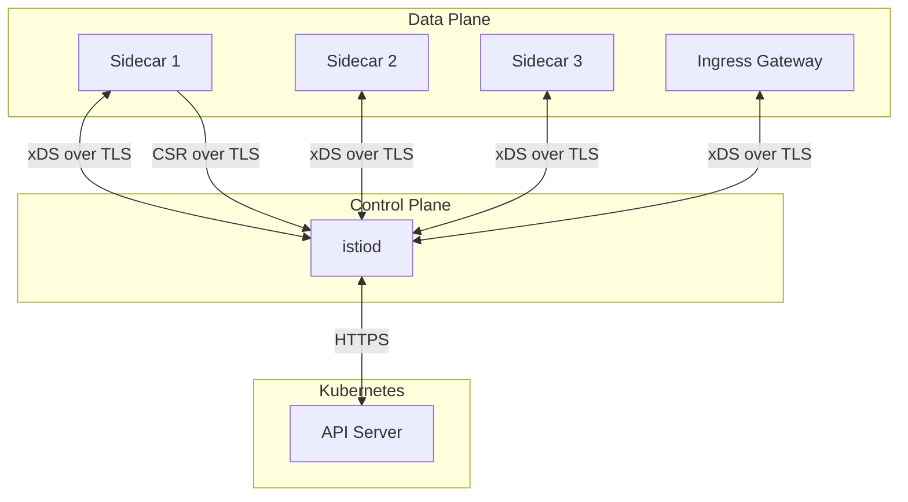

# How to Secure Istio Control Plane Communication

Author: [nawazdhandala](https://github.com/nawazdhandala)

Tags: Istio, Security, Control Plane, Hardening, Service Mesh

Description: How to secure communication between Istio control plane components and the data plane, including certificate pinning, RBAC, and network policies.

---

The Istio control plane is the brain of your service mesh. If an attacker compromises istiod, they can modify routing rules to redirect traffic, disable mTLS to eavesdrop on communication, or inject malicious configuration into Envoy sidecars. Securing the control plane is not optional - it is the foundation that everything else in the mesh depends on.

Control plane communication in Istio flows in two main directions: istiod pushes configuration to sidecars (xDS), and sidecars send certificate signing requests to istiod. Both channels need to be secured.

## Control Plane Communication Channels



Each of these channels has specific security considerations.

## Securing xDS Communication

xDS (Envoy's configuration discovery protocol) is how istiod delivers configuration to sidecars. This channel uses TLS by default, but there are ways to strengthen it.

### Verify xDS TLS is Active

```bash
# Check the xDS connection from a sidecar
istioctl proxy-config bootstrap <pod-name> -o json | \
  jq '.bootstrap.dynamicResources.adsConfig'
```

You should see a gRPC connection to istiod with TLS configured. The bootstrap configuration should reference certificates for securing this connection.

### DNS Certificate for istiod

istiod uses a DNS certificate for its xDS server. Verify it is valid:

```bash
kubectl get secret istiod-tls -n istio-system -o jsonpath='{.data.tls\.crt}' | \
  base64 -d | openssl x509 -text -noout
```

If this secret does not exist, istiod uses a self-generated certificate. For production, configure a proper certificate:

```yaml
apiVersion: install.istio.io/v1alpha1
kind: IstioOperator
spec:
  values:
    pilot:
      env:
        PILOT_CERT_PROVIDER: istiod
      k8s:
        env:
          - name: ENABLE_CA_SERVER
            value: "true"
```

## Restricting Control Plane Access with RBAC

Kubernetes RBAC controls who can modify Istio configuration. Lock it down.

### Review Existing Roles

```bash
# Check who has access to Istio resources
kubectl get clusterroles | grep istio
kubectl get clusterrolebindings | grep istio
```

### Create Restricted Roles

Instead of giving broad Istio access, create targeted roles:

```yaml
apiVersion: rbac.authorization.k8s.io/v1
kind: ClusterRole
metadata:
  name: istio-traffic-manager
rules:
  - apiGroups: ["networking.istio.io"]
    resources: ["virtualservices", "destinationrules", "gateways"]
    verbs: ["get", "list", "watch", "create", "update", "patch"]
---
apiVersion: rbac.authorization.k8s.io/v1
kind: ClusterRole
metadata:
  name: istio-security-admin
rules:
  - apiGroups: ["security.istio.io"]
    resources: ["peerauthentications", "authorizationpolicies", "requestauthentications"]
    verbs: ["get", "list", "watch", "create", "update", "patch", "delete"]
---
apiVersion: rbac.authorization.k8s.io/v1
kind: ClusterRole
metadata:
  name: istio-viewer
rules:
  - apiGroups: ["networking.istio.io", "security.istio.io"]
    resources: ["*"]
    verbs: ["get", "list", "watch"]
```

Bind these roles to specific teams:

```yaml
apiVersion: rbac.authorization.k8s.io/v1
kind: ClusterRoleBinding
metadata:
  name: platform-team-istio-security
subjects:
  - kind: Group
    name: platform-team
    apiGroup: rbac.authorization.k8s.io
roleRef:
  kind: ClusterRole
  name: istio-security-admin
  apiGroup: rbac.authorization.k8s.io
```

## Network Policies for the Control Plane

Use Kubernetes NetworkPolicies to restrict which pods can communicate with istiod:

```yaml
apiVersion: networking.k8s.io/v1
kind: NetworkPolicy
metadata:
  name: istiod-network-policy
  namespace: istio-system
spec:
  podSelector:
    matchLabels:
      app: istiod
  policyTypes:
    - Ingress
    - Egress
  ingress:
    # Allow xDS connections from sidecars (port 15010/15012)
    - ports:
        - port: 15010
          protocol: TCP
        - port: 15012
          protocol: TCP
        - port: 15014
          protocol: TCP
    # Allow webhook calls from API server
    - ports:
        - port: 15017
          protocol: TCP
  egress:
    # Allow connection to Kubernetes API server
    - ports:
        - port: 443
          protocol: TCP
        - port: 6443
          protocol: TCP
    # Allow DNS resolution
    - ports:
        - port: 53
          protocol: UDP
        - port: 53
          protocol: TCP
```

## Securing the Istiod Service Account

The istiod service account has significant permissions in the cluster. Audit and minimize them:

```bash
# Check istiod's effective permissions
kubectl auth can-i --list --as=system:serviceaccount:istio-system:istiod -n istio-system
```

Review the ClusterRoles bound to the istiod service account and remove any permissions that are not needed for your setup:

```bash
kubectl get clusterrolebindings -o json | \
  jq '.items[] | select(.subjects[]? | .name == "istiod" and .namespace == "istio-system") | .metadata.name'
```

## Securing Webhook Communication

Istio uses admission webhooks for sidecar injection and configuration validation. These run over TLS and need to be secured:

```bash
# Check webhook configurations
kubectl get mutatingwebhookconfigurations | grep istio
kubectl get validatingwebhookconfigurations | grep istio
```

Verify the webhook certificates are valid:

```bash
kubectl get mutatingwebhookconfiguration istio-sidecar-injector \
  -o jsonpath='{.webhooks[0].clientConfig.caBundle}' | base64 -d | \
  openssl x509 -text -noout | grep "Not After"
```

If webhooks are compromised, an attacker could inject malicious sidecars or bypass configuration validation. Consider using webhook certificate rotation and monitoring.

## Protecting the CA Root Key

Istiod's CA private key is the most sensitive secret in the mesh. If compromised, an attacker can issue certificates for any workload identity.

For the self-signed CA:

```bash
# Check where the CA key is stored
kubectl get secret istio-ca-secret -n istio-system -o yaml
```

For production, use a plug-in CA where the root key is stored outside the cluster:

```yaml
apiVersion: install.istio.io/v1alpha1
kind: IstioOperator
spec:
  values:
    pilot:
      env:
        EXTERNAL_CA: ISTIOD_RA_KUBERNETES_API
```

Or integrate with an external CA like Vault or SPIRE so the root key never touches the cluster.

## Monitoring Control Plane Security

Set up monitoring to detect anomalous control plane behavior:

```bash
# Monitor istiod for unusual activity
kubectl logs deployment/istiod -n istio-system -f | \
  grep -E "error|warn|unauthorized|denied"
```

Key metrics to watch in Prometheus:

```text
# Configuration push errors (could indicate attacks)
pilot_xds_push_errors

# Certificate signing requests (unusual spike could indicate attack)
citadel_server_csr_count

# Failed authentication attempts
pilot_xds_expired_nonce

# Configuration push latency (high values could indicate DoS)
pilot_proxy_convergence_time_bucket
```

## istiod High Availability

Running istiod in high availability mode is both a reliability and security measure. If one istiod instance is compromised, the others continue serving legitimate configuration:

```yaml
apiVersion: install.istio.io/v1alpha1
kind: IstioOperator
spec:
  components:
    pilot:
      k8s:
        replicaCount: 3
        hpaSpec:
          minReplicas: 3
          maxReplicas: 5
```

Spread istiod replicas across availability zones:

```yaml
spec:
  components:
    pilot:
      k8s:
        affinity:
          podAntiAffinity:
            preferredDuringSchedulingIgnoredDuringExecution:
              - weight: 100
                podAffinityTerm:
                  labelSelector:
                    matchLabels:
                      app: istiod
                  topologyKey: topology.kubernetes.io/zone
```

## Audit Logging

Enable Kubernetes audit logging for Istio resources to track who modifies mesh configuration:

```yaml
apiVersion: audit.k8s.io/v1
kind: Policy
rules:
  - level: RequestResponse
    resources:
      - group: "networking.istio.io"
        resources: ["*"]
      - group: "security.istio.io"
        resources: ["*"]
    verbs: ["create", "update", "patch", "delete"]
```

This creates an audit trail of all Istio configuration changes, which is essential for incident investigation and compliance.

Securing the control plane is not a set-and-forget task. Review permissions regularly, rotate certificates, monitor for anomalies, and keep istiod updated with security patches. The control plane is the trust root for your entire mesh - treat it with the corresponding level of care.
