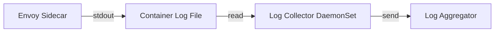

# How to Send Istio Access Logs to a Log Aggregator

Author: [nawazdhandala](https://github.com/nawazdhandala)

Tags: Istio, Access Logs, Log Aggregation, Fluentd, OpenTelemetry, Observability

Description: How to ship Istio access logs from sidecar proxies to centralized log aggregation systems like Elasticsearch, Loki, and cloud logging services.

---

Istio access logs are written to stdout by default, which means they end up in the container log files on each node. That works fine for quick debugging with `kubectl logs`, but for production use you need a centralized log aggregation system. Searching through logs across hundreds of pods manually is not sustainable.

This guide covers the main approaches to shipping Istio access logs to a log aggregator, from the standard Kubernetes log collection pattern to Istio-native options.

## The Standard Pattern: Node-Level Log Collection

The most common and proven approach is to run a log collector as a DaemonSet on every node. The collector reads container logs from the node's filesystem and forwards them to your aggregation backend.



This works because Kubernetes captures stdout/stderr from every container and writes it to files on the node, typically at `/var/log/containers/` or `/var/log/pods/`.

### Using Fluent Bit

Fluent Bit is lightweight and commonly used for log collection:

```yaml
apiVersion: apps/v1
kind: DaemonSet
metadata:
  name: fluent-bit
  namespace: logging
spec:
  selector:
    matchLabels:
      app: fluent-bit
  template:
    metadata:
      labels:
        app: fluent-bit
    spec:
      serviceAccountName: fluent-bit
      tolerations:
        - operator: Exists
      containers:
        - name: fluent-bit
          image: fluent/fluent-bit:latest
          volumeMounts:
            - name: varlog
              mountPath: /var/log
            - name: config
              mountPath: /fluent-bit/etc/
      volumes:
        - name: varlog
          hostPath:
            path: /var/log
        - name: config
          configMap:
            name: fluent-bit-config
```

Configure Fluent Bit to filter for Istio sidecar logs:

```yaml
apiVersion: v1
kind: ConfigMap
metadata:
  name: fluent-bit-config
  namespace: logging
data:
  fluent-bit.conf: |
    [SERVICE]
        Flush         5
        Log_Level     info
        Parsers_File  parsers.conf

    [INPUT]
        Name              tail
        Tag               kube.*
        Path              /var/log/containers/*istio-proxy*.log
        Parser            docker
        DB                /var/log/flb_kube.db
        Mem_Buf_Limit     5MB
        Skip_Long_Lines   On
        Refresh_Interval  10

    [FILTER]
        Name                kubernetes
        Match               kube.*
        Kube_URL            https://kubernetes.default.svc:443
        Kube_CA_File        /var/run/secrets/kubernetes.io/serviceaccount/ca.crt
        Kube_Token_File     /var/run/secrets/kubernetes.io/serviceaccount/token
        Merge_Log           On
        Keep_Log            Off
        K8S-Logging.Parser  On
        K8S-Logging.Exclude Off
        Labels              On
        Annotations         Off

    [OUTPUT]
        Name            es
        Match           kube.*
        Host            elasticsearch.logging.svc.cluster.local
        Port            9200
        Index           istio-access-logs
        Type            _doc
        Logstash_Format On
        Logstash_Prefix istio-access

  parsers.conf: |
    [PARSER]
        Name        docker
        Format      json
        Time_Key    time
        Time_Format %Y-%m-%dT%H:%M:%S.%LZ
```

The key optimization here is the `Path` filter: `/var/log/containers/*istio-proxy*.log`. This tells Fluent Bit to only read logs from istio-proxy containers, reducing the amount of data it processes.

### Using Promtail for Loki

If you use Grafana Loki for log aggregation:

```yaml
apiVersion: v1
kind: ConfigMap
metadata:
  name: promtail-config
  namespace: logging
data:
  promtail.yaml: |
    server:
      http_listen_port: 3101

    positions:
      filename: /tmp/positions.yaml

    clients:
      - url: http://loki.logging.svc.cluster.local:3100/loki/api/v1/push

    scrape_configs:
      - job_name: istio-proxy
        pipeline_stages:
          - regex:
              expression: '^\[(?P<timestamp>[^\]]+)\] "(?P<method>\S+) (?P<path>\S+) (?P<protocol>\S+)" (?P<response_code>\d+) (?P<response_flags>\S+) (?P<response_code_details>\S+)'
          - labels:
              method:
              response_code:
              response_flags:
          - timestamp:
              source: timestamp
              format: "2006-01-02T15:04:05.000Z"
        static_configs:
          - targets: [localhost]
            labels:
              job: istio-access-logs
              __path__: /var/log/containers/*istio-proxy*.log
```

This extracts fields from the access log and adds them as Loki labels, making it easy to filter by method, response code, or response flags.

## Approach 2: OpenTelemetry Access Log Service (ALS)

Istio can send access logs directly to an OpenTelemetry Collector using the Envoy ALS (Access Log Service) protocol, bypassing the need for node-level log collection entirely.

Configure the extension provider in Istio:

```yaml
apiVersion: install.istio.io/v1alpha1
kind: IstioOperator
spec:
  meshConfig:
    extensionProviders:
      - name: otel-als
        envoyOtelAls:
          service: otel-collector.logging.svc.cluster.local
          port: 4317
```

Enable it with the Telemetry API:

```yaml
apiVersion: telemetry.istio.io/v1
kind: Telemetry
metadata:
  name: otel-logging
  namespace: istio-system
spec:
  accessLogging:
    - providers:
        - name: otel-als
```

Set up the OTel Collector to receive and forward logs:

```yaml
apiVersion: v1
kind: ConfigMap
metadata:
  name: otel-collector-config
  namespace: logging
data:
  config.yaml: |
    receivers:
      otlp:
        protocols:
          grpc:
            endpoint: 0.0.0.0:4317

    processors:
      batch:
        timeout: 5s
        send_batch_size: 500

    exporters:
      elasticsearch:
        endpoints: ["https://elasticsearch.logging.svc.cluster.local:9200"]
        logs_index: istio-access-logs

      loki:
        endpoint: http://loki.logging.svc.cluster.local:3100/loki/api/v1/push
        labels:
          attributes:
            response_code: ""
            method: ""

    service:
      pipelines:
        logs:
          receivers: [otlp]
          processors: [batch]
          exporters: [elasticsearch]
```

The advantage of ALS over node-level collection is that the logs are structured from the start and do not need to be parsed from text. The downside is that it adds gRPC connections from every sidecar to the collector, which can be a scaling concern in large meshes.

## Approach 3: Sidecar-Level File Output

You can configure Envoy to write access logs to a file instead of stdout, and then use a sidecar container to ship them:

```yaml
apiVersion: install.istio.io/v1alpha1
kind: IstioOperator
spec:
  meshConfig:
    extensionProviders:
      - name: file-log
        envoyFileAccessLog:
          path: /var/log/istio/access.log
          logFormat:
            labels:
              timestamp: "%START_TIME%"
              method: "%REQ(:METHOD)%"
              path: "%REQ(X-ENVOY-ORIGINAL-PATH?:PATH)%"
              response_code: "%RESPONSE_CODE%"
              response_flags: "%RESPONSE_FLAGS%"
              duration: "%DURATION%"
```

This approach is rarely used because it requires mounting shared volumes and managing log rotation. The stdout approach combined with node-level collection is simpler and more standard in Kubernetes.

## JSON Formatting for Log Aggregators

Most log aggregators work better with JSON. Switch to JSON encoding:

```yaml
meshConfig:
  accessLogFile: /dev/stdout
  accessLogEncoding: JSON
```

JSON access logs are automatically parsed by most log collectors without custom parsers. The fields become searchable attributes in your log aggregation system.

## Filtering Before Shipping

Shipping every access log to your aggregation backend can be expensive. Filter at the source:

```yaml
apiVersion: telemetry.istio.io/v1
kind: Telemetry
metadata:
  name: filtered-logging
  namespace: istio-system
spec:
  accessLogging:
    - providers:
        - name: envoy
      filter:
        expression: "response.code >= 400 || response.duration > duration('1s')"
```

This logs only errors and slow requests, dramatically reducing log volume while keeping the most important information.

You can also filter at the log collector level:

```yaml
# Fluent Bit filter to drop 200 health check responses
[FILTER]
    Name    grep
    Match   kube.*
    Exclude log .*GET /healthz.*200.*
```

## Scaling Considerations

For large meshes, log volume can be significant:

- A service handling 1000 requests per second generates about 1000 log lines per second per pod
- With JSON encoding, each line is roughly 500 bytes to 1KB
- That is 500KB-1MB per second per pod of log data

Multiply by the number of pods in your mesh and you get a sense of the infrastructure needed. The main levers for controlling this are:

1. **Source filtering** - Only log errors and anomalies
2. **Sampling** - Log a percentage of successful requests
3. **Selective enablement** - Only enable access logs for specific namespaces or services
4. **Log retention** - Set aggressive retention policies in your aggregation backend

The right approach depends on your scale and budget. For most teams, node-level collection with Fluent Bit or Promtail, combined with JSON encoding and CEL-based filtering, provides a good balance of visibility and cost.
