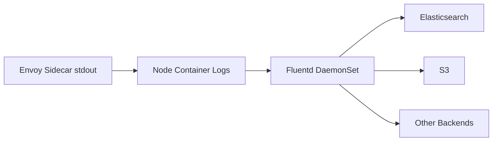

# How to Send Istio Access Logs to Fluentd

Author: [nawazdhandala](https://github.com/nawazdhandala)

Tags: Istio, Fluentd, Access Logs, Logging, Log Aggregation

Description: How to configure a Fluentd pipeline to collect, parse, and forward Istio access logs from Envoy sidecars to various backends.

---

Fluentd has been a staple in Kubernetes logging for years. It is part of the CNCF ecosystem, has a massive plugin library, and handles log routing with a flexibility that is hard to match. If your organization already runs Fluentd, adding Istio access logs to the pipeline is a natural extension.

This guide covers setting up Fluentd to collect Istio access logs, parse them properly, and route them to your backend of choice.

## Architecture

The standard setup runs Fluentd as a DaemonSet on each node, tailing the container log files written by the kubelet:



## Step 1: Configure JSON Access Logs in Istio

Fluentd works best with structured logs. Configure Istio to output JSON:

```yaml
apiVersion: install.istio.io/v1alpha1
kind: IstioOperator
spec:
  meshConfig:
    accessLogFile: /dev/stdout
    accessLogEncoding: JSON
```

Or use the Telemetry API with a custom provider for more control over the fields:

```yaml
apiVersion: install.istio.io/v1alpha1
kind: IstioOperator
spec:
  meshConfig:
    extensionProviders:
      - name: json-stdout
        envoyFileAccessLog:
          path: /dev/stdout
          logFormat:
            labels:
              timestamp: "%START_TIME%"
              method: "%REQ(:METHOD)%"
              path: "%REQ(X-ENVOY-ORIGINAL-PATH?:PATH)%"
              protocol: "%PROTOCOL%"
              response_code: "%RESPONSE_CODE%"
              response_flags: "%RESPONSE_FLAGS%"
              duration_ms: "%DURATION%"
              upstream_host: "%UPSTREAM_HOST%"
              upstream_cluster: "%UPSTREAM_CLUSTER%"
              request_id: "%REQ(X-REQUEST-ID)%"
              authority: "%REQ(:AUTHORITY)%"
              user_agent: "%REQ(USER-AGENT)%"
              bytes_received: "%BYTES_RECEIVED%"
              bytes_sent: "%BYTES_SENT%"
```

## Step 2: Fluentd Configuration

Create a comprehensive Fluentd configuration for Istio access logs:

```yaml
apiVersion: v1
kind: ConfigMap
metadata:
  name: fluentd-config
  namespace: logging
data:
  fluent.conf: |
    # Input: tail istio-proxy container logs
    <source>
      @type tail
      path /var/log/containers/*istio-proxy*.log
      pos_file /var/log/fluentd-istio-proxy.pos
      tag istio.access
      read_from_head false
      <parse>
        @type json
        time_key time
        time_format %Y-%m-%dT%H:%M:%S.%NZ
        keep_time_key true
      </parse>
    </source>

    # Filter: parse the nested JSON log field
    <filter istio.access>
      @type parser
      key_name log
      reserve_data true
      remove_key_name_field true
      <parse>
        @type json
      </parse>
    </filter>

    # Filter: add Kubernetes metadata
    <filter istio.access>
      @type kubernetes_metadata
      skip_labels false
      skip_container_metadata false
      skip_namespace_metadata false
    </filter>

    # Filter: add computed fields
    <filter istio.access>
      @type record_transformer
      enable_ruby true
      <record>
        service_name ${record.dig("kubernetes", "labels", "app") || "unknown"}
        namespace ${record.dig("kubernetes", "namespace_name") || "unknown"}
        is_error ${(record["response_code"].to_i >= 500).to_s}
      </record>
    </filter>

    # Route errors to a separate stream
    <match istio.access>
      @type copy

      # Send everything to Elasticsearch
      <store>
        @type elasticsearch
        host elasticsearch.logging.svc.cluster.local
        port 9200
        index_name istio-access-logs
        logstash_format true
        logstash_prefix istio-access
        type_name _doc
        include_tag_key false
        <buffer>
          @type file
          path /var/log/fluentd-buffers/istio-access
          flush_mode interval
          flush_interval 5s
          chunk_limit_size 8MB
          total_limit_size 2GB
          retry_max_interval 30s
          retry_forever true
          overflow_action block
        </buffer>
      </store>

      # Send errors to a dedicated index with longer retention
      <store>
        @type elasticsearch
        host elasticsearch.logging.svc.cluster.local
        port 9200
        index_name istio-errors
        logstash_format true
        logstash_prefix istio-errors
        type_name _doc
        <buffer>
          @type file
          path /var/log/fluentd-buffers/istio-errors
          flush_mode interval
          flush_interval 2s
          chunk_limit_size 4MB
          total_limit_size 1GB
        </buffer>
        <filter>
          @type grep
          <regexp>
            key is_error
            pattern true
          </regexp>
        </filter>
      </store>
    </match>
```

## Step 3: Deploy Fluentd DaemonSet

```yaml
apiVersion: apps/v1
kind: DaemonSet
metadata:
  name: fluentd
  namespace: logging
spec:
  selector:
    matchLabels:
      app: fluentd
  template:
    metadata:
      labels:
        app: fluentd
    spec:
      serviceAccountName: fluentd
      tolerations:
        - operator: Exists
      containers:
        - name: fluentd
          image: fluent/fluentd-kubernetes-daemonset:v1-debian-elasticsearch
          env:
            - name: FLUENT_ELASTICSEARCH_HOST
              value: elasticsearch.logging.svc.cluster.local
            - name: FLUENT_ELASTICSEARCH_PORT
              value: "9200"
          resources:
            requests:
              cpu: 200m
              memory: 256Mi
            limits:
              memory: 512Mi
          volumeMounts:
            - name: varlog
              mountPath: /var/log
            - name: config
              mountPath: /fluentd/etc/
            - name: buffer
              mountPath: /var/log/fluentd-buffers
      volumes:
        - name: varlog
          hostPath:
            path: /var/log
        - name: config
          configMap:
            name: fluentd-config
        - name: buffer
          emptyDir: {}
```

Create the ServiceAccount and RBAC:

```yaml
apiVersion: v1
kind: ServiceAccount
metadata:
  name: fluentd
  namespace: logging
---
apiVersion: rbac.authorization.k8s.io/v1
kind: ClusterRole
metadata:
  name: fluentd
rules:
  - apiGroups: [""]
    resources: ["namespaces", "pods"]
    verbs: ["get", "list", "watch"]
---
apiVersion: rbac.authorization.k8s.io/v1
kind: ClusterRoleBinding
metadata:
  name: fluentd
roleRef:
  apiGroup: rbac.authorization.k8s.io
  kind: ClusterRole
  name: fluentd
subjects:
  - kind: ServiceAccount
    name: fluentd
    namespace: logging
```

## Parsing TEXT Format Logs

If you cannot switch to JSON access logs, you need a custom parser for Istio's default TEXT format:

```yaml
<source>
  @type tail
  path /var/log/containers/*istio-proxy*.log
  pos_file /var/log/fluentd-istio-text.pos
  tag istio.access
  <parse>
    @type json
    time_key time
    time_format %Y-%m-%dT%H:%M:%S.%NZ
  </parse>
</source>

<filter istio.access>
  @type parser
  key_name log
  reserve_data true
  remove_key_name_field true
  <parse>
    @type regexp
    expression /^\[(?<timestamp>[^\]]+)\] "(?<method>\S+) (?<path>\S+) (?<protocol>\S+)" (?<response_code>\d+) (?<response_flags>\S+) (?<response_code_details>\S+) (?<connection_termination>\S+) "(?<upstream_failure_reason>[^"]*)" (?<bytes_received>\d+) (?<bytes_sent>\d+) (?<duration>\d+) (?<upstream_service_time>\S+) "(?<x_forwarded_for>[^"]*)" "(?<user_agent>[^"]*)" "(?<request_id>[^"]*)" "(?<authority>[^"]*)" "(?<upstream_host>[^"]*)" (?<upstream_cluster>\S+)/
  </parse>
</filter>
```

This regex parser extracts the main fields from the default Istio text format. It is fragile - if Istio changes the default format, the parser breaks. This is why JSON is preferred.

## Routing to Multiple Backends

Fluentd excels at routing logs to multiple destinations. Here is an example that sends to Elasticsearch, S3, and a Kafka topic:

```yaml
<match istio.access>
  @type copy

  <store>
    @type elasticsearch
    host elasticsearch.logging.svc.cluster.local
    port 9200
    logstash_format true
    logstash_prefix istio-access
    <buffer>
      flush_interval 5s
    </buffer>
  </store>

  <store>
    @type s3
    s3_bucket istio-access-logs-archive
    s3_region us-east-1
    path logs/%Y/%m/%d/
    <buffer time>
      @type file
      path /var/log/fluentd-buffers/s3
      timekey 3600
      timekey_wait 10m
      chunk_limit_size 64MB
    </buffer>
    <format>
      @type json
    </format>
  </store>

  <store>
    @type kafka2
    brokers kafka.messaging.svc.cluster.local:9092
    default_topic istio-access-logs
    <format>
      @type json
    </format>
    <buffer>
      flush_interval 3s
    </buffer>
  </store>
</match>
```

## Filtering in Fluentd

### Drop Health Check Logs

```yaml
<filter istio.access>
  @type grep
  <exclude>
    key path
    pattern /^\/health[zy]?$/
  </exclude>
</filter>
```

### Keep Only Errors

```yaml
<filter istio.access>
  @type grep
  <regexp>
    key response_code
    pattern /^[45]\d{2}$/
  </regexp>
</filter>
```

### Sample Successful Requests

```yaml
<filter istio.access>
  @type sampling
  sample_rate 100  # Keep 1 out of every 100 successful requests
  <filter>
    @type grep
    <regexp>
      key response_code
      pattern /^2\d{2}$/
    </regexp>
  </filter>
</filter>
```

## Performance Tuning

Fluentd can become a bottleneck if not tuned properly:

- **Buffer configuration** is critical. Use file-based buffers (`@type file`) instead of memory buffers for reliability.
- **Set chunk_limit_size** appropriately. Larger chunks mean fewer flushes but more memory usage.
- **Use multiple workers** if your Fluentd instance handles a lot of data:

```yaml
<system>
  workers 4
</system>
```

- **Monitor Fluentd itself.** Enable the monitoring plugin:

```yaml
<source>
  @type monitor_agent
  bind 0.0.0.0
  port 24220
</source>
```

Then scrape `/api/plugins.json` with Prometheus to track buffer sizes, retry counts, and output latency.

Fluentd's strength is its flexibility. Once you have the basic pipeline working, you can add transforms, routing rules, and additional outputs without changing anything on the Istio side. The key is starting with JSON access logs so you avoid the fragility of text parsing.
