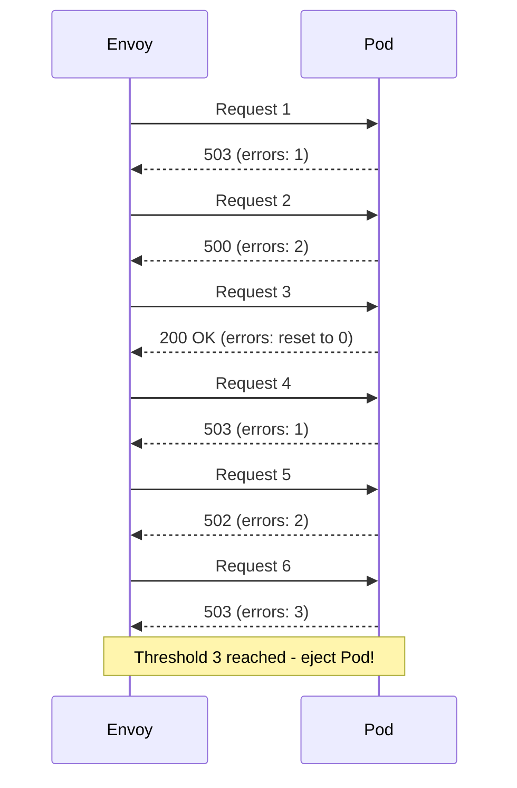

# How to Set Consecutive Errors Threshold for Circuit Breaking

Author: [nawazdhandala](https://github.com/nawazdhandala)

Tags: Istio, Service Mesh, Circuit Breaking, Outlier Detection, Kubernetes

Description: How to set and tune the consecutive errors threshold in Istio outlier detection to control when unhealthy pods get ejected from the load balancing pool.

---

The consecutive errors threshold is the trigger point for Istio's outlier detection. It determines how many back-to-back errors an individual pod needs to return before it gets pulled out of the load balancing pool. Set it too low and you eject pods over minor hiccups. Set it too high and genuinely broken pods keep receiving traffic for too long. Getting this number right matters a lot for production reliability.

## How Consecutive Error Counting Works

Envoy tracks errors per upstream instance (pod). The counter is straightforward:

1. A request to Pod A returns a 5xx error. Counter for Pod A: 1.
2. Another request to Pod A returns a 5xx error. Counter for Pod A: 2.
3. A request to Pod A succeeds with 200. Counter for Pod A: reset to 0.

The key word is "consecutive." A single successful response resets the entire counter. This means the threshold only triggers when a pod is consistently failing, not when it has occasional errors.



## The Two Error Threshold Fields

Istio gives you two separate error threshold fields:

### consecutive5xxErrors

Counts all HTTP 5xx errors (500, 501, 502, 503, 504, etc.):

```yaml
apiVersion: networking.istio.io/v1beta1
kind: DestinationRule
metadata:
  name: my-service
  namespace: default
spec:
  host: my-service
  trafficPolicy:
    outlierDetection:
      consecutive5xxErrors: 5
      interval: 10s
      baseEjectionTime: 30s
```

### consecutiveGatewayErrors

Only counts gateway errors (502, 503, 504):

```yaml
apiVersion: networking.istio.io/v1beta1
kind: DestinationRule
metadata:
  name: my-service
  namespace: default
spec:
  host: my-service
  trafficPolicy:
    outlierDetection:
      consecutiveGatewayErrors: 3
      interval: 10s
      baseEjectionTime: 30s
```

You can use both together. They maintain separate counters:

```yaml
apiVersion: networking.istio.io/v1beta1
kind: DestinationRule
metadata:
  name: my-service
  namespace: default
spec:
  host: my-service
  trafficPolicy:
    outlierDetection:
      consecutive5xxErrors: 5
      consecutiveGatewayErrors: 3
      interval: 10s
      baseEjectionTime: 30s
      maxEjectionPercent: 50
```

In this setup, a pod gets ejected if it returns 5 consecutive 5xx errors of any kind OR 3 consecutive gateway errors. The gateway error threshold is lower because gateway errors usually indicate infrastructure problems that are less likely to resolve on their own.

## Choosing the Right Threshold

### Threshold of 1

```yaml
consecutive5xxErrors: 1
```

Extremely aggressive. One error and the pod is out. Only use this for services where any error means the pod is definitely broken (for example, health check endpoints).

The problem with this threshold is false positives. A single timeout due to garbage collection, a slow disk, or a network blip ejects the pod even though it would handle the next request fine.

### Threshold of 3

```yaml
consecutive5xxErrors: 3
```

A good middle ground for most services. Three consecutive errors strongly suggest the pod is genuinely unhealthy. This is aggressive enough to catch real issues quickly but tolerant enough to ride through momentary hiccups.

This is the value I recommend starting with for most production services.

### Threshold of 5

```yaml
consecutive5xxErrors: 5
```

More conservative. The default value in many Istio configurations. Suitable for services that occasionally return 5xx errors during normal operation (for example, services that return 500 for certain invalid inputs).

### Threshold of 10+

```yaml
consecutive5xxErrors: 10
```

Very conservative. The pod needs to fail 10 times in a row before getting ejected. This is appropriate for services with known flaky behavior where you want to avoid unnecessary ejections but still protect against completely broken instances.

## Threshold Guidelines by Service Type

| Service Type | Recommended Threshold | Reasoning |
|-------------|----------------------|-----------|
| API Gateway | 2-3 | User-facing, fast recovery needed |
| Payment Service | 2-3 | Critical path, cannot afford broken pods |
| Logging Service | 5-10 | Non-critical, tolerates some failures |
| Cache Service | 3-5 | Important for perf, not for correctness |
| Batch Processor | 10+ | Errors may be expected for bad inputs |

## Full Example: Multi-Tier Application

Here is how you might set different thresholds for different services in the same application:

```yaml
# Frontend API - strict threshold
apiVersion: networking.istio.io/v1beta1
kind: DestinationRule
metadata:
  name: frontend-api
  namespace: production
spec:
  host: frontend-api
  trafficPolicy:
    outlierDetection:
      consecutive5xxErrors: 2
      consecutiveGatewayErrors: 1
      interval: 5s
      baseEjectionTime: 60s
      maxEjectionPercent: 30
---
# Backend Processing - moderate threshold
apiVersion: networking.istio.io/v1beta1
kind: DestinationRule
metadata:
  name: order-processor
  namespace: production
spec:
  host: order-processor
  trafficPolicy:
    outlierDetection:
      consecutive5xxErrors: 5
      interval: 10s
      baseEjectionTime: 30s
      maxEjectionPercent: 50
---
# Analytics Service - lenient threshold
apiVersion: networking.istio.io/v1beta1
kind: DestinationRule
metadata:
  name: analytics-service
  namespace: production
spec:
  host: analytics-service
  trafficPolicy:
    outlierDetection:
      consecutive5xxErrors: 10
      interval: 30s
      baseEjectionTime: 15s
      maxEjectionPercent: 60
```

## Monitoring Error Thresholds

Track whether your thresholds are actually triggering ejections:

```bash
# Check ejection events
kubectl exec deploy/frontend-api -n production -c istio-proxy -- \
  curl -s localhost:15000/stats | grep "ejections"

# Specifically look for:
# ejections_detected_consecutive_5xx - threshold was hit
# ejections_enforced_consecutive_5xx - pod was actually ejected
# ejections_active - currently ejected pods
```

The difference between "detected" and "enforced" matters. An ejection is detected when the threshold is hit but might not be enforced if `maxEjectionPercent` would be exceeded. If detected is much higher than enforced, you are hitting the ejection percentage cap and might need more replicas.

## Interaction with Load Balancing

The consecutive error threshold interacts with Istio's load balancing in an important way. If you have 3 pods and the load balancer uses round-robin, consecutive errors from one pod might be broken up by requests to other pods.

For example, with round-robin across pods A, B, and C where B is broken:

```text
Request 1 -> A (200)
Request 2 -> B (503) -- B errors: 1
Request 3 -> C (200)
Request 4 -> A (200)
Request 5 -> B (503) -- B errors: 1 (reset because non-consecutive to B)
```

Wait, that is not right. The consecutive counter is per-instance, not per-request-sequence. Envoy tracks errors per pod, so:

```text
Request to B: 503 -- B errors: 1
Request to A: 200 -- (doesn't affect B's counter)
Request to B: 503 -- B errors: 2
Request to C: 200 -- (doesn't affect B's counter)
Request to B: 503 -- B errors: 3 (threshold reached!)
```

Requests to other pods do not reset the counter. Only a successful response from Pod B itself would reset Pod B's counter. This is important to understand when reasoning about how quickly your thresholds will trigger.

## Testing Your Threshold

Use fortio to generate errors and verify ejection happens:

```bash
# Deploy a test service that returns errors
kubectl exec deploy/fortio -- fortio load \
  -c 10 \
  -qps 100 \
  -t 60s \
  http://my-service:8080/error-endpoint

# Watch ejection metrics in real-time
watch -n 1 "kubectl exec deploy/my-service -c istio-proxy -- \
  curl -s localhost:15000/stats | grep ejections"
```

The right consecutive error threshold is specific to each service. Start with 3-5 for most services, monitor the ejection metrics for a week, and adjust based on whether you see too many false ejections or too few real ones.
