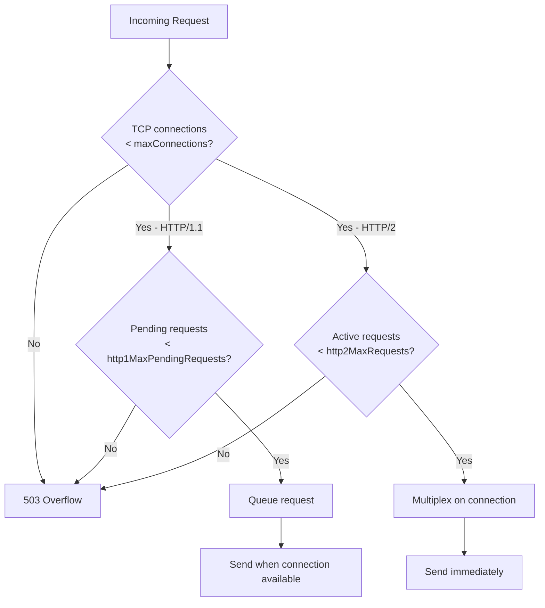

# How to Set Maximum Concurrent Connections in Istio

Author: [nawazdhandala](https://github.com/nawazdhandala)

Tags: Istio, Service Mesh, Circuit Breaking, Connection, Kubernetes

Description: How to configure maximum concurrent TCP and HTTP connections in Istio using DestinationRule connection pool settings to protect services from overload.

---

Every service has a limit to how many concurrent connections it can handle. Databases, legacy services, and even modern microservices can degrade or crash when they get more connections than they can manage. Istio lets you enforce connection limits at the mesh level through DestinationRule resources, so the service itself never sees more traffic than it can handle.

## Why Limit Concurrent Connections?

Without connection limits, a traffic spike can overwhelm a service. The service starts processing requests slower, callers time out, retries pile up, and suddenly you have a cascading failure. Connection limits act as a pressure valve - when the limit is reached, excess requests fail fast with a 503 rather than waiting in an ever-growing queue.

This is especially important for:

- Services that connect to databases with connection pool limits
- Legacy services that were not built for high concurrency
- Services that consume a lot of memory per connection
- Any service during incidents when capacity is reduced

## Configuring TCP Connection Limits

The `maxConnections` field in a DestinationRule controls the maximum number of TCP connections to a service:

```yaml
apiVersion: networking.istio.io/v1beta1
kind: DestinationRule
metadata:
  name: database-proxy
  namespace: default
spec:
  host: database-proxy
  trafficPolicy:
    connectionPool:
      tcp:
        maxConnections: 50
        connectTimeout: 3s
```

This limits the Envoy proxy to 50 concurrent TCP connections to the `database-proxy` service. The 51st connection attempt will receive a 503 Service Unavailable error.

The `connectTimeout` sets how long Envoy waits for the TCP handshake to complete. If the upstream service is slow to accept connections (a sign of overload), this prevents callers from waiting too long.

## Configuring HTTP Connection Limits

For HTTP traffic, you have more fine-grained controls:

```yaml
apiVersion: networking.istio.io/v1beta1
kind: DestinationRule
metadata:
  name: api-service
  namespace: default
spec:
  host: api-service
  trafficPolicy:
    connectionPool:
      tcp:
        maxConnections: 100
      http:
        http1MaxPendingRequests: 50
        http2MaxRequests: 200
```

Here is what each setting does:

**maxConnections** - Total TCP connections. This applies to both HTTP/1.1 and HTTP/2, but has different implications for each protocol.

**http1MaxPendingRequests** - For HTTP/1.1, each connection handles one request at a time. When all connections are busy, new requests wait in a pending queue. This setting caps that queue. Once the queue is full, additional requests get an immediate 503.

**http2MaxRequests** - For HTTP/2 (and gRPC), multiple requests are multiplexed over a single connection. This setting limits the total number of concurrent requests, regardless of how many connections exist.

## Understanding the Difference Between TCP and HTTP Limits

This trips people up. TCP and HTTP limits work together but at different layers.



For HTTP/1.1 services, the effective concurrency limit is `maxConnections` because each connection handles one request at a time. The `http1MaxPendingRequests` just controls how many extra requests can wait.

For HTTP/2 services, `http2MaxRequests` is the primary concurrency control since many requests share few connections.

## Real-World Configuration Examples

### Protecting a Database Service

Database connections are expensive. Limit them tightly:

```yaml
apiVersion: networking.istio.io/v1beta1
kind: DestinationRule
metadata:
  name: postgres-proxy
  namespace: default
spec:
  host: postgres-proxy
  trafficPolicy:
    connectionPool:
      tcp:
        maxConnections: 20
        connectTimeout: 5s
      http:
        http1MaxPendingRequests: 10
```

Twenty connections is typical for a small database. The low pending request limit means excess traffic fails fast rather than building up.

### Protecting a High-Traffic API

For a service that handles lots of concurrent requests:

```yaml
apiVersion: networking.istio.io/v1beta1
kind: DestinationRule
metadata:
  name: product-api
  namespace: default
spec:
  host: product-api
  trafficPolicy:
    connectionPool:
      tcp:
        maxConnections: 500
      http:
        http1MaxPendingRequests: 200
        http2MaxRequests: 1000
        maxRequestsPerConnection: 100
```

Higher limits for a service that is built to handle high concurrency. The `maxRequestsPerConnection: 100` setting forces connections to be recycled periodically, which helps distribute load across pods when new instances are added.

### Protecting a Legacy Service

For a service that can only handle a few concurrent requests:

```yaml
apiVersion: networking.istio.io/v1beta1
kind: DestinationRule
metadata:
  name: legacy-billing
  namespace: default
spec:
  host: legacy-billing
  trafficPolicy:
    connectionPool:
      tcp:
        maxConnections: 5
        connectTimeout: 10s
      http:
        http1MaxPendingRequests: 5
```

Very tight limits. Only 5 concurrent connections and 5 pending requests. The legacy service gets at most 10 requests in its pipeline at any time.

## How to Determine the Right Limits

Do not guess. Look at your current traffic:

```bash
# Check current active connections and requests
kubectl exec deploy/my-service -c istio-proxy -- \
  curl -s localhost:15000/stats | grep -E "cx_active|rq_active"

# Check peak connection counts
kubectl exec deploy/my-service -c istio-proxy -- \
  curl -s localhost:15000/stats | grep "cx_total"
```

Start with limits at about 2x your observed peak, then tighten as you gain confidence. You can also use Prometheus to track connection counts over time:

```bash
# In PromQL, check max concurrent connections over the past hour
# max_over_time(envoy_cluster_upstream_cx_active[1h])
```

## Monitoring Connection Limit Overflows

When the connection limit trips, Envoy records it as an overflow:

```bash
# Check how often the circuit breaker has tripped
kubectl exec deploy/my-service -c istio-proxy -- \
  curl -s localhost:15000/stats | grep overflow

# Key metrics:
# upstream_rq_pending_overflow - HTTP pending request overflow
# upstream_cx_overflow - TCP connection overflow
```

If `overflow` counts are high during normal traffic, your limits are too low. If they are zero even during load tests, your limits might be too generous to provide any protection.

## Combining with Outlier Detection

Connection limits work best alongside outlier detection:

```yaml
apiVersion: networking.istio.io/v1beta1
kind: DestinationRule
metadata:
  name: payment-service
  namespace: default
spec:
  host: payment-service
  trafficPolicy:
    connectionPool:
      tcp:
        maxConnections: 100
      http:
        http1MaxPendingRequests: 50
        http2MaxRequests: 200
    outlierDetection:
      consecutive5xxErrors: 3
      interval: 10s
      baseEjectionTime: 30s
      maxEjectionPercent: 40
```

Connection limits prevent overload. Outlier detection removes failing instances. Together, they give you a complete circuit breaking solution that protects both the service as a whole and individual instances.

Setting connection limits is about knowing your services. What can they handle? What are their bottlenecks? Once you have that understanding, translating it into Istio configuration is straightforward.
