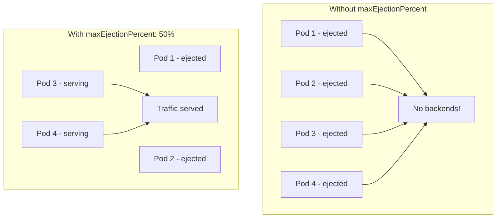

# How to Set Maximum Ejection Percentage in Istio

Author: [nawazdhandala](https://github.com/nawazdhandala)

Tags: Istio, Service Mesh, Outlier Detection, Circuit Breaking, Kubernetes

Description: How to configure maxEjectionPercent in Istio to prevent outlier detection from ejecting too many pods and causing a complete service outage.

---

The `maxEjectionPercent` field in Istio's outlier detection is a safety valve. It caps the percentage of upstream instances that can be removed from the load balancing pool at the same time. Without it, a widespread issue could cause outlier detection to eject every single pod, leaving your service with zero backends and a 100% error rate.

## Why maxEjectionPercent Matters

Imagine you have 4 pods running a service. A network issue causes all of them to return errors briefly. Without `maxEjectionPercent`, outlier detection could eject all 4 pods, leaving no healthy backends. Every request would fail with a 503.

With `maxEjectionPercent: 50`, at most 2 of the 4 pods can be ejected. The remaining 2 continue serving traffic, even if they are also having issues. Some degraded service is almost always better than no service.



## Basic Configuration

```yaml
apiVersion: networking.istio.io/v1beta1
kind: DestinationRule
metadata:
  name: my-service
  namespace: default
spec:
  host: my-service
  trafficPolicy:
    outlierDetection:
      consecutive5xxErrors: 3
      interval: 10s
      baseEjectionTime: 30s
      maxEjectionPercent: 50
```

This says: no matter how many pods are failing, never eject more than 50% of them.

## How the Math Works

The ejection percentage is calculated against the total number of hosts in the load balancing pool:

```
max_ejectable = floor(total_hosts * maxEjectionPercent / 100)
```

Examples:

| Total Pods | maxEjectionPercent | Max Ejectable |
|-----------|-------------------|---------------|
| 2 | 50 | 1 |
| 3 | 50 | 1 |
| 4 | 50 | 2 |
| 5 | 50 | 2 |
| 10 | 50 | 5 |
| 3 | 33 | 0 (effectively disabled!) |
| 4 | 25 | 1 |
| 10 | 30 | 3 |

Notice the gotcha with 3 pods and 33%: `floor(3 * 0.33) = 0`. Outlier detection is effectively disabled because it cannot eject anyone. Always do the math for your specific pod count.

## Choosing the Right Percentage

### 100% - Full Ejection

```yaml
maxEjectionPercent: 100
```

Every pod can be ejected. Only use this in testing or for non-critical services where you would rather have no traffic than degraded traffic. In production, this is almost never what you want.

### 50% - Standard

```yaml
maxEjectionPercent: 50
```

The most common choice. Ensures at least half your capacity is always available. Works well for services with 4 or more pods.

### 25-40% - Conservative

```yaml
maxEjectionPercent: 30
```

Good for critical services where you need to maintain high availability. With 10 pods and 30%, at most 3 can be ejected, leaving 7 to handle traffic.

### 10-20% - Very Conservative

```yaml
maxEjectionPercent: 15
```

For highly critical services with many replicas. With 20 pods and 15%, at most 3 can be ejected. The service barely notices the capacity reduction.

## The Relationship with Pod Count

The right `maxEjectionPercent` depends heavily on how many pods you run:

### Small Deployments (2-3 pods)

With only 2-3 pods, even ejecting one pod means losing 33-50% of capacity. Be very conservative:

```yaml
apiVersion: networking.istio.io/v1beta1
kind: DestinationRule
metadata:
  name: small-service
  namespace: default
spec:
  host: small-service
  trafficPolicy:
    outlierDetection:
      consecutive5xxErrors: 5
      interval: 15s
      baseEjectionTime: 15s
      maxEjectionPercent: 33
```

Higher error threshold (5), shorter ejection time (15s), and 33% max ejection. With 3 pods, this allows ejecting 1 pod max. With 2 pods, `floor(2 * 0.33) = 0`, so ejection is effectively disabled. Consider using 50% for 2-pod deployments if you still want ejection.

### Medium Deployments (4-10 pods)

```yaml
apiVersion: networking.istio.io/v1beta1
kind: DestinationRule
metadata:
  name: medium-service
  namespace: default
spec:
  host: medium-service
  trafficPolicy:
    outlierDetection:
      consecutive5xxErrors: 3
      interval: 10s
      baseEjectionTime: 30s
      maxEjectionPercent: 40
```

40% ejection with 6 pods means at most 2 can be ejected, leaving 4 to serve traffic. That is usually plenty of capacity.

### Large Deployments (10+ pods)

```yaml
apiVersion: networking.istio.io/v1beta1
kind: DestinationRule
metadata:
  name: large-service
  namespace: default
spec:
  host: large-service
  trafficPolicy:
    outlierDetection:
      consecutive5xxErrors: 3
      interval: 10s
      baseEjectionTime: 30s
      maxEjectionPercent: 50
```

With 20 pods and 50%, up to 10 can be ejected. This handles scenarios where half the deployment has issues (like a bad canary deployment affecting one availability zone).

## Using minHealthPercent Alongside maxEjectionPercent

The `minHealthPercent` field adds another layer of protection. If the percentage of healthy hosts drops below this threshold, outlier detection is disabled entirely:

```yaml
apiVersion: networking.istio.io/v1beta1
kind: DestinationRule
metadata:
  name: critical-service
  namespace: production
spec:
  host: critical-service
  trafficPolicy:
    outlierDetection:
      consecutive5xxErrors: 3
      interval: 10s
      baseEjectionTime: 30s
      maxEjectionPercent: 50
      minHealthPercent: 40
```

This says:
- Eject up to 50% of hosts based on errors
- But if healthy hosts drop below 40%, stop ejecting and send traffic to everyone

This prevents a cascade where ejections reduce capacity, causing more errors, causing more ejections. When things get really bad, `minHealthPercent` says "just send traffic everywhere and hope for the best."

## What Happens When maxEjectionPercent Is Reached

When the limit is hit, Envoy records it but does not eject the pod. The `ejections_overflow` metric tracks this:

```bash
# Check if ejections are being blocked by the percentage limit
kubectl exec deploy/my-service -c istio-proxy -- \
  curl -s localhost:15000/stats | grep "ejections_overflow"

# Also check detected vs enforced
kubectl exec deploy/my-service -c istio-proxy -- \
  curl -s localhost:15000/stats | grep -E "ejections_detected|ejections_enforced"
```

If `ejections_detected` exceeds `ejections_enforced`, the percentage limit is blocking ejections. This means you have more unhealthy pods than you are allowing to be removed. You might need more replicas, or you might need to investigate why so many pods are failing.

## Production Example: E-Commerce Platform

```yaml
# Product catalog - reads only, can tolerate some degradation
apiVersion: networking.istio.io/v1beta1
kind: DestinationRule
metadata:
  name: catalog-service
  namespace: production
spec:
  host: catalog-service
  trafficPolicy:
    outlierDetection:
      consecutive5xxErrors: 3
      interval: 10s
      baseEjectionTime: 30s
      maxEjectionPercent: 50
---
# Payment processing - critical, minimal ejection
apiVersion: networking.istio.io/v1beta1
kind: DestinationRule
metadata:
  name: payment-service
  namespace: production
spec:
  host: payment-service
  trafficPolicy:
    outlierDetection:
      consecutive5xxErrors: 2
      interval: 5s
      baseEjectionTime: 60s
      maxEjectionPercent: 25
      minHealthPercent: 50
---
# Recommendation engine - non-critical, aggressive ejection
apiVersion: networking.istio.io/v1beta1
kind: DestinationRule
metadata:
  name: recommendation-service
  namespace: production
spec:
  host: recommendation-service
  trafficPolicy:
    outlierDetection:
      consecutive5xxErrors: 5
      interval: 15s
      baseEjectionTime: 15s
      maxEjectionPercent: 60
```

Each service has different tolerance for capacity reduction:
- Catalog: standard 50% - losing half the pods is manageable for read traffic
- Payment: strict 25% - always maintain 75% capacity for critical transactions
- Recommendations: generous 60% - better to show no recommendations than broken ones

The key insight with `maxEjectionPercent` is that it is not about tuning for performance. It is about preventing catastrophic failure. Set it based on the minimum capacity your service needs to stay functional, and use `minHealthPercent` as a backstop for truly bad scenarios.
