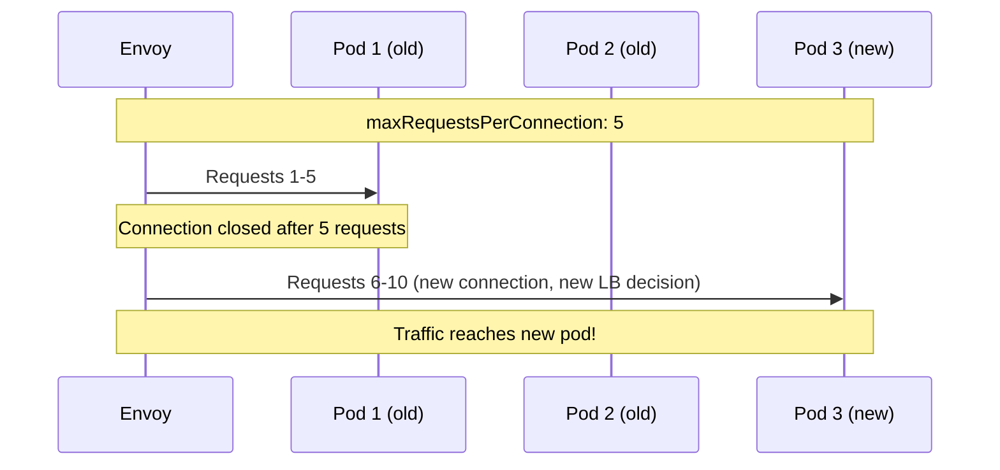

# How to Set Maximum Requests Per Connection in Istio

Author: [nawazdhandala](https://github.com/nawazdhandala)

Tags: Istio, Service Mesh, Connection, Kubernetes, Load Balancing

Description: How to use maxRequestsPerConnection in Istio DestinationRule to force connection recycling for better load distribution and memory management.

---

When Envoy opens a connection to an upstream service, it can reuse that connection for many requests. This is efficient because it avoids the overhead of TCP handshakes, but it creates a problem: long-lived connections can get "stuck" to specific pods, leading to uneven load distribution. The `maxRequestsPerConnection` setting tells Envoy to close a connection after a certain number of requests and open a new one, which triggers a fresh load balancing decision.

## Why Connection Recycling Matters

Picture this scenario. You have a service with 3 pods. Envoy opens connections to all three and starts sending requests. Now you scale up to 6 pods. The existing connections still point to the original 3 pods. The new pods sit idle while the original ones handle all the traffic.

This is not a hypothetical problem. It happens all the time with HTTP/1.1 keep-alive connections and HTTP/2 long-lived connections. Setting `maxRequestsPerConnection` forces periodic reconnection, which means the load balancer gets a chance to pick new (possibly freshly scaled) pods.



## Basic Configuration

Set `maxRequestsPerConnection` in the DestinationRule:

```yaml
apiVersion: networking.istio.io/v1beta1
kind: DestinationRule
metadata:
  name: backend-service
  namespace: default
spec:
  host: backend-service
  trafficPolicy:
    connectionPool:
      tcp:
        maxConnections: 100
      http:
        maxRequestsPerConnection: 100
```

After every 100 requests on a connection, Envoy closes it and opens a new one. The next request triggers a fresh load balancing decision.

## Setting the Right Value

A value of 0 (the default) means unlimited requests per connection. Connections stay open indefinitely.

The right value depends on your situation:

**Frequently scaling services** - Use a low value like 10-50. Connections get recycled often, so new pods get traffic quickly.

```yaml
apiVersion: networking.istio.io/v1beta1
kind: DestinationRule
metadata:
  name: autoscaling-service
  namespace: default
spec:
  host: autoscaling-service
  trafficPolicy:
    connectionPool:
      http:
        maxRequestsPerConnection: 20
```

**Stable services with fixed pod counts** - Use a higher value like 500-1000 or leave it at 0. Connection setup overhead is not worth it if the pod set rarely changes.

```yaml
apiVersion: networking.istio.io/v1beta1
kind: DestinationRule
metadata:
  name: stable-service
  namespace: default
spec:
  host: stable-service
  trafficPolicy:
    connectionPool:
      http:
        maxRequestsPerConnection: 1000
```

**Services with memory leaks in connection handling** - Use a low value. Some applications leak memory per connection. Recycling connections periodically can keep memory usage in check.

```yaml
apiVersion: networking.istio.io/v1beta1
kind: DestinationRule
metadata:
  name: leaky-service
  namespace: default
spec:
  host: leaky-service
  trafficPolicy:
    connectionPool:
      http:
        maxRequestsPerConnection: 10
```

## Impact on HTTP/1.1 vs HTTP/2

The behavior differs between HTTP versions.

For **HTTP/1.1**, each connection handles one request at a time. Setting `maxRequestsPerConnection: 100` means the connection closes after handling 100 sequential requests. The overhead is relatively low because HTTP/1.1 connection setup is cheap.

For **HTTP/2** (and gRPC), a single connection handles many concurrent requests. Setting `maxRequestsPerConnection: 100` means the connection closes after 100 total requests have completed on it. Since HTTP/2 connections are more expensive to set up (TLS negotiation, SETTINGS frame exchange), you might want a higher value:

```yaml
apiVersion: networking.istio.io/v1beta1
kind: DestinationRule
metadata:
  name: grpc-service
  namespace: default
spec:
  host: grpc-service
  trafficPolicy:
    connectionPool:
      http:
        http2MaxRequests: 500
        maxRequestsPerConnection: 500
```

## The Trade-Off: Efficiency vs Load Distribution

There is a direct trade-off here. Lower values mean better load distribution but more connection overhead. Higher values mean less overhead but potentially uneven load.

Here is a rough guide:

| Value | Use Case |
|-------|----------|
| 0 (unlimited) | Stable services, low latency requirements |
| 10-50 | Frequent scaling, rolling deployments |
| 100-500 | General purpose, balanced approach |
| 500-1000 | High-traffic services where connection overhead matters |

## Combining with Other Settings

`maxRequestsPerConnection` works best as part of a complete connection pool configuration:

```yaml
apiVersion: networking.istio.io/v1beta1
kind: DestinationRule
metadata:
  name: order-service
  namespace: production
spec:
  host: order-service
  trafficPolicy:
    connectionPool:
      tcp:
        maxConnections: 200
        connectTimeout: 5s
      http:
        http1MaxPendingRequests: 100
        http2MaxRequests: 400
        maxRequestsPerConnection: 100
    outlierDetection:
      consecutive5xxErrors: 5
      interval: 10s
      baseEjectionTime: 30s
      maxEjectionPercent: 50
```

This configuration:
- Allows up to 200 TCP connections
- Queues up to 100 pending HTTP/1.1 requests
- Allows up to 400 concurrent HTTP/2 requests
- Recycles connections after 100 requests
- Ejects unhealthy instances after 5 consecutive errors

## Monitoring Connection Recycling

Track connection creation to see how often recycling happens:

```bash
# Check total connections created over time
kubectl exec deploy/order-service -c istio-proxy -- \
  curl -s localhost:15000/stats | grep "cx_total"

# Check active connections
kubectl exec deploy/order-service -c istio-proxy -- \
  curl -s localhost:15000/stats | grep "cx_active"

# If cx_total is growing much faster than expected,
# maxRequestsPerConnection might be too low
```

You can calculate the effective connection rate. If your service handles 1000 RPS and `maxRequestsPerConnection` is 100, Envoy creates roughly 10 new connections per second. At 10, it would be 100 new connections per second. That overhead can be significant.

## Rolling Deployments and Connection Recycling

One of the most practical uses of `maxRequestsPerConnection` is ensuring smooth rolling deployments. When old pods terminate and new pods start, connections to old pods break. If you rely on long-lived connections, you will see errors during every deployment.

Setting `maxRequestsPerConnection` to a reasonable value means connections naturally cycle to new pods as they become available, reducing deployment-related errors:

```yaml
apiVersion: networking.istio.io/v1beta1
kind: DestinationRule
metadata:
  name: web-frontend
  namespace: default
spec:
  host: web-frontend
  trafficPolicy:
    connectionPool:
      http:
        maxRequestsPerConnection: 50
    outlierDetection:
      consecutive5xxErrors: 2
      interval: 5s
      baseEjectionTime: 15s
```

The combination of connection recycling every 50 requests and aggressive outlier detection (eject after just 2 consecutive errors, check every 5 seconds) gives you fast failover during deployments.

Connection recycling through `maxRequestsPerConnection` is a simple setting with a big impact on load distribution and deployment smoothness. If you are running autoscaling services or doing frequent deployments, this is one of the first things to configure.
