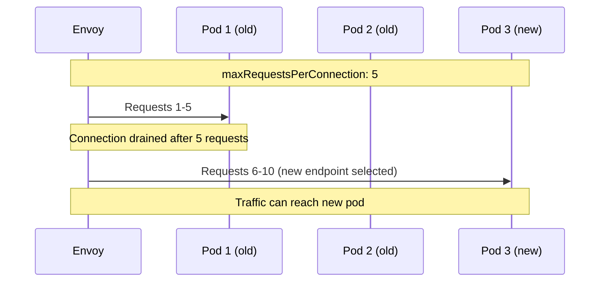

# How to Set Maximum Requests Per Connection in Istio

Author: [nawazdhandala](https://github.com/nawazdhandala)

Tags: Istio, Service Mesh, Connection, Kubernetes, Load Balancing

Description: How to use maxRequestsPerConnection in Istio DestinationRule to force connection recycling for better load distribution and memory management.

---

When Envoy opens a connection to an upstream endpoint, it can reuse that connection for many requests. This is efficient because it avoids the overhead of TCP handshakes and, in Istio mTLS meshes, TLS handshakes. The `maxRequestsPerConnection` setting tells Envoy to drain and replace a connection after a certain number of requests, which bounds how long any single upstream connection stays in use.

## Why Connection Recycling Matters

Picture this scenario. You have a service with 3 pods. Envoy opens connections to upstream endpoints as requests arrive. Now you scale up to 6 pods. Envoy can select the new endpoints for new requests, but long-lived connections to the original pods can still keep a lot of active traffic on those pods, especially with HTTP/2 streams or clients that maintain steady traffic.

This is not a hypothetical problem. It can happen with HTTP/1.1 keep-alive connections and HTTP/2 long-lived connections. Setting `maxRequestsPerConnection` forces periodic connection draining, which keeps upstream connections from living indefinitely.


```mermaid
sequenceDiagram
    participant E as Envoy
    participant P1 as Pod 1 (old)
    participant P2 as Pod 2 (old)
    participant P3 as Pod 3 (new)

    Note over E,P3: maxRequestsPerConnection: 5

    E->>P1: Requests 1-5
    Note over E,P1: Connection drained after 5 requests
    E->>P3: Requests 6-10 (new endpoint selected)
    Note over E,P3: Traffic can reach new pod
```

## Basic Configuration

Set `maxRequestsPerConnection` in the DestinationRule:

```yaml
apiVersion: networking.istio.io/v1
kind: DestinationRule
metadata:
  name: backend-service
  namespace: default
spec:
  host: backend-service
  trafficPolicy:
    connectionPool:
      tcp:
        maxConnections: 100
      http:
        maxRequestsPerConnection: 100
```

After every 100 requests on a connection, Envoy drains that connection and uses a new connection for later requests.

## Setting the Right Value

A value of 0 (the default) means unlimited requests per connection, up to Envoy's implementation limit. Connections can still close for other reasons, such as idle timeout, endpoint health changes, or normal shutdown.

The right value depends on your situation:

**Frequently scaling services** - Use a low value like 10-50. Connections get recycled often, so traffic can move across changing pod sets more steadily.

```yaml
apiVersion: networking.istio.io/v1
kind: DestinationRule
metadata:
  name: autoscaling-service
  namespace: default
spec:
  host: autoscaling-service
  trafficPolicy:
    connectionPool:
      http:
        maxRequestsPerConnection: 20
```

**Stable services with fixed pod counts** - Use a higher value like 500-1000 or leave it at 0. Connection setup overhead is not worth it if the pod set rarely changes.

```yaml
apiVersion: networking.istio.io/v1
kind: DestinationRule
metadata:
  name: stable-service
  namespace: default
spec:
  host: stable-service
  trafficPolicy:
    connectionPool:
      http:
        maxRequestsPerConnection: 1000
```

**Services with memory leaks in connection handling** - Use a low value. Some applications leak memory per connection. Recycling connections periodically can keep memory usage in check.

```yaml
apiVersion: networking.istio.io/v1
kind: DestinationRule
metadata:
  name: leaky-service
  namespace: default
spec:
  host: leaky-service
  trafficPolicy:
    connectionPool:
      http:
        maxRequestsPerConnection: 10
```

## Impact on HTTP/1.1 vs HTTP/2

The behavior differs between HTTP versions.

For **HTTP/1.1**, Envoy does not use upstream pipelining, so each connection handles one request at a time. Setting `maxRequestsPerConnection: 100` means the connection is drained after handling 100 sequential requests. The overhead depends on whether the upstream connection uses plain TCP or TLS/mTLS.

For **HTTP/2** (and gRPC), a single connection handles many concurrent requests. Setting `maxRequestsPerConnection: 100` means the connection is drained after 100 total requests have been sent on it. Since HTTP/2 connections can carry many streams and may involve TLS negotiation plus HTTP/2 SETTINGS exchange, you might want a higher value:

```yaml
apiVersion: networking.istio.io/v1
kind: DestinationRule
metadata:
  name: grpc-service
  namespace: default
spec:
  host: grpc-service
  trafficPolicy:
    connectionPool:
      http:
        http2MaxRequests: 500
        maxRequestsPerConnection: 500
```

## The Trade-Off: Efficiency vs Load Distribution

There is a direct trade-off here. Lower values mean better load distribution but more connection overhead. Higher values mean less overhead but potentially uneven load.

Here is a rough guide:

| Value | Use Case |
|-------|----------|
| 0 (unlimited) | Stable services, low latency requirements |
| 10-50 | Frequent scaling, rolling deployments |
| 100-500 | General purpose, balanced approach |
| 500-1000 | High-traffic services where connection overhead matters |

## Combining with Other Settings

`maxRequestsPerConnection` works best as part of a complete connection pool configuration:

```yaml
apiVersion: networking.istio.io/v1
kind: DestinationRule
metadata:
  name: order-service
  namespace: production
spec:
  host: order-service
  trafficPolicy:
    connectionPool:
      tcp:
        maxConnections: 200
        connectTimeout: 5s
      http:
        http1MaxPendingRequests: 100
        http2MaxRequests: 400
        maxRequestsPerConnection: 100
    outlierDetection:
      consecutive5xxErrors: 5
      interval: 10s
      baseEjectionTime: 30s
      maxEjectionPercent: 50
```

This configuration:
- Allows up to 200 TCP connections
- Queues up to 100 pending requests while waiting for a ready connection
- Allows up to 400 active requests to the destination
- Drains and replaces connections after 100 requests
- Ejects unhealthy instances after 5 consecutive errors

## Monitoring Connection Recycling

Track connection creation to see how often recycling happens:

```bash
# Check total connections created over time

kubectl exec deploy/order-service -c istio-proxy -- \
  curl -s localhost:15000/stats | grep "cx_total"

# Check active connections
kubectl exec deploy/order-service -c istio-proxy -- \
  curl -s localhost:15000/stats | grep "cx_active"

# If cx_total is growing much faster than expected,
# maxRequestsPerConnection might be too low
```

You can estimate the effective connection churn. If one Envoy proxy sends 1000 RPS to a destination and `maxRequestsPerConnection` is 100, that proxy may create roughly 10 replacement upstream connections per second for that destination. At 10, it could be around 100 replacement connections per second. The exact number depends on endpoint count, protocol, concurrency, worker threads, and existing connection-pool capacity.

## Rolling Deployments and Connection Recycling

One practical use of `maxRequestsPerConnection` is limiting how long upstream connections live during rolling deployments. When old pods terminate and new pods start, connections to old pods must drain or close. If you rely on very long-lived connections without graceful shutdown, you can see errors during deployments.

Setting `maxRequestsPerConnection` to a reasonable value means connections naturally cycle over time as pods change, which can reduce deployment-related errors when combined with graceful termination and health checking:

```yaml
apiVersion: networking.istio.io/v1
kind: DestinationRule
metadata:
  name: web-frontend
  namespace: default
spec:
  host: web-frontend
  trafficPolicy:
    connectionPool:
      http:
        maxRequestsPerConnection: 50
    outlierDetection:
      consecutive5xxErrors: 2
      interval: 5s
      baseEjectionTime: 15s
```

The combination of connection recycling every 50 requests and aggressive outlier detection (eject after just 2 consecutive errors, with a 5-second analysis interval) can give you faster failover during deployments.

Connection recycling through `maxRequestsPerConnection` is a simple setting that can improve connection turnover, load distribution, and deployment smoothness. If you are running autoscaling services or doing frequent deployments, this is one of the first things to consider.
