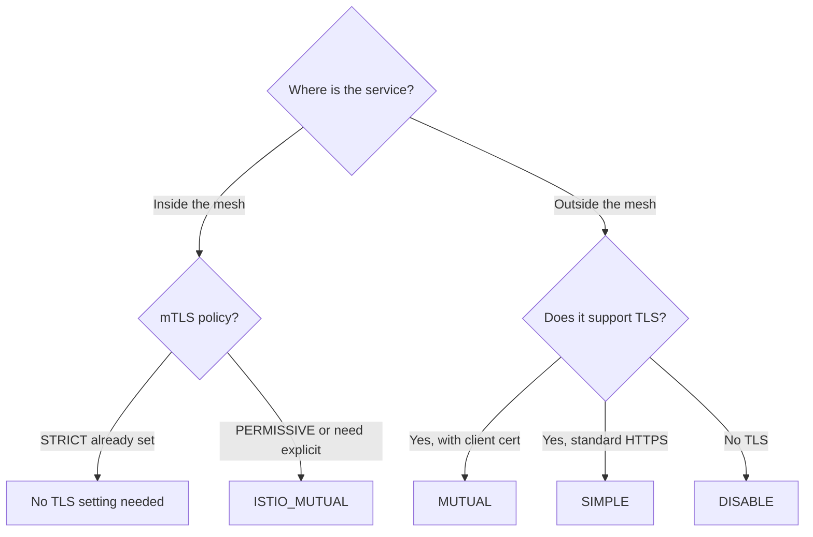

# How to Set TLS Settings in Istio DestinationRule

Author: [nawazdhandala](https://github.com/nawazdhandala)

Tags: Istio, TLS, DestinationRule, Security, MTLS

Description: Configure TLS settings in Istio DestinationRule to control encryption between your services and external endpoints.

---

TLS settings in a DestinationRule tell Envoy how to establish secure connections to upstream services. This covers everything from enforcing mutual TLS (mTLS) between services in the mesh to configuring TLS for connections to external services that require HTTPS.

The TLS mode you choose depends on where the traffic is going and what security requirements you have. Services inside the mesh typically use Istio's automatic mTLS, but there are cases where you need to override the default behavior.

## TLS Modes in DestinationRule

Istio supports four TLS modes in the DestinationRule:

| Mode | Description |
|------|-------------|
| `DISABLE` | No TLS. Connections are plain text. |
| `SIMPLE` | Standard TLS (like HTTPS). Client verifies the server's certificate. |
| `MUTUAL` | Mutual TLS. Both client and server present certificates. |
| `ISTIO_MUTUAL` | Istio's built-in mTLS using automatically provisioned certificates. |

## DISABLE - Turning Off TLS

Sometimes you need to explicitly disable TLS for a specific service. This is common when connecting to legacy services that do not support TLS:

```yaml
apiVersion: networking.istio.io/v1
kind: DestinationRule
metadata:
  name: legacy-service-notls
spec:
  host: legacy-service
  trafficPolicy:
    tls:
      mode: DISABLE
```

Be careful with this. Disabling TLS means traffic between your sidecar and the upstream is unencrypted. Only use this when the service genuinely cannot handle TLS and you have other network-level security in place.

## SIMPLE - Standard TLS

Use SIMPLE mode when connecting to an external HTTPS service or any service that presents a server certificate:

```yaml
apiVersion: networking.istio.io/v1
kind: DestinationRule
metadata:
  name: external-api-tls
spec:
  host: api.external-service.com
  trafficPolicy:
    tls:
      mode: SIMPLE
```

In SIMPLE mode, Envoy verifies the server's certificate against its CA bundle. For well-known CAs (like Let's Encrypt), this works out of the box.

If the external service uses a private CA, you need to provide the CA certificate:

```yaml
apiVersion: networking.istio.io/v1
kind: DestinationRule
metadata:
  name: external-private-ca
spec:
  host: internal-api.company.com
  trafficPolicy:
    tls:
      mode: SIMPLE
      caCertificates: /etc/certs/company-ca.pem
```

The certificate file must be mounted into the Envoy sidecar. You can do this with a Kubernetes Secret mounted as a volume.

## MUTUAL - Full Mutual TLS

MUTUAL mode means both sides present certificates. The client (Envoy) sends a certificate to the server, and the server sends one back. This is used when the upstream service requires client certificate authentication:

```yaml
apiVersion: networking.istio.io/v1
kind: DestinationRule
metadata:
  name: secure-service-mtls
spec:
  host: secure-backend.partner.com
  trafficPolicy:
    tls:
      mode: MUTUAL
      clientCertificate: /etc/certs/client.pem
      privateKey: /etc/certs/client-key.pem
      caCertificates: /etc/certs/partner-ca.pem
```

Here you specify:
- `clientCertificate`: The certificate Envoy presents to the server
- `privateKey`: The private key for the client certificate
- `caCertificates`: The CA that signed the server's certificate

These files need to be available in the sidecar container. The typical approach is to create a Kubernetes Secret and mount it:

```bash
kubectl create secret generic partner-certs \
  --from-file=client.pem=client-cert.pem \
  --from-file=client-key.pem=client-key.pem \
  --from-file=partner-ca.pem=partner-ca-cert.pem
```

Then add a volume mount to your pod spec or use Istio's SDS (Secret Discovery Service) for automatic cert distribution.

## ISTIO_MUTUAL - Istio's Automatic mTLS

This is the most common mode for services within the mesh. Istio automatically provisions and rotates certificates through its built-in CA (istiod):

```yaml
apiVersion: networking.istio.io/v1
kind: DestinationRule
metadata:
  name: mesh-service-mtls
spec:
  host: my-service
  trafficPolicy:
    tls:
      mode: ISTIO_MUTUAL
```

With `ISTIO_MUTUAL`, you do not need to specify any certificate paths. Istio handles everything:
- Certificate generation
- Certificate distribution to sidecars
- Certificate rotation before expiry
- Mutual authentication

In most Istio installations with `PeerAuthentication` set to STRICT mode, mTLS is enforced automatically and you do not even need to set `ISTIO_MUTUAL` in the DestinationRule. But there are cases where you want to be explicit, or where auto-mTLS is not working as expected.

## When to Use Each Mode



## TLS Settings Per Subset

Different subsets can have different TLS settings:

```yaml
apiVersion: networking.istio.io/v1
kind: DestinationRule
metadata:
  name: my-service-tls-subsets
spec:
  host: my-service
  trafficPolicy:
    tls:
      mode: ISTIO_MUTUAL
  subsets:
  - name: v1
    labels:
      version: v1
  - name: v2-legacy
    labels:
      version: v2
    trafficPolicy:
      tls:
        mode: DISABLE
```

The v1 subset uses Istio mTLS while the v2-legacy subset has TLS disabled (maybe it does not have a sidecar).

## TLS for External Services with ServiceEntry

When connecting to external services, you typically need both a ServiceEntry and a DestinationRule:

```yaml
apiVersion: networking.istio.io/v1
kind: ServiceEntry
metadata:
  name: external-api
spec:
  hosts:
  - api.stripe.com
  ports:
  - number: 443
    name: https
    protocol: HTTPS
  resolution: DNS
  location: MESH_EXTERNAL
---
apiVersion: networking.istio.io/v1
kind: DestinationRule
metadata:
  name: external-api-tls
spec:
  host: api.stripe.com
  trafficPolicy:
    tls:
      mode: SIMPLE
```

The ServiceEntry registers the external host with the mesh, and the DestinationRule configures TLS for connections to it.

## Verifying TLS Configuration

Check that TLS is properly configured on the Envoy proxy:

```bash
istioctl proxy-config cluster <pod-name> --fqdn my-service.default.svc.cluster.local -o json
```

Look for the `transportSocket` section in the output. For mTLS, you should see certificate paths pointing to Istio's SDS-provided certificates.

You can also check if mTLS is active between two services:

```bash
istioctl authn tls-check <pod-name> my-service.default.svc.cluster.local
```

This shows the current TLS status for the connection.

## Troubleshooting TLS Issues

**503 errors after enabling TLS**: The most common cause is a mismatch between what the client sends and what the server expects. If you set `ISTIO_MUTUAL` but the server does not have a sidecar, the connection will fail.

**Certificate not found**: When using SIMPLE or MUTUAL mode with custom certificates, make sure the certificate files are mounted into the sidecar container at the paths specified in the DestinationRule.

**Connection reset**: This can happen when TLS versions are incompatible. Envoy supports TLS 1.2 and 1.3 by default.

Check the Envoy logs for more details:

```bash
kubectl logs <pod-name> -c istio-proxy | grep tls
```

## Cleanup

```bash
kubectl delete destinationrule mesh-service-mtls
kubectl delete destinationrule external-api-tls
kubectl delete serviceentry external-api
```

TLS settings in DestinationRule give you fine-grained control over connection security. For services inside the mesh, ISTIO_MUTUAL is the default and usually requires no configuration. For external services, use SIMPLE for standard HTTPS or MUTUAL when client certificates are required. Always verify your TLS configuration with istioctl to catch mismatches early.
