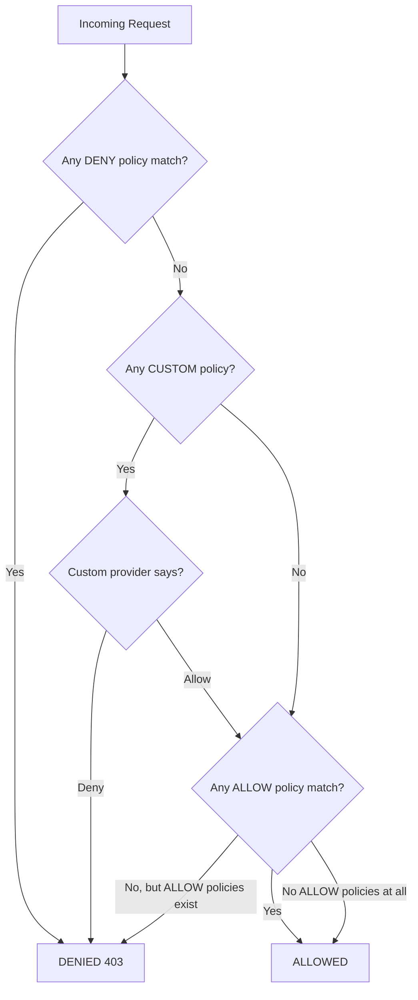

# How to Set Up ALLOW Authorization Policy in Istio

Author: [nawazdhandala](https://github.com/nawazdhandala)

Tags: Istio, Authorization, ALLOW Policy, Security, Kubernetes

Description: Complete guide to creating and managing ALLOW authorization policies in Istio with practical examples for real-world service mesh scenarios.

---

The ALLOW action is the most commonly used authorization policy type in Istio. It works like a whitelist - you define exactly which traffic should be permitted, and everything else that doesn't match any ALLOW policy gets denied. Understanding how ALLOW policies work, how they interact with each other, and how they combine with DENY and CUSTOM policies is essential for building a secure mesh.

## How ALLOW Policies Work

When you create an AuthorizationPolicy with `action: ALLOW`, you're telling Istio: "permit traffic that matches these rules." The key thing to understand is what happens to traffic that doesn't match.

If there are NO authorization policies for a workload, all traffic is allowed (default open). But the moment you add even one ALLOW policy, the behavior flips: now only traffic that matches an ALLOW rule gets through. Everything else is denied with a 403 response.



## Basic ALLOW Policy

The simplest ALLOW policy permits all traffic to a workload:

```yaml
apiVersion: security.istio.io/v1
kind: AuthorizationPolicy
metadata:
  name: allow-all-to-frontend
  namespace: my-app
spec:
  selector:
    matchLabels:
      app: frontend
  action: ALLOW
  rules:
    - {}
```

An empty rule `{}` matches everything. This is equivalent to having no policies at all, but it's useful when you're building up policies incrementally and need a placeholder.

## Source-Based ALLOW

Allow traffic only from specific sources:

```yaml
apiVersion: security.istio.io/v1
kind: AuthorizationPolicy
metadata:
  name: allow-from-frontend
  namespace: my-app
spec:
  selector:
    matchLabels:
      app: backend-api
  action: ALLOW
  rules:
    - from:
        - source:
            principals:
              - "cluster.local/ns/my-app/sa/frontend"
              - "cluster.local/ns/my-app/sa/admin-dashboard"
```

This allows traffic from two specific service accounts. No one else can reach the backend-api service.

## Operation-Based ALLOW

Allow based on what the request is trying to do:

```yaml
apiVersion: security.istio.io/v1
kind: AuthorizationPolicy
metadata:
  name: allow-reads
  namespace: my-app
spec:
  selector:
    matchLabels:
      app: data-service
  action: ALLOW
  rules:
    - to:
        - operation:
            methods: ["GET", "HEAD", "OPTIONS"]
```

This permits read-only operations. POST, PUT, PATCH, and DELETE are all denied.

## Combined Source and Operation

The most practical policies combine both source and operation constraints:

```yaml
apiVersion: security.istio.io/v1
kind: AuthorizationPolicy
metadata:
  name: api-access-control
  namespace: my-app
spec:
  selector:
    matchLabels:
      app: order-service
  action: ALLOW
  rules:
    # Frontend can read orders
    - from:
        - source:
            principals: ["cluster.local/ns/my-app/sa/frontend"]
      to:
        - operation:
            methods: ["GET"]
            paths: ["/api/orders/*"]
    # Order processor can create and update orders
    - from:
        - source:
            principals: ["cluster.local/ns/my-app/sa/order-processor"]
      to:
        - operation:
            methods: ["POST", "PUT"]
            paths: ["/api/orders/*"]
    # Admin can do everything
    - from:
        - source:
            principals: ["cluster.local/ns/my-app/sa/admin"]
```

Each rule is independent. A request matches if it satisfies any one of the rules (OR logic between rules).

## Multiple ALLOW Policies on the Same Workload

You can have multiple ALLOW policies targeting the same workload. They are evaluated together - if a request matches ANY of the ALLOW policies, it's permitted:

```yaml
apiVersion: security.istio.io/v1
kind: AuthorizationPolicy
metadata:
  name: allow-internal
  namespace: my-app
spec:
  selector:
    matchLabels:
      app: my-service
  action: ALLOW
  rules:
    - from:
        - source:
            namespaces: ["my-app"]
---
apiVersion: security.istio.io/v1
kind: AuthorizationPolicy
metadata:
  name: allow-monitoring
  namespace: my-app
spec:
  selector:
    matchLabels:
      app: my-service
  action: ALLOW
  rules:
    - from:
        - source:
            namespaces: ["monitoring"]
      to:
        - operation:
            paths: ["/metrics"]
```

The first policy allows all traffic from the `my-app` namespace. The second allows monitoring traffic to the `/metrics` endpoint. Both are active simultaneously, and matching either one is sufficient.

## Namespace-Level ALLOW Policies

Applying a policy without a selector makes it apply to all workloads in the namespace:

```yaml
apiVersion: security.istio.io/v1
kind: AuthorizationPolicy
metadata:
  name: namespace-default
  namespace: my-app
spec:
  # No selector - applies to all workloads
  action: ALLOW
  rules:
    - from:
        - source:
            namespaces: ["my-app", "shared-infra"]
```

This is great for setting a baseline. All services in `my-app` can only be reached from within the same namespace or from `shared-infra`.

## Using IP Blocks

For traffic coming from outside the mesh (through an ingress gateway, for example), you might want to allow specific IP ranges:

```yaml
apiVersion: security.istio.io/v1
kind: AuthorizationPolicy
metadata:
  name: allow-office-ips
  namespace: my-app
spec:
  selector:
    matchLabels:
      app: admin-panel
  action: ALLOW
  rules:
    - from:
        - source:
            ipBlocks: ["203.0.113.0/24", "198.51.100.0/24"]
```

Keep in mind that IP-based policies can be tricky in Kubernetes. The source IP seen by the sidecar depends on your CNI plugin and whether traffic goes through a load balancer. Test thoroughly before relying on IP blocks.

## ALLOW with JWT Authentication

Combine ALLOW with JWT validation for end-user authentication:

```yaml
apiVersion: security.istio.io/v1
kind: AuthorizationPolicy
metadata:
  name: allow-authenticated
  namespace: my-app
spec:
  selector:
    matchLabels:
      app: my-service
  action: ALLOW
  rules:
    # Service-to-service traffic from known services
    - from:
        - source:
            principals:
              - "cluster.local/ns/my-app/sa/gateway"
    # End-user traffic with valid JWT
    - from:
        - source:
            requestPrincipals: ["*"]
      when:
        - key: request.auth.claims[role]
          values: ["user", "admin"]
```

## Gotchas and Common Mistakes

**Forgetting that ALLOW denies everything else.** The number one mistake. You add an ALLOW policy for GET requests, and suddenly all your POST endpoints are returning 403. Remember: once any ALLOW policy exists for a workload, only matching traffic is permitted.

**Conflicting selectors.** If you have two policies with overlapping selectors, they both apply. This can be confusing when you're trying to figure out why a request is or isn't allowed.

**Not accounting for all traffic sources.** If your service receives traffic from both internal mesh services and an ingress gateway, your ALLOW policy needs to cover both. It's easy to forget one and break half your traffic.

**Health check probes.** Kubernetes health probes go through the sidecar. If your ALLOW policy doesn't account for them, your pods will start failing health checks. Always include health check paths in your ALLOW rules.

## Testing Your ALLOW Policy

```bash
# Apply the policy
kubectl apply -f allow-policy.yaml

# Test from an allowed source
kubectl exec -n my-app deploy/frontend -- curl -s -o /dev/null -w "%{http_code}" http://backend:8080/api/data

# Test from a denied source
kubectl exec -n other-ns deploy/attacker -- curl -s -o /dev/null -w "%{http_code}" http://backend.my-app:8080/api/data

# Check for configuration issues
istioctl analyze -n my-app

# Verify the policy is loaded in Envoy
istioctl proxy-config listener deploy/backend -n my-app -o json | grep -c "rbac"
```

## When to Use ALLOW vs DENY

Use ALLOW policies when you have a known set of traffic sources that should be permitted and you want to block everything else. This is the "default deny" approach and is the most secure pattern.

Use DENY policies when most traffic should be allowed and you only need to block specific cases. DENY policies are evaluated before ALLOW policies, so they act as overrides.

In practice, most production meshes use ALLOW policies as the primary mechanism with occasional DENY policies for specific blocking needs.

ALLOW policies are the foundation of Istio's authorization system. Start with broad policies that match your service architecture, then tighten them over time as you gain confidence in your traffic patterns.
