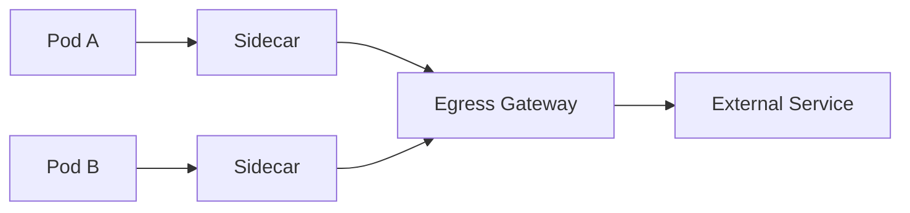

# How to Set Up an Istio Egress Gateway

Author: [nawazdhandala](https://github.com/nawazdhandala)

Tags: Istio, Egress Gateway, Service Mesh, Security, Traffic Management

Description: Step-by-step guide to deploying and configuring an Istio Egress Gateway to control and monitor all outbound traffic leaving your service mesh.

---

An Istio egress gateway is a dedicated proxy that handles all outbound traffic leaving the mesh. Instead of each pod's sidecar connecting directly to external services, traffic goes through the egress gateway first. This gives you a single point for monitoring, logging, and applying policies to outbound traffic.

Think of it as the reverse of an ingress gateway. The ingress gateway is the front door for incoming traffic. The egress gateway is the back door for outgoing traffic.

## Why Use an Egress Gateway

Without an egress gateway, each pod's sidecar proxy connects directly to external services. This works, but has some limitations:

- You cannot easily audit all outbound traffic from a central point
- Network policies are harder to enforce (you'd need to restrict each node)
- In environments with strict compliance requirements, having a single egress point simplifies firewall rules
- You cannot apply consistent TLS origination across all pods

With an egress gateway, all external traffic funnels through a few dedicated pods. You can put these pods on specific nodes, apply network policies to them, and audit their traffic.



## Installing the Egress Gateway

If you used the default Istio profile, the egress gateway might not be installed. Install it with IstioOperator:

```yaml
apiVersion: install.istio.io/v1alpha1
kind: IstioOperator
spec:
  components:
    egressGateways:
    - name: istio-egressgateway
      enabled: true
```

Apply it:

```bash
istioctl install -f istio-egress.yaml
```

Verify the egress gateway is running:

```bash
kubectl get pods -n istio-system -l istio=egressgateway
kubectl get svc istio-egressgateway -n istio-system
```

Unlike the ingress gateway, the egress gateway service type is `ClusterIP` by default since it only handles internal-to-external traffic.

## Routing Traffic Through the Egress Gateway

Setting up traffic to flow through the egress gateway requires three resources working together: a ServiceEntry, a Gateway, and a VirtualService.

### Step 1: Create a ServiceEntry for the External Service

```yaml
apiVersion: networking.istio.io/v1
kind: ServiceEntry
metadata:
  name: external-api
  namespace: default
spec:
  hosts:
  - "api.external.com"
  ports:
  - number: 443
    name: tls
    protocol: TLS
  resolution: DNS
  location: MESH_EXTERNAL
```

### Step 2: Create a Gateway for the Egress Gateway

This tells the egress gateway to accept traffic for the external host:

```yaml
apiVersion: networking.istio.io/v1
kind: Gateway
metadata:
  name: egress-gateway
  namespace: istio-system
spec:
  selector:
    istio: egressgateway
  servers:
  - port:
      number: 443
      name: tls
      protocol: TLS
    hosts:
    - "api.external.com"
    tls:
      mode: PASSTHROUGH
```

### Step 3: Create a VirtualService to Route Through the Egress Gateway

This is the part that stitches everything together. The VirtualService defines two routing rules: one for mesh traffic (from sidecars to the egress gateway) and one for the egress gateway (from the egress gateway to the external service):

```yaml
apiVersion: networking.istio.io/v1
kind: VirtualService
metadata:
  name: external-api-via-egress
  namespace: default
spec:
  hosts:
  - "api.external.com"
  gateways:
  - istio-system/egress-gateway
  - mesh
  tls:
  - match:
    - gateways:
      - mesh
      port: 443
      sniHosts:
      - "api.external.com"
    route:
    - destination:
        host: istio-egressgateway.istio-system.svc.cluster.local
        port:
          number: 443
  - match:
    - gateways:
      - istio-system/egress-gateway
      port: 443
      sniHosts:
      - "api.external.com"
    route:
    - destination:
        host: api.external.com
        port:
          number: 443
```

The first rule catches traffic from any sidecar in the mesh (`mesh` gateway) going to `api.external.com` and redirects it to the egress gateway. The second rule catches traffic arriving at the egress gateway and forwards it to the actual external service.

## Testing the Setup

Send a request from inside the mesh:

```bash
kubectl exec deploy/sleep -- curl -s -o /dev/null -w "%{http_code}" https://api.external.com/status
```

Check the egress gateway logs to confirm traffic is flowing through it:

```bash
kubectl logs -n istio-system deploy/istio-egressgateway --tail=20
```

You should see access log entries for the request.

## Routing HTTP Traffic Through the Egress Gateway

For HTTP (non-TLS) traffic, the configuration is slightly different:

```yaml
apiVersion: networking.istio.io/v1
kind: ServiceEntry
metadata:
  name: httpbin
spec:
  hosts:
  - "httpbin.org"
  ports:
  - number: 80
    name: http
    protocol: HTTP
  resolution: DNS
  location: MESH_EXTERNAL
---
apiVersion: networking.istio.io/v1
kind: Gateway
metadata:
  name: egress-http-gateway
  namespace: istio-system
spec:
  selector:
    istio: egressgateway
  servers:
  - port:
      number: 80
      name: http
      protocol: HTTP
    hosts:
    - "httpbin.org"
---
apiVersion: networking.istio.io/v1
kind: VirtualService
metadata:
  name: httpbin-via-egress
spec:
  hosts:
  - "httpbin.org"
  gateways:
  - istio-system/egress-http-gateway
  - mesh
  http:
  - match:
    - gateways:
      - mesh
      port: 80
    route:
    - destination:
        host: istio-egressgateway.istio-system.svc.cluster.local
        port:
          number: 80
  - match:
    - gateways:
      - istio-system/egress-http-gateway
      port: 80
    route:
    - destination:
        host: httpbin.org
        port:
          number: 80
```

## Scaling and High Availability

For production, run multiple replicas of the egress gateway:

```yaml
apiVersion: install.istio.io/v1alpha1
kind: IstioOperator
spec:
  components:
    egressGateways:
    - name: istio-egressgateway
      enabled: true
      k8s:
        replicaCount: 3
        resources:
          requests:
            cpu: 200m
            memory: 128Mi
          limits:
            cpu: 1000m
            memory: 512Mi
        hpaSpec:
          minReplicas: 2
          maxReplicas: 5
          metrics:
          - type: Resource
            resource:
              name: cpu
              targetAverageUtilization: 70
```

## Dedicated Egress Gateway for Specific Traffic

You can deploy multiple egress gateways for different purposes. For example, one for general API traffic and another for database connections:

```yaml
apiVersion: install.istio.io/v1alpha1
kind: IstioOperator
spec:
  components:
    egressGateways:
    - name: istio-egressgateway
      enabled: true
      label:
        istio: egressgateway
    - name: db-egressgateway
      enabled: true
      label:
        istio: db-egressgateway
```

Then reference the specific gateway in your Gateway resources using the appropriate selector label.

## Network Policies for the Egress Gateway

To enforce that all external traffic goes through the egress gateway (and pods cannot bypass it), apply Kubernetes NetworkPolicies:

```yaml
apiVersion: networking.k8s.io/v1
kind: NetworkPolicy
metadata:
  name: restrict-egress
  namespace: default
spec:
  podSelector: {}
  policyTypes:
  - Egress
  egress:
  - to:
    - namespaceSelector:
        matchLabels:
          kubernetes.io/metadata.name: istio-system
    ports:
    - port: 443
    - port: 80
  - to:
    - namespaceSelector:
        matchLabels:
          kubernetes.io/metadata.name: kube-system
    ports:
    - port: 53
      protocol: UDP
    - port: 53
      protocol: TCP
  - to:
    - podSelector: {}
```

This allows pods in the `default` namespace to talk to each other, to the istio-system namespace (where the egress gateway lives), and to kube-system for DNS. Direct connections to external IPs are blocked.

## Monitoring Egress Gateway Traffic

The egress gateway generates the same Istio metrics as any other proxy. Query them in Prometheus:

```promql
sum(rate(istio_requests_total{source_workload="istio-egressgateway"}[5m])) by (destination_service_name)
```

This shows which external services are being accessed through the egress gateway and at what rate.

## Troubleshooting

**Traffic bypassing the egress gateway.** Make sure `outboundTrafficPolicy.mode` is set to `REGISTRY_ONLY` and that NetworkPolicies prevent direct external access.

**Connection refused at the egress gateway.** Verify the Gateway resource has the correct host and port, and that the egress gateway pod is healthy.

**No access log entries.** Check that access logging is enabled. You may need to configure a Telemetry resource to enable it for the egress gateway.

```bash
istioctl proxy-config listeners deploy/istio-egressgateway -n istio-system
istioctl proxy-config routes deploy/istio-egressgateway -n istio-system
```

## Summary

An Istio egress gateway centralizes outbound traffic through dedicated proxy pods. The setup requires a ServiceEntry for the external service, a Gateway on the egress gateway, and a VirtualService with dual routing rules (mesh to egress gateway, egress gateway to external). Combine this with NetworkPolicies to ensure all outbound traffic is forced through the gateway, giving you a single point for monitoring, auditing, and policy enforcement.
