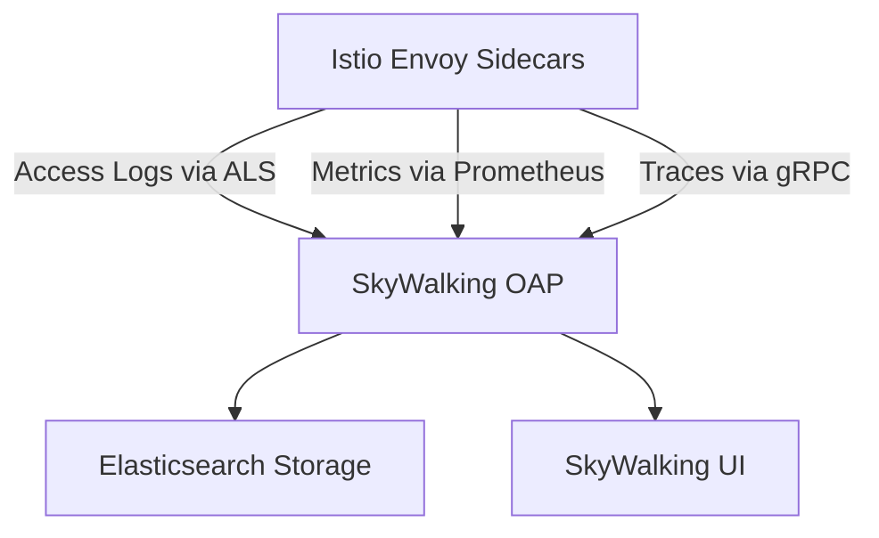

# How to Set Up Apache SkyWalking with Istio

Author: [nawazdhandala](https://github.com/nawazdhandala)

Tags: Istio, Apache SkyWalking, Observability, Tracing, APM

Description: Step-by-step guide to integrating Apache SkyWalking with Istio for application performance monitoring, tracing, and service topology visualization.

---

Apache SkyWalking is more than just a tracing backend. It's a full Application Performance Monitoring (APM) platform that provides service topology maps, performance metrics, alerting, and distributed tracing all in one package. It integrates natively with Istio's access log and metrics data, giving you a comprehensive view of your mesh without deploying multiple tools.

## What Makes SkyWalking Different

Most tracing backends focus on traces. SkyWalking goes further by consuming Istio's access logs and metrics to build service topology maps, calculate service-level indicators (SLIs), and generate alerts. It can replace your separate metrics, tracing, and topology visualization tools with a single platform.



The OAP (Observability Analysis Platform) is the core server that processes all incoming data. It can ingest Envoy's Access Log Service (ALS) data directly, which means it builds service topology without requiring distributed tracing at all.

## Deploying SkyWalking

Deploy SkyWalking's OAP server and UI:

```yaml
# skywalking-oap.yaml
apiVersion: apps/v1
kind: Deployment
metadata:
  name: skywalking-oap
  namespace: observability
spec:
  replicas: 2
  selector:
    matchLabels:
      app: skywalking-oap
  template:
    metadata:
      labels:
        app: skywalking-oap
    spec:
      containers:
        - name: oap
          image: apache/skywalking-oap-server:9.7.0
          env:
            - name: SW_STORAGE
              value: elasticsearch
            - name: SW_STORAGE_ES_CLUSTER_NODES
              value: elasticsearch.observability:9200
            - name: SW_ENVOY_METRIC_ALS_HTTP_ANALYSIS
              value: default
            - name: SW_ENVOY_METRIC_ALS_TCP_ANALYSIS
              value: default
          ports:
            - containerPort: 11800
              name: grpc
            - containerPort: 12800
              name: rest
            - containerPort: 1234
              name: prometheus
          resources:
            requests:
              cpu: 500m
              memory: 1Gi
            limits:
              cpu: "2"
              memory: 2Gi
---
apiVersion: v1
kind: Service
metadata:
  name: skywalking-oap
  namespace: observability
spec:
  selector:
    app: skywalking-oap
  ports:
    - name: grpc
      port: 11800
    - name: rest
      port: 12800
    - name: prometheus
      port: 1234
```

Deploy the UI:

```yaml
# skywalking-ui.yaml
apiVersion: apps/v1
kind: Deployment
metadata:
  name: skywalking-ui
  namespace: observability
spec:
  replicas: 1
  selector:
    matchLabels:
      app: skywalking-ui
  template:
    metadata:
      labels:
        app: skywalking-ui
    spec:
      containers:
        - name: ui
          image: apache/skywalking-ui:9.7.0
          env:
            - name: SW_OAP_ADDRESS
              value: http://skywalking-oap:12800
          ports:
            - containerPort: 8080
---
apiVersion: v1
kind: Service
metadata:
  name: skywalking-ui
  namespace: observability
spec:
  selector:
    app: skywalking-ui
  ports:
    - name: http
      port: 8080
```

```bash
kubectl create namespace observability
kubectl apply -f skywalking-oap.yaml -f skywalking-ui.yaml
```

## Configuring Istio for SkyWalking

SkyWalking can receive data from Istio in several ways. The most powerful approach uses the Envoy Access Log Service (ALS) to build service topology, combined with gRPC trace reporting.

### Method 1: Access Log Service (ALS)

ALS sends structured access log data from every Envoy sidecar to SkyWalking. This is how SkyWalking builds its service topology map.

```yaml
apiVersion: install.istio.io/v1alpha1
kind: IstioOperator
spec:
  meshConfig:
    enableTracing: true
    accessLogFile: ""
    defaultConfig:
      envoyAccessLogService:
        address: skywalking-oap.observability:11800
      envoyMetricsService:
        address: skywalking-oap.observability:11800
    extensionProviders:
      - name: skywalking
        skywalking:
          service: skywalking-oap.observability.svc.cluster.local
          port: 11800
```

Activate tracing:

```yaml
apiVersion: telemetry.istio.io/v1
kind: Telemetry
metadata:
  name: skywalking-tracing
  namespace: istio-system
spec:
  tracing:
    - providers:
        - name: skywalking
      randomSamplingPercentage: 10
```

### Method 2: Using the Telemetry API with SkyWalking Provider

Istio has a dedicated SkyWalking provider type:

```yaml
apiVersion: install.istio.io/v1alpha1
kind: IstioOperator
spec:
  meshConfig:
    enableTracing: true
    extensionProviders:
      - name: skywalking
        skywalking:
          service: skywalking-oap.observability.svc.cluster.local
          port: 11800
```

This configures Envoy to send trace data using SkyWalking's native gRPC protocol, which provides the richest integration.

## Enabling Envoy Metrics Service

SkyWalking can also consume Envoy's metrics for deeper performance insights:

```yaml
apiVersion: install.istio.io/v1alpha1
kind: IstioOperator
spec:
  meshConfig:
    defaultConfig:
      envoyMetricsService:
        address: skywalking-oap.observability:11800
        tlsSettings:
          mode: DISABLE
```

## Verifying the Integration

Generate traffic and check SkyWalking:

```bash
# Generate test traffic
for i in $(seq 1 50); do
  kubectl exec deploy/sleep -- curl -s http://httpbin:8000/get > /dev/null
done

# Access the SkyWalking UI
kubectl port-forward svc/skywalking-ui -n observability 8080:8080
```

Open `http://localhost:8080` and you should see:

1. **Topology view** - A map showing your services and their connections
2. **Service list** - Performance metrics for each service
3. **Trace view** - Distributed traces across your mesh

## SkyWalking's Service Topology

One of SkyWalking's standout features is the automatic service topology map. Using ALS data, it builds a graph of all service-to-service communication patterns, including:

- Request rates between services
- Error rates on each edge
- Average response times
- Protocol types (HTTP, gRPC, TCP)

This topology is generated purely from Envoy data - no application instrumentation needed. It updates in real-time as traffic patterns change.

## Configuring Storage Retention

SkyWalking stores data in Elasticsearch with configurable TTL:

```yaml
env:
  - name: SW_STORAGE
    value: elasticsearch
  - name: SW_STORAGE_ES_CLUSTER_NODES
    value: elasticsearch.observability:9200
  - name: SW_CORE_RECORD_DATA_TTL
    value: "7"
  - name: SW_CORE_METRICS_DATA_TTL
    value: "14"
```

`SW_CORE_RECORD_DATA_TTL` controls how long trace data is kept (7 days). `SW_CORE_METRICS_DATA_TTL` controls metrics retention (14 days).

## Setting Up Alerts in SkyWalking

SkyWalking includes a built-in alerting engine. Configure alerts in the OAP:

```yaml
# alarm-settings.yml (mount as ConfigMap)
rules:
  service_resp_time_rule:
    metrics-name: service_resp_time
    op: ">"
    threshold: 1000
    period: 5
    count: 3
    message: "Service response time is above 1000ms for 3 consecutive periods"

  service_sla_rule:
    metrics-name: service_sla
    op: "<"
    threshold: 8000
    period: 5
    count: 5
    message: "Service success rate is below 80% for 5 consecutive periods"

  endpoint_resp_time_rule:
    metrics-name: endpoint_resp_time
    op: ">"
    threshold: 2000
    period: 5
    count: 3
    message: "Endpoint response time is above 2000ms"
```

Mount this as a ConfigMap:

```yaml
apiVersion: v1
kind: ConfigMap
metadata:
  name: skywalking-alarm
  namespace: observability
data:
  alarm-settings.yml: |
    rules:
      service_resp_time_rule:
        metrics-name: service_resp_time
        op: ">"
        threshold: 1000
        period: 5
        count: 3
        message: "Response time over 1s"
```

Add the volume mount to the OAP deployment:

```yaml
volumeMounts:
  - name: alarm-config
    mountPath: /skywalking/config/alarm-settings.yml
    subPath: alarm-settings.yml
volumes:
  - name: alarm-config
    configMap:
      name: skywalking-alarm
```

## SkyWalking vs Jaeger/Zipkin

The main differences:

- **SkyWalking** provides metrics, topology, tracing, and alerting in one tool. It can build topology from Envoy ALS without application-level tracing. It has a more complex deployment but fewer separate tools to maintain.
- **Jaeger/Zipkin** are focused on tracing. They're simpler to deploy but need separate tools for metrics, topology, and alerting.

If you want an all-in-one observability platform that works natively with Istio, SkyWalking is a strong choice. If you already have Prometheus for metrics and Grafana for dashboards, adding Jaeger for tracing might be simpler.

## Troubleshooting

If the topology map is empty:

```bash
# Verify ALS is configured
istioctl proxy-config bootstrap deploy/my-service -o json | grep -A5 "access_log_service"

# Check OAP logs for incoming data
kubectl logs deploy/skywalking-oap -n observability | grep -i "als\|access_log\|received"

# Verify connectivity
kubectl exec deploy/my-service -c istio-proxy -- \
  curl -s http://skywalking-oap.observability:12800/healthcheck
```

If traces are missing but topology works, verify the tracing configuration:

```bash
kubectl get telemetry -A
istioctl proxy-config bootstrap deploy/my-service -o json | grep -A10 tracing
```

## Summary

Apache SkyWalking provides a comprehensive observability platform for Istio meshes. Its ability to build service topology from Envoy's ALS data, combined with distributed tracing and built-in alerting, makes it a compelling alternative to running separate metrics, tracing, and visualization tools. Configure it through the Istio Telemetry API with the dedicated SkyWalking provider, and enable ALS for the richest integration.
