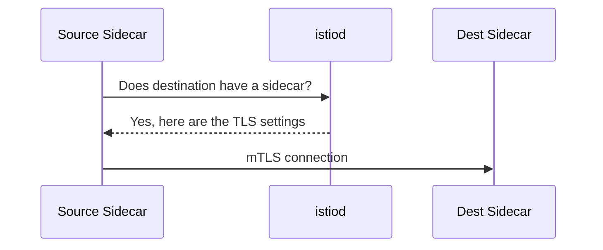

# How to Set Up Auto mTLS in Istio

Author: [nawazdhandala](https://github.com/nawazdhandala)

Tags: Istio, MTLS, Auto mTLS, Service Mesh, Security

Description: Understanding and configuring Istio auto mTLS which automatically uses mutual TLS when both sides have sidecars without manual configuration.

---

Auto mTLS is one of Istio's best features and also one of its least understood. When enabled (which it is by default), Istio sidecars automatically detect whether the destination service has a sidecar and use mTLS accordingly. If the destination has a sidecar, the connection uses mTLS. If it does not, the connection uses plain text. No DestinationRules needed, no manual TLS configuration per service.

This makes it possible to gradually add services to the mesh without breaking anything. But there are nuances to how auto mTLS works, when it does not, and how to configure it.

## How Auto mTLS Works Under the Hood

When a source sidecar needs to connect to a destination service, it checks with istiod to determine if the destination has an Envoy sidecar. Istiod knows this because it tracks all pod configurations in the cluster.



If the destination has a sidecar:
- The source sidecar uses mTLS with Istio-managed certificates
- The TLS mode is effectively `ISTIO_MUTUAL`

If the destination does not have a sidecar:
- The source sidecar sends plain text
- The TLS mode is effectively `DISABLE`

This detection happens at the proxy configuration level, not per-request. When istiod pushes configuration updates to sidecars, it includes the TLS settings for each destination based on current sidecar presence.

## Verifying Auto mTLS is Enabled

Auto mTLS is enabled by default in Istio 1.5+. To verify:

```bash
kubectl get configmap istio -n istio-system -o jsonpath='{.data.mesh}' | grep enableAutoMtls
```

If the output is empty or shows `true`, auto mTLS is enabled. If it shows `false`, it has been explicitly disabled.

You can also check it through the IstioOperator:

```bash
kubectl get istiooperator -n istio-system -o jsonpath='{.items[0].spec.meshConfig.enableAutoMtls}'
```

## Enabling Auto mTLS (If Disabled)

If auto mTLS was disabled, enable it:

```yaml
apiVersion: install.istio.io/v1alpha1
kind: IstioOperator
spec:
  meshConfig:
    enableAutoMtls: true
```

Apply the change:

```bash
istioctl install -f enable-auto-mtls.yaml
```

Or update the mesh config directly:

```bash
kubectl edit configmap istio -n istio-system
```

Find the `mesh` key and add or update:

```yaml
enableAutoMtls: true
```

Then restart istiod to pick up the change:

```bash
kubectl rollout restart deployment istiod -n istio-system
```

## Auto mTLS vs Explicit DestinationRules

Before auto mTLS, you had to create DestinationRules for every service to enable mTLS:

```yaml
# The old way - not needed with auto mTLS
apiVersion: networking.istio.io/v1
kind: DestinationRule
metadata:
  name: enable-mtls
  namespace: default
spec:
  host: "*.default.svc.cluster.local"
  trafficPolicy:
    tls:
      mode: ISTIO_MUTUAL
```

With auto mTLS, this is unnecessary. The sidecar figures out the right TLS mode automatically.

However, explicit DestinationRules still take precedence over auto mTLS. If you have a DestinationRule that sets `tls.mode: DISABLE` for a service, auto mTLS will not override it. The explicit configuration wins.

This can cause confusion. If you enabled auto mTLS but traffic to a specific service is not encrypted, check for DestinationRules:

```bash
kubectl get destinationrule --all-namespaces -o yaml | grep -B 10 "mode: DISABLE"
```

Remove or update any DestinationRules that explicitly disable TLS for mesh-internal services.

## Auto mTLS and PeerAuthentication Interaction

Auto mTLS controls the client side (how outbound connections are made). PeerAuthentication controls the server side (how incoming connections are accepted). These are independent but work together.

The combination matrix:

| PeerAuth Mode | Auto mTLS Source | Auto mTLS Dest has Sidecar | Result |
|---|---|---|---|
| PERMISSIVE | Enabled | Yes | mTLS |
| PERMISSIVE | Enabled | No | Plain text |
| STRICT | Enabled | Yes | mTLS |
| STRICT | Enabled | No | Connection fails |
| PERMISSIVE | Disabled | Yes | Plain text (no auto detection) |
| STRICT | Disabled | Yes | Connection fails (unless explicit DR) |

The safest combination is: Auto mTLS enabled + PERMISSIVE PeerAuthentication during migration, then switch to STRICT once all services have sidecars.

## Testing Auto mTLS Behavior

### Test 1: Both Pods Have Sidecars

```bash
# Both services have sidecars - traffic should use mTLS
kubectl exec deploy/service-a -c service-a -- curl -s http://service-b:8080/health
```

Check if mTLS was used:

```bash
kubectl exec deploy/service-a -c istio-proxy -- pilot-agent request GET /stats | \
  grep "cluster.outbound|8080||service-b" | grep ssl
```

If `ssl.handshake` is incrementing, mTLS is working.

### Test 2: Destination Has No Sidecar

```bash
# Deploy a service without sidecar
kubectl create deployment no-sidecar --image=nginx -n default
kubectl label deployment no-sidecar sidecar.istio.io/inject=false
kubectl expose deployment no-sidecar --port=80

# Call it from a sidecar-injected pod
kubectl exec deploy/service-a -c service-a -- curl -s http://no-sidecar:80
```

This should succeed with plain text. Check the proxy stats:

```bash
kubectl exec deploy/service-a -c istio-proxy -- pilot-agent request GET /stats | \
  grep "cluster.outbound|80||no-sidecar" | grep ssl
```

No `ssl.handshake` counter means plain text was used, which is the expected auto mTLS behavior.

### Test 3: Adding a Sidecar to a Previously Non-Mesh Service

```bash
# Add sidecar to the no-sidecar service
kubectl label deployment no-sidecar sidecar.istio.io/inject=true --overwrite
kubectl rollout restart deployment no-sidecar
```

Wait for the pod to restart with the sidecar, then test again:

```bash
kubectl exec deploy/service-a -c service-a -- curl -s http://no-sidecar:80
```

Now check the stats. Auto mTLS should have detected the new sidecar and switched to mTLS automatically.

## When Auto mTLS Does Not Work

There are edge cases where auto mTLS does not behave as expected:

**Headless services**: For headless services (ClusterIP: None), auto mTLS might not detect the sidecar correctly because the traffic goes directly to pod IPs. Explicit DestinationRules might be needed.

**External services**: Auto mTLS only applies to services within the mesh. For ServiceEntry resources pointing to external services, you need explicit DestinationRules to set the TLS mode.

**Stale configuration**: When a pod's sidecar status changes (injected or removed), there is a brief window where the source sidecar might have stale configuration. This resolves itself within a few seconds as istiod pushes updates.

**Custom listeners**: If you have custom Envoy filters or listeners that modify the connection handling, they might interfere with auto mTLS.

## Monitoring Auto mTLS

Track the effectiveness of auto mTLS with Prometheus:

```text
# Percentage of traffic using mTLS
sum(rate(istio_requests_total{connection_security_policy="mutual_tls"}[5m]))
/
sum(rate(istio_requests_total[5m]))
```

```text
# Traffic NOT using mTLS (should decrease over time)
sum(rate(istio_requests_total{connection_security_policy="none"}[5m])) by (source_workload, destination_service)
```

Auto mTLS is the feature that makes Istio's mTLS practical at scale. Without it, you would need to maintain DestinationRules for every service pair in the mesh. With it, mTLS just works as you add sidecars to services. Keep it enabled, monitor its effectiveness, and only fall back to explicit DestinationRules when the automatic detection does not cover your edge case.
