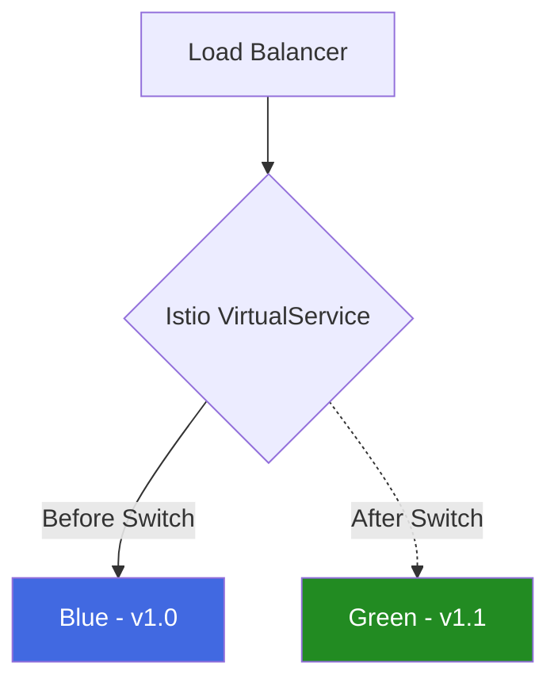

# How to Set Up Blue-Green Deployments with Istio VirtualService

Author: [nawazdhandala](https://github.com/nawazdhandala)

Tags: Istio, Blue-Green Deployment, VirtualService, Traffic Management, Kubernetes

Description: A step-by-step guide to implementing blue-green deployments using Istio VirtualService for instant traffic switching between versions.

---

Blue-green deployments give you the ability to switch all traffic from one version to another instantly. Unlike canary deployments where you gradually shift traffic, blue-green is all-or-nothing. You run two identical environments (blue and green), route all traffic to one of them, and switch to the other when you are ready. Istio makes the switch instantaneous and reversible.

## Blue-Green vs Canary

The difference is straightforward:

- **Canary**: Gradually shift traffic (5% -> 25% -> 50% -> 100%)
- **Blue-Green**: Instantly switch all traffic from blue to green (100% blue -> 100% green)

Blue-green is simpler to reason about. There is no ambiguity about which version is serving traffic. Either everyone gets blue or everyone gets green.



## Setting Up the Two Environments

Create two complete deployments, one for blue and one for green:

```yaml
apiVersion: apps/v1
kind: Deployment
metadata:
  name: my-app-blue
  namespace: default
  labels:
    app: my-app
    version: blue
spec:
  replicas: 3
  selector:
    matchLabels:
      app: my-app
      version: blue
  template:
    metadata:
      labels:
        app: my-app
        version: blue
    spec:
      containers:
        - name: my-app
          image: my-registry/my-app:1.0.0
          ports:
            - containerPort: 8080
---
apiVersion: apps/v1
kind: Deployment
metadata:
  name: my-app-green
  namespace: default
  labels:
    app: my-app
    version: green
spec:
  replicas: 3
  selector:
    matchLabels:
      app: my-app
      version: green
  template:
    metadata:
      labels:
        app: my-app
        version: green
    spec:
      containers:
        - name: my-app
          image: my-registry/my-app:1.1.0
          ports:
            - containerPort: 8080
```

Both deployments have the same `app: my-app` label (so they share a Service) but different `version` labels.

The Service:

```yaml
apiVersion: v1
kind: Service
metadata:
  name: my-app
  namespace: default
spec:
  selector:
    app: my-app
  ports:
    - port: 80
      targetPort: 8080
```

## The DestinationRule

Define subsets for blue and green:

```yaml
apiVersion: networking.istio.io/v1beta1
kind: DestinationRule
metadata:
  name: my-app
  namespace: default
spec:
  host: my-app
  subsets:
    - name: blue
      labels:
        version: blue
    - name: green
      labels:
        version: green
```

## Phase 1: All Traffic to Blue

Initially, all traffic goes to the blue deployment:

```yaml
apiVersion: networking.istio.io/v1beta1
kind: VirtualService
metadata:
  name: my-app
  namespace: default
spec:
  hosts:
    - my-app
  http:
    - route:
        - destination:
            host: my-app
            subset: blue
          weight: 100
```

At this point, green is deployed and running but receiving zero traffic. You can test it directly by sending requests with pod-level port forwarding.

## Phase 2: Validate Green

Before switching traffic, verify that the green deployment is healthy:

```bash
# Check green pods are ready
kubectl get pods -l app=my-app,version=green

# Port-forward to test green directly
kubectl port-forward deploy/my-app-green 8081:8080

# Run smoke tests against green
curl http://localhost:8081/health
curl http://localhost:8081/api/test
```

You can also use Istio's header-based routing to test green without affecting production traffic:

```yaml
apiVersion: networking.istio.io/v1beta1
kind: VirtualService
metadata:
  name: my-app
  namespace: default
spec:
  hosts:
    - my-app
  http:
    - match:
        - headers:
            x-test-green:
              exact: "true"
      route:
        - destination:
            host: my-app
            subset: green
    - route:
        - destination:
            host: my-app
            subset: blue
          weight: 100
```

Internal testers can add the `x-test-green: true` header to hit the green deployment while everyone else stays on blue.

## Phase 3: Switch to Green

When you are confident green is working, flip the traffic:

```yaml
apiVersion: networking.istio.io/v1beta1
kind: VirtualService
metadata:
  name: my-app
  namespace: default
spec:
  hosts:
    - my-app
  http:
    - route:
        - destination:
            host: my-app
            subset: green
          weight: 100
```

```bash
kubectl apply -f virtualservice-green.yaml
```

The switch is instant. Envoy proxies receive the new configuration within seconds and all new requests go to green. Existing connections to blue finish normally.

## Phase 4: Rollback if Needed

If something goes wrong with green, roll back to blue:

```yaml
apiVersion: networking.istio.io/v1beta1
kind: VirtualService
metadata:
  name: my-app
  namespace: default
spec:
  hosts:
    - my-app
  http:
    - route:
        - destination:
            host: my-app
            subset: blue
          weight: 100
```

```bash
kubectl apply -f virtualservice-blue.yaml
```

This is the main advantage of blue-green. The old version is still running and ready to receive traffic immediately. No need to rebuild or redeploy anything.

## Phase 5: Clean Up

Once you are satisfied with green, you have two options:

**Option A: Keep the blue/green naming.** Update the blue deployment with the next version for the next deployment cycle. The green becomes the new "blue" (active), and blue becomes the staging area for the next release.

**Option B: Update and reset.** Update the blue deployment to match green, then route back to blue. This keeps blue as the primary deployment and green as the staging area.

Either way, you always have two running environments.

## Blue-Green with External Gateway

For external traffic through an ingress gateway:

```yaml
apiVersion: networking.istio.io/v1beta1
kind: Gateway
metadata:
  name: app-gateway
  namespace: default
spec:
  selector:
    istio: ingressgateway
  servers:
    - port:
        number: 443
        name: https
        protocol: HTTPS
      hosts:
        - "app.example.com"
      tls:
        mode: SIMPLE
        credentialName: app-tls-cert
---
apiVersion: networking.istio.io/v1beta1
kind: VirtualService
metadata:
  name: my-app
  namespace: default
spec:
  hosts:
    - "app.example.com"
  gateways:
    - app-gateway
  http:
    - route:
        - destination:
            host: my-app
            subset: green
          weight: 100
```

## Automating the Switch

You can script the switch for use in CI/CD pipelines:

```bash
#!/bin/bash
ACTIVE_COLOR=$1  # "blue" or "green"

cat <<EOF | kubectl apply -f -
apiVersion: networking.istio.io/v1beta1
kind: VirtualService
metadata:
  name: my-app
  namespace: default
spec:
  hosts:
    - my-app
  http:
    - route:
        - destination:
            host: my-app
            subset: ${ACTIVE_COLOR}
          weight: 100
EOF

echo "Traffic switched to ${ACTIVE_COLOR}"
```

Usage:

```bash
./switch-traffic.sh green   # Switch to green
./switch-traffic.sh blue    # Roll back to blue
```

## Monitoring the Switch

Watch the traffic during and after the switch:

```bash
# Check which version is getting traffic
kubectl exec deploy/my-app-blue -c istio-proxy -- curl -s localhost:15090/stats/prometheus | grep downstream_rq_active

kubectl exec deploy/my-app-green -c istio-proxy -- curl -s localhost:15090/stats/prometheus | grep downstream_rq_active
```

## Blue-Green vs Canary: When to Use Which

Use blue-green when:
- You want a clean, instant switch
- The change is significant and does not lend itself to gradual rollout
- You need an easy rollback path
- Database schema changes require all instances to be on the same version

Use canary when:
- You want to reduce risk by gradually increasing traffic
- You need to collect metrics on the new version with real traffic
- The new version might have subtle issues that only show up at scale

## Things to Keep in Mind

1. **Resource cost** - You need double the resources since both versions run simultaneously. This is the main downside of blue-green.
2. **Database compatibility** - Both versions must be compatible with the current database schema. Schema changes need careful planning.
3. **In-flight requests** - When you switch, in-flight requests to the old version complete normally. No requests are dropped.
4. **DNS considerations** - If you use DNS-based routing outside of Istio, the switch is not instant because of DNS caching. With Istio, the switch is truly instant.

Blue-green deployments with Istio are straightforward and give you the simplest possible rollback story. One `kubectl apply` and all traffic switches. Another `kubectl apply` and it switches back. No complexity, no partial states.
