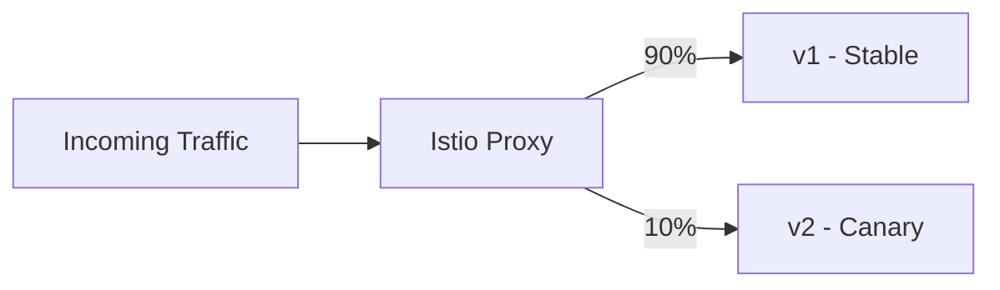

# How to Set Up Canary Deployments with Istio Traffic Splitting

Author: [nawazdhandala](https://github.com/nawazdhandala)

Tags: Istio, Canary Deployments, Traffic Splitting, VirtualService, Kubernetes

Description: A practical guide to setting up canary deployments using Istio traffic splitting to gradually roll out new versions with minimal risk.

---

Canary deployments are probably the safest way to roll out new code. Instead of sending all traffic to a new version at once, you start with a small percentage and gradually increase it. If something breaks, only a fraction of your users are affected. Istio makes this workflow trivial with weighted routing in VirtualService.

## How Canary Deployments Work in Istio

The idea is simple. You have your stable version running and receiving 100% of traffic. You deploy a new version alongside it, then slowly shift traffic from the old version to the new one. With Istio, you control this split at the proxy layer, so the application itself does not need to know anything about the deployment strategy.



## Setting Up the Deployments

First, you need two Kubernetes Deployments. The key is using a common `app` label for the Service selector, plus a `version` label to distinguish them.

```yaml
apiVersion: apps/v1
kind: Deployment
metadata:
  name: my-app-v1
  namespace: default
spec:
  replicas: 3
  selector:
    matchLabels:
      app: my-app
      version: v1
  template:
    metadata:
      labels:
        app: my-app
        version: v1
    spec:
      containers:
        - name: my-app
          image: my-registry/my-app:1.0.0
          ports:
            - containerPort: 8080
---
apiVersion: apps/v1
kind: Deployment
metadata:
  name: my-app-v2
  namespace: default
spec:
  replicas: 1
  selector:
    matchLabels:
      app: my-app
      version: v2
  template:
    metadata:
      labels:
        app: my-app
        version: v2
    spec:
      containers:
        - name: my-app
          image: my-registry/my-app:2.0.0
          ports:
            - containerPort: 8080
```

The Service selects on `app: my-app`, which matches both deployments:

```yaml
apiVersion: v1
kind: Service
metadata:
  name: my-app
  namespace: default
spec:
  selector:
    app: my-app
  ports:
    - port: 80
      targetPort: 8080
```

## Creating the DestinationRule

The DestinationRule defines subsets that the VirtualService can reference:

```yaml
apiVersion: networking.istio.io/v1beta1
kind: DestinationRule
metadata:
  name: my-app
  namespace: default
spec:
  host: my-app
  subsets:
    - name: v1
      labels:
        version: v1
    - name: v2
      labels:
        version: v2
```

## Starting the Canary - 5% Traffic

Start small. Send just 5% of traffic to the canary:

```yaml
apiVersion: networking.istio.io/v1beta1
kind: VirtualService
metadata:
  name: my-app
  namespace: default
spec:
  hosts:
    - my-app
  http:
    - route:
        - destination:
            host: my-app
            subset: v1
          weight: 95
        - destination:
            host: my-app
            subset: v2
          weight: 5
```

Apply it and watch the metrics:

```bash
kubectl apply -f virtualservice-canary.yaml

# Verify the config
istioctl proxy-config routes deploy/my-app-v1 --name "80" -o json
```

## Monitoring the Canary

Before you increase the traffic percentage, make sure the canary is healthy. Check error rates and latency for both versions:

```bash
# Check error rates using istioctl
istioctl experimental dashboard prometheus

# Or query Prometheus directly
# Error rate for canary
rate(istio_requests_total{destination_version="v2", response_code=~"5.*"}[5m])
/
rate(istio_requests_total{destination_version="v2"}[5m])
```

You can also use Kiali to visualize the traffic flow:

```bash
istioctl dashboard kiali
```

## Progressive Traffic Increase

If the canary looks good, increase the percentage step by step. Here is a typical progression:

**Phase 2 - 25% to canary:**

```yaml
apiVersion: networking.istio.io/v1beta1
kind: VirtualService
metadata:
  name: my-app
  namespace: default
spec:
  hosts:
    - my-app
  http:
    - route:
        - destination:
            host: my-app
            subset: v1
          weight: 75
        - destination:
            host: my-app
            subset: v2
          weight: 25
```

**Phase 3 - 50/50 split:**

```yaml
apiVersion: networking.istio.io/v1beta1
kind: VirtualService
metadata:
  name: my-app
  namespace: default
spec:
  hosts:
    - my-app
  http:
    - route:
        - destination:
            host: my-app
            subset: v1
          weight: 50
        - destination:
            host: my-app
            subset: v2
          weight: 50
```

**Phase 4 - Full rollout (100% to v2):**

```yaml
apiVersion: networking.istio.io/v1beta1
kind: VirtualService
metadata:
  name: my-app
  namespace: default
spec:
  hosts:
    - my-app
  http:
    - route:
        - destination:
            host: my-app
            subset: v2
          weight: 100
```

## Rolling Back

If the canary shows problems at any phase, roll back immediately by sending 100% to v1:

```yaml
apiVersion: networking.istio.io/v1beta1
kind: VirtualService
metadata:
  name: my-app
  namespace: default
spec:
  hosts:
    - my-app
  http:
    - route:
        - destination:
            host: my-app
            subset: v1
          weight: 100
```

The rollback is instant because you are just changing routing rules. No pods need to restart, no images need to be pulled. Traffic shifts immediately.

## Automating with Flagger

If you want to automate the progressive rollout, Flagger works well with Istio. It monitors metrics and automatically adjusts the traffic split:

```yaml
apiVersion: flagger.app/v1beta1
kind: Canary
metadata:
  name: my-app
  namespace: default
spec:
  targetRef:
    apiVersion: apps/v1
    kind: Deployment
    name: my-app
  service:
    port: 80
    targetPort: 8080
  analysis:
    interval: 1m
    threshold: 5
    maxWeight: 50
    stepWeight: 10
    metrics:
      - name: request-success-rate
        thresholdRange:
          min: 99
        interval: 1m
      - name: request-duration
        thresholdRange:
          max: 500
        interval: 1m
```

Flagger will automatically increase the canary weight by 10% every minute, as long as the success rate stays above 99% and latency stays under 500ms.

## Canary with Internal Traffic Only

Sometimes you want to test the canary with internal traffic first before exposing it to external users. You can do this by combining header-based routing with weight-based routing:

```yaml
apiVersion: networking.istio.io/v1beta1
kind: VirtualService
metadata:
  name: my-app
  namespace: default
spec:
  hosts:
    - my-app
  http:
    - match:
        - headers:
            x-canary:
              exact: "true"
      route:
        - destination:
            host: my-app
            subset: v2
    - route:
        - destination:
            host: my-app
            subset: v1
          weight: 95
        - destination:
            host: my-app
            subset: v2
          weight: 5
```

Internal testers add the `x-canary: true` header and always hit v2. Everyone else gets the weighted split.

## Tips for Successful Canary Deployments

A few things that make canary deployments smoother:

- **Start with 1-5% traffic.** This gives you enough data to detect problems without impacting many users.
- **Watch error rates, not just latency.** A new version might be fast but returning wrong results.
- **Keep the old version running** until you are fully confident in the new one. Do not scale down v1 too early.
- **Use the same number of replicas** or at least similar capacity. If your canary has 1 replica and gets 50% traffic, it will be overwhelmed.
- **Set up alerts** on error rate spikes so you can react quickly if something goes wrong.

Canary deployments with Istio are one of the best risk-reduction strategies you can use. The traffic split happens at the proxy layer, so it is fast, reliable, and does not require any changes to your application code.
