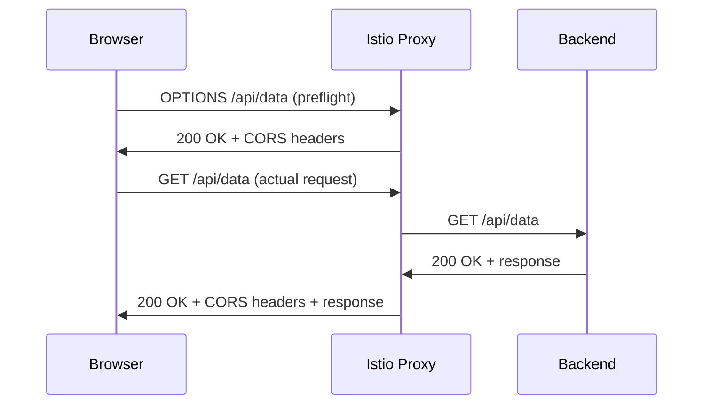

# How to Set Up Cross-Origin Resource Sharing (CORS) in Istio

Author: [nawazdhandala](https://github.com/nawazdhandala)

Tags: Istio, CORS, VirtualService, Security, Web Development

Description: A complete guide to configuring CORS policies in Istio VirtualService to control cross-origin requests for web applications.

---

If you have ever seen the error "Access to XMLHttpRequest has been blocked by CORS policy" in your browser console, you know how frustrating CORS issues can be. Instead of configuring CORS in every backend service, you can handle it once at the Istio proxy layer. This keeps the policy consistent and your services simpler.

## What CORS Does

Cross-Origin Resource Sharing controls which websites can make requests to your API from a browser. When your frontend at `https://app.example.com` makes an API call to `https://api.example.com`, the browser sends a preflight OPTIONS request to check if this cross-origin request is allowed. The server responds with CORS headers that tell the browser what is permitted.



## Basic CORS Configuration

Here is a straightforward CORS setup that allows requests from a specific origin:

```yaml
apiVersion: networking.istio.io/v1beta1
kind: VirtualService
metadata:
  name: api-service
  namespace: default
spec:
  hosts:
    - "api.example.com"
  gateways:
    - my-gateway
  http:
    - corsPolicy:
        allowOrigins:
          - exact: "https://app.example.com"
        allowMethods:
          - GET
          - POST
          - PUT
          - DELETE
        allowHeaders:
          - content-type
          - authorization
        maxAge: "24h"
      route:
        - destination:
            host: api-service
            port:
              number: 80
```

This configuration tells the browser:
- Requests from `https://app.example.com` are allowed
- GET, POST, PUT, and DELETE methods are permitted
- The `content-type` and `authorization` headers can be sent
- The preflight response can be cached for 24 hours

## Multiple Allowed Origins

For multiple origins, list each one:

```yaml
apiVersion: networking.istio.io/v1beta1
kind: VirtualService
metadata:
  name: api-service
  namespace: default
spec:
  hosts:
    - "api.example.com"
  gateways:
    - my-gateway
  http:
    - corsPolicy:
        allowOrigins:
          - exact: "https://app.example.com"
          - exact: "https://staging.example.com"
          - exact: "http://localhost:3000"
        allowMethods:
          - GET
          - POST
          - PUT
          - DELETE
          - OPTIONS
        allowHeaders:
          - content-type
          - authorization
          - x-request-id
        maxAge: "24h"
      route:
        - destination:
            host: api-service
            port:
              number: 80
```

Including `http://localhost:3000` is common for development environments where your frontend runs locally.

## Regex-Based Origin Matching

If you have many subdomains, use regex matching:

```yaml
apiVersion: networking.istio.io/v1beta1
kind: VirtualService
metadata:
  name: api-service
  namespace: default
spec:
  hosts:
    - "api.example.com"
  gateways:
    - my-gateway
  http:
    - corsPolicy:
        allowOrigins:
          - regex: "https://.*[.]example[.]com"
        allowMethods:
          - GET
          - POST
          - PUT
          - DELETE
        allowHeaders:
          - content-type
          - authorization
        maxAge: "12h"
      route:
        - destination:
            host: api-service
            port:
              number: 80
```

This allows requests from any subdomain of `example.com` over HTTPS.

## Allowing Credentials

If your API uses cookies or HTTP authentication, you need to allow credentials:

```yaml
apiVersion: networking.istio.io/v1beta1
kind: VirtualService
metadata:
  name: api-service
  namespace: default
spec:
  hosts:
    - "api.example.com"
  gateways:
    - my-gateway
  http:
    - corsPolicy:
        allowOrigins:
          - exact: "https://app.example.com"
        allowMethods:
          - GET
          - POST
        allowHeaders:
          - content-type
          - authorization
          - cookie
        allowCredentials: true
        maxAge: "24h"
      route:
        - destination:
            host: api-service
            port:
              number: 80
```

When `allowCredentials` is true, you cannot use a wildcard `*` for `allowOrigins`. You must specify exact origins. This is a browser security requirement, not an Istio limitation.

## Exposing Response Headers

By default, browsers only expose a small set of response headers to JavaScript. To let your frontend read custom response headers, use `exposeHeaders`:

```yaml
apiVersion: networking.istio.io/v1beta1
kind: VirtualService
metadata:
  name: api-service
  namespace: default
spec:
  hosts:
    - "api.example.com"
  gateways:
    - my-gateway
  http:
    - corsPolicy:
        allowOrigins:
          - exact: "https://app.example.com"
        allowMethods:
          - GET
          - POST
        allowHeaders:
          - content-type
        exposeHeaders:
          - x-total-count
          - x-request-id
          - x-rate-limit-remaining
        maxAge: "24h"
      route:
        - destination:
            host: api-service
            port:
              number: 80
```

Now your frontend JavaScript can access `x-total-count`, `x-request-id`, and `x-rate-limit-remaining` from the response.

## Different CORS Policies per Route

You can apply different CORS policies to different paths:

```yaml
apiVersion: networking.istio.io/v1beta1
kind: VirtualService
metadata:
  name: api-service
  namespace: default
spec:
  hosts:
    - "api.example.com"
  gateways:
    - my-gateway
  http:
    - match:
        - uri:
            prefix: "/public"
      corsPolicy:
        allowOrigins:
          - regex: ".*"
        allowMethods:
          - GET
        maxAge: "24h"
      route:
        - destination:
            host: public-api
            port:
              number: 80
    - match:
        - uri:
            prefix: "/private"
      corsPolicy:
        allowOrigins:
          - exact: "https://admin.example.com"
        allowMethods:
          - GET
          - POST
          - PUT
          - DELETE
        allowCredentials: true
        allowHeaders:
          - content-type
          - authorization
        maxAge: "1h"
      route:
        - destination:
            host: private-api
            port:
              number: 80
```

Public endpoints are open to any origin with GET-only access. Private endpoints are restricted to the admin app with full CRUD access and credentials.

## Complete Production Example

Here is a production-ready configuration:

```yaml
apiVersion: networking.istio.io/v1beta1
kind: Gateway
metadata:
  name: api-gateway
  namespace: default
spec:
  selector:
    istio: ingressgateway
  servers:
    - port:
        number: 443
        name: https
        protocol: HTTPS
      hosts:
        - "api.example.com"
      tls:
        mode: SIMPLE
        credentialName: api-tls-cert
---
apiVersion: networking.istio.io/v1beta1
kind: VirtualService
metadata:
  name: api-service
  namespace: default
spec:
  hosts:
    - "api.example.com"
  gateways:
    - api-gateway
  http:
    - corsPolicy:
        allowOrigins:
          - exact: "https://app.example.com"
          - exact: "https://admin.example.com"
        allowMethods:
          - GET
          - POST
          - PUT
          - DELETE
          - PATCH
          - OPTIONS
        allowHeaders:
          - content-type
          - authorization
          - x-request-id
          - accept
          - origin
        exposeHeaders:
          - x-total-count
          - x-rate-limit-remaining
          - x-request-id
        allowCredentials: true
        maxAge: "24h"
      route:
        - destination:
            host: api-service
            port:
              number: 80
```

## Debugging CORS Issues

When CORS is not working, here is how to troubleshoot:

```bash
# Send a preflight request manually
curl -X OPTIONS \
  -H "Origin: https://app.example.com" \
  -H "Access-Control-Request-Method: POST" \
  -H "Access-Control-Request-Headers: content-type,authorization" \
  -v https://api.example.com/api/data

# Check the response headers
# You should see:
# Access-Control-Allow-Origin: https://app.example.com
# Access-Control-Allow-Methods: GET,POST,PUT,DELETE
# Access-Control-Allow-Headers: content-type,authorization
# Access-Control-Max-Age: 86400

# Check the proxy config
istioctl proxy-config routes deploy/istio-ingressgateway -n istio-system -o json
```

Common problems:
- **Origin mismatch** - The origin must match exactly, including protocol and port
- **Missing OPTIONS in allowMethods** - Some browsers require OPTIONS to be explicitly listed
- **Backend also setting CORS headers** - Double CORS headers can confuse browsers. Remove CORS handling from the backend if Istio handles it
- **Credentials with wildcard origin** - This combination is not allowed by the CORS spec

## Max Age Tuning

The `maxAge` field controls how long browsers cache the preflight response. A longer maxAge reduces the number of OPTIONS requests:

- Development: `"1h"` or shorter (you want changes to take effect quickly)
- Production: `"24h"` or `"86400s"` (reduce preflight requests for better performance)

Setting CORS at the Istio layer is cleaner than configuring it in every service. You get a single place to manage the policy, consistent behavior across all services, and the ability to change it without redeploying your applications.
