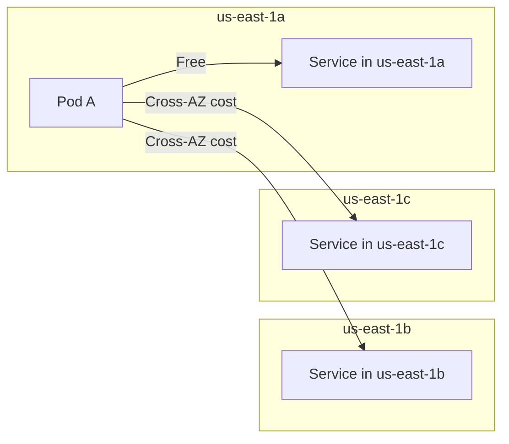

# How to Set Up Cross-Zone Traffic Distribution in Istio

Author: [nawazdhandala](https://github.com/nawazdhandala)

Tags: Istio, Cross-Zone Traffic, Load Balancing, Kubernetes, Service Mesh

Description: Configure cross-zone traffic distribution in Istio to balance load evenly across availability zones within a region for better reliability.

---

Most Kubernetes clusters run across multiple availability zones within a single region. This is standard practice for high availability, and cloud providers make it easy. But the tricky part is making sure traffic is distributed sensibly across those zones. You do not want all traffic pinned to one zone while the others sit idle, and you also do not want unnecessary cross-zone network hops eating into your latency budget and cloud bill.

Istio gives you the tools to control exactly how traffic flows between zones. You can keep it local, spread it evenly, or set custom percentages based on your capacity in each zone.

## Understanding Zone Topology in Kubernetes

Kubernetes nodes get zone labels automatically on major cloud providers:

```bash
kubectl get nodes -L topology.kubernetes.io/zone
```

Output looks something like:

```
NAME           STATUS   ROLES    AGE   VERSION   ZONE
node-1         Ready    <none>   30d   v1.28.3   us-east-1a
node-2         Ready    <none>   30d   v1.28.3   us-east-1a
node-3         Ready    <none>   30d   v1.28.3   us-east-1b
node-4         Ready    <none>   30d   v1.28.3   us-east-1b
node-5         Ready    <none>   30d   v1.28.3   us-east-1c
```

Istio uses these labels to determine which zone each pod belongs to. The Envoy sidecars then use this information to make smart routing decisions.

## The Default Behavior

Without any locality configuration, Istio distributes traffic round-robin across all healthy endpoints regardless of zone. A request from a pod in us-east-1a might go to us-east-1c, adding 1-2ms of cross-zone latency. For most services, this is fine. But for latency-sensitive services or high-traffic paths, those extra milliseconds and the cross-zone data transfer costs add up.

## Keeping Traffic Zone-Local with Failover

The simplest cross-zone setup uses failover mode. Traffic stays in the local zone and only crosses zone boundaries when local endpoints are unhealthy.

```yaml
apiVersion: networking.istio.io/v1
kind: DestinationRule
metadata:
  name: cache-service
spec:
  host: cache-service
  trafficPolicy:
    outlierDetection:
      consecutive5xxErrors: 3
      interval: 10s
      baseEjectionTime: 30s
    loadBalancer:
      localityLbSetting:
        enabled: true
      simple: ROUND_ROBIN
```

With just `enabled: true` and no explicit failover or distribute config, Istio defaults to preferring same-zone endpoints. If all endpoints in the local zone fail outlier detection, traffic goes to other zones in the same region.

This works well for services where latency matters and each zone has enough capacity to serve its own traffic.

## Even Distribution Across All Zones

Sometimes you want an even split across zones. Maybe your service is stateless and you want maximum redundancy. Or maybe you are running a service that benefits from spreading load as widely as possible.

```yaml
apiVersion: networking.istio.io/v1
kind: DestinationRule
metadata:
  name: analytics-collector
spec:
  host: analytics-collector
  trafficPolicy:
    outlierDetection:
      consecutive5xxErrors: 5
      interval: 30s
      baseEjectionTime: 30s
    loadBalancer:
      localityLbSetting:
        enabled: true
        distribute:
          - from: "us-east-1/us-east-1a/*"
            to:
              "us-east-1/us-east-1a/*": 34
              "us-east-1/us-east-1b/*": 33
              "us-east-1/us-east-1c/*": 33
          - from: "us-east-1/us-east-1b/*"
            to:
              "us-east-1/us-east-1a/*": 33
              "us-east-1/us-east-1b/*": 34
              "us-east-1/us-east-1c/*": 33
          - from: "us-east-1/us-east-1c/*"
            to:
              "us-east-1/us-east-1a/*": 33
              "us-east-1/us-east-1b/*": 33
              "us-east-1/us-east-1c/*": 34
      simple: ROUND_ROBIN
```

This gives roughly equal traffic to each zone regardless of where the request originates. The percentages are close to 33/33/34 because they need to add up to 100.

## Weighted Distribution Based on Zone Capacity

In practice, zones rarely have identical capacity. Maybe you have more nodes in zone A because it was your first zone, or zone C is newer and still being built out.

Check your pod distribution:

```bash
kubectl get pods -l app=my-service -o wide --no-headers \
  | awk '{print $7}' | sort | uniq -c | sort -rn
```

Output:

```
     15 node-1    (us-east-1a)
     12 node-3    (us-east-1b)
      5 node-5    (us-east-1c)
```

So you have roughly 47% in zone a, 37% in zone b, and 16% in zone c. Configure distribution to match:

```yaml
apiVersion: networking.istio.io/v1
kind: DestinationRule
metadata:
  name: my-service
spec:
  host: my-service
  trafficPolicy:
    outlierDetection:
      consecutive5xxErrors: 3
      interval: 10s
      baseEjectionTime: 30s
    loadBalancer:
      localityLbSetting:
        enabled: true
        distribute:
          - from: "us-east-1/*"
            to:
              "us-east-1/us-east-1a/*": 47
              "us-east-1/us-east-1b/*": 37
              "us-east-1/us-east-1c/*": 16
      simple: ROUND_ROBIN
```

Note the `from` uses `"us-east-1/*"` which matches all zones in the region. This means regardless of which zone the request comes from, it gets the same distribution weights. This is a simpler config when you want the same behavior from every zone.

## Verifying Cross-Zone Distribution

Check Envoy's endpoint configuration:

```bash
istioctl proxy-config endpoint <pod-name> \
  --cluster "outbound|80||my-service.default.svc.cluster.local"
```

For a more detailed view:

```bash
istioctl proxy-config endpoint <pod-name> \
  --cluster "outbound|80||my-service.default.svc.cluster.local" -o json \
  | jq '.[].hostStatuses[] | {address: .address.socketAddress.address, locality: .locality, priority: .priority}'
```

## Ensuring Pods Spread Across Zones

Your Istio distribution config only works if pods actually exist in each zone. Use topology spread constraints in your deployments:

```yaml
apiVersion: apps/v1
kind: Deployment
metadata:
  name: my-service
spec:
  replicas: 9
  selector:
    matchLabels:
      app: my-service
  template:
    metadata:
      labels:
        app: my-service
    spec:
      topologySpreadConstraints:
        - maxSkew: 1
          topologyKey: topology.kubernetes.io/zone
          whenUnsatisfiable: DoNotSchedule
          labelSelector:
            matchLabels:
              app: my-service
      containers:
        - name: my-service
          image: myregistry/my-service:1.0.0
          ports:
            - containerPort: 8080
```

The `maxSkew: 1` means the difference in pod count between any two zones is at most 1. With 9 replicas and 3 zones, you get 3 pods per zone.

## Cross-Zone Traffic Costs

Cross-zone data transfer is not free on most cloud providers. AWS charges for cross-AZ traffic, and it can add up quickly for high-throughput services.



If you are optimizing for cost, keep the local percentage high:

```yaml
distribute:
  - from: "us-east-1/us-east-1a/*"
    to:
      "us-east-1/us-east-1a/*": 90
      "us-east-1/us-east-1b/*": 5
      "us-east-1/us-east-1c/*": 5
```

The 5% to other zones keeps them warm without breaking the bank.

## Monitoring Zone Distribution

Use Prometheus to track actual traffic distribution:

```
sum(rate(istio_requests_total{
  destination_service="my-service.default.svc.cluster.local",
  reporter="source"
}[5m])) by (destination_workload, source_workload)
```

For zone-level visibility, you may need to use destination pod labels or configure Istio to include zone information in metrics by customizing the telemetry configuration.

## Troubleshooting

**Traffic not staying local:** Make sure outlier detection is configured. Without it, locality preferences are not applied.

**Uneven distribution despite correct config:** Check if some endpoints are being ejected by outlier detection. Ejected endpoints do not receive traffic, skewing the distribution.

**All traffic going to one zone:** Verify that pods in other zones are actually running and passing health checks.

```bash
kubectl get pods -l app=my-service -o wide
```

**Config not taking effect:** Check for VirtualService rules that might override the DestinationRule's load balancing settings. VirtualService routing happens first, and if it pins traffic to a specific subset, locality settings may not apply as expected.

Cross-zone traffic distribution is one of those configurations that seems minor but has a meaningful impact on latency, cost, and resilience in production. Take the time to configure it properly based on your zone capacities and service requirements.
