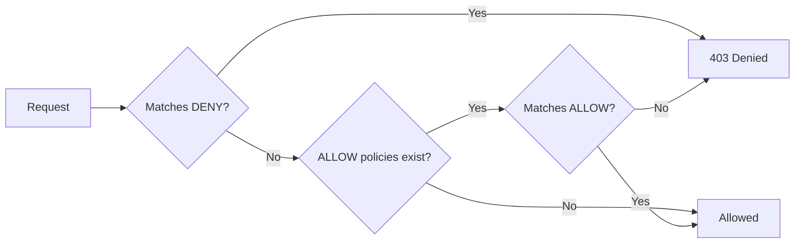

# How to Set Up DENY Authorization Policy in Istio

Author: [nawazdhandala](https://github.com/nawazdhandala)

Tags: Istio, Authorization, DENY Policy, Security, Kubernetes

Description: How to use DENY authorization policies in Istio to explicitly block specific traffic patterns while keeping the rest of your mesh open.

---

DENY policies in Istio work like a blocklist. Instead of specifying what's allowed (like ALLOW policies), you specify what should be blocked. Everything that doesn't match a DENY rule passes through. This makes DENY policies perfect for situations where you have mostly open traffic but need to block specific patterns - certain IP ranges, particular paths, or traffic from specific sources.

## How DENY Policies Fit in the Evaluation Order

Istio evaluates authorization policies in a strict order:

1. CUSTOM policies (external authorization) - evaluated first
2. DENY policies - evaluated second
3. ALLOW policies - evaluated last

This ordering is important. DENY policies always win over ALLOW policies. If a request matches both a DENY and an ALLOW policy, it's denied. There's no way to override a DENY with an ALLOW.



## Basic DENY Policy

Block all POST requests to a service:

```yaml
apiVersion: security.istio.io/v1
kind: AuthorizationPolicy
metadata:
  name: deny-posts
  namespace: my-app
spec:
  selector:
    matchLabels:
      app: read-only-service
  action: DENY
  rules:
    - to:
        - operation:
            methods: ["POST", "PUT", "PATCH", "DELETE"]
```

Any write operation gets a 403 response. GET and HEAD requests pass through unaffected.

## Blocking Specific Source Namespaces

If you want to prevent a specific namespace from reaching your services:

```yaml
apiVersion: security.istio.io/v1
kind: AuthorizationPolicy
metadata:
  name: deny-untrusted-ns
  namespace: production
spec:
  action: DENY
  rules:
    - from:
        - source:
            namespaces: ["sandbox", "testing"]
```

This blocks all traffic from the `sandbox` and `testing` namespaces to any service in the `production` namespace. Note that there's no selector, so it applies to every workload in the namespace.

## Blocking Specific IP Ranges

Block requests from known bad IP ranges:

```yaml
apiVersion: security.istio.io/v1
kind: AuthorizationPolicy
metadata:
  name: deny-bad-ips
  namespace: my-app
spec:
  selector:
    matchLabels:
      app: public-api
  action: DENY
  rules:
    - from:
        - source:
            ipBlocks:
              - "192.0.2.0/24"
              - "198.51.100.0/24"
```

This is useful at the ingress gateway level where you can see real client IPs.

## Protecting Sensitive Paths

Block access to admin or debug endpoints:

```yaml
apiVersion: security.istio.io/v1
kind: AuthorizationPolicy
metadata:
  name: deny-admin-paths
  namespace: my-app
spec:
  selector:
    matchLabels:
      app: web-app
  action: DENY
  rules:
    - to:
        - operation:
            paths:
              - "/admin*"
              - "/debug/*"
              - "/internal/*"
              - "/.env"
              - "/wp-admin*"
```

This blocks access to common sensitive paths. The wildcard `*` matches any suffix, so `/admin`, `/admin/users`, and `/admin/settings` are all blocked.

## Combining Source and Operation in DENY

Within a single rule, `from` and `to` are AND-ed. This means you can create targeted blocks:

```yaml
apiVersion: security.istio.io/v1
kind: AuthorizationPolicy
metadata:
  name: deny-external-write
  namespace: my-app
spec:
  selector:
    matchLabels:
      app: api-service
  action: DENY
  rules:
    - from:
        - source:
            notNamespaces: ["my-app"]
      to:
        - operation:
            methods: ["POST", "PUT", "PATCH", "DELETE"]
```

This blocks write operations from outside the `my-app` namespace. Services within the namespace can still do writes. Notice the use of `notNamespaces` - this matches traffic from any namespace except `my-app`.

## Using notValues in DENY Policies

The `not` variants of fields are powerful for creating exceptions:

```yaml
apiVersion: security.istio.io/v1
kind: AuthorizationPolicy
metadata:
  name: deny-non-admin-to-admin-paths
  namespace: my-app
spec:
  selector:
    matchLabels:
      app: api-service
  action: DENY
  rules:
    - from:
        - source:
            notPrincipals:
              - "cluster.local/ns/my-app/sa/admin-service"
      to:
        - operation:
            paths: ["/admin/*"]
```

This denies access to `/admin/*` for everyone except the admin-service. It's a clean way to protect sensitive endpoints.

## Multiple Rules in a DENY Policy

Multiple rules in a DENY policy are OR-ed. If a request matches any rule, it's denied:

```yaml
apiVersion: security.istio.io/v1
kind: AuthorizationPolicy
metadata:
  name: deny-multiple-patterns
  namespace: my-app
spec:
  selector:
    matchLabels:
      app: my-service
  action: DENY
  rules:
    # Block requests without proper host header
    - to:
        - operation:
            notHosts: ["api.example.com", "api.example.com:443"]
    # Block requests to debug endpoints
    - to:
        - operation:
            paths: ["/debug/*"]
    # Block traffic from sandbox
    - from:
        - source:
            namespaces: ["sandbox"]
```

A request is denied if it matches rule 1 OR rule 2 OR rule 3.

## DENY Policy with JWT Claims

You can deny access based on JWT token claims:

```yaml
apiVersion: security.istio.io/v1
kind: AuthorizationPolicy
metadata:
  name: deny-free-tier-premium
  namespace: my-app
spec:
  selector:
    matchLabels:
      app: premium-service
  action: DENY
  rules:
    - from:
        - source:
            requestPrincipals: ["*"]
      to:
        - operation:
            paths: ["/api/premium/*"]
      when:
        - key: request.auth.claims[plan]
          values: ["free"]
```

This specifically blocks users on the free plan from accessing premium API endpoints, even if they have a valid JWT.

## DENY as a Safety Net

One of the most practical uses of DENY policies is as a safety net on top of ALLOW policies. Even if someone misconfigures an ALLOW policy, the DENY policy prevents sensitive resources from being exposed:

```yaml
# Safety net - always block these paths regardless of ALLOW policies
apiVersion: security.istio.io/v1
kind: AuthorizationPolicy
metadata:
  name: safety-net-deny
  namespace: my-app
spec:
  action: DENY
  rules:
    - to:
        - operation:
            paths:
              - "/actuator/*"
              - "/env"
              - "/metrics"
              - "/.git/*"
              - "/swagger-ui/*"
---
# ALLOW policy for normal traffic
apiVersion: security.istio.io/v1
kind: AuthorizationPolicy
metadata:
  name: allow-normal-traffic
  namespace: my-app
spec:
  action: ALLOW
  rules:
    - from:
        - source:
            namespaces: ["my-app", "frontend"]
      to:
        - operation:
            paths: ["/api/*"]
```

Because DENY is evaluated before ALLOW, the safety net blocks those paths even though the ALLOW policy has a broad `/api/*` match.

## Testing DENY Policies

```bash
# Apply the deny policy
kubectl apply -f deny-policy.yaml

# Test a blocked request
kubectl exec -n my-app deploy/sleep -- curl -s -o /dev/null -w "%{http_code}" http://my-service:8080/admin/users
# Expected: 403

# Test an allowed request
kubectl exec -n my-app deploy/sleep -- curl -s -o /dev/null -w "%{http_code}" http://my-service:8080/api/users
# Expected: 200

# Check Envoy RBAC logs
kubectl logs -n my-app deploy/my-service -c istio-proxy | grep "rbac_access_denied"
```

## Debugging DENY Issues

When a DENY policy is blocking traffic you expected to be allowed:

```bash
# List all policies affecting the workload
kubectl get authorizationpolicies -n my-app

# Run Istio analysis
istioctl analyze -n my-app

# Enable RBAC debug logging
istioctl proxy-config log deploy/my-service -n my-app --level rbac:debug

# Check the access log for denied requests
kubectl logs -n my-app deploy/my-service -c istio-proxy | grep "403"
```

Common debugging steps:

1. Check if the DENY rule is too broad. A rule with just `from` and no `to` blocks ALL operations from that source.
2. Verify path matching. Remember that paths are case-sensitive and `/api` doesn't match `/api/` (trailing slash matters).
3. Check namespace spelling. A typo in the namespace name in `notNamespaces` could block everything.

## When to Choose DENY over ALLOW

Use DENY policies when:
- You want most traffic to flow freely but need to block specific patterns
- You need a safety net that can't be overridden by ALLOW policies
- You're blocking known-bad sources (IP ranges, namespaces)
- You're protecting specific sensitive paths across multiple services

Use ALLOW policies when:
- You want a default-deny posture where only explicitly permitted traffic flows
- You're building a zero-trust environment
- You know exactly which services should communicate

In many production setups, you'll use both. DENY policies set hard boundaries, and ALLOW policies control the normal flow of traffic within those boundaries.
