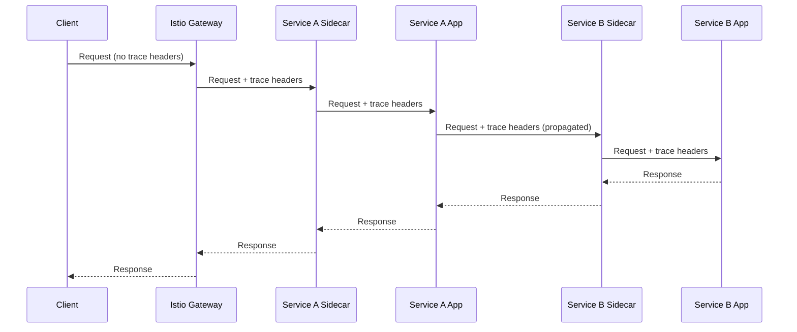

# How to Set Up Distributed Tracing in Istio

Author: [nawazdhandala](https://github.com/nawazdhandala)

Tags: Istio, Distributed Tracing, Observability, Envoy, Microservices

Description: A complete guide to setting up distributed tracing in Istio from scratch, covering configuration, backends, and header propagation.

---

Distributed tracing is one of the most powerful observability features you get with a service mesh. When a user request hits your API gateway and fans out across five or ten microservices, tracing shows you exactly where time is being spent, where errors occur, and how services depend on each other. Istio makes tracing easier to set up because the Envoy sidecars automatically generate trace spans for every request - but there are still a few things you need to configure correctly.

## How Tracing Works in Istio

Every Envoy sidecar in the mesh can generate trace spans. When a request arrives at a sidecar, it checks for incoming trace headers. If headers exist, the sidecar creates a child span under the existing trace. If no headers are present, it starts a new trace.

The general flow looks like this:



Each sidecar reports its span to a tracing backend. The backend assembles all spans with the same trace ID into a complete trace.

## Prerequisites

You need a tracing backend. Popular choices include:

- Jaeger
- Zipkin
- Grafana Tempo
- Apache SkyWalking

For this guide, we'll set up Jaeger as the backend and then configure Istio to send traces to it.

## Installing Jaeger

Deploy Jaeger to your cluster:

```bash
kubectl create namespace observability

kubectl apply -f https://raw.githubusercontent.com/jaegertracing/jaeger-operator/main/examples/simplest.yaml -n observability
```

Or use a simple all-in-one deployment for development:

```yaml
apiVersion: apps/v1
kind: Deployment
metadata:
  name: jaeger
  namespace: observability
spec:
  replicas: 1
  selector:
    matchLabels:
      app: jaeger
  template:
    metadata:
      labels:
        app: jaeger
    spec:
      containers:
        - name: jaeger
          image: jaegertracing/all-in-one:1.54
          ports:
            - containerPort: 16686
              name: ui
            - containerPort: 4317
              name: otlp-grpc
            - containerPort: 4318
              name: otlp-http
            - containerPort: 9411
              name: zipkin
---
apiVersion: v1
kind: Service
metadata:
  name: jaeger-collector
  namespace: observability
spec:
  selector:
    app: jaeger
  ports:
    - name: zipkin
      port: 9411
      targetPort: 9411
    - name: otlp-grpc
      port: 4317
      targetPort: 4317
    - name: otlp-http
      port: 4318
      targetPort: 4318
---
apiVersion: v1
kind: Service
metadata:
  name: jaeger-query
  namespace: observability
spec:
  selector:
    app: jaeger
  ports:
    - name: ui
      port: 16686
      targetPort: 16686
```

```bash
kubectl apply -f jaeger.yaml
```

## Configuring Istio for Tracing

Configure Istio to send traces to Jaeger using the mesh configuration. The recommended approach uses extension providers:

```yaml
apiVersion: install.istio.io/v1alpha1
kind: IstioOperator
spec:
  meshConfig:
    enableTracing: true
    extensionProviders:
      - name: jaeger
        zipkin:
          service: jaeger-collector.observability.svc.cluster.local
          port: 9411
```

If you're using `istioctl` to install:

```bash
istioctl install --set meshConfig.enableTracing=true \
  --set meshConfig.extensionProviders[0].name=jaeger \
  --set meshConfig.extensionProviders[0].zipkin.service=jaeger-collector.observability.svc.cluster.local \
  --set meshConfig.extensionProviders[0].zipkin.port=9411
```

Then activate the tracing provider with a Telemetry resource:

```yaml
apiVersion: telemetry.istio.io/v1
kind: Telemetry
metadata:
  name: mesh-tracing
  namespace: istio-system
spec:
  tracing:
    - providers:
        - name: jaeger
      randomSamplingPercentage: 100
```

Setting `randomSamplingPercentage` to 100 means every request gets traced. This is fine for development but too aggressive for production. We'll cover sampling rates in more detail later.

## Header Propagation - The Critical Step

This is where most people run into problems. Istio's sidecars generate spans automatically, but they can only connect spans into a complete trace if the application propagates trace headers from incoming requests to outgoing requests.

The headers that need propagating are:

- `x-request-id`
- `x-b3-traceid`
- `x-b3-spanid`
- `x-b3-parentspanid`
- `x-b3-sampled`
- `x-b3-flags`

Or if using W3C Trace Context:

- `traceparent`
- `tracestate`

Here's what header propagation looks like in practice:

Python (Flask/Requests):

```python
import requests
from flask import Flask, request

app = Flask(__name__)

TRACE_HEADERS = [
    'x-request-id',
    'x-b3-traceid',
    'x-b3-spanid',
    'x-b3-parentspanid',
    'x-b3-sampled',
    'x-b3-flags',
    'traceparent',
    'tracestate',
]

@app.route('/api/orders')
def get_orders():
    headers = {}
    for h in TRACE_HEADERS:
        val = request.headers.get(h)
        if val:
            headers[h] = val

    # Call downstream service with propagated headers
    resp = requests.get('http://inventory-service/api/stock', headers=headers)
    return resp.json()
```

Go:

```go
func propagateHeaders(r *http.Request) http.Header {
    headers := make(http.Header)
    traceHeaders := []string{
        "x-request-id", "x-b3-traceid", "x-b3-spanid",
        "x-b3-parentspanid", "x-b3-sampled", "x-b3-flags",
        "traceparent", "tracestate",
    }
    for _, h := range traceHeaders {
        if val := r.Header.Get(h); val != "" {
            headers.Set(h, val)
        }
    }
    return headers
}
```

## Verifying the Setup

Deploy a sample application and generate some traffic:

```bash
# Deploy the Bookinfo sample app
kubectl apply -f https://raw.githubusercontent.com/istio/istio/release-1.24/samples/bookinfo/platform/kube/bookinfo.yaml

# Generate traffic
for i in $(seq 1 100); do
  kubectl exec deploy/sleep -- curl -s http://productpage:9080/productpage
done
```

Then access the Jaeger UI:

```bash
kubectl port-forward svc/jaeger-query -n observability 16686:16686
```

Open `http://localhost:16686` in your browser. Select the `productpage` service and click "Find Traces." You should see traces that span multiple services.

## Setting the Sampling Rate

For production, you want a sampling rate that gives you enough traces for debugging without overwhelming your tracing backend:

```yaml
apiVersion: telemetry.istio.io/v1
kind: Telemetry
metadata:
  name: mesh-tracing
  namespace: istio-system
spec:
  tracing:
    - providers:
        - name: jaeger
      randomSamplingPercentage: 1.0
```

A 1% sampling rate is a common starting point. If you handle 10,000 requests per second, that's still 100 traces per second - plenty for identifying patterns and debugging issues.

## Troubleshooting Common Issues

If you see disconnected spans (each service shows as a separate trace):

1. Check that your application propagates trace headers
2. Verify the header format matches what Istio expects
3. Make sure all services in the call chain are part of the mesh

If you see no traces at all:

```bash
# Check that tracing is enabled
istioctl proxy-config bootstrap <pod-name> -o json | grep -A5 tracing

# Verify the tracing backend is reachable
kubectl exec <pod-name> -c istio-proxy -- curl -s http://jaeger-collector.observability:9411/

# Check Envoy stats for trace-related metrics
kubectl exec <pod-name> -c istio-proxy -- curl -s localhost:15000/stats | grep tracing
```

## Summary

Setting up distributed tracing in Istio requires three things: a tracing backend, Istio configured to send traces to that backend, and applications that propagate trace headers. The Envoy sidecars handle span generation automatically, but without header propagation in your application code, you'll end up with disconnected spans instead of complete traces. Start with 100% sampling in development, then reduce to 1-5% for production workloads.
