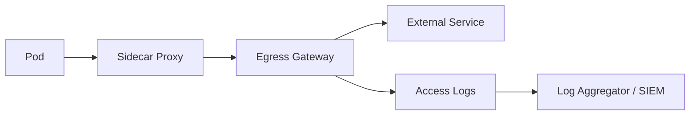

# How to Set Up Egress Gateway for Auditing External Traffic

Author: [nawazdhandala](https://github.com/nawazdhandala)

Tags: Istio, Egress Gateway, Auditing, Logging, Compliance

Description: How to configure an Istio Egress Gateway as a centralized audit point for all outbound traffic with detailed logging and monitoring capabilities.

---

When security or compliance teams ask "can you tell me every external service your cluster talks to?" you need a good answer. An Istio egress gateway, configured with proper logging, gives you exactly that. Instead of parsing logs from hundreds of sidecar proxies, you funnel all external traffic through a handful of egress gateway pods and capture everything there.

This guide focuses specifically on setting up the egress gateway as an audit point, with emphasis on logging configuration, log enrichment, and making the audit data useful.

## Architecture for Auditable Egress

The goal is to create a setup where every outbound connection is visible, logged, and searchable:



Every external request passes through the egress gateway, which logs the connection details. These logs flow to a central logging system where they can be queried, analyzed, and retained.

## Deploy the Egress Gateway

First, make sure the egress gateway is installed:

```yaml
apiVersion: install.istio.io/v1alpha1
kind: IstioOperator
spec:
  components:
    egressGateways:
    - name: istio-egressgateway
      enabled: true
      k8s:
        replicaCount: 2
        resources:
          requests:
            cpu: 200m
            memory: 128Mi
```

Apply and verify:

```bash
istioctl install -f istio-config.yaml
kubectl get pods -n istio-system -l istio=egressgateway
```

## Configure Detailed Access Logging

The default Envoy access log format includes basic fields. For auditing, you want more detail. Configure a custom log format through the Telemetry API:

```yaml
apiVersion: telemetry.istio.io/v1
kind: Telemetry
metadata:
  name: egress-audit-logging
  namespace: istio-system
spec:
  selector:
    matchLabels:
      istio: egressgateway
  accessLogging:
  - providers:
    - name: envoy
```

For more control over the log format, use an EnvoyFilter:

```yaml
apiVersion: networking.istio.io/v1alpha3
kind: EnvoyFilter
metadata:
  name: egress-access-log-format
  namespace: istio-system
spec:
  workloadSelector:
    labels:
      istio: egressgateway
  configPatches:
  - applyTo: NETWORK_FILTER
    match:
      context: GATEWAY
      listener:
        filterChain:
          filter:
            name: envoy.filters.network.http_connection_manager
    patch:
      operation: MERGE
      value:
        typed_config:
          "@type": type.googleapis.com/envoy.extensions.filters.network.http_connection_manager.v3.HttpConnectionManager
          access_log:
          - name: envoy.access_loggers.file
            typed_config:
              "@type": type.googleapis.com/envoy.extensions.access_loggers.file.v3.FileAccessLog
              path: /dev/stdout
              log_format:
                json_format:
                  timestamp: "%START_TIME%"
                  source_ip: "%DOWNSTREAM_REMOTE_ADDRESS%"
                  destination_host: "%UPSTREAM_HOST%"
                  destination_service: "%REQ(:AUTHORITY)%"
                  method: "%REQ(:METHOD)%"
                  path: "%REQ(X-ENVOY-ORIGINAL-PATH?:PATH)%"
                  protocol: "%PROTOCOL%"
                  response_code: "%RESPONSE_CODE%"
                  response_flags: "%RESPONSE_FLAGS%"
                  bytes_received: "%BYTES_RECEIVED%"
                  bytes_sent: "%BYTES_SENT%"
                  duration_ms: "%DURATION%"
                  upstream_cluster: "%UPSTREAM_CLUSTER%"
                  request_id: "%REQ(X-REQUEST-ID)%"
                  user_agent: "%REQ(USER-AGENT)%"
                  tls_version: "%DOWNSTREAM_TLS_VERSION%"
                  sni: "%REQUESTED_SERVER_NAME%"
```

JSON formatted logs are much easier to parse and search in log aggregation systems compared to the default text format.

## Route External Services Through the Egress Gateway

For each external service, set up the routing chain. Here is a template you can follow:

```yaml
apiVersion: networking.istio.io/v1
kind: ServiceEntry
metadata:
  name: external-api
spec:
  hosts:
  - "api.external.com"
  ports:
  - number: 443
    name: tls
    protocol: TLS
  resolution: DNS
  location: MESH_EXTERNAL
---
apiVersion: networking.istio.io/v1
kind: Gateway
metadata:
  name: audit-egress
  namespace: istio-system
spec:
  selector:
    istio: egressgateway
  servers:
  - port:
      number: 443
      name: tls
      protocol: TLS
    hosts:
    - "api.external.com"
    tls:
      mode: PASSTHROUGH
---
apiVersion: networking.istio.io/v1
kind: VirtualService
metadata:
  name: api-external-audit
spec:
  hosts:
  - "api.external.com"
  gateways:
  - istio-system/audit-egress
  - mesh
  tls:
  - match:
    - gateways:
      - mesh
      port: 443
      sniHosts:
      - "api.external.com"
    route:
    - destination:
        host: istio-egressgateway.istio-system.svc.cluster.local
        port:
          number: 443
  - match:
    - gateways:
      - istio-system/audit-egress
      port: 443
      sniHosts:
      - "api.external.com"
    route:
    - destination:
        host: api.external.com
        port:
          number: 443
```

## Preventing Bypass

Logging is only useful if all traffic goes through the egress gateway. Enforce this with NetworkPolicies:

```yaml
apiVersion: networking.k8s.io/v1
kind: NetworkPolicy
metadata:
  name: force-egress-gateway
  namespace: default
spec:
  podSelector: {}
  policyTypes:
  - Egress
  egress:
  # Allow traffic to other pods in the namespace
  - to:
    - podSelector: {}
  # Allow traffic to istio-system (egress gateway)
  - to:
    - namespaceSelector:
        matchLabels:
          kubernetes.io/metadata.name: istio-system
  # Allow DNS
  - to:
    - namespaceSelector:
        matchLabels:
          kubernetes.io/metadata.name: kube-system
    ports:
    - port: 53
      protocol: UDP
    - port: 53
      protocol: TCP
```

This blocks direct internet access from pods. The only path to external services is through the istio-system namespace where the egress gateway runs.

## Shipping Logs to a SIEM

### Elasticsearch + Fluentd

Deploy Fluentd as a DaemonSet to collect egress gateway logs:

```yaml
apiVersion: apps/v1
kind: DaemonSet
metadata:
  name: fluentd
  namespace: logging
spec:
  selector:
    matchLabels:
      app: fluentd
  template:
    metadata:
      labels:
        app: fluentd
    spec:
      containers:
      - name: fluentd
        image: fluent/fluentd-kubernetes-daemonset:v1-debian-elasticsearch
        env:
        - name: FLUENT_ELASTICSEARCH_HOST
          value: "elasticsearch.logging.svc.cluster.local"
        - name: FLUENT_ELASTICSEARCH_PORT
          value: "9200"
        - name: FLUENT_ELASTICSEARCH_SCHEME
          value: "https"
        volumeMounts:
        - name: varlog
          mountPath: /var/log
      volumes:
      - name: varlog
        hostPath:
          path: /var/log
```

### Creating Audit Reports

With logs in Elasticsearch, you can run queries like:

```json
{
  "query": {
    "bool": {
      "must": [
        {"match": {"kubernetes.labels.istio": "egressgateway"}},
        {"range": {"@timestamp": {"gte": "now-30d"}}}
      ]
    }
  },
  "aggs": {
    "external_services": {
      "terms": {
        "field": "destination_service.keyword",
        "size": 100
      }
    }
  }
}
```

This gives you a list of all external services accessed in the last 30 days, which is exactly what auditors ask for.

## Monitoring the Egress Gateway Itself

The egress gateway is now a critical piece of infrastructure. Monitor its health:

```yaml
apiVersion: monitoring.coreos.com/v1
kind: PrometheusRule
metadata:
  name: egress-gateway-health
  namespace: istio-system
spec:
  groups:
  - name: egress-gateway
    rules:
    - alert: EgressGatewayDown
      expr: |
        absent(up{job="istio-egressgateway"} == 1)
      for: 2m
      labels:
        severity: critical
      annotations:
        summary: "Egress gateway is down - external traffic auditing is impaired"

    - alert: EgressGatewayHighLatency
      expr: |
        histogram_quantile(0.99,
          sum(rate(istio_request_duration_milliseconds_bucket{
            source_workload="istio-egressgateway"
          }[5m])) by (le)
        ) > 5000
      for: 5m
      labels:
        severity: warning
      annotations:
        summary: "Egress gateway P99 latency exceeds 5 seconds"

    - alert: EgressGatewayHighMemory
      expr: |
        container_memory_working_set_bytes{
          pod=~"istio-egressgateway.*",
          container="istio-proxy"
        } > 400000000
      for: 10m
      labels:
        severity: warning
      annotations:
        summary: "Egress gateway memory usage exceeds 400MB"
```

## Querying Audit Data

Once you have logs flowing to your SIEM, here are useful queries:

**All external services accessed by a specific namespace:**

```
kubernetes.namespace: "payment-processing" AND upstream_cluster: "outbound|*"
```

**Failed egress attempts (unauthorized services):**

```
response_code: 502 AND kubernetes.labels.istio: "egressgateway"
```

**Traffic volume by external service:**

Group by `destination_service` and sum `bytes_sent` for bandwidth analysis.

**Unusual destinations (anomaly detection):**

Compare the current week's unique destinations against the previous week's. New entries might indicate compromised workloads or configuration drift.

## Log Retention

Compliance frameworks have specific retention requirements:

- PCI DSS: 1 year minimum, with 3 months immediately available
- SOC 2: Typically 1 year
- HIPAA: 6 years
- GDPR: As long as necessary for the processing purpose

Configure your log aggregation system's retention policy accordingly. Egress audit logs tend to be smaller than full application logs, so long retention is usually affordable.

## Summary

Setting up an Istio egress gateway for auditing external traffic requires deploying the gateway, configuring JSON access logging with detailed fields, routing all external traffic through it, preventing bypass with NetworkPolicies, and shipping logs to a SIEM for long-term retention and querying. The egress gateway becomes your centralized audit point where every outbound connection is logged with source, destination, timing, and response details. This gives security and compliance teams the visibility they need without requiring changes to application code.
