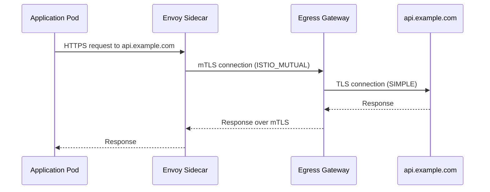

# How to Set Up Egress Gateway with Mutual TLS

Author: [nawazdhandala](https://github.com/nawazdhandala)

Tags: Istio, Egress Gateway, mTLS, Kubernetes, Security

Description: Step-by-step guide to configuring an Istio egress gateway with mutual TLS for secure outbound traffic from your service mesh.

---

An egress gateway gives you a centralized exit point for all outbound traffic leaving your mesh. Instead of every pod directly connecting to external services, traffic flows through a dedicated gateway pod. When you combine this with mutual TLS between sidecars and the gateway, you get encrypted, auditable, and controllable egress traffic.

This is particularly important in environments with strict compliance requirements where you need to prove that all outbound connections go through a known point and are encrypted in transit.

## Why Use an Egress Gateway

Without an egress gateway, each pod's sidecar proxy handles external connections independently. This works, but it has drawbacks:

- You cannot easily enforce network policies on outbound traffic at the infrastructure level
- Logging and auditing are distributed across every pod
- If a pod's sidecar is compromised or bypassed, traffic goes out without controls

An egress gateway solves these problems by funneling all external traffic through a single (or small set of) gateway pods. Network policies can then restrict direct external access and only allow the egress gateway pods to reach the outside.

## Prerequisites

Make sure your Istio installation includes the egress gateway:

```bash
istioctl install --set components.egressGateways[0].name=istio-egressgateway --set components.egressGateways[0].enabled=true
```

Verify it is running:

```bash
kubectl get pods -n istio-system -l istio=egressgateway
```

You should see the egress gateway pod in Running state.

## Step 1: Create the ServiceEntry

First, register the external service you want to reach. For this example, we will configure egress to `api.example.com`:

```yaml
apiVersion: networking.istio.io/v1
kind: ServiceEntry
metadata:
  name: external-api
  namespace: default
spec:
  hosts:
  - api.example.com
  ports:
  - number: 443
    name: tls
    protocol: TLS
  resolution: DNS
  location: MESH_EXTERNAL
```

## Step 2: Create the Gateway Resource

Define a Gateway resource for the egress gateway that listens for traffic destined to the external host:

```yaml
apiVersion: networking.istio.io/v1
kind: Gateway
metadata:
  name: external-api-egressgateway
  namespace: default
spec:
  selector:
    istio: egressgateway
  servers:
  - port:
      number: 443
      name: tls
      protocol: TLS
    hosts:
    - api.example.com
    tls:
      mode: ISTIO_MUTUAL
```

The key here is `tls.mode: ISTIO_MUTUAL`. This tells the gateway to expect mTLS connections from the mesh sidecars using Istio's built-in certificates.

## Step 3: Configure the VirtualService

The VirtualService needs two route rules: one to send traffic from the sidecar to the egress gateway, and one to send traffic from the egress gateway to the external service.

```yaml
apiVersion: networking.istio.io/v1
kind: VirtualService
metadata:
  name: external-api-vs
  namespace: default
spec:
  hosts:
  - api.example.com
  gateways:
  - external-api-egressgateway
  - mesh
  tls:
  - match:
    - gateways:
      - mesh
      port: 443
      sniHosts:
      - api.example.com
    route:
    - destination:
        host: istio-egressgateway.istio-system.svc.cluster.local
        subset: external-api
        port:
          number: 443
  - match:
    - gateways:
      - external-api-egressgateway
      port: 443
      sniHosts:
      - api.example.com
    route:
    - destination:
        host: api.example.com
        port:
          number: 443
      weight: 100
```

The first match block catches traffic from pods inside the mesh (the `mesh` gateway) and redirects it to the egress gateway. The second match block catches traffic arriving at the egress gateway and forwards it to the actual external host.

## Step 4: Create the DestinationRule

You need a DestinationRule for the egress gateway that specifies the mTLS settings:

```yaml
apiVersion: networking.istio.io/v1
kind: DestinationRule
metadata:
  name: egressgateway-for-external-api
  namespace: default
spec:
  host: istio-egressgateway.istio-system.svc.cluster.local
  subsets:
  - name: external-api
    trafficPolicy:
      tls:
        mode: ISTIO_MUTUAL
        sni: api.example.com
```

And one for the external service itself:

```yaml
apiVersion: networking.istio.io/v1
kind: DestinationRule
metadata:
  name: external-api-dr
  namespace: default
spec:
  host: api.example.com
  trafficPolicy:
    tls:
      mode: SIMPLE
      sni: api.example.com
```

## The Full Traffic Flow

Here is how traffic flows with this configuration:



Traffic is encrypted with Istio mTLS between the sidecar and the egress gateway. The egress gateway then initiates a new TLS connection to the external service.

## Step 5: Apply Everything and Test

Apply all the resources:

```bash
kubectl apply -f service-entry.yaml
kubectl apply -f gateway.yaml
kubectl apply -f virtual-service.yaml
kubectl apply -f destination-rules.yaml
```

Test from a pod in the mesh:

```bash
kubectl exec deploy/my-app -c my-app -- curl -s -o /dev/null -w "%{http_code}" https://api.example.com/health
```

Check the egress gateway logs to confirm traffic is flowing through it:

```bash
kubectl logs -n istio-system -l istio=egressgateway --tail=50
```

You should see access log entries for the external host.

## Enforcing Egress Through the Gateway

To actually force all egress through the gateway, you need to combine this with a Kubernetes NetworkPolicy that blocks direct external access from application pods:

```yaml
apiVersion: networking.k8s.io/v1
kind: NetworkPolicy
metadata:
  name: restrict-external-access
  namespace: default
spec:
  podSelector:
    matchLabels: {}
  policyTypes:
  - Egress
  egress:
  - to:
    - namespaceSelector: {}
  - to:
    - ipBlock:
        cidr: 0.0.0.0/0
    ports:
    - port: 53
      protocol: UDP
```

This policy allows traffic to any namespace (including istio-system where the egress gateway lives) and DNS queries, but blocks direct external connections from application pods.

## Debugging Tips

If things are not working, check these common issues:

1. **Subset mismatch**: The subset name in the VirtualService must match the subset name in the DestinationRule for the egress gateway.

2. **Gateway selector**: Make sure the Gateway's selector matches the actual labels on your egress gateway pods. Check with `kubectl get pods -n istio-system -l istio=egressgateway --show-labels`.

3. **SNI consistency**: The SNI host must be consistent across the Gateway, VirtualService, and DestinationRule resources.

4. **Port conflicts**: If another Gateway already uses port 443 on the egress gateway, you will get conflicts. Use different port numbers or merge the configurations.

Run the analysis tool to catch configuration issues:

```bash
istioctl analyze -n default
```

This setup gives you a robust, secure egress path with full mTLS encryption inside the mesh and centralized control over outbound traffic.
