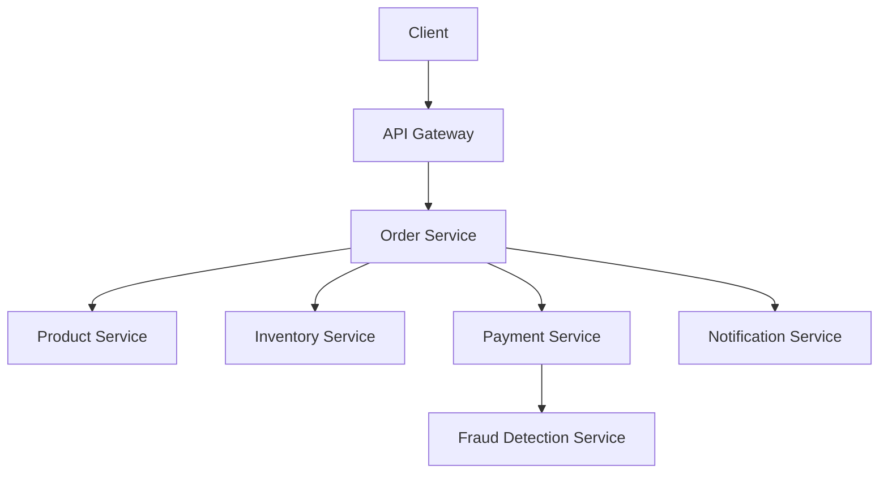

# How to Set Up End-to-End Tracing Across Microservices with Istio

Author: [nawazdhandala](https://github.com/nawazdhandala)

Tags: Istio, End-to-End Tracing, Microservices, Distributed Tracing, Observability

Description: A complete walkthrough for setting up end-to-end distributed tracing across multiple microservices in an Istio service mesh.

---

Getting a single trace that shows a request flowing from your API gateway through five or six microservices and back is one of the most satisfying things in observability. But it requires everything to line up correctly - the mesh configuration, the tracing backend, header propagation in every service, and the right sampling settings. This post walks through the entire setup from scratch using a realistic multi-service application.

## The Architecture

We'll trace requests across a typical e-commerce flow:



A single order creation request touches six services. Without tracing, debugging a slow or failed order means checking logs in six different places. With tracing, you get one view that shows exactly what happened.

## Step 1: Deploy the Tracing Backend

We'll use Jaeger with the OpenTelemetry Collector as an intermediary:

```yaml
# otel-collector.yaml
apiVersion: v1
kind: ConfigMap
metadata:
  name: otel-collector-config
  namespace: observability
data:
  config.yaml: |
    receivers:
      otlp:
        protocols:
          grpc:
            endpoint: 0.0.0.0:4317
    processors:
      batch:
        timeout: 5s
        send_batch_size: 512
    exporters:
      otlp/jaeger:
        endpoint: jaeger-collector.observability:4317
        tls:
          insecure: true
    service:
      pipelines:
        traces:
          receivers: [otlp]
          processors: [batch]
          exporters: [otlp/jaeger]
---
apiVersion: apps/v1
kind: Deployment
metadata:
  name: otel-collector
  namespace: observability
spec:
  replicas: 1
  selector:
    matchLabels:
      app: otel-collector
  template:
    metadata:
      labels:
        app: otel-collector
    spec:
      containers:
        - name: collector
          image: otel/opentelemetry-collector-contrib:0.96.0
          args: ["--config=/conf/config.yaml"]
          ports:
            - containerPort: 4317
          volumeMounts:
            - name: config
              mountPath: /conf
      volumes:
        - name: config
          configMap:
            name: otel-collector-config
---
apiVersion: v1
kind: Service
metadata:
  name: otel-collector
  namespace: observability
spec:
  selector:
    app: otel-collector
  ports:
    - name: otlp-grpc
      port: 4317
```

Deploy Jaeger alongside:

```yaml
# jaeger.yaml
apiVersion: apps/v1
kind: Deployment
metadata:
  name: jaeger
  namespace: observability
spec:
  replicas: 1
  selector:
    matchLabels:
      app: jaeger
  template:
    metadata:
      labels:
        app: jaeger
    spec:
      containers:
        - name: jaeger
          image: jaegertracing/all-in-one:1.54
          ports:
            - containerPort: 16686
            - containerPort: 4317
---
apiVersion: v1
kind: Service
metadata:
  name: jaeger-collector
  namespace: observability
spec:
  selector:
    app: jaeger
  ports:
    - name: otlp-grpc
      port: 4317
---
apiVersion: v1
kind: Service
metadata:
  name: jaeger-query
  namespace: observability
spec:
  selector:
    app: jaeger
  ports:
    - name: ui
      port: 16686
```

```bash
kubectl create namespace observability
kubectl apply -f otel-collector.yaml -f jaeger.yaml
```

## Step 2: Configure Istio

Set up the mesh to use OpenTelemetry tracing:

```yaml
apiVersion: install.istio.io/v1alpha1
kind: IstioOperator
spec:
  meshConfig:
    enableTracing: true
    extensionProviders:
      - name: otel
        opentelemetry:
          service: otel-collector.observability.svc.cluster.local
          port: 4317
```

Create the Telemetry resource:

```yaml
apiVersion: telemetry.istio.io/v1
kind: Telemetry
metadata:
  name: mesh-tracing
  namespace: istio-system
spec:
  tracing:
    - providers:
        - name: otel
      randomSamplingPercentage: 100
      customTags:
        mesh.id:
          literal:
            value: ecommerce-mesh
```

## Step 3: Implement Header Propagation

Every service in the chain needs to propagate trace headers. Here's a reusable middleware approach for each language.

### Shared Header Propagation Module (Node.js)

Create a shared npm package or a common module:

```javascript
// trace-propagation.js
const TRACE_HEADERS = [
  'x-request-id',
  'x-b3-traceid',
  'x-b3-spanid',
  'x-b3-parentspanid',
  'x-b3-sampled',
  'x-b3-flags',
  'traceparent',
  'tracestate',
  'b3',
];

function extractTraceHeaders(req) {
  const headers = {};
  for (const h of TRACE_HEADERS) {
    const val = req.headers[h.toLowerCase()];
    if (val) {
      headers[h] = val;
    }
  }
  return headers;
}

function traceMiddleware(req, res, next) {
  req.traceHeaders = extractTraceHeaders(req);
  next();
}

module.exports = { traceMiddleware, extractTraceHeaders, TRACE_HEADERS };
```

### Order Service (Node.js Example)

```javascript
const express = require('express');
const axios = require('axios');
const { traceMiddleware } = require('./trace-propagation');

const app = express();
app.use(express.json());
app.use(traceMiddleware);

app.post('/api/orders', async (req, res) => {
  const { productId, quantity, paymentMethod } = req.body;

  try {
    // All downstream calls include trace headers
    const headers = req.traceHeaders;

    // Call Product Service
    const product = await axios.get(
      `http://product-service:8080/api/products/${productId}`,
      { headers }
    );

    // Call Inventory Service
    const stock = await axios.get(
      `http://inventory-service:8080/api/stock/${productId}`,
      { headers }
    );

    if (stock.data.available < quantity) {
      return res.status(400).json({ error: 'Insufficient stock' });
    }

    // Call Payment Service
    const payment = await axios.post(
      'http://payment-service:8080/api/payments',
      { amount: product.data.price * quantity, method: paymentMethod },
      { headers }
    );

    // Call Notification Service
    await axios.post(
      'http://notification-service:8080/api/notify',
      { orderId: payment.data.orderId, type: 'order_confirmation' },
      { headers }
    );

    res.json({
      orderId: payment.data.orderId,
      status: 'confirmed',
      total: product.data.price * quantity,
    });
  } catch (err) {
    res.status(500).json({ error: err.message });
  }
});

app.listen(8080);
```

### Payment Service (Go Example)

```go
package main

import (
    "encoding/json"
    "io"
    "net/http"
)

var traceHeaders = []string{
    "x-request-id", "x-b3-traceid", "x-b3-spanid",
    "x-b3-parentspanid", "x-b3-sampled", "x-b3-flags",
    "traceparent", "tracestate", "b3",
}

func propagateHeaders(r *http.Request, outReq *http.Request) {
    for _, h := range traceHeaders {
        if val := r.Header.Get(h); val != "" {
            outReq.Header.Set(h, val)
        }
    }
}

func paymentHandler(w http.ResponseWriter, r *http.Request) {
    // Process payment...

    // Call Fraud Detection Service with propagated headers
    fraudReq, _ := http.NewRequest("POST",
        "http://fraud-service:8080/api/check",
        r.Body,
    )
    propagateHeaders(r, fraudReq)
    fraudReq.Header.Set("Content-Type", "application/json")

    client := &http.Client{}
    fraudResp, err := client.Do(fraudReq)
    if err != nil {
        http.Error(w, err.Error(), 500)
        return
    }
    defer fraudResp.Body.Close()

    w.Header().Set("Content-Type", "application/json")
    json.NewEncoder(w).Encode(map[string]string{
        "orderId": "ord-12345",
        "status":  "processed",
    })
}

func main() {
    http.HandleFunc("/api/payments", paymentHandler)
    http.ListenAndServe(":8080", nil)
}
```

## Step 4: Deploy the Services

Make sure all services are in a namespace with sidecar injection:

```bash
kubectl create namespace ecommerce
kubectl label namespace ecommerce istio-injection=enabled

kubectl apply -f order-service.yaml -n ecommerce
kubectl apply -f product-service.yaml -n ecommerce
kubectl apply -f inventory-service.yaml -n ecommerce
kubectl apply -f payment-service.yaml -n ecommerce
kubectl apply -f fraud-service.yaml -n ecommerce
kubectl apply -f notification-service.yaml -n ecommerce
```

Verify sidecars are injected:

```bash
kubectl get pods -n ecommerce -o jsonpath='{range .items[*]}{.metadata.name}{"\t"}{range .spec.containers[*]}{.name}{" "}{end}{"\n"}{end}'
```

Each pod should list both the application container and `istio-proxy`.

## Step 5: Generate End-to-End Traces

Create an order:

```bash
kubectl exec deploy/sleep -- curl -s -X POST \
  -H "Content-Type: application/json" \
  -d '{"productId": "prod-1", "quantity": 2, "paymentMethod": "card"}' \
  http://order-service.ecommerce:8080/api/orders
```

## Step 6: View the Trace

Port-forward to Jaeger and view the complete trace:

```bash
kubectl port-forward svc/jaeger-query -n observability 16686:16686
```

Open `http://localhost:16686`, select the `order-service` and find your trace. You should see a waterfall diagram showing:

1. Order Service receives the request
2. Order Service calls Product Service (in parallel or sequence)
3. Order Service calls Inventory Service
4. Order Service calls Payment Service
5. Payment Service calls Fraud Detection Service
6. Order Service calls Notification Service

Each service hop shows two spans (client-side and server-side), giving you precise timing for network latency versus processing time.

## Step 7: Add Service-Level Custom Tags

Make traces more useful by adding context:

```yaml
apiVersion: telemetry.istio.io/v1
kind: Telemetry
metadata:
  name: ecommerce-tracing
  namespace: ecommerce
spec:
  tracing:
    - providers:
        - name: otel
      customTags:
        service.namespace:
          literal:
            value: ecommerce
        user.id:
          header:
            name: x-user-id
            defaultValue: anonymous
```

## Troubleshooting Broken Traces

If your end-to-end trace shows gaps or disconnected spans:

```bash
# Verify header propagation at each service
kubectl exec deploy/sleep -- curl -s \
  -H "X-B3-TraceId: deadbeef12345678deadbeef12345678" \
  -H "X-B3-SpanId: 1234567812345678" \
  -H "X-B3-Sampled: 1" \
  http://order-service.ecommerce:8080/api/orders

# Search for this trace ID in Jaeger
# If some services are missing, those services aren't propagating headers
```

The most common issue is a service that makes downstream calls without including the incoming trace headers. Go through each service in the chain and verify it propagates headers from every incoming request to every outgoing request.

## Summary

End-to-end tracing across microservices requires coordination between the mesh (Istio configuration and tracing backend), the infrastructure (OpenTelemetry Collector), and the application code (header propagation). The mesh generates spans automatically, but connecting them into a complete trace depends on every service in the chain forwarding trace headers. Once it's working, you get a powerful debugging tool that shows exactly where time is spent and where errors occur across your entire request flow.
