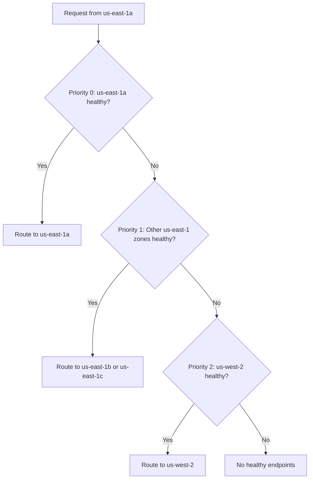

# How to Set Up Failover Load Balancing Across Regions in Istio

Author: [nawazdhandala](https://github.com/nawazdhandala)

Tags: Istio, Failover, Multi-Region, Load Balancing, Kubernetes, High Availability

Description: Set up cross-region failover load balancing in Istio so traffic automatically redirects to healthy endpoints in other regions during outages.

---

If you are running services across multiple regions, you need a plan for what happens when an entire region goes down. Maybe there is an AWS outage in us-east-1, or your deployment in eu-west-1 has a bad config push that takes down all pods. Without failover, your users in that region are stuck.

Istio's locality failover lets you define exactly where traffic should go when the local region is not available. You set up a chain of fallback regions, and Istio handles the routing automatically based on endpoint health.

## Prerequisites

For cross-region failover to work, you need:

- A multi-cluster Istio mesh or a single cluster spanning multiple regions
- Services deployed in at least two regions
- Outlier detection configured (this is mandatory - failover does not work without it)
- Nodes labeled with standard Kubernetes topology labels

Check your node topology labels:

```bash
kubectl get nodes -o custom-columns=NAME:.metadata.name,REGION:.metadata.labels.topology\\.kubernetes\\.io/region,ZONE:.metadata.labels.topology\\.kubernetes\\.io/zone
```

## Deploying Services Across Regions

Suppose you have a `search-api` service that needs to be available in three regions. Each region has its own deployment:

```yaml
apiVersion: apps/v1
kind: Deployment
metadata:
  name: search-api
  namespace: default
spec:
  replicas: 5
  selector:
    matchLabels:
      app: search-api
  template:
    metadata:
      labels:
        app: search-api
    spec:
      topologySpreadConstraints:
        - maxSkew: 1
          topologyKey: topology.kubernetes.io/zone
          whenUnsatisfiable: DoNotSchedule
          labelSelector:
            matchLabels:
              app: search-api
      containers:
        - name: search-api
          image: myregistry/search-api:1.0.0
          ports:
            - containerPort: 8080
          readinessProbe:
            httpGet:
              path: /health
              port: 8080
            initialDelaySeconds: 5
            periodSeconds: 10
```

The `topologySpreadConstraints` ensure pods are distributed evenly across zones within each region.

## Configuring Failover

The failover configuration goes in a DestinationRule. You specify which region should receive traffic when the primary region fails.

```yaml
apiVersion: networking.istio.io/v1
kind: DestinationRule
metadata:
  name: search-api
spec:
  host: search-api
  trafficPolicy:
    outlierDetection:
      consecutive5xxErrors: 3
      interval: 10s
      baseEjectionTime: 30s
      maxEjectionPercent: 100
    loadBalancer:
      localityLbSetting:
        enabled: true
        failover:
          - from: us-east-1
            to: us-west-2
          - from: us-west-2
            to: us-east-1
          - from: eu-west-1
            to: us-east-1
      simple: ROUND_ROBIN
```

Here is what this configuration says:

- If us-east-1 endpoints are unhealthy, failover to us-west-2
- If us-west-2 endpoints are unhealthy, failover to us-east-1
- If eu-west-1 endpoints are unhealthy, failover to us-east-1

## How Failover Actually Works

Istio assigns priority levels to endpoints based on their locality relative to the calling pod:

| Priority | Locality | Description |
|----------|----------|-------------|
| 0 | Same zone | Preferred - lowest latency |
| 1 | Same region, different zone | Fallback within region |
| 2 | Failover region | Cross-region failover |



The key thing to understand is that failover is triggered by outlier detection. When Envoy detects that endpoints in a locality are returning errors (based on the `outlierDetection` settings), it ejects those endpoints and tries the next priority level.

## Outlier Detection Settings

Getting outlier detection right is critical for failover. Here are the important settings:

```yaml
outlierDetection:
  consecutive5xxErrors: 3        # Eject after 3 consecutive 5xx errors
  interval: 10s                  # Check every 10 seconds
  baseEjectionTime: 30s          # Eject for at least 30 seconds
  maxEjectionPercent: 100        # Allow ejecting all endpoints in a locality
```

**`maxEjectionPercent: 100`** is important for failover. The default is 10%, which means Envoy will only eject 10% of endpoints. If you have 10 pods in a zone and all of them are failing, only 1 gets ejected, and the other 9 keep receiving (and failing) traffic. Setting it to 100 allows all unhealthy endpoints to be ejected, which triggers the failover.

**`consecutive5xxErrors: 3`** means a pod needs to fail 3 times in a row before it gets ejected. Lower values make failover faster but more sensitive to transient errors. Higher values are more tolerant but slower to failover.

## Testing Failover

You can test failover by making endpoints in one zone return errors.

### Method 1: Scale Down a Zone

```bash
kubectl scale deployment search-api --replicas=0 -n zone-a-namespace
```

Watch traffic shift to the next zone or region.

### Method 2: Inject Faults

Use Istio fault injection to simulate failures in a specific zone:

```yaml
apiVersion: networking.istio.io/v1
kind: VirtualService
metadata:
  name: search-api-fault-test
spec:
  hosts:
    - search-api
  http:
    - fault:
        abort:
          httpStatus: 503
          percentage:
            value: 100
      match:
        - sourceLabels:
            topology.kubernetes.io/zone: us-east-1a
      route:
        - destination:
            host: search-api
    - route:
        - destination:
            host: search-api
```

### Method 3: Check Endpoint Priorities

Inspect the endpoint priorities from a specific pod's perspective:

```bash
istioctl proxy-config endpoint <pod-name>.default \
  --cluster "outbound|80||search-api.default.svc.cluster.local" -o json \
  | jq '.[] | {endpoint: .hostStatuses[0].address.socketAddress, priority: .priority, locality: .locality}'
```

## Monitoring Failover Events

Track when failover happens with Prometheus:

```text
# Requests by destination locality
sum(rate(istio_requests_total{
  destination_service="search-api.default.svc.cluster.local"
}[5m])) by (destination_canonical_revision, source_workload)
```

Set up alerts for when traffic is routing cross-region unexpectedly:

```yaml
apiVersion: monitoring.coreos.com/v1
kind: PrometheusRule
metadata:
  name: cross-region-traffic-alert
spec:
  groups:
    - name: failover
      rules:
        - alert: CrossRegionTrafficDetected
          expr: |
            sum(rate(istio_requests_total{
              destination_service="search-api.default.svc.cluster.local",
              source_workload_namespace="default"
            }[5m])) by (source_workload) > 0
          for: 5m
          labels:
            severity: warning
          annotations:
            summary: "Cross-region traffic detected for search-api"
```

## Multi-Cluster Failover

If you are running a multi-cluster Istio mesh, failover works the same way, but you need to make sure services are discoverable across clusters. With Istio multi-cluster, each cluster's istiod shares endpoint information with the other clusters, so locality-based routing works transparently.

The key requirement is that your clusters are connected either through a shared control plane or through Istio's multi-cluster east-west gateway:

```bash
# Verify cross-cluster endpoints are visible
istioctl proxy-config endpoint <pod-name> | grep search-api
```

You should see endpoints from all clusters listed with their respective localities.

## Tips for Production

- **Always set `maxEjectionPercent` to 100** for services where failover is critical
- **Keep outlier detection intervals short** (10-30 seconds) for fast failover
- **Test failover regularly** - do not wait for a real outage to discover it does not work
- **Monitor cross-region traffic costs** - failover traffic crosses region boundaries, which usually costs more
- **Size your failover regions** to handle the extra load - if us-east-1 goes down, us-west-2 needs enough capacity for both regions' traffic

Cross-region failover with Istio gives you automatic disaster recovery at the service mesh level. Set it up once, test it periodically, and trust that when a region goes down, traffic will find its way to healthy endpoints without any manual intervention.
