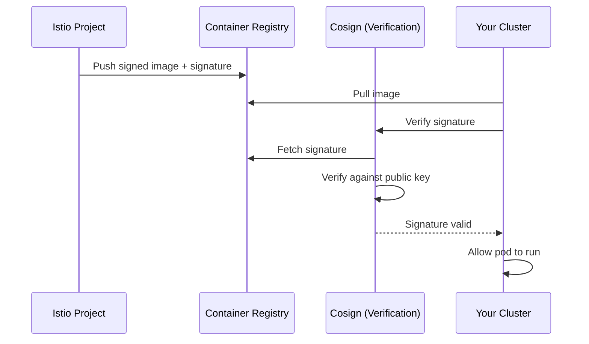

# How to Set Up Image Signing and Validation for Istio

Author: [nawazdhandala](https://github.com/nawazdhandala)

Tags: Istio, Image Signing, Cosign, Supply Chain Security, Service Mesh

Description: How to verify Istio container image signatures and set up admission control to ensure only trusted Istio images run in your cluster.

---

Supply chain attacks are a growing concern. If an attacker manages to replace an Istio container image with a compromised one, they could intercept all traffic in your mesh, disable security features, or exfiltrate data. Image signing and validation ensures that the Istio images running in your cluster are the exact images published by the Istio project, untampered with.

Starting with Istio 1.12, the project signs its container images using Cosign (part of the Sigstore project). This means you can verify the authenticity and integrity of every Istio image before deploying it.

## Understanding Image Signing

Image signing works like this:



The Istio project signs images during their CI/CD process using Cosign's keyless signing with Sigstore's certificate transparency log (Rekor). This means there is a public, auditable record of every signature.

## Verifying Istio Images Manually

First, install Cosign:

```bash
# macOS
brew install cosign

# Linux
curl -LO https://github.com/sigstore/cosign/releases/latest/download/cosign-linux-amd64
chmod +x cosign-linux-amd64
sudo mv cosign-linux-amd64 /usr/local/bin/cosign
```

Verify an Istio image:

```bash
# Verify the istiod image
cosign verify \
  --certificate-identity-regexp='https://github.com/istio/istio/.github/workflows/' \
  --certificate-oidc-issuer='https://token.actions.githubusercontent.com' \
  docker.io/istio/pilot:1.20.3

# Verify the proxy image
cosign verify \
  --certificate-identity-regexp='https://github.com/istio/istio/.github/workflows/' \
  --certificate-oidc-issuer='https://token.actions.githubusercontent.com' \
  docker.io/istio/proxyv2:1.20.3
```

A successful verification shows the signature details and the certificate chain. If the image has been tampered with, the verification fails.

You can also verify the Software Bill of Materials (SBOM):

```bash
cosign verify-attestation \
  --type spdx \
  --certificate-identity-regexp='https://github.com/istio/istio/.github/workflows/' \
  --certificate-oidc-issuer='https://token.actions.githubusercontent.com' \
  docker.io/istio/pilot:1.20.3
```

## Automating Verification in CI/CD

Add image verification to your deployment pipeline:

```yaml
# GitHub Actions example
name: Deploy Istio
on:
  workflow_dispatch:
    inputs:
      istio_version:
        description: 'Istio version to deploy'
        required: true

jobs:
  verify-and-deploy:
    runs-on: ubuntu-latest
    steps:
      - name: Install Cosign
        uses: sigstore/cosign-installer@main

      - name: Verify Istio Images
        run: |
          VERSION=${{ github.event.inputs.istio_version }}
          IMAGES="pilot proxyv2 install-cni"

          for image in $IMAGES; do
            echo "Verifying istio/$image:$VERSION"
            cosign verify \
              --certificate-identity-regexp='https://github.com/istio/istio/.github/workflows/' \
              --certificate-oidc-issuer='https://token.actions.githubusercontent.com' \
              "docker.io/istio/$image:$VERSION"
          done

      - name: Deploy Istio
        if: success()
        run: |
          istioctl install --set tag=${{ github.event.inputs.istio_version }}
```

## Setting Up Admission Control with Kyverno

Kyverno is a Kubernetes admission controller that can enforce image signature verification. Install it and create a policy for Istio images.

Install Kyverno:

```bash
kubectl create -f https://github.com/kyverno/kyverno/releases/latest/download/install.yaml
```

Create a policy that requires Istio images to be signed:

```yaml
apiVersion: kyverno.io/v1
kind: ClusterPolicy
metadata:
  name: verify-istio-images
spec:
  validationFailureAction: Enforce
  background: false
  webhookTimeoutSeconds: 30
  rules:
    - name: verify-istiod
      match:
        any:
          - resources:
              kinds:
                - Pod
              namespaces:
                - istio-system
      verifyImages:
        - imageReferences:
            - "docker.io/istio/pilot:*"
            - "docker.io/istio/proxyv2:*"
            - "docker.io/istio/install-cni:*"
          attestors:
            - entries:
                - keyless:
                    issuer: "https://token.actions.githubusercontent.com"
                    subject: "https://github.com/istio/istio/.github/workflows/*"
                    rekor:
                      url: "https://rekor.sigstore.dev"
    - name: verify-sidecar-images
      match:
        any:
          - resources:
              kinds:
                - Pod
      verifyImages:
        - imageReferences:
            - "docker.io/istio/proxyv2:*"
          attestors:
            - entries:
                - keyless:
                    issuer: "https://token.actions.githubusercontent.com"
                    subject: "https://github.com/istio/istio/.github/workflows/*"
                    rekor:
                      url: "https://rekor.sigstore.dev"
```

This policy prevents any pod from running an unsigned Istio proxy image. If someone tries to deploy a tampered image, the admission controller blocks it.

## Setting Up Admission Control with Connaisseur

Connaisseur is another option for image signature verification:

```bash
helm repo add connaisseur https://sse-secure-systems.github.io/connaisseur/charts
helm install connaisseur connaisseur/connaisseur \
  --namespace connaisseur \
  --create-namespace
```

Configure a validator for Istio images:

```yaml
# values.yaml for Connaisseur
validators:
  - name: istio-cosign
    type: cosign
    trustRoots:
      - name: default
        key: |
          -----BEGIN PUBLIC KEY-----
          ... (Istio's public signing key) ...
          -----END PUBLIC KEY-----
policy:
  - pattern: "docker.io/istio/*"
    validator: istio-cosign
```

## Using OPA Gatekeeper for Image Validation

If you already use OPA Gatekeeper, add a constraint template for image signatures:

```yaml
apiVersion: templates.gatekeeper.sh/v1
kind: ConstraintTemplate
metadata:
  name: k8simageverification
spec:
  crd:
    spec:
      names:
        kind: K8sImageVerification
      validation:
        openAPIV3Schema:
          type: object
          properties:
            allowedRegistries:
              type: array
              items:
                type: string
  targets:
    - target: admission.k8s.gatekeeper.sh
      rego: |
        package k8simageverification
        violation[{"msg": msg}] {
          container := input.review.object.spec.containers[_]
          startswith(container.image, "istio/")
          not startswith(container.image, "docker.io/istio/")
          msg := sprintf("Istio image %v must come from docker.io/istio/", [container.image])
        }
```

## Signing Your Own Custom Istio Images

If you build custom Istio images (with patches or custom extensions), sign them with your own key:

```bash
# Generate a key pair
cosign generate-key-pair

# Build and push your custom image
docker build -t myregistry.example.com/istio/pilot:1.20.3-custom .
docker push myregistry.example.com/istio/pilot:1.20.3-custom

# Sign the image
cosign sign --key cosign.key myregistry.example.com/istio/pilot:1.20.3-custom
```

Then update your admission policy to verify against your key:

```yaml
verifyImages:
  - imageReferences:
      - "myregistry.example.com/istio/*"
    attestors:
      - entries:
          - keys:
              publicKeys: |
                -----BEGIN PUBLIC KEY-----
                ... (your public key) ...
                -----END PUBLIC KEY-----
```

## Verifying Istio Helm Charts

If you install Istio via Helm, verify the chart provenance:

```bash
# Download the chart with provenance file
helm pull istio/istiod --version 1.20.3 --prov

# Verify the provenance
helm verify istiod-1.20.3.tgz
```

## Monitoring Image Verification

Set up alerts for image verification failures. With Kyverno, check policy reports:

```bash
kubectl get policyreport --all-namespaces -o json | \
  jq '.items[].results[] | select(.result == "fail") | {policy: .policy, resource: .resources[0].name}'
```

Create a monitoring dashboard for verification events:

```bash
# Check Kyverno admission controller logs for verification failures
kubectl logs -n kyverno deployment/kyverno -f | grep -i "verify\|signature\|failed"
```

## Supply Chain Security Checklist

Beyond image signing, here is a checklist for Istio supply chain security:

1. **Verify all Istio images before deployment** - Use Cosign to verify signatures
2. **Pin image digests, not tags** - Tags can be moved, digests cannot:

```yaml
# Instead of this
image: docker.io/istio/pilot:1.20.3

# Use this
image: docker.io/istio/pilot@sha256:abc123...
```

3. **Use a private registry** - Mirror Istio images to your own registry and scan them
4. **Enable admission control** - Prevent unsigned images from running
5. **Audit image pulls** - Monitor which images are pulled and from where
6. **Review SBOMs** - Check the software bill of materials for known vulnerable dependencies

```bash
# Get the SBOM for an Istio image
cosign download sbom docker.io/istio/pilot:1.20.3 > pilot-sbom.json
```

Image signing and verification add a critical layer of trust to your Istio deployment. Without it, you are trusting that the images you pull are what they claim to be, which is an assumption that supply chain attacks directly target. Set up verification early, enforce it through admission control, and make it part of your standard deployment process.
