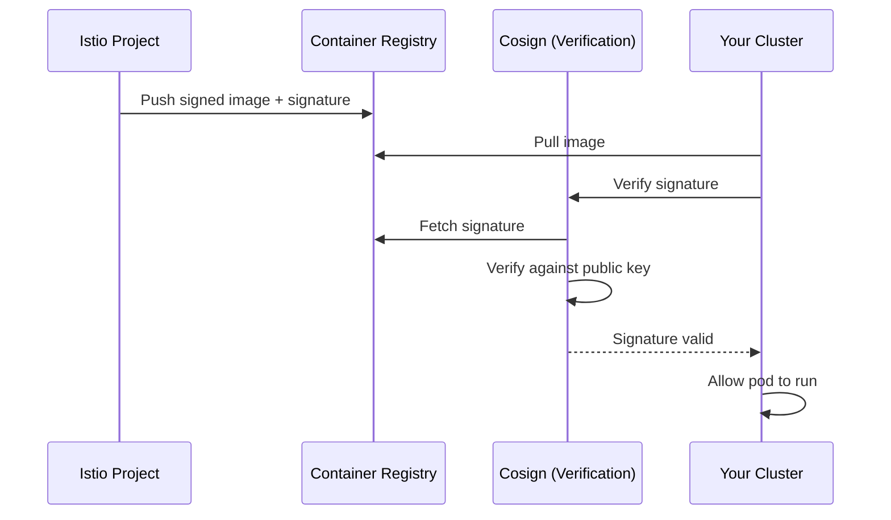

# How to Set Up Image Signing and Validation for Istio

Author: [nawazdhandala](https://github.com/nawazdhandala)

Tags: Istio, Image Signing, Cosign, Supply Chain Security, Service Mesh

Description: How to verify Istio container image signatures and set up admission control to ensure only trusted Istio images run in your cluster.

---

Supply chain attacks are a growing concern. If an attacker manages to replace an Istio container image with a compromised one, they could intercept all traffic in your mesh, disable security features, or exfiltrate data. Image signing and validation ensures that the Istio images running in your cluster are the exact images published by the Istio project, untampered with.

Starting with Istio 1.12, the project signs its container images using Cosign (part of the Sigstore project). This means you can verify the authenticity and integrity of every Istio image before deploying it.

## Understanding Image Signing

Image signing works like this:


```mermaid
sequenceDiagram
    participant Istio as Istio Project
    participant Registry as Container Registry
    participant Cosign as Cosign (Verification)
    participant Cluster as Your Cluster

    Istio->>Registry: Push signed image + signature
    Cluster->>Registry: Pull image
    Cluster->>Cosign: Verify signature
    Cosign->>Registry: Fetch signature
    Cosign->>Cosign: Verify against public key
    Cosign-->>Cluster: Signature valid
    Cluster->>Cluster: Allow pod to run
```

The Istio project signs images during their release process using Cosign and publishes the verification key at `https://istio.io/misc/istio-key.pub`. This means there is a public, auditable record of every signature.

## Verifying Istio Images Manually

First, install Cosign:

```bash
# macOS

brew install cosign

# Linux
curl -LO https://github.com/sigstore/cosign/releases/latest/download/cosign-linux-amd64
chmod +x cosign-linux-amd64
sudo mv cosign-linux-amd64 /usr/local/bin/cosign
```

Verify an Istio image:

```bash
# Verify the istiod image
cosign verify \
  --key https://istio.io/misc/istio-key.pub \
  docker.io/istio/pilot:1.20.3

# Verify the proxy image
cosign verify \
  --key https://istio.io/misc/istio-key.pub \
  docker.io/istio/proxyv2:1.20.3
```

A successful verification shows the signature details and confirms the signature was verified against Istio's public key. If the image has been tampered with, the verification fails.

## Automating Verification in CI/CD

Add image verification to your deployment pipeline:

```yaml
# GitHub Actions example
name: Deploy Istio
on:
  workflow_dispatch:
    inputs:
      istio_version:
        description: 'Istio version to deploy'
        required: true

jobs:
  verify-and-deploy:
    runs-on: ubuntu-latest
    steps:
      - name: Install Cosign
        uses: sigstore/cosign-installer@main

      - name: Verify Istio Images
        run: |
          VERSION=${{ github.event.inputs.istio_version }}
          IMAGES="pilot proxyv2 install-cni"

          for image in $IMAGES; do
            echo "Verifying istio/$image:$VERSION"
            cosign verify \
              --key https://istio.io/misc/istio-key.pub \
              "docker.io/istio/$image:$VERSION"
          done

      - name: Deploy Istio
        if: success()
        run: |
          istioctl install --set tag=${{ github.event.inputs.istio_version }}
```

## Setting Up Admission Control with Kyverno

Kyverno is a Kubernetes admission controller that can enforce image signature verification. Install it and create a policy for Istio images.

Install Kyverno:

```bash
kubectl create -f https://github.com/kyverno/kyverno/releases/latest/download/install.yaml
```

Create a policy that requires Istio images to be signed:

```yaml
apiVersion: policies.kyverno.io/v1
kind: ImageValidatingPolicy
metadata:
  name: verify-istio-images
spec:
  validationActions: [Deny]
  webhookConfiguration:
    timeoutSeconds: 30
  failurePolicy: Fail
  evaluation:
    background:
      enabled: false
  matchConstraints:
    resourceRules:
      - apiGroups: [""]
        apiVersions: ["v1"]
        operations: ["CREATE", "UPDATE"]
        resources: ["pods"]
  matchImageReferences:
    - glob: "docker.io/istio/pilot:*"
    - glob: "docker.io/istio/proxyv2:*"
    - glob: "docker.io/istio/install-cni:*"
  attestors:
    - name: istio
      cosign:
        key:
          data: |
            -----BEGIN PUBLIC KEY-----
            MFkwEwYHKoZIzj0CAQYIKoZIzj0DAQcDQgAEej5bv2n2vOecKineYGWwq1WaQa7C
            7HTEVN+BkNI4D1+66ufzn1eGTrbaC9dceJqCAkhp37vMxhWOrGufpBUokg==
            -----END PUBLIC KEY-----
  validations:
    - expression: >-
        images.containers.map(image, verifyImageSignatures(image, [attestors.istio])).all(result, result > 0)
      message: "failed to verify Istio image signature"
```

This policy prevents any pod from running an unsigned Istio proxy image. If someone tries to deploy a tampered image, the admission controller blocks it.

## Setting Up Admission Control with Connaisseur

Connaisseur is another option for image signature verification:

```bash
helm repo add connaisseur https://sse-secure-systems.github.io/connaisseur/charts
helm install connaisseur connaisseur/connaisseur \
  --namespace connaisseur \
  --create-namespace
```

Configure a validator for Istio images:

```yaml
# values.yaml for Connaisseur
application:
  validators:
    - name: istio-cosign
      type: cosign
      trustRoots:
        - name: istio-key
          key: |
            -----BEGIN PUBLIC KEY-----
            MFkwEwYHKoZIzj0CAQYIKoZIzj0DAQcDQgAEej5bv2n2vOecKineYGWwq1WaQa7C
            7HTEVN+BkNI4D1+66ufzn1eGTrbaC9dceJqCAkhp37vMxhWOrGufpBUokg==
            -----END PUBLIC KEY-----
  policy:
    - pattern: "docker.io/istio/*"
      validator: istio-cosign
      with:
        trustRoot: istio-key
```

## Using OPA Gatekeeper for Image Validation

If you already use OPA Gatekeeper, add a constraint template to ensure Istio images come from the official registry. Gatekeeper does not verify Cosign signatures by itself; use Kyverno, Connaisseur, or another signature-aware admission controller for signature verification.

```yaml
apiVersion: templates.gatekeeper.sh/v1
kind: ConstraintTemplate
metadata:
  name: k8simageverification
spec:
  crd:
    spec:
      names:
        kind: K8sImageVerification
      validation:
        openAPIV3Schema:
          type: object
  targets:
    - target: admission.k8s.gatekeeper.sh
      rego: |
        package k8simageverification

        containers[container] {
          container := input.review.object.spec.containers[_]
        }

        containers[container] {
          container := input.review.object.spec.initContainers[_]
        }

        is_istio_image(image) {
          startswith(image, "istio/")
        }

        is_istio_image(image) {
          contains(image, "/istio/")
        }

        violation[{"msg": msg}] {
          container := containers[_]
          is_istio_image(container.image)
          not startswith(container.image, "docker.io/istio/")
          msg := sprintf("Istio image %v must come from docker.io/istio/", [container.image])
        }
---
apiVersion: constraints.gatekeeper.sh/v1beta1
kind: K8sImageVerification
metadata:
  name: require-official-istio-images
spec:
  match:
    kinds:
      - apiGroups: [""]
        kinds: ["Pod"]
```

## Signing Your Own Custom Istio Images

If you build custom Istio images (with patches or custom extensions), sign them with your own key:

```bash
# Generate a key pair
cosign generate-key-pair

# Build and push your custom image
docker build -t myregistry.example.com/istio/pilot:1.20.3-custom .
docker push myregistry.example.com/istio/pilot:1.20.3-custom

# Sign the image
cosign sign --key cosign.key myregistry.example.com/istio/pilot:1.20.3-custom
```

Then update your admission policy to verify against your key:

```yaml
attestors:
  - name: custom-istio
    cosign:
      key:
        data: |
          -----BEGIN PUBLIC KEY-----
          ... (your public key) ...
          -----END PUBLIC KEY-----
```

## Verifying Istio Helm Charts

If you install Istio via Helm, check the chart digest from the official Istio chart repository index. Istio does not publish Helm provenance files for this chart version, so `helm verify` will not work unless a `.prov` file exists.

```bash
# Add the official Istio chart repository
helm repo add istio https://istio-release.storage.googleapis.com/charts
helm repo update

# Download the chart
helm pull istio/istiod --version 1.20.3

# Compare with the digest in the official repository index
sha256sum istiod-1.20.3.tgz
curl -s -o istio-index.yaml https://istio-release.storage.googleapis.com/charts/index.yaml
awk '/^  istiod:/{in_chart=1} in_chart && /version: 1.20.3/{found=1} found && /digest:/{print $2; exit}' istio-index.yaml
```

## Monitoring Image Verification

Set up alerts for image verification failures. With Kyverno, check policy reports:

```bash
kubectl get policyreport --all-namespaces -o json | \
  jq '.items[].results[] | select(.result == "fail") | {policy: .policy, resource: .resources[0].name}'
```

Create a monitoring dashboard for verification events:

```bash
# Check Kyverno admission controller logs for verification failures
kubectl logs -n kyverno deployment/kyverno -f | grep -i "verify\|signature\|failed"
```

## Supply Chain Security Checklist

Beyond image signing, here is a checklist for Istio supply chain security:

1. **Verify all Istio images before deployment** - Use Cosign to verify signatures
2. **Pin image digests, not tags** - Tags can be moved, digests cannot:

```yaml
# Instead of this
image: docker.io/istio/pilot:1.20.3

# Use this
image: docker.io/istio/pilot@sha256:abc123...
```

3. **Use a private registry** - Mirror Istio images to your own registry and scan them
4. **Enable admission control** - Prevent unsigned images from running
5. **Audit image pulls** - Monitor which images are pulled and from where
6. **Review SBOMs when available** - Check the software bill of materials for known vulnerable dependencies

Image signing and verification add a critical layer of trust to your Istio deployment. Without it, you are trusting that the images you pull are what they claim to be, which is an assumption that supply chain attacks directly target. Set up verification early, enforce it through admission control, and make it part of your standard deployment process.
