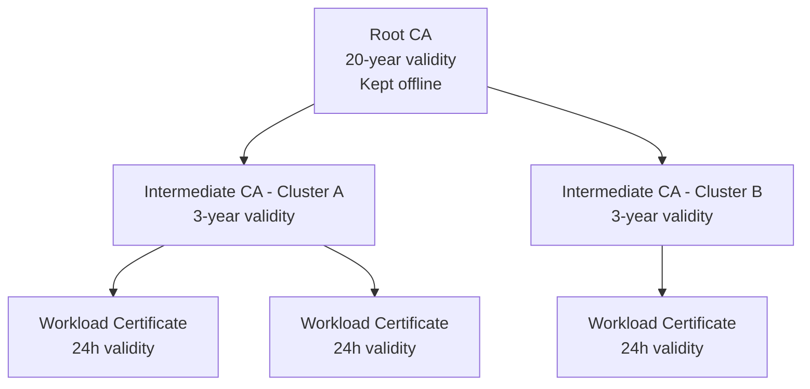

# How to Set Up Intermediate CA Certificates in Istio

Author: [nawazdhandala](https://github.com/nawazdhandala)

Tags: Istio, Certificate, Intermediate CA, PKI, Security, Kubernetes

Description: How to configure Istio with intermediate CA certificates for a proper PKI hierarchy, including generation, installation, and chain management.

---

In a proper PKI setup, the root CA never signs workload certificates directly. Instead, an intermediate CA sits between the root and the workloads. The root CA signs the intermediate, and the intermediate signs the workloads. This layered approach means the root key can stay offline and secure while the intermediate handles the day-to-day signing.

Istio supports this pattern natively. In fact, when you bring your own certificates to Istio, you are expected to provide an intermediate CA. This guide walks through the entire process of setting up and managing intermediate CAs with Istio.

## Why Use Intermediate CAs

**Root key protection** - The root CA private key only needs to be online when signing intermediate certificates, which happens rarely. The rest of the time it stays in cold storage.

**Blast radius reduction** - If the intermediate CA key is compromised, you can revoke it and issue a new one without changing the root. All trust relationships that depend on the root still work.

**Operational flexibility** - You can have different intermediate CAs for different purposes (one per cluster, one per environment, one per team).

**Certificate revocation** - You can revoke an entire intermediate CA and all certificates it issued, without affecting other intermediates.

## Certificate Hierarchy



## Generating the Root CA

Start with the root CA. This should be done on a secure, air-gapped machine:

```bash
# Generate a strong root key
openssl genrsa -out root-key.pem 4096

# Create root CA configuration
cat > root-ca.conf <<EOF
[req]
distinguished_name = req_dn
x509_extensions = v3_root_ca
prompt = no

[req_dn]
O = MyCompany Inc.
CN = MyCompany Root CA

[v3_root_ca]
basicConstraints = critical, CA:true
keyUsage = critical, keyCertSign, cRLSign
subjectKeyIdentifier = hash
EOF

# Generate self-signed root certificate (20-year validity)
openssl req -new -x509 -key root-key.pem -out root-cert.pem \
  -days 7300 -config root-ca.conf -sha256

# Verify
openssl x509 -in root-cert.pem -text -noout | head -15
```

Store `root-key.pem` securely offline. You will only need it when creating new intermediate CAs.

## Generating an Intermediate CA

For each Istio cluster or environment, generate a separate intermediate CA:

```bash
# Generate intermediate CA key
openssl genrsa -out ca-key.pem 4096

# Create intermediate CA configuration
cat > intermediate-ca.conf <<EOF
[req]
distinguished_name = req_dn
req_extensions = v3_intermediate
prompt = no

[req_dn]
O = MyCompany Inc.
CN = Istio CA - Production Cluster

[v3_intermediate]
basicConstraints = critical, CA:true, pathlen:0
keyUsage = critical, keyCertSign, cRLSign
subjectKeyIdentifier = hash
authorityKeyIdentifier = keyid:always, issuer
EOF

# Generate CSR
openssl req -new -key ca-key.pem -out ca-csr.pem -config intermediate-ca.conf

# Sign with root CA (3-year validity)
openssl x509 -req -in ca-csr.pem \
  -CA root-cert.pem -CAkey root-key.pem -CAcreateserial \
  -out ca-cert.pem -days 1095 -sha256 \
  -extfile intermediate-ca.conf -extensions v3_intermediate
```

The `pathlen:0` constraint is important. It means this intermediate CA can sign workload certificates but cannot sign other intermediate CAs. This limits the depth of the certificate chain.

## Building the Certificate Chain

The certificate chain file must contain the intermediate CA certificate followed by the root certificate:

```bash
cat ca-cert.pem root-cert.pem > cert-chain.pem
```

Verify the chain:

```bash
# Verify intermediate against root
openssl verify -CAfile root-cert.pem ca-cert.pem
# Should output: ca-cert.pem: OK

# Verify the full chain
openssl verify -CAfile root-cert.pem cert-chain.pem
```

## Installing in Istio

Create the `cacerts` secret:

```bash
kubectl create secret generic cacerts -n istio-system \
  --from-file=ca-cert.pem \
  --from-file=ca-key.pem \
  --from-file=root-cert.pem \
  --from-file=cert-chain.pem
```

Verify the secret contents:

```bash
kubectl get secret cacerts -n istio-system -o json | jq '.data | keys'
```

Should output:
```json
["ca-cert.pem", "ca-key.pem", "cert-chain.pem", "root-cert.pem"]
```

Install or restart Istio:

```bash
# If Istio is not installed yet, install normally
istioctl install -f my-istio-config.yaml

# If Istio is already running
kubectl rollout restart deployment istiod -n istio-system
```

## Verifying the Intermediate CA

After istiod restarts, check that it is using the intermediate CA:

```bash
kubectl logs deployment/istiod -n istio-system | grep -i "CA"
```

Check a workload certificate to verify the chain:

```bash
# Restart a pod to get a fresh certificate
kubectl delete pod <pod-name> -n default

# Check the new certificate's issuer
istioctl proxy-config secret <new-pod-name> -n default -o json | \
  jq -r '.dynamicActiveSecrets[] | select(.name=="default") | .secret.tlsCertificate.certificateChain.inlineBytes' | \
  base64 -d | openssl x509 -text -noout | grep -A 2 "Issuer"
```

The issuer should be your intermediate CA's CN ("Istio CA - Production Cluster").

Verify the full chain in the workload certificate:

```bash
istioctl proxy-config secret <pod-name> -n default -o json | \
  jq -r '.dynamicActiveSecrets[] | select(.name=="default") | .secret.tlsCertificate.certificateChain.inlineBytes' | \
  base64 -d | openssl crl2pkcs7 -nocrl -certfile /dev/stdin | \
  openssl pkcs7 -print_certs -noout -text | grep "Subject:"
```

You should see three certificates in the chain:
1. The workload certificate (with the SPIFFE URI)
2. The intermediate CA
3. The root CA

## Multiple Intermediate CAs for Different Clusters

When running multiple clusters, each gets its own intermediate CA signed by the same root:

```bash
# Generate for production cluster
openssl genrsa -out prod-ca-key.pem 4096
openssl req -new -key prod-ca-key.pem -out prod-ca-csr.pem \
  -subj "/O=MyCompany/CN=Istio CA - Production"
openssl x509 -req -in prod-ca-csr.pem -CA root-cert.pem -CAkey root-key.pem \
  -CAcreateserial -out prod-ca-cert.pem -days 1095 \
  -extfile <(printf "basicConstraints=critical,CA:true,pathlen:0\nkeyUsage=critical,keyCertSign,cRLSign")
cat prod-ca-cert.pem root-cert.pem > prod-cert-chain.pem

# Generate for staging cluster
openssl genrsa -out staging-ca-key.pem 4096
openssl req -new -key staging-ca-key.pem -out staging-ca-csr.pem \
  -subj "/O=MyCompany/CN=Istio CA - Staging"
openssl x509 -req -in staging-ca-csr.pem -CA root-cert.pem -CAkey root-key.pem \
  -CAcreateserial -out staging-ca-cert.pem -days 1095 \
  -extfile <(printf "basicConstraints=critical,CA:true,pathlen:0\nkeyUsage=critical,keyCertSign,cRLSign")
cat staging-ca-cert.pem root-cert.pem > staging-cert-chain.pem
```

Install each in the respective cluster. Because they share the same root, cross-cluster mTLS works.

## Rotating the Intermediate CA

When the intermediate CA approaches expiry (or if it is compromised), generate a new one:

```bash
# Generate new intermediate CA
openssl genrsa -out new-ca-key.pem 4096
openssl req -new -key new-ca-key.pem -out new-ca-csr.pem \
  -subj "/O=MyCompany/CN=Istio CA - Production v2"
openssl x509 -req -in new-ca-csr.pem -CA root-cert.pem -CAkey root-key.pem \
  -CAcreateserial -out new-ca-cert.pem -days 1095 \
  -extfile <(printf "basicConstraints=critical,CA:true,pathlen:0\nkeyUsage=critical,keyCertSign,cRLSign")
cat new-ca-cert.pem root-cert.pem > new-cert-chain.pem

# Update the secret
kubectl create secret generic cacerts -n istio-system \
  --from-file=ca-cert.pem=new-ca-cert.pem \
  --from-file=ca-key.pem=new-ca-key.pem \
  --from-file=root-cert.pem \
  --from-file=cert-chain.pem=new-cert-chain.pem \
  --dry-run=client -o yaml | kubectl apply -f -

# Restart istiod
kubectl rollout restart deployment istiod -n istio-system
```

Because the root CA remains the same, existing workload certificates (signed by the old intermediate) are still trusted. As workloads rotate their certificates, they will get new ones signed by the new intermediate. After one certificate lifetime (24 hours by default), all workloads will have certificates from the new intermediate.

## Monitoring Intermediate CA Health

Track the intermediate CA certificate expiry:

```bash
# Check expiry
kubectl get secret cacerts -n istio-system -o jsonpath='{.data.ca-cert\.pem}' | \
  base64 -d | openssl x509 -noout -enddate
```

Set up a Prometheus alert:

```yaml
- alert: IntermediateCAExpiringSoon
  expr: |
    (citadel_server_root_cert_expiry_timestamp - time()) < 7776000
  for: 1h
  labels:
    severity: warning
  annotations:
    summary: "Istio intermediate CA certificate expires in less than 90 days"
```

Setting up intermediate CAs with Istio is a one-time investment that significantly improves your security posture. It protects your root key, enables multi-cluster trust, and gives you the flexibility to rotate and revoke certificates at the intermediate level without disrupting the entire trust chain.
