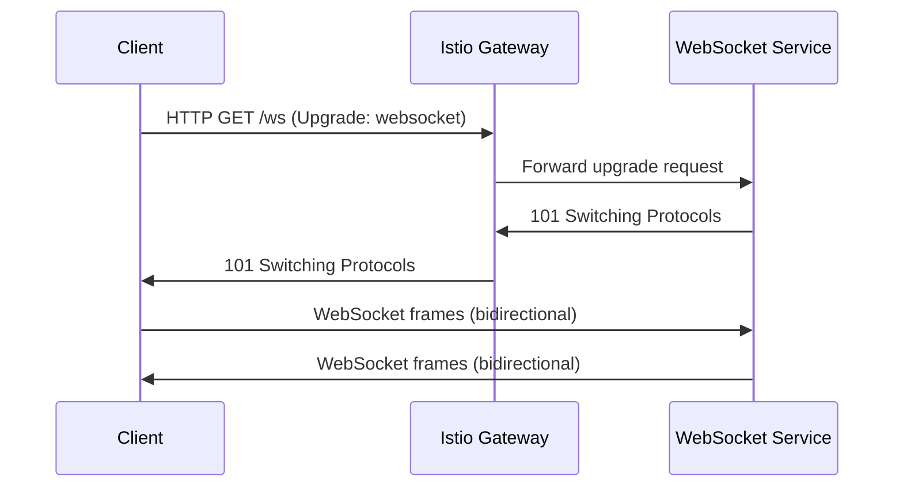

# How to Set Up Istio Gateway for WebSocket Applications

Author: [nawazdhandala](https://github.com/nawazdhandala)

Tags: Istio, WebSocket, Gateway, Kubernetes, Real-Time

Description: How to configure an Istio Gateway to properly handle WebSocket connections for real-time applications like chat and live dashboards.

---

WebSocket connections are fundamentally different from regular HTTP requests. They start as an HTTP request, upgrade to a persistent bidirectional connection, and can stay open for hours. Istio supports WebSockets out of the box, but you need to be aware of a few configuration details around timeouts, load balancing, and connection handling to make sure your WebSocket applications work reliably through an Istio Gateway.

## How WebSocket Works with Istio

A WebSocket connection starts with an HTTP upgrade request. The client sends a regular HTTP request with an `Upgrade: websocket` header, and the server responds with a 101 status code to switch protocols. After the upgrade, the connection becomes a persistent, full-duplex TCP connection.



Envoy (the proxy behind Istio's Gateway) handles the HTTP upgrade transparently. You do not need any special WebSocket-specific configuration in most cases.

## Basic WebSocket Gateway Configuration

The gateway configuration for WebSocket is the same as for regular HTTP:

```yaml
apiVersion: networking.istio.io/v1
kind: Gateway
metadata:
  name: ws-gateway
spec:
  selector:
    istio: ingressgateway
  servers:
  - port:
      number: 80
      name: http
      protocol: HTTP
    hosts:
    - "ws.example.com"
```

And the VirtualService:

```yaml
apiVersion: networking.istio.io/v1
kind: VirtualService
metadata:
  name: ws-vs
spec:
  hosts:
  - "ws.example.com"
  gateways:
  - ws-gateway
  http:
  - match:
    - uri:
        prefix: /ws
    route:
    - destination:
        host: websocket-service
        port:
          number: 8080
  - route:
    - destination:
        host: web-frontend
        port:
          number: 3000
```

This routes WebSocket connections (which start as HTTP requests to `/ws`) to the websocket-service and regular HTTP traffic to the web-frontend.

## Handling Timeouts

This is the most important configuration for WebSockets. By default, Istio sets an idle timeout on connections. If no data is sent for a while, the connection gets closed. For WebSocket applications, you typically want to disable or increase this timeout:

```yaml
apiVersion: networking.istio.io/v1
kind: VirtualService
metadata:
  name: ws-vs
spec:
  hosts:
  - "ws.example.com"
  gateways:
  - ws-gateway
  http:
  - match:
    - uri:
        prefix: /ws
    route:
    - destination:
        host: websocket-service
        port:
          number: 8080
    timeout: 0s
```

Setting `timeout: 0s` disables the request timeout entirely. This is necessary for WebSocket connections that may stay open indefinitely.

For the idle timeout (closing connections with no activity), you can configure it with a DestinationRule or through EnvoyFilter if the default is not sufficient.

## WebSocket with TLS (WSS)

Production WebSocket applications should use secure WebSocket (wss://). The gateway handles TLS termination:

```yaml
apiVersion: networking.istio.io/v1
kind: Gateway
metadata:
  name: wss-gateway
spec:
  selector:
    istio: ingressgateway
  servers:
  - port:
      number: 443
      name: https
      protocol: HTTPS
    hosts:
    - "ws.example.com"
    tls:
      mode: SIMPLE
      credentialName: ws-tls-credential
  - port:
      number: 80
      name: http
      protocol: HTTP
    hosts:
    - "ws.example.com"
    tls:
      httpsRedirect: true
```

The VirtualService stays the same. TLS termination happens at the gateway level, so the WebSocket upgrade and frames flow over the decrypted connection internally.

## Connection Draining

When you update your WebSocket service, existing connections should be drained gracefully. Configure a DestinationRule with connection pool settings:

```yaml
apiVersion: networking.istio.io/v1
kind: DestinationRule
metadata:
  name: ws-destination
spec:
  host: websocket-service
  trafficPolicy:
    connectionPool:
      tcp:
        maxConnections: 1000
      http:
        h2UpgradePolicy: UPGRADE
```

The `h2UpgradePolicy: UPGRADE` tells Envoy to allow HTTP/1.1 to HTTP/2 upgrades, which is relevant for WebSocket connections.

## Load Balancing for WebSocket

WebSocket connections are long-lived, so load balancing works differently than for regular HTTP. With regular HTTP, each request can be routed to a different backend. With WebSocket, once a connection is established, it stays with the same backend pod.

For sticky sessions (important if your WebSocket application stores per-connection state):

```yaml
apiVersion: networking.istio.io/v1
kind: DestinationRule
metadata:
  name: ws-destination
spec:
  host: websocket-service
  trafficPolicy:
    loadBalancer:
      consistentHash:
        httpHeaderName: x-session-id
```

This uses a consistent hash based on a custom header to route connections from the same client to the same backend pod.

## Mixed HTTP and WebSocket Traffic

Many applications serve both HTTP and WebSocket on the same hostname. Route them based on path:

```yaml
apiVersion: networking.istio.io/v1
kind: VirtualService
metadata:
  name: mixed-vs
spec:
  hosts:
  - "app.example.com"
  gateways:
  - app-gateway
  http:
  - match:
    - uri:
        prefix: /ws
    route:
    - destination:
        host: websocket-service
        port:
          number: 8080
    timeout: 0s
  - match:
    - uri:
        prefix: /api
    route:
    - destination:
        host: api-service
        port:
          number: 8080
    timeout: 30s
  - route:
    - destination:
        host: web-frontend
        port:
          number: 3000
```

Note the different timeouts: WebSocket routes have `0s` (infinite) while regular HTTP routes have a normal timeout.

## Deploying a Sample WebSocket Application

Here is a simple WebSocket echo server to test with:

```yaml
apiVersion: apps/v1
kind: Deployment
metadata:
  name: websocket-service
spec:
  replicas: 2
  selector:
    matchLabels:
      app: websocket-service
  template:
    metadata:
      labels:
        app: websocket-service
    spec:
      containers:
      - name: ws-echo
        image: jmalloc/echo-server
        ports:
        - containerPort: 8080
---
apiVersion: v1
kind: Service
metadata:
  name: websocket-service
spec:
  ports:
  - name: http
    port: 8080
    targetPort: 8080
  selector:
    app: websocket-service
```

## Testing WebSocket Connections

Use websocat or wscat to test:

```bash
export GATEWAY_IP=$(kubectl -n istio-system get service istio-ingressgateway \
  -o jsonpath='{.status.loadBalancer.ingress[0].ip}')

# Using wscat
wscat -c "ws://$GATEWAY_IP/ws" -H "Host: ws.example.com"

# Using websocat
websocat "ws://$GATEWAY_IP/ws" -H "Host: ws.example.com"

# Using curl to test the upgrade
curl -v -N \
  -H "Host: ws.example.com" \
  -H "Upgrade: websocket" \
  -H "Connection: Upgrade" \
  -H "Sec-WebSocket-Key: dGhlIHNhbXBsZSBub25jZQ==" \
  -H "Sec-WebSocket-Version: 13" \
  http://$GATEWAY_IP/ws
```

## Scaling Considerations

WebSocket connections consume resources differently than HTTP requests:

- Each open connection holds memory and file descriptors on both the gateway and backend pods
- Connection count grows over time rather than following a request/response pattern
- Pod scaling does not redistribute existing connections

Monitor these metrics:

```bash
# Check active connections on the gateway
istioctl proxy-config cluster deploy/istio-ingressgateway -n istio-system -o json | grep -A 5 websocket-service
```

If you see connection imbalance after scaling, new connections will naturally go to pods with fewer connections if you use the LEAST_CONN load balancing policy:

```yaml
apiVersion: networking.istio.io/v1
kind: DestinationRule
metadata:
  name: ws-lb
spec:
  host: websocket-service
  trafficPolicy:
    loadBalancer:
      simple: LEAST_CONN
```

## Troubleshooting WebSocket Issues

**Connection drops after 15 seconds**

The default Istio/Envoy idle timeout might be too low. Set `timeout: 0s` on the VirtualService route.

**Upgrade rejected (426 or other errors)**

Check that the port on the backend Service is named with an `http` prefix, not `tcp`. TCP ports do not support HTTP upgrades.

**Intermittent disconnects**

Check for infrastructure-level timeouts. Cloud load balancers often have their own idle timeouts (for example, AWS ELB defaults to 60 seconds). Increase the load balancer timeout or implement application-level ping/pong keep-alives.

WebSocket through Istio Gateway works well with minimal configuration. The main thing to remember is setting appropriate timeouts for long-lived connections. Everything else - TLS, routing, load balancing - follows the same patterns as regular HTTP traffic.
