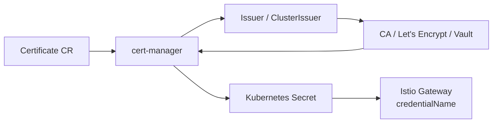

# How to Set Up Istio Gateway with cert-manager

Author: [nawazdhandala](https://github.com/nawazdhandala)

Tags: Istio, Cert-Manager, TLS, Gateway, Kubernetes, Automation

Description: Complete guide to integrating cert-manager with Istio Gateway for automated TLS certificate provisioning and renewal.

---

Managing TLS certificates by hand is a recipe for outages. Certificates expire, somebody forgets to renew them, and your users see scary browser warnings. cert-manager solves this by automating the entire certificate lifecycle in Kubernetes. Pairing it with Istio Gateway means your gateways always have valid certificates without any manual intervention.

## How cert-manager Works with Istio

cert-manager runs as a controller in your cluster. It watches for Certificate resources, obtains certificates from a configured issuer (like Let's Encrypt or an internal CA), stores them as Kubernetes secrets, and renews them before expiration.



The Istio Gateway references the secret by name via `credentialName`, and Istio's SDS (Secret Discovery Service) picks up changes automatically.

## Installing cert-manager

Install cert-manager using the official manifests:

```bash
kubectl apply -f https://github.com/cert-manager/cert-manager/releases/download/v1.14.4/cert-manager.yaml
```

Or with Helm:

```bash
helm repo add jetstack https://charts.jetstack.io
helm repo update
helm install cert-manager jetstack/cert-manager \
  --namespace cert-manager \
  --create-namespace \
  --set crds.enabled=true
```

Verify the installation:

```bash
kubectl get pods -n cert-manager
```

All three pods should be running: `cert-manager`, `cert-manager-cainjector`, and `cert-manager-webhook`.

## Setting Up an Issuer

### Self-Signed Issuer (for testing)

```yaml
apiVersion: cert-manager.io/v1
kind: ClusterIssuer
metadata:
  name: selfsigned-issuer
spec:
  selfSigned: {}
```

### Let's Encrypt with HTTP-01

```yaml
apiVersion: cert-manager.io/v1
kind: ClusterIssuer
metadata:
  name: letsencrypt-prod
spec:
  acme:
    server: https://acme-v02.api.letsencrypt.org/directory
    email: admin@example.com
    privateKeySecretRef:
      name: letsencrypt-prod-key
    solvers:
    - http01:
        ingress:
          class: istio
```

### Let's Encrypt with DNS-01 (for wildcards)

```yaml
apiVersion: cert-manager.io/v1
kind: ClusterIssuer
metadata:
  name: letsencrypt-dns
spec:
  acme:
    server: https://acme-v02.api.letsencrypt.org/directory
    email: admin@example.com
    privateKeySecretRef:
      name: letsencrypt-dns-key
    solvers:
    - dns01:
        cloudflare:
          apiTokenSecretRef:
            name: cloudflare-api-token
            key: api-token
```

### Internal CA Issuer

```yaml
apiVersion: cert-manager.io/v1
kind: ClusterIssuer
metadata:
  name: internal-ca
spec:
  ca:
    secretName: internal-ca-key-pair
```

Apply whichever issuer fits your needs:

```bash
kubectl apply -f issuer.yaml
```

## Creating a Certificate

The Certificate resource tells cert-manager what certificate you need:

```yaml
apiVersion: cert-manager.io/v1
kind: Certificate
metadata:
  name: app-tls
  namespace: istio-system
spec:
  secretName: app-tls-credential
  duration: 2160h    # 90 days
  renewBefore: 720h  # Renew 30 days before expiry
  issuerRef:
    name: letsencrypt-prod
    kind: ClusterIssuer
  dnsNames:
  - "app.example.com"
  - "www.example.com"
```

Key points:
- The Certificate must be in the `istio-system` namespace so the secret ends up there
- `secretName` is what you reference in the Gateway `credentialName`
- `duration` and `renewBefore` control the certificate lifetime and renewal timing
- `dnsNames` lists all domains the certificate covers

Apply it:

```bash
kubectl apply -f certificate.yaml
```

## Monitoring Certificate Status

```bash
# Check certificate status
kubectl get certificate app-tls -n istio-system

# Detailed status
kubectl describe certificate app-tls -n istio-system

# Check the order (ACME flow)
kubectl get order -n istio-system

# Check the challenge (validation step)
kubectl get challenge -n istio-system
```

The certificate goes through these states: Issuing -> Challenge -> Valid. Once READY shows True, the secret is created and ready to use.

## Configuring the Istio Gateway

Reference the cert-manager-created secret in your Gateway:

```yaml
apiVersion: networking.istio.io/v1
kind: Gateway
metadata:
  name: app-gateway
spec:
  selector:
    istio: ingressgateway
  servers:
  - port:
      number: 443
      name: https
      protocol: HTTPS
    hosts:
    - "app.example.com"
    - "www.example.com"
    tls:
      mode: SIMPLE
      credentialName: app-tls-credential
  - port:
      number: 80
      name: http
      protocol: HTTP
    hosts:
    - "app.example.com"
    - "www.example.com"
    tls:
      httpsRedirect: true
```

## Multiple Certificates

For different domains, create separate Certificate resources:

```yaml
apiVersion: cert-manager.io/v1
kind: Certificate
metadata:
  name: api-tls
  namespace: istio-system
spec:
  secretName: api-tls-credential
  issuerRef:
    name: letsencrypt-prod
    kind: ClusterIssuer
  dnsNames:
  - "api.example.com"
---
apiVersion: cert-manager.io/v1
kind: Certificate
metadata:
  name: admin-tls
  namespace: istio-system
spec:
  secretName: admin-tls-credential
  issuerRef:
    name: letsencrypt-prod
    kind: ClusterIssuer
  dnsNames:
  - "admin.example.com"
```

Each gets its own Gateway server entry:

```yaml
apiVersion: networking.istio.io/v1
kind: Gateway
metadata:
  name: multi-cert-gateway
spec:
  selector:
    istio: ingressgateway
  servers:
  - port:
      number: 443
      name: https-api
      protocol: HTTPS
    hosts:
    - "api.example.com"
    tls:
      mode: SIMPLE
      credentialName: api-tls-credential
  - port:
      number: 443
      name: https-admin
      protocol: HTTPS
    hosts:
    - "admin.example.com"
    tls:
      mode: SIMPLE
      credentialName: admin-tls-credential
```

## Wildcard Certificate

For wildcard certs, you must use DNS-01 validation:

```yaml
apiVersion: cert-manager.io/v1
kind: Certificate
metadata:
  name: wildcard-tls
  namespace: istio-system
spec:
  secretName: wildcard-tls-credential
  issuerRef:
    name: letsencrypt-dns
    kind: ClusterIssuer
  dnsNames:
  - "*.example.com"
  - "example.com"
```

## Certificate Renewal

cert-manager handles renewal automatically. It checks certificates periodically and renews them when the `renewBefore` threshold is reached.

When renewal happens:
1. cert-manager gets a new certificate from the issuer
2. The Kubernetes secret is updated with the new certificate
3. Istio's SDS detects the secret change
4. The ingress gateway hot-reloads the new certificate
5. No downtime, no manual intervention

Monitor upcoming renewals:

```bash
kubectl get certificate -n istio-system -o custom-columns='NAME:.metadata.name,READY:.status.conditions[0].status,EXPIRY:.status.notAfter,RENEWAL:.status.renewalTime'
```

## Troubleshooting cert-manager with Istio

**Certificate stuck in "Issuing" state**

Check the challenge:

```bash
kubectl describe challenge -n istio-system
```

Common cause: HTTP-01 challenge cannot reach the temporary validation endpoint. Make sure the Istio gateway allows port 80 traffic for the ACME challenge.

**Secret created but gateway not using it**

Verify the secret is in `istio-system`:

```bash
kubectl get secret app-tls-credential -n istio-system -o yaml
```

Check the secret has the right keys (`tls.crt` and `tls.key`).

**cert-manager logs**

```bash
kubectl logs -n cert-manager deploy/cert-manager --tail=100
```

**Force certificate re-issuance**

```bash
kubectl delete secret app-tls-credential -n istio-system
# cert-manager will detect the missing secret and re-issue
```

Or update the Certificate resource to trigger a new issuance:

```bash
kubectl annotate certificate app-tls -n istio-system cert-manager.io/renew="true"
```

Using cert-manager with Istio Gateway is the production-standard approach for TLS management. It eliminates certificate-related outages and gives you a consistent, declarative way to manage certificates across your entire cluster. Set it up once and you can stop worrying about certificate expiration for good.
