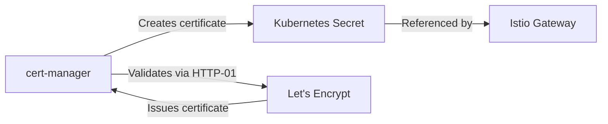

# How to Set Up Istio Gateway with Let's Encrypt Certificates

Author: [nawazdhandala](https://github.com/nawazdhandala)

Tags: Istio, Let's Encrypt, TLS, Cert-Manager, Gateway, Kubernetes

Description: How to automate TLS certificate provisioning for Istio Gateway using Let's Encrypt and cert-manager in Kubernetes.

---

Managing TLS certificates manually is tedious and error-prone. Certificates expire, you forget to renew them, and suddenly your production site is down with a certificate error. Let's Encrypt provides free, automated certificates, and when combined with cert-manager in Kubernetes, you get fully automated certificate lifecycle management for your Istio Gateway.

## Architecture Overview

The setup involves three components working together:



1. cert-manager requests a certificate from Let's Encrypt
2. Let's Encrypt validates you own the domain (via HTTP-01 or DNS-01 challenge)
3. cert-manager stores the certificate in a Kubernetes secret
4. The Istio Gateway references that secret for TLS

## Installing cert-manager

If you do not have cert-manager installed yet:

```bash
kubectl apply -f https://github.com/cert-manager/cert-manager/releases/download/v1.14.4/cert-manager.yaml
```

Wait for all cert-manager pods to be ready:

```bash
kubectl get pods -n cert-manager
```

You should see three pods running: `cert-manager`, `cert-manager-cainjector`, and `cert-manager-webhook`.

## Creating a ClusterIssuer

A ClusterIssuer tells cert-manager how to obtain certificates. For Let's Encrypt with HTTP-01 validation:

```yaml
apiVersion: cert-manager.io/v1
kind: ClusterIssuer
metadata:
  name: letsencrypt-prod
spec:
  acme:
    server: https://acme-v02.api.letsencrypt.org/directory
    email: your-email@example.com
    privateKeySecretRef:
      name: letsencrypt-prod-account-key
    solvers:
    - http01:
        ingress:
          class: istio
```

For testing, use the Let's Encrypt staging server first to avoid rate limits:

```yaml
apiVersion: cert-manager.io/v1
kind: ClusterIssuer
metadata:
  name: letsencrypt-staging
spec:
  acme:
    server: https://acme-staging-v02.api.letsencrypt.org/directory
    email: your-email@example.com
    privateKeySecretRef:
      name: letsencrypt-staging-account-key
    solvers:
    - http01:
        ingress:
          class: istio
```

Apply the issuer:

```bash
kubectl apply -f cluster-issuer.yaml
```

## HTTP-01 Challenge with Istio

The HTTP-01 challenge requires Let's Encrypt to reach a specific URL on your domain to verify ownership. With Istio, you need a Gateway that allows this challenge traffic through on port 80.

Create a Gateway for the ACME challenge:

```yaml
apiVersion: networking.istio.io/v1
kind: Gateway
metadata:
  name: acme-gateway
  namespace: istio-system
spec:
  selector:
    istio: ingressgateway
  servers:
  - port:
      number: 80
      name: http
      protocol: HTTP
    hosts:
    - "*.example.com"
```

cert-manager creates temporary pods and services for the HTTP-01 challenge. The Istio ingress gateway needs to be able to reach these.

## Creating a Certificate Resource

Now request a certificate for your domain:

```yaml
apiVersion: cert-manager.io/v1
kind: Certificate
metadata:
  name: app-certificate
  namespace: istio-system
spec:
  secretName: app-tls-credential
  issuerRef:
    name: letsencrypt-prod
    kind: ClusterIssuer
  dnsNames:
  - "app.example.com"
```

Important: The certificate and the resulting secret must be in the `istio-system` namespace because that is where the Istio ingress gateway looks for TLS secrets.

Apply the certificate:

```bash
kubectl apply -f certificate.yaml
```

## Monitoring Certificate Issuance

Check the certificate status:

```bash
kubectl get certificate app-certificate -n istio-system
```

If it is not ready, check the related CertificateRequest and Challenge resources:

```bash
kubectl get certificaterequest -n istio-system
kubectl get challenge -n istio-system
kubectl get order -n istio-system
```

For detailed troubleshooting:

```bash
kubectl describe certificate app-certificate -n istio-system
```

The certificate issuance usually takes 30 seconds to a couple of minutes. Once the READY column shows True, the secret has been created.

## Configuring the Istio Gateway

Now configure your Istio Gateway to use the certificate:

```yaml
apiVersion: networking.istio.io/v1
kind: Gateway
metadata:
  name: app-gateway
spec:
  selector:
    istio: ingressgateway
  servers:
  - port:
      number: 443
      name: https
      protocol: HTTPS
    hosts:
    - "app.example.com"
    tls:
      mode: SIMPLE
      credentialName: app-tls-credential
  - port:
      number: 80
      name: http
      protocol: HTTP
    hosts:
    - "app.example.com"
    tls:
      httpsRedirect: true
```

The `credentialName: app-tls-credential` matches the `secretName` in the Certificate resource.

## Creating the VirtualService

```yaml
apiVersion: networking.istio.io/v1
kind: VirtualService
metadata:
  name: app-vs
spec:
  hosts:
  - "app.example.com"
  gateways:
  - app-gateway
  http:
  - route:
    - destination:
        host: app-service
        port:
          number: 8080
```

## DNS-01 Challenge for Wildcard Certificates

If you need a wildcard certificate, you must use DNS-01 validation because Let's Encrypt does not support HTTP-01 for wildcards. Here is an example using Cloudflare DNS:

```yaml
apiVersion: cert-manager.io/v1
kind: ClusterIssuer
metadata:
  name: letsencrypt-dns
spec:
  acme:
    server: https://acme-v02.api.letsencrypt.org/directory
    email: your-email@example.com
    privateKeySecretRef:
      name: letsencrypt-dns-account-key
    solvers:
    - dns01:
        cloudflare:
          apiTokenSecretRef:
            name: cloudflare-api-token
            key: api-token
```

Create the Cloudflare API token secret:

```bash
kubectl create secret generic cloudflare-api-token \
  --from-literal=api-token=YOUR_CLOUDFLARE_API_TOKEN \
  -n cert-manager
```

Then request a wildcard certificate:

```yaml
apiVersion: cert-manager.io/v1
kind: Certificate
metadata:
  name: wildcard-certificate
  namespace: istio-system
spec:
  secretName: wildcard-tls-credential
  issuerRef:
    name: letsencrypt-dns
    kind: ClusterIssuer
  dnsNames:
  - "*.example.com"
  - "example.com"
```

## Automatic Certificate Renewal

cert-manager automatically renews certificates before they expire. By default, it starts the renewal process 30 days before expiration. Let's Encrypt certificates are valid for 90 days, so renewal happens around the 60-day mark.

You can check when a certificate will be renewed:

```bash
kubectl get certificate app-certificate -n istio-system -o jsonpath='{.status.renewalTime}'
```

When the certificate renews, cert-manager updates the Kubernetes secret. Istio detects the change and hot-reloads the new certificate automatically, with no downtime.

## Troubleshooting

**Challenge stuck in pending state**

Make sure your domain DNS points to the Istio ingress gateway external IP:

```bash
dig app.example.com
kubectl get svc istio-ingressgateway -n istio-system
```

**cert-manager cannot reach Let's Encrypt**

Check if there is a NetworkPolicy blocking egress from the cert-manager namespace.

**Secret not found by Istio**

Verify the secret is in `istio-system`:

```bash
kubectl get secret app-tls-credential -n istio-system
```

**Certificate keeps failing**

Check cert-manager logs:

```bash
kubectl logs -n cert-manager deploy/cert-manager
```

The combination of Let's Encrypt and cert-manager gives you production-grade TLS for your Istio Gateway with zero manual certificate management. Once set up, certificates are issued, renewed, and rotated automatically, which removes one of the most common causes of production incidents.
