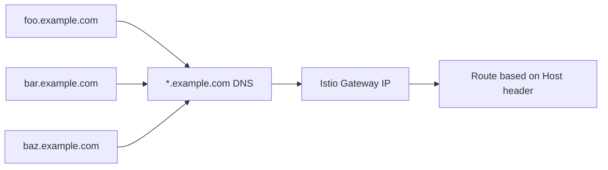

# How to Set Up Istio Gateway with Wildcard DNS

Author: [nawazdhandala](https://github.com/nawazdhandala)

Tags: Istio, Wildcard DNS, Gateway, Kubernetes, Networking

Description: How to configure an Istio Gateway with wildcard DNS to dynamically handle traffic for any subdomain without updating the gateway config.

---

Wildcard DNS with Istio Gateway is a powerful pattern that lets you add new services and subdomains without touching the gateway configuration each time. Instead of defining every hostname explicitly, you set up a wildcard DNS record and a wildcard gateway, and then individual VirtualServices handle the routing for specific subdomains.

## How Wildcard DNS Works

A wildcard DNS record is a record like `*.example.com` that matches any subdomain. When a client requests `anything.example.com`, the DNS resolver returns the IP associated with the wildcard record.



## Setting Up Wildcard DNS

Point a wildcard DNS record to your Istio ingress gateway IP. First, get the external IP:

```bash
kubectl get svc istio-ingressgateway -n istio-system
```

Then create a DNS record with your DNS provider:

```
Type: A
Name: *.example.com
Value: <GATEWAY_EXTERNAL_IP>
```

If your gateway has a hostname instead of an IP (common with AWS ELB), use a CNAME record:

```
Type: CNAME
Name: *.example.com
Value: <GATEWAY_HOSTNAME>
```

## Configuring the Wildcard Gateway

Set the Gateway to accept traffic for any subdomain:

```yaml
apiVersion: networking.istio.io/v1
kind: Gateway
metadata:
  name: wildcard-gateway
spec:
  selector:
    istio: ingressgateway
  servers:
  - port:
      number: 80
      name: http
      protocol: HTTP
    hosts:
    - "*.example.com"
```

The `*.example.com` host tells the gateway to accept HTTP traffic for any subdomain of `example.com`.

## Adding HTTPS with a Wildcard Certificate

For HTTPS, you need a wildcard TLS certificate. You can get one from Let's Encrypt using DNS-01 validation:

```yaml
apiVersion: cert-manager.io/v1
kind: Certificate
metadata:
  name: wildcard-cert
  namespace: istio-system
spec:
  secretName: wildcard-tls-credential
  issuerRef:
    name: letsencrypt-prod
    kind: ClusterIssuer
  dnsNames:
  - "*.example.com"
  - "example.com"
```

Then configure the Gateway with HTTPS:

```yaml
apiVersion: networking.istio.io/v1
kind: Gateway
metadata:
  name: wildcard-gateway
spec:
  selector:
    istio: ingressgateway
  servers:
  - port:
      number: 443
      name: https
      protocol: HTTPS
    hosts:
    - "*.example.com"
    tls:
      mode: SIMPLE
      credentialName: wildcard-tls-credential
  - port:
      number: 80
      name: http
      protocol: HTTP
    hosts:
    - "*.example.com"
    tls:
      httpsRedirect: true
```

## Creating VirtualServices for Specific Subdomains

With the wildcard gateway in place, each service gets a VirtualService for its specific subdomain:

```yaml
apiVersion: networking.istio.io/v1
kind: VirtualService
metadata:
  name: api-vs
spec:
  hosts:
  - "api.example.com"
  gateways:
  - wildcard-gateway
  http:
  - route:
    - destination:
        host: api-service
        port:
          number: 8080
---
apiVersion: networking.istio.io/v1
kind: VirtualService
metadata:
  name: dashboard-vs
spec:
  hosts:
  - "dashboard.example.com"
  gateways:
  - wildcard-gateway
  http:
  - route:
    - destination:
        host: dashboard-service
        port:
          number: 3000
---
apiVersion: networking.istio.io/v1
kind: VirtualService
metadata:
  name: docs-vs
spec:
  hosts:
  - "docs.example.com"
  gateways:
  - wildcard-gateway
  http:
  - route:
    - destination:
        host: docs-service
        port:
          number: 8080
```

Adding a new service is now just a matter of creating a new VirtualService. No gateway changes needed.

## Default Catch-All Route

You might want a default response for subdomains that do not have a VirtualService. Create a catch-all VirtualService:

```yaml
apiVersion: networking.istio.io/v1
kind: VirtualService
metadata:
  name: default-vs
spec:
  hosts:
  - "*.example.com"
  gateways:
  - wildcard-gateway
  http:
  - route:
    - destination:
        host: default-landing-page
        port:
          number: 8080
```

Specific subdomain VirtualServices take precedence over the wildcard VirtualService, so `api.example.com` still goes to the API service while `random.example.com` hits the default landing page.

## Multi-Tenant Applications

Wildcard DNS is perfect for multi-tenant SaaS applications where each tenant gets their own subdomain:

```yaml
apiVersion: networking.istio.io/v1
kind: VirtualService
metadata:
  name: tenant-routing
spec:
  hosts:
  - "*.example.com"
  gateways:
  - wildcard-gateway
  http:
  - route:
    - destination:
        host: tenant-router-service
        port:
          number: 8080
```

The `tenant-router-service` reads the Host header to determine which tenant the request belongs to and handles the logic internally.

Alternatively, if each tenant has a separate deployment:

```yaml
# Generated per tenant
apiVersion: networking.istio.io/v1
kind: VirtualService
metadata:
  name: tenant-acme-vs
spec:
  hosts:
  - "acme.example.com"
  gateways:
  - wildcard-gateway
  http:
  - route:
    - destination:
        host: tenant-acme-app
        port:
          number: 8080
```

## Dynamic Subdomain Creation

For platforms that create subdomains dynamically (like preview environments for pull requests), the wildcard gateway makes this seamless. Your CI/CD pipeline just creates a Deployment, Service, and VirtualService:

```bash
# In your CI/CD pipeline for PR #123
export PR_NUMBER=123
export SUBDOMAIN="pr-${PR_NUMBER}"

# Deploy the app
kubectl apply -f deployment-pr-${PR_NUMBER}.yaml

# Create the VirtualService
cat <<EOF | kubectl apply -f -
apiVersion: networking.istio.io/v1
kind: VirtualService
metadata:
  name: preview-${SUBDOMAIN}
spec:
  hosts:
  - "${SUBDOMAIN}.example.com"
  gateways:
  - wildcard-gateway
  http:
  - route:
    - destination:
        host: preview-${SUBDOMAIN}
        port:
          number: 8080
EOF
```

The preview environment is immediately accessible at `pr-123.example.com` with no DNS or gateway changes.

## Wildcard with Specific Subdomain Override

You can combine wildcard and specific entries. Specific entries always take priority:

```yaml
apiVersion: networking.istio.io/v1
kind: Gateway
metadata:
  name: combined-gateway
spec:
  selector:
    istio: ingressgateway
  servers:
  - port:
      number: 443
      name: https-specific
      protocol: HTTPS
    hosts:
    - "api.example.com"
    tls:
      mode: SIMPLE
      credentialName: api-specific-tls
  - port:
      number: 443
      name: https-wildcard
      protocol: HTTPS
    hosts:
    - "*.example.com"
    tls:
      mode: SIMPLE
      credentialName: wildcard-tls-credential
```

The `api.example.com` entry uses a specific certificate while all other subdomains use the wildcard certificate.

## Testing Wildcard Setup

```bash
export GATEWAY_IP=$(kubectl -n istio-system get service istio-ingressgateway \
  -o jsonpath='{.status.loadBalancer.ingress[0].ip}')

# Test specific subdomain
curl -H "Host: api.example.com" http://$GATEWAY_IP/

# Test another subdomain
curl -H "Host: dashboard.example.com" http://$GATEWAY_IP/

# Test unknown subdomain (should hit catch-all)
curl -H "Host: unknown.example.com" http://$GATEWAY_IP/
```

## Limitations

Wildcard DNS records only match one level of subdomain. `*.example.com` matches `api.example.com` but does not match `v1.api.example.com`. If you need multiple levels, you would need additional wildcard records like `*.api.example.com`.

The same limitation applies to the Gateway host field - `*.example.com` in the Gateway only matches single-level subdomains.

Wildcard DNS with Istio Gateway is one of those patterns that saves you from constantly updating infrastructure configuration. Set it up once, and adding new services becomes purely an application-level concern. Your platform team manages the gateway and DNS, and application teams just create VirtualServices for their subdomains.
