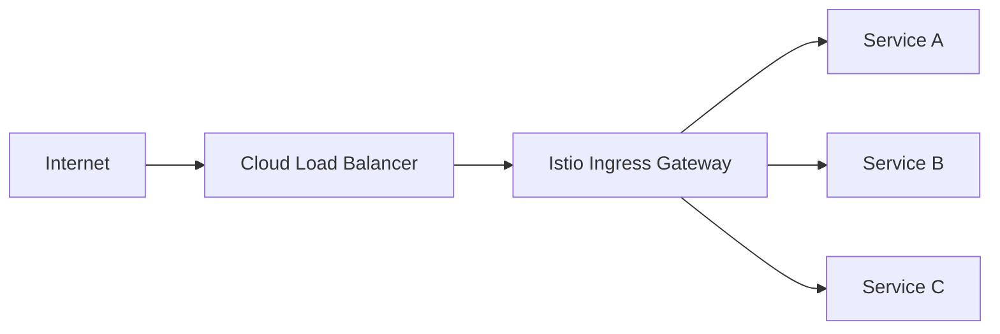

# How to Set Up Istio Ingress Gateway for External Traffic

Author: [nawazdhandala](https://github.com/nawazdhandala)

Tags: Istio, Ingress Gateway, Kubernetes, External Traffic, Service Mesh

Description: Set up the Istio Ingress Gateway to accept external traffic and route it to services inside your Kubernetes cluster with full mesh capabilities.

---

The Istio Ingress Gateway is the front door of your service mesh. It is the entry point where external traffic from the internet hits your cluster and gets routed to the appropriate internal services. Unlike a regular Kubernetes Ingress controller, the Istio Ingress Gateway gives you the full power of Istio's traffic management: request routing, load balancing, TLS termination, rate limiting, and observability, all at the edge.

If you are running Istio, you should be using the Ingress Gateway for external traffic. It is built on Envoy, so you get the same battle-tested proxy at the edge that runs as a sidecar inside your mesh.

## How the Ingress Gateway Fits In



The flow is: Internet -> Cloud Load Balancer -> Istio Ingress Gateway Pod -> Internal Services.

The cloud load balancer is created automatically when you deploy the Ingress Gateway as a `LoadBalancer` type Kubernetes Service.

## Verifying the Ingress Gateway is Running

If you installed Istio with the default profile, the ingress gateway is already deployed:

```bash
kubectl get pods -n istio-system -l istio=ingressgateway
```

You should see something like:

```
NAME                                    READY   STATUS    RESTARTS   AGE
istio-ingressgateway-7b6d5d8d4f-x2k4n  1/1     Running   0          5d
```

Check the service:

```bash
kubectl get svc -n istio-system istio-ingressgateway
```

The EXTERNAL-IP is the address where external traffic enters your mesh.

## Step 1: Create a Gateway Resource

The Gateway resource defines the ports and protocols the ingress gateway listens on.

```yaml
apiVersion: networking.istio.io/v1
kind: Gateway
metadata:
  name: my-gateway
  namespace: default
spec:
  selector:
    istio: ingressgateway
  servers:
    - port:
        number: 80
        name: http
        protocol: HTTP
      hosts:
        - "myapp.example.com"
        - "api.example.com"
```

The `selector` field tells Istio which gateway pods should apply this configuration. The default Istio installation labels the ingress gateway pods with `istio: ingressgateway`.

```bash
kubectl apply -f my-gateway.yaml
```

## Step 2: Create a VirtualService

The VirtualService routes traffic from the gateway to your services:

```yaml
apiVersion: networking.istio.io/v1
kind: VirtualService
metadata:
  name: myapp-routing
spec:
  hosts:
    - "myapp.example.com"
  gateways:
    - my-gateway
  http:
    - match:
        - uri:
            prefix: /api
      route:
        - destination:
            host: api-service
            port:
              number: 80
    - match:
        - uri:
            prefix: /
      route:
        - destination:
            host: frontend-service
            port:
              number: 80
```

```bash
kubectl apply -f myapp-virtualservice.yaml
```

Now requests to `myapp.example.com/api/*` go to `api-service` and everything else goes to `frontend-service`.

## Step 3: Point DNS to the Gateway

Get the external IP:

```bash
export INGRESS_IP=$(kubectl get svc -n istio-system istio-ingressgateway -o jsonpath='{.status.loadBalancer.ingress[0].ip}')
echo $INGRESS_IP
```

On AWS, you might get a hostname instead of an IP:

```bash
export INGRESS_HOST=$(kubectl get svc -n istio-system istio-ingressgateway -o jsonpath='{.status.loadBalancer.ingress[0].hostname}')
echo $INGRESS_HOST
```

Create a DNS A record (or CNAME for AWS) pointing `myapp.example.com` to this address.

## Testing the Setup

Before DNS propagates, test directly:

```bash
curl -H "Host: myapp.example.com" http://$INGRESS_IP/api/health
```

If you get a response from your api-service, the routing is working.

## Routing Multiple Domains

You can route multiple domains through the same gateway:

```yaml
apiVersion: networking.istio.io/v1
kind: Gateway
metadata:
  name: multi-domain-gateway
spec:
  selector:
    istio: ingressgateway
  servers:
    - port:
        number: 80
        name: http
        protocol: HTTP
      hosts:
        - "myapp.example.com"
        - "admin.example.com"
        - "docs.example.com"
```

Then create separate VirtualServices for each domain:

```yaml
apiVersion: networking.istio.io/v1
kind: VirtualService
metadata:
  name: admin-routing
spec:
  hosts:
    - "admin.example.com"
  gateways:
    - multi-domain-gateway
  http:
    - route:
        - destination:
            host: admin-service
            port:
              number: 80
---
apiVersion: networking.istio.io/v1
kind: VirtualService
metadata:
  name: docs-routing
spec:
  hosts:
    - "docs.example.com"
  gateways:
    - multi-domain-gateway
  http:
    - route:
        - destination:
            host: docs-service
            port:
              number: 80
```

## Header-Based Routing at the Ingress

You can route based on headers, which is useful for things like A/B testing:

```yaml
apiVersion: networking.istio.io/v1
kind: VirtualService
metadata:
  name: api-routing
spec:
  hosts:
    - "api.example.com"
  gateways:
    - my-gateway
  http:
    - match:
        - headers:
            x-api-version:
              exact: "v2"
      route:
        - destination:
            host: api-service-v2
            port:
              number: 80
    - route:
        - destination:
            host: api-service-v1
            port:
              number: 80
```

Requests with the `x-api-version: v2` header go to v2, everything else goes to v1.

## Scaling the Ingress Gateway

The default installation runs a single ingress gateway pod. For production, you want multiple replicas across zones:

```yaml
apiVersion: apps/v1
kind: Deployment
metadata:
  name: istio-ingressgateway
  namespace: istio-system
spec:
  replicas: 3
  template:
    spec:
      topologySpreadConstraints:
        - maxSkew: 1
          topologyKey: topology.kubernetes.io/zone
          whenUnsatisfiable: DoNotSchedule
          labelSelector:
            matchLabels:
              istio: ingressgateway
```

Or scale with HPA:

```yaml
apiVersion: autoscaling/v2
kind: HorizontalPodAutoscaler
metadata:
  name: istio-ingressgateway
  namespace: istio-system
spec:
  scaleTargetRef:
    apiVersion: apps/v1
    kind: Deployment
    name: istio-ingressgateway
  minReplicas: 3
  maxReplicas: 10
  metrics:
    - type: Resource
      resource:
        name: cpu
        target:
          type: Utilization
          averageUtilization: 60
```

## Monitoring Ingress Traffic

The ingress gateway generates Istio metrics just like any other sidecar:

```
# Request rate at the ingress
sum(rate(istio_requests_total{source_workload="istio-ingressgateway"}[5m]))

# Error rate
sum(rate(istio_requests_total{source_workload="istio-ingressgateway",response_code=~"5.*"}[5m]))

# Latency
histogram_quantile(0.99, sum(rate(istio_request_duration_milliseconds_bucket{source_workload="istio-ingressgateway"}[5m])) by (le))
```

## Troubleshooting

**No response from the gateway:**

```bash
# Check gateway config
istioctl analyze -n default

# Check if the gateway pod can see the config
istioctl proxy-config listener <gateway-pod-name> -n istio-system

# Check routes
istioctl proxy-config route <gateway-pod-name> -n istio-system
```

**404 Not Found:**

This usually means the VirtualService is not attached to the gateway. Check that the `gateways` field in the VirtualService matches the gateway name, and that the `hosts` field matches between the Gateway and VirtualService.

**503 Service Unavailable:**

The gateway can reach the VirtualService configuration but cannot connect to the backend. Check that the destination service exists and has healthy pods:

```bash
kubectl get svc api-service
kubectl get endpoints api-service
```

The Istio Ingress Gateway is the recommended way to expose services in an Istio mesh. It gives you all the traffic management and observability features of Istio right at the edge, with the same Envoy proxy you already know from your sidecars.
