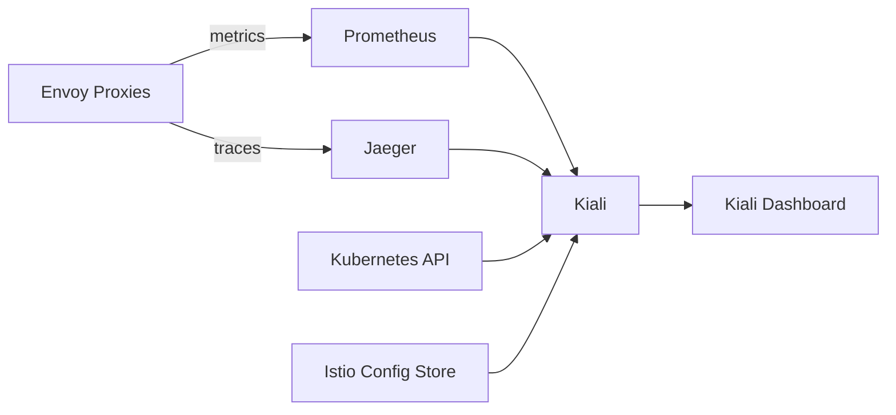

# How to Set Up Kiali for Istio Mesh Visualization

Author: [nawazdhandala](https://github.com/nawazdhandala)

Tags: Istio, Kiali, Service Mesh, Kubernetes, Observability

Description: Step-by-step guide to installing and configuring Kiali for visualizing your Istio service mesh topology and traffic patterns.

---

Running Istio without Kiali is like driving with your eyes closed. You have all this powerful traffic management and security built into your mesh, but you can't actually see what's happening. Kiali fixes that problem by giving you a real-time visual map of your entire service mesh.

Kiali is the default observability console for Istio. It reads data from Prometheus, Istio's configuration store, and the Kubernetes API to build interactive topology graphs, validate configurations, and surface health issues. If you're running Istio in production and haven't set up Kiali yet, this guide will walk you through the whole process.

## Prerequisites

Before you start, make sure you have:

- A running Kubernetes cluster (1.23+)
- Istio installed (1.16+)
- Prometheus collecting Istio metrics (usually installed with the Istio demo profile)
- kubectl configured to talk to your cluster
- Helm 3 installed

You can check your Istio installation with:

```bash
istioctl version
```

And verify Prometheus is running:

```bash
kubectl get pods -n istio-system -l app=prometheus
```

## Installing Kiali with Helm

The recommended way to install Kiali is through the Kiali Operator using Helm. First, add the Kiali Helm repository:

```bash
helm repo add kiali https://kiali.org/helm-charts
helm repo update
```

Install the Kiali Operator:

```bash
helm install \
  kiali-operator \
  kiali/kiali-operator \
  --namespace kiali-operator \
  --create-namespace \
  --set cr.create=true \
  --set cr.namespace=istio-system
```

This does two things: it installs the operator in the `kiali-operator` namespace, and it also creates a Kiali CR (Custom Resource) that tells the operator to deploy Kiali Server in the `istio-system` namespace.

Wait for the pods to come up:

```bash
kubectl get pods -n kiali-operator
kubectl get pods -n istio-system -l app.kubernetes.io/name=kiali
```

## Installing with istioctl (Quick Method)

If you just want to get Kiali running fast for development, you can install it as an Istio addon:

```bash
kubectl apply -f https://raw.githubusercontent.com/istio/istio/release-1.22/samples/addons/kiali.yaml
```

This approach works great for testing but shouldn't be used in production since it doesn't give you fine-grained control over configuration.

## Accessing the Kiali Dashboard

The simplest way to open Kiali is through istioctl:

```bash
istioctl dashboard kiali
```

This sets up a port-forward automatically and opens your browser. If you prefer doing it manually:

```bash
kubectl port-forward svc/kiali 20001:20001 -n istio-system
```

Then open http://localhost:20001 in your browser.

## Configuring Kiali with a Custom CR

For production setups, you want to customize Kiali's configuration. Create a Kiali CR that specifies exactly what you need:

```yaml
apiVersion: kiali.io/v1alpha1
kind: Kiali
metadata:
  name: kiali
  namespace: istio-system
spec:
  auth:
    strategy: anonymous
  deployment:
    accessible_namespaces:
      - "**"
    view_only_mode: false
  external_services:
    prometheus:
      url: "http://prometheus.istio-system:9090"
    grafana:
      enabled: true
      in_cluster_url: "http://grafana.istio-system:3000"
    tracing:
      enabled: true
      in_cluster_url: "http://tracing.istio-system:16685/jaeger"
      use_grpc: true
  server:
    web_root: "/kiali"
```

Apply it:

```bash
kubectl apply -f kiali-cr.yaml
```

The operator watches for changes to this CR and reconciles the Kiali deployment automatically.

## Understanding the Graph View

Once Kiali is up, navigate to the Graph section in the left sidebar. This is where the magic happens. You'll see a topology graph showing all your services, the connections between them, and real-time traffic flow.

The graph supports several display modes:

- **App graph** - Groups workloads by app label
- **Versioned app graph** - Shows different versions of the same app separately
- **Workload graph** - Shows individual workload pods
- **Service graph** - Shows Kubernetes services

You can toggle traffic animation, response time overlays, and error rate highlighting using the toolbar above the graph.

## Setting Up Namespace Access

By default, Kiali tries to access all namespaces. If you want to restrict which namespaces Kiali can see (common in multi-tenant clusters), adjust the CR:

```yaml
spec:
  deployment:
    accessible_namespaces:
      - "my-app-namespace"
      - "another-namespace"
```

For clusters where you want Kiali to discover namespaces dynamically based on Istio injection:

```yaml
spec:
  api:
    namespaces:
      label_selector_include: "istio-injection=enabled"
```

## Configuring Health Thresholds

Kiali uses traffic data to determine the health of your services. You can customize what counts as "degraded" or "failure" by adjusting health rate thresholds:

```yaml
spec:
  health_config:
    rate:
      - namespace: ".*"
        kind: ".*"
        name: ".*"
        tolerance:
          - code: "^5\\d\\d$"
            direction: ".*"
            protocol: "http"
            degraded: 1
            failure: 5
          - code: "^4\\d\\d$"
            direction: ".*"
            protocol: "http"
            degraded: 10
            failure: 20
```

This configuration marks a service as degraded when more than 1% of responses are 5xx errors, and as failed when it exceeds 5%.

## Verifying the Installation

Run through this checklist to make sure everything is working:

1. Check that the Kiali pod is running and ready:

```bash
kubectl get pods -n istio-system -l app.kubernetes.io/name=kiali
```

2. Verify Kiali can reach Prometheus:

```bash
kubectl logs -n istio-system -l app.kubernetes.io/name=kiali | grep -i prometheus
```

3. Generate some traffic to your mesh services so the graph has data to display:

```bash
for i in $(seq 1 100); do
  curl -s -o /dev/null http://your-service-url
done
```

4. Open Kiali and confirm you see traffic in the graph view.

## Architecture Overview

Here's how Kiali fits into the Istio ecosystem:



Kiali doesn't collect any data on its own. It queries Prometheus for traffic metrics, Jaeger for distributed traces, and the Kubernetes API for configuration data. This makes it lightweight and easy to maintain.

## Troubleshooting Common Issues

**Graph shows no data**: Make sure Prometheus is actually collecting Istio metrics. Check that your pods have the Istio sidecar injected and that traffic is flowing through the mesh.

**Kiali can't connect to Prometheus**: Verify the Prometheus URL in your Kiali CR matches the actual service name and port. The default is `http://prometheus.istio-system:9090`.

**Missing namespaces**: Check the `accessible_namespaces` setting in your CR. Also verify that the Kiali service account has the necessary RBAC permissions.

**Slow graph rendering**: If you have hundreds of services, the graph can get heavy. Try filtering by namespace or using the "Find/Hide" feature to reduce what's displayed.

## Next Steps

With Kiali running, you now have visibility into your mesh topology, traffic patterns, and configuration health. From here, you can explore Kiali's validation features to catch misconfigurations, use the traffic graph for debugging latency issues, and integrate Grafana dashboards for deeper metric analysis. Kiali is one of those tools that you won't want to live without once you start using it.
