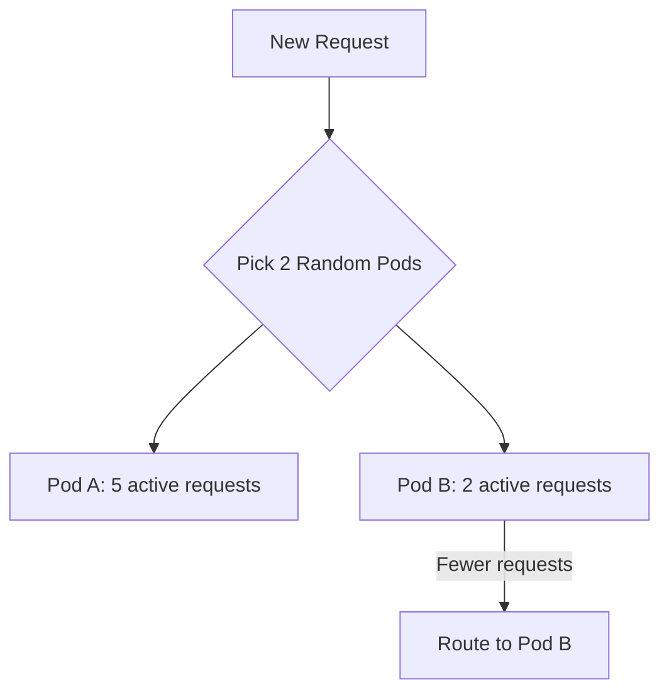

# How to Set Up Least Request Load Balancing in Istio

Author: [nawazdhandala](https://github.com/nawazdhandala)

Tags: Istio, Least Request, Load Balancing, DestinationRule, Kubernetes

Description: Configure least request load balancing in Istio DestinationRule to send traffic to the pod with the fewest active requests.

---

Least request load balancing is one of the smartest simple algorithms available in Istio. Instead of blindly cycling through pods (round robin) or picking randomly, it sends each new request to the backend pod that currently has the fewest active requests. This naturally adapts to pods with different processing speeds and handles variable request costs gracefully.

## Why Least Request Matters

Consider a service where some API endpoints are fast (5ms) and others are slow (500ms). With round robin, every pod gets the same number of requests. But a pod that gets 5 slow requests in a row is now loaded down while another pod that got 5 fast requests is sitting idle.

Least request fixes this. The pod handling slow requests will have more active (in-flight) requests, so new requests will get routed elsewhere. Traffic naturally flows to wherever there is capacity.

This algorithm shines for:

- Services with variable response times
- Heterogeneous pod resources (some pods have more CPU than others)
- Workloads where request processing cost varies significantly
- Services under inconsistent load patterns

## Configuration

The setup is one line in your DestinationRule:

```yaml
apiVersion: networking.istio.io/v1
kind: DestinationRule
metadata:
  name: api-service-lr
spec:
  host: api-service
  trafficPolicy:
    loadBalancer:
      simple: LEAST_REQUEST
```

Apply it:

```bash
kubectl apply -f api-service-lr.yaml
```

## How It Works Internally

Envoy does not actually check every single endpoint when making a routing decision. That would be expensive with hundreds of endpoints. Instead, it uses the "power of two choices" algorithm.

Here is how it works:

1. Envoy randomly picks 2 endpoints from the available pool
2. It compares their active request counts
3. It sends the request to whichever has fewer active requests

This approach gives you most of the benefit of true least-request with O(1) lookup time instead of O(n). Research shows that choosing the best of two random options is significantly better than pure random, and almost as good as checking every endpoint.



## Setting Up a Test Scenario

To see least request in action, create a service where some pods are artificially slower:

```yaml
apiVersion: apps/v1
kind: Deployment
metadata:
  name: slow-fast-service
spec:
  replicas: 4
  selector:
    matchLabels:
      app: slow-fast-service
  template:
    metadata:
      labels:
        app: slow-fast-service
    spec:
      containers:
      - name: app
        image: hashicorp/http-echo
        args:
        - -listen=:8080
        - -text=response
        ports:
        - containerPort: 8080
---
apiVersion: v1
kind: Service
metadata:
  name: slow-fast-service
spec:
  selector:
    app: slow-fast-service
  ports:
  - name: http
    port: 8080
    targetPort: 8080
```

```bash
kubectl apply -f slow-fast-service.yaml
```

Now apply the least request DestinationRule:

```bash
kubectl apply -f - <<EOF
apiVersion: networking.istio.io/v1
kind: DestinationRule
metadata:
  name: slow-fast-lr
spec:
  host: slow-fast-service
  trafficPolicy:
    loadBalancer:
      simple: LEAST_REQUEST
EOF
```

## Verifying the Configuration

Check that Envoy received the configuration:

```bash
istioctl proxy-config cluster <client-pod> --fqdn slow-fast-service.default.svc.cluster.local -o json
```

Look for:

```json
{
  "lbPolicy": "LEAST_REQUEST"
}
```

## Comparing Least Request to Round Robin

Here is a practical way to see the difference. If you have a service with variable response times and you are tracking latency, compare p99 latency under both algorithms.

First, apply round robin:

```yaml
apiVersion: networking.istio.io/v1
kind: DestinationRule
metadata:
  name: test-lb
spec:
  host: my-service
  trafficPolicy:
    loadBalancer:
      simple: ROUND_ROBIN
```

Run your load test and note the p50, p95, and p99 latencies.

Then switch to least request:

```yaml
apiVersion: networking.istio.io/v1
kind: DestinationRule
metadata:
  name: test-lb
spec:
  host: my-service
  trafficPolicy:
    loadBalancer:
      simple: LEAST_REQUEST
```

Run the same load test again. With variable request costs, you should see the p99 latency drop significantly because slow requests no longer pile up on individual pods.

## Least Request with Connection Limits

Least request pairs well with connection pool limits. You can prevent any single endpoint from getting overwhelmed:

```yaml
apiVersion: networking.istio.io/v1
kind: DestinationRule
metadata:
  name: api-protected
spec:
  host: api-service
  trafficPolicy:
    loadBalancer:
      simple: LEAST_REQUEST
    connectionPool:
      tcp:
        maxConnections: 100
      http:
        http1MaxPendingRequests: 50
        http2MaxRequests: 200
```

The least request algorithm tries to balance load across pods, and the connection pool limits act as a hard backstop if something goes wrong.

## Least Request with Outlier Detection

Adding outlier detection makes least request even better. If a pod starts failing, it gets removed from the pool entirely:

```yaml
apiVersion: networking.istio.io/v1
kind: DestinationRule
metadata:
  name: api-full-protection
spec:
  host: api-service
  trafficPolicy:
    loadBalancer:
      simple: LEAST_REQUEST
    outlierDetection:
      consecutive5xxErrors: 3
      interval: 5s
      baseEjectionTime: 30s
      maxEjectionPercent: 50
    connectionPool:
      tcp:
        maxConnections: 100
      http:
        http1MaxPendingRequests: 50
```

This is a robust configuration for production services. Least request distributes load intelligently, outlier detection removes failing pods, and connection pool limits prevent resource exhaustion.

## When Least Request Is Not Ideal

There are a few cases where least request might not be the best fit:

**Stateful services needing affinity**: If your service needs the same client to hit the same pod every time (like for in-memory sessions), least request will scatter requests across all pods. Use consistent hash instead.

**Very few pods with very even traffic**: With 2-3 pods handling identical requests, round robin is simpler and just as effective.

**Extremely high request rates**: The "power of two choices" approach adds a tiny bit of latency compared to round robin (two random selections plus a comparison). At extremely high request rates (hundreds of thousands per second per proxy), this might matter. For most workloads, it is negligible.

## Per-Subset Configuration

Apply least request to specific subsets:

```yaml
apiVersion: networking.istio.io/v1
kind: DestinationRule
metadata:
  name: api-subsets
spec:
  host: api-service
  subsets:
  - name: stable
    labels:
      version: stable
    trafficPolicy:
      loadBalancer:
        simple: ROUND_ROBIN
  - name: canary
    labels:
      version: canary
    trafficPolicy:
      loadBalancer:
        simple: LEAST_REQUEST
```

Using least request for the canary makes sense because canary pods might have different performance characteristics than stable pods.

## Cleanup

```bash
kubectl delete destinationrule api-service-lr
kubectl delete deployment slow-fast-service
kubectl delete service slow-fast-service
```

Least request is my go-to recommendation for any service where request costs vary. It is barely more complex than round robin to configure, but it handles real-world traffic patterns much better. If you are not sure which algorithm to pick, least request is a safe and smart default.
