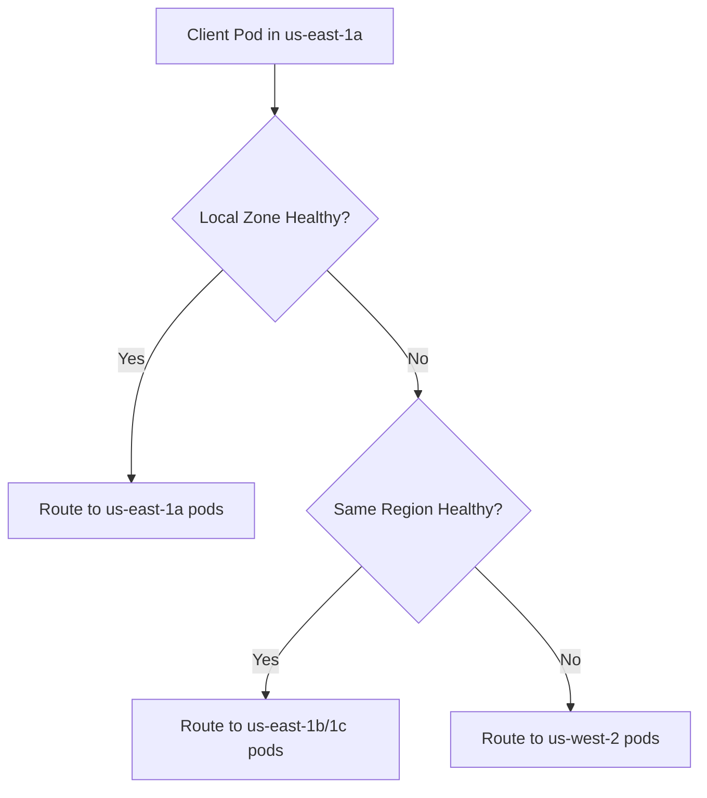

# How to Set Up Locality-Based Load Balancing with DestinationRule

Author: [nawazdhandala](https://github.com/nawazdhandala)

Tags: Istio, Locality Load Balancing, DestinationRule, Multi-Cluster, Kubernetes

Description: Configure locality-based load balancing in Istio to prefer local endpoints and define failover rules across regions and zones.

---

Locality-based load balancing in Istio routes traffic to the closest available service instances. If your service runs across multiple availability zones or regions, locality awareness ensures that requests prefer local endpoints, reducing latency and cross-zone network costs. When local endpoints are unhealthy, traffic automatically fails over to endpoints in other zones or regions.

Kubernetes nodes have built-in locality labels that Istio uses:
- `topology.kubernetes.io/region` (e.g., us-east-1)
- `topology.kubernetes.io/zone` (e.g., us-east-1a)
- `topology.kubernetes.io/subzone` (optional, often not set)

Istio reads these labels and groups endpoints by their locality for load balancing decisions.

## How Locality Load Balancing Works

By default, when Istio's locality load balancing is enabled, Envoy prefers endpoints in the same zone as the calling pod. If no healthy endpoints are available in the local zone, it fails over to other zones in the same region, and then to other regions.



## Prerequisites

Locality load balancing requires outlier detection to be configured. Without it, Envoy cannot determine which endpoints are healthy, and locality-aware routing will not work.

```yaml
apiVersion: networking.istio.io/v1
kind: DestinationRule
metadata:
  name: my-service-locality
spec:
  host: my-service
  trafficPolicy:
    outlierDetection:
      consecutive5xxErrors: 5
      interval: 10s
      baseEjectionTime: 30s
    connectionPool:
      tcp:
        maxConnections: 100
```

That is the minimum configuration. With outlier detection enabled, Istio automatically enables locality-aware load balancing using a prioritized failover approach.

## Verifying Node Locality Labels

First, check that your nodes have locality labels:

```bash
kubectl get nodes --show-labels | grep topology
```

You should see labels like:

```
topology.kubernetes.io/region=us-east-1
topology.kubernetes.io/zone=us-east-1a
```

If your nodes do not have these labels (common in bare-metal or some on-premise setups), locality load balancing will not work. You can manually add them:

```bash
kubectl label node node-1 topology.kubernetes.io/region=us-east-1
kubectl label node node-1 topology.kubernetes.io/zone=us-east-1a
```

## Configuring Locality Failover

For explicit control over failover behavior, use the `localityLbSetting` in your DestinationRule:

```yaml
apiVersion: networking.istio.io/v1
kind: DestinationRule
metadata:
  name: my-service-failover
spec:
  host: my-service
  trafficPolicy:
    outlierDetection:
      consecutive5xxErrors: 5
      interval: 10s
      baseEjectionTime: 30s
    loadBalancer:
      localityLbSetting:
        failover:
        - from: us-east-1
          to: us-west-2
        - from: us-west-2
          to: us-east-1
```

This defines explicit failover rules:
- If us-east-1 endpoints are unhealthy, fail over to us-west-2
- If us-west-2 endpoints are unhealthy, fail over to us-east-1

Without explicit failover rules, Istio uses a prioritized list based on proximity (same zone, then same region, then any region).

## Weighted Locality Distribution

Instead of strict failover, you can distribute traffic across localities with specific weights:

```yaml
apiVersion: networking.istio.io/v1
kind: DestinationRule
metadata:
  name: my-service-weighted-locality
spec:
  host: my-service
  trafficPolicy:
    outlierDetection:
      consecutive5xxErrors: 5
      interval: 10s
      baseEjectionTime: 30s
    loadBalancer:
      localityLbSetting:
        distribute:
        - from: "us-east-1/us-east-1a/*"
          to:
            "us-east-1/us-east-1a/*": 80
            "us-east-1/us-east-1b/*": 15
            "us-west-2/us-west-2a/*": 5
```

Traffic from pods in us-east-1a is distributed:
- 80% to endpoints in us-east-1a
- 15% to endpoints in us-east-1b (same region, different zone)
- 5% to endpoints in us-west-2a (different region)

The `from` and `to` fields use the format `region/zone/subzone`. The wildcard `*` matches any value.

## Why Not 100% Local?

You might wonder why you would send any traffic to a remote zone. There are a few reasons:

1. **Warm standby**: Keeping some traffic flowing to remote endpoints ensures they are warm and ready if you need to fail over. Cold endpoints might have empty caches or uninitialized connection pools.

2. **Load distribution**: If one zone has more client pods than server pods, sending all traffic locally would overload those local servers while remote servers sit idle.

3. **Canary testing**: You might want to slowly introduce traffic to a new region to verify it works before routing more.

## Full Production Example

Here is a complete setup for a multi-region service:

```yaml
apiVersion: networking.istio.io/v1
kind: DestinationRule
metadata:
  name: api-service-locality
spec:
  host: api-service
  trafficPolicy:
    loadBalancer:
      simple: LEAST_REQUEST
      localityLbSetting:
        enabled: true
        distribute:
        - from: "us-east-1/us-east-1a/*"
          to:
            "us-east-1/us-east-1a/*": 70
            "us-east-1/us-east-1b/*": 20
            "us-east-1/us-east-1c/*": 10
        - from: "us-east-1/us-east-1b/*"
          to:
            "us-east-1/us-east-1b/*": 70
            "us-east-1/us-east-1a/*": 20
            "us-east-1/us-east-1c/*": 10
        failover:
        - from: us-east-1
          to: us-west-2
    connectionPool:
      tcp:
        maxConnections: 200
        connectTimeout: 3s
    outlierDetection:
      consecutive5xxErrors: 5
      interval: 10s
      baseEjectionTime: 30s
      maxEjectionPercent: 50
```

This configuration:
- Distributes traffic with 70% local preference
- Spreads 30% across other zones in the same region
- Falls over to us-west-2 if all us-east-1 endpoints are unhealthy
- Uses least request for the actual load balancing within a locality
- Has connection limits and outlier detection for circuit breaking

## Verifying Locality Load Balancing

Check the endpoint localities known to Envoy:

```bash
istioctl proxy-config endpoint <pod-name> \
  --cluster "outbound|8080||api-service.default.svc.cluster.local"
```

The output shows each endpoint along with its locality:

```
ENDPOINT          STATUS    OUTLIER CHECK   CLUSTER     LOCALITY
10.0.1.5:8080     HEALTHY   OK             ...         us-east-1/us-east-1a
10.0.2.3:8080     HEALTHY   OK             ...         us-east-1/us-east-1b
10.0.3.7:8080     HEALTHY   OK             ...         us-west-2/us-west-2a
```

You can also check the priority assignment:

```bash
istioctl proxy-config cluster <pod-name> \
  --fqdn api-service.default.svc.cluster.local -o json
```

Look for the `loadAssignment.endpoints` section. Endpoints are grouped by locality and assigned priorities (0 being highest).

## Disabling Locality Load Balancing

If you want to distribute traffic evenly across all zones without locality preference:

```yaml
apiVersion: networking.istio.io/v1
kind: DestinationRule
metadata:
  name: api-service-no-locality
spec:
  host: api-service
  trafficPolicy:
    loadBalancer:
      localityLbSetting:
        enabled: false
      simple: ROUND_ROBIN
```

Setting `enabled: false` tells Envoy to ignore endpoint localities and treat all endpoints equally.

## Common Issues

**Locality load balancing not working**: The most common cause is missing outlier detection. Locality-aware routing requires outlier detection to function. Always include `outlierDetection` in your DestinationRule.

**All traffic going to one zone**: If one zone has significantly more client pods than others, most traffic originates from that zone and goes to local endpoints. This is expected behavior, but if the server pods are unevenly distributed, some pods might be overloaded. Use the `distribute` setting to spread traffic more evenly.

**Failover not triggering**: Failover only happens when endpoints are ejected by outlier detection. If outlier detection thresholds are too high, unhealthy endpoints might not get ejected quickly enough. Lower `consecutive5xxErrors` and `interval` for faster detection.

## Cleanup

```bash
kubectl delete destinationrule api-service-locality
```

Locality-based load balancing is a must-have for any multi-zone or multi-region Istio deployment. It reduces latency by preferring local endpoints, saves money by minimizing cross-zone traffic, and provides automatic failover when local endpoints are unhealthy. The key requirement is having outlier detection configured - without it, Istio cannot determine endpoint health and locality routing will not activate.
