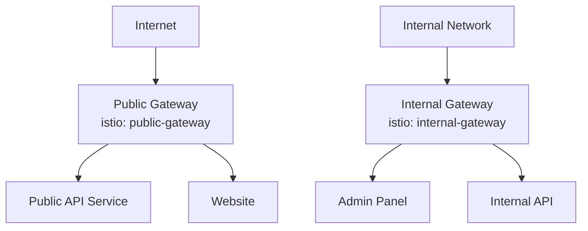

# How to Set Up Multiple Istio Ingress Gateways

Author: [nawazdhandala](https://github.com/nawazdhandala)

Tags: Istio, Multiple Gateways, Kubernetes, Networking, Architecture

Description: How to deploy and configure multiple Istio ingress gateways for different use cases like public/private traffic separation.

---

A single ingress gateway works for simple setups, but production environments often need multiple gateways. Maybe you need a public-facing gateway and a separate internal one. Or different gateways for different teams with independent scaling and configuration. Istio fully supports multiple ingress gateway deployments, and the key to making it work is proper label configuration and Gateway resource targeting.

## Why Multiple Gateways

Common reasons to deploy more than one ingress gateway:

- **Public vs internal traffic** - Public APIs on one gateway, internal tools on another
- **Team isolation** - Each team gets their own gateway they can configure independently
- **Security boundaries** - Different gateways with different TLS policies
- **Performance isolation** - High-traffic services get a dedicated gateway so they do not affect others
- **Regulatory compliance** - Some traffic must flow through a gateway with specific audit logging



## Deploying a Second Ingress Gateway

Use IstioOperator to add another gateway:

```yaml
apiVersion: install.istio.io/v1alpha1
kind: IstioOperator
spec:
  components:
    ingressGateways:
    - name: istio-ingressgateway
      enabled: true
      label:
        istio: ingressgateway
    - name: internal-ingressgateway
      enabled: true
      namespace: istio-system
      label:
        istio: internal-gateway
        app: internal-gateway
      k8s:
        service:
          type: ClusterIP
          ports:
          - name: http2
            port: 80
            targetPort: 8080
          - name: https
            port: 443
            targetPort: 8443
          - name: status-port
            port: 15021
            targetPort: 15021
        resources:
          requests:
            cpu: 200m
            memory: 128Mi
          limits:
            cpu: 1000m
            memory: 512Mi
```

Apply it:

```bash
istioctl install -f multi-gateway.yaml
```

Verify both gateways are running:

```bash
kubectl get pods -n istio-system -l app=istio-ingressgateway
kubectl get pods -n istio-system -l app=internal-gateway
kubectl get svc -n istio-system | grep gateway
```

## Configuring Gateway Resources

Each Istio Gateway resource targets a specific gateway deployment through the selector:

```yaml
# Public gateway configuration
apiVersion: networking.istio.io/v1
kind: Gateway
metadata:
  name: public-gateway
spec:
  selector:
    istio: ingressgateway
  servers:
  - port:
      number: 443
      name: https
      protocol: HTTPS
    hosts:
    - "api.example.com"
    - "www.example.com"
    tls:
      mode: SIMPLE
      credentialName: public-tls-credential
  - port:
      number: 80
      name: http
      protocol: HTTP
    hosts:
    - "api.example.com"
    - "www.example.com"
    tls:
      httpsRedirect: true
---
# Internal gateway configuration
apiVersion: networking.istio.io/v1
kind: Gateway
metadata:
  name: internal-gateway
spec:
  selector:
    istio: internal-gateway
  servers:
  - port:
      number: 80
      name: http
      protocol: HTTP
    hosts:
    - "admin.internal.example.com"
    - "api.internal.example.com"
```

The `selector` is what ties each Gateway resource to the correct gateway deployment.

## VirtualServices for Each Gateway

VirtualServices reference the Gateway by name:

```yaml
apiVersion: networking.istio.io/v1
kind: VirtualService
metadata:
  name: public-api
spec:
  hosts:
  - "api.example.com"
  gateways:
  - public-gateway
  http:
  - route:
    - destination:
        host: api-service
        port:
          number: 8080
---
apiVersion: networking.istio.io/v1
kind: VirtualService
metadata:
  name: internal-admin
spec:
  hosts:
  - "admin.internal.example.com"
  gateways:
  - internal-gateway
  http:
  - route:
    - destination:
        host: admin-service
        port:
          number: 8080
```

## Different Service Types

The key difference between public and internal gateways is often the Kubernetes Service type:

| Use Case | Service Type | Access |
|---|---|---|
| Public internet | LoadBalancer | External IP/DNS |
| Internal VPC only | LoadBalancer + internal annotation | VPC-only IP |
| Cluster internal only | ClusterIP | Only from within cluster |
| Node access | NodePort | Via node IPs |

For an internal-only gateway on AWS:

```yaml
k8s:
  serviceAnnotations:
    service.beta.kubernetes.io/aws-load-balancer-scheme: "internal"
  service:
    type: LoadBalancer
```

For a cluster-internal gateway:

```yaml
k8s:
  service:
    type: ClusterIP
```

## Gateway in a Different Namespace

You can deploy gateways in namespaces other than `istio-system`:

```yaml
apiVersion: install.istio.io/v1alpha1
kind: IstioOperator
spec:
  components:
    ingressGateways:
    - name: team-a-gateway
      enabled: true
      namespace: team-a
      label:
        istio: team-a-gateway
      k8s:
        service:
          type: LoadBalancer
```

VirtualServices in any namespace can reference this gateway:

```yaml
apiVersion: networking.istio.io/v1
kind: VirtualService
metadata:
  name: team-a-app
  namespace: team-a
spec:
  hosts:
  - "team-a.example.com"
  gateways:
  - team-a/team-a-gw
  http:
  - route:
    - destination:
        host: team-a-app
        port:
          number: 8080
```

## Independent Scaling

Each gateway deployment can have its own HPA:

```yaml
apiVersion: autoscaling/v2
kind: HorizontalPodAutoscaler
metadata:
  name: public-gateway-hpa
  namespace: istio-system
spec:
  scaleTargetRef:
    apiVersion: apps/v1
    kind: Deployment
    name: istio-ingressgateway
  minReplicas: 3
  maxReplicas: 20
  metrics:
  - type: Resource
    resource:
      name: cpu
      target:
        type: Utilization
        averageUtilization: 60
---
apiVersion: autoscaling/v2
kind: HorizontalPodAutoscaler
metadata:
  name: internal-gateway-hpa
  namespace: istio-system
spec:
  scaleTargetRef:
    apiVersion: apps/v1
    kind: Deployment
    name: internal-ingressgateway
  minReplicas: 1
  maxReplicas: 5
  metrics:
  - type: Resource
    resource:
      name: cpu
      target:
        type: Utilization
        averageUtilization: 70
```

The public gateway scales more aggressively since it handles more traffic.

## Security Isolation

Different gateways can have different security policies. For example, the internal gateway might not need TLS if it is only accessible within the cluster:

```yaml
# Public: strict TLS
apiVersion: networking.istio.io/v1
kind: Gateway
metadata:
  name: public-gw
spec:
  selector:
    istio: ingressgateway
  servers:
  - port:
      number: 443
      name: https
      protocol: HTTPS
    hosts:
    - "*.example.com"
    tls:
      mode: SIMPLE
      credentialName: public-tls
      minProtocolVersion: TLSV1_2

# Internal: plain HTTP (cluster-internal only)
---
apiVersion: networking.istio.io/v1
kind: Gateway
metadata:
  name: internal-gw
spec:
  selector:
    istio: internal-gateway
  servers:
  - port:
      number: 80
      name: http
      protocol: HTTP
    hosts:
    - "*.internal.example.com"
```

## Verifying Multiple Gateways

```bash
# List all gateway deployments
kubectl get deploy -n istio-system | grep gateway

# Check labels on each
kubectl get pods -n istio-system --show-labels | grep gateway

# Verify proxy config on each gateway
istioctl proxy-config listener deploy/istio-ingressgateway -n istio-system
istioctl proxy-config listener deploy/internal-ingressgateway -n istio-system

# Make sure routes are on the correct gateway
istioctl proxy-config routes deploy/istio-ingressgateway -n istio-system
istioctl proxy-config routes deploy/internal-ingressgateway -n istio-system
```

## Troubleshooting Multiple Gateways

**VirtualService not working on the intended gateway**

Check the Gateway selector matches the right deployment labels:

```bash
kubectl get gateway public-gateway -o jsonpath='{.spec.selector}'
kubectl get pods -n istio-system -l istio=ingressgateway --show-labels
```

**Same route appearing on both gateways**

Make sure each VirtualService explicitly references only the correct gateway in the `gateways` field. If you do not specify the gateway, the VirtualService only applies to mesh-internal traffic by default, which is actually safe.

**Gateway not getting an external IP**

Check the Service type and cloud provider annotations:

```bash
kubectl describe svc internal-ingressgateway -n istio-system
```

Multiple ingress gateways give you the flexibility to handle different types of traffic with different policies, scaling, and security configurations. The setup is straightforward once you understand that the label selector is the bridge between Gateway resources and gateway deployments. Keep your labels consistent and well-documented, and managing multiple gateways becomes manageable even as your cluster grows.
