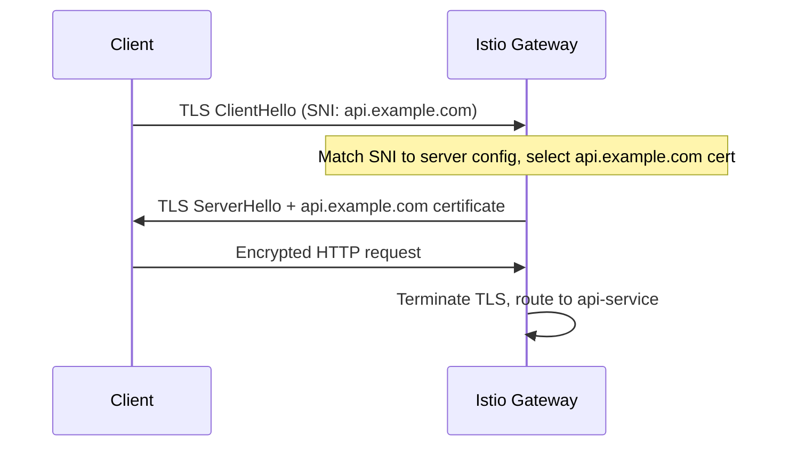

# How to Set Up Multiple TLS Hosts on Istio Ingress Gateway

Author: [nawazdhandala](https://github.com/nawazdhandala)

Tags: Istio, TLS, Ingress Gateway, Multi-Host, Kubernetes, HTTPS

Description: Configure the Istio Ingress Gateway to serve multiple TLS-encrypted domains with separate certificates on a single gateway instance.

---

Running multiple HTTPS domains through a single Istio Ingress Gateway is a common requirement. You might have api.example.com, app.example.com, and admin.example.com all pointing to different services, each with its own TLS certificate. Istio handles this using Server Name Indication (SNI), which lets the gateway select the right certificate based on the hostname the client requests.

Setting this up is straightforward, but there are a few details about certificate management and Gateway configuration that you need to get right.

## How Multi-Host TLS Works

When a client connects over HTTPS, the TLS handshake includes an SNI field with the requested hostname. The Istio Ingress Gateway (Envoy under the hood) reads this field and selects the matching certificate and server configuration.



## Step 1: Create TLS Secrets for Each Domain

Each domain needs its own TLS certificate stored as a Kubernetes secret in the `istio-system` namespace (or wherever your ingress gateway runs):

```bash
# Certificate for api.example.com
kubectl create secret tls api-tls \
  --cert=api-fullchain.pem \
  --key=api-privkey.pem \
  -n istio-system

# Certificate for app.example.com
kubectl create secret tls app-tls \
  --cert=app-fullchain.pem \
  --key=app-privkey.pem \
  -n istio-system

# Certificate for admin.example.com
kubectl create secret tls admin-tls \
  --cert=admin-fullchain.pem \
  --key=admin-privkey.pem \
  -n istio-system
```

Verify the secrets:

```bash
kubectl get secrets -n istio-system | grep tls
```

## Step 2: Configure the Gateway with Multiple Servers

Define a server entry for each domain in your Gateway resource. Each server references its own TLS secret:

```yaml
apiVersion: networking.istio.io/v1
kind: Gateway
metadata:
  name: multi-host-gateway
  namespace: default
spec:
  selector:
    istio: ingressgateway
  servers:
    - port:
        number: 443
        name: https-api
        protocol: HTTPS
      tls:
        mode: SIMPLE
        credentialName: api-tls
      hosts:
        - "api.example.com"
    - port:
        number: 443
        name: https-app
        protocol: HTTPS
      tls:
        mode: SIMPLE
        credentialName: app-tls
      hosts:
        - "app.example.com"
    - port:
        number: 443
        name: https-admin
        protocol: HTTPS
      tls:
        mode: SIMPLE
        credentialName: admin-tls
      hosts:
        - "admin.example.com"
```

Important details:

- All servers share port 443. Istio uses SNI to differentiate them.
- Each server entry must have a unique `name`.
- The `credentialName` references the Kubernetes secret for that domain.
- The `hosts` field specifies which hostnames this server handles.

```bash
kubectl apply -f multi-host-gateway.yaml
```

## Step 3: Create VirtualServices for Each Domain

Route traffic from each domain to the appropriate backend services:

```yaml
apiVersion: networking.istio.io/v1
kind: VirtualService
metadata:
  name: api-routes
spec:
  hosts:
    - "api.example.com"
  gateways:
    - multi-host-gateway
  http:
    - match:
        - uri:
            prefix: /v1
      route:
        - destination:
            host: api-service-v1
            port:
              number: 80
    - match:
        - uri:
            prefix: /v2
      route:
        - destination:
            host: api-service-v2
            port:
              number: 80
---
apiVersion: networking.istio.io/v1
kind: VirtualService
metadata:
  name: app-routes
spec:
  hosts:
    - "app.example.com"
  gateways:
    - multi-host-gateway
  http:
    - route:
        - destination:
            host: web-app
            port:
              number: 80
---
apiVersion: networking.istio.io/v1
kind: VirtualService
metadata:
  name: admin-routes
spec:
  hosts:
    - "admin.example.com"
  gateways:
    - multi-host-gateway
  http:
    - route:
        - destination:
            host: admin-panel
            port:
              number: 80
```

```bash
kubectl apply -f virtualservices.yaml
```

## Using a Wildcard Certificate

If all your domains are subdomains of the same parent, you can use a single wildcard certificate:

```bash
kubectl create secret tls wildcard-tls \
  --cert=wildcard-fullchain.pem \
  --key=wildcard-privkey.pem \
  -n istio-system
```

The Gateway config becomes simpler:

```yaml
apiVersion: networking.istio.io/v1
kind: Gateway
metadata:
  name: wildcard-gateway
spec:
  selector:
    istio: ingressgateway
  servers:
    - port:
        number: 443
        name: https
        protocol: HTTPS
      tls:
        mode: SIMPLE
        credentialName: wildcard-tls
      hosts:
        - "*.example.com"
```

All subdomains of example.com share the same certificate. You still create separate VirtualServices for each subdomain to route to different backends.

## Mixing Wildcard and Specific Certificates

Sometimes you need a wildcard for most subdomains but a specific certificate for one:

```yaml
apiVersion: networking.istio.io/v1
kind: Gateway
metadata:
  name: mixed-gateway
spec:
  selector:
    istio: ingressgateway
  servers:
    # Specific certificate for api.example.com
    - port:
        number: 443
        name: https-api
        protocol: HTTPS
      tls:
        mode: SIMPLE
        credentialName: api-specific-tls
      hosts:
        - "api.example.com"
    # Wildcard for everything else
    - port:
        number: 443
        name: https-wildcard
        protocol: HTTPS
      tls:
        mode: SIMPLE
        credentialName: wildcard-tls
      hosts:
        - "*.example.com"
```

Istio matches the most specific hostname first. Requests to api.example.com use the specific cert, and all other subdomains use the wildcard.

## Automating with cert-manager

For production, you do not want to manage certificates manually. Use cert-manager to automatically provision and renew certificates:

```yaml
apiVersion: cert-manager.io/v1
kind: Certificate
metadata:
  name: api-cert
  namespace: istio-system
spec:
  secretName: api-tls
  issuerRef:
    name: letsencrypt-prod
    kind: ClusterIssuer
  dnsNames:
    - api.example.com
---
apiVersion: cert-manager.io/v1
kind: Certificate
metadata:
  name: app-cert
  namespace: istio-system
spec:
  secretName: app-tls
  issuerRef:
    name: letsencrypt-prod
    kind: ClusterIssuer
  dnsNames:
    - app.example.com
---
apiVersion: cert-manager.io/v1
kind: Certificate
metadata:
  name: admin-cert
  namespace: istio-system
spec:
  secretName: admin-tls
  issuerRef:
    name: letsencrypt-prod
    kind: ClusterIssuer
  dnsNames:
    - admin.example.com
```

When cert-manager renews a certificate, it updates the Kubernetes secret. Istio detects the change through SDS and loads the new certificate without a gateway restart.

## Adding HTTP to HTTPS Redirect

You probably want to redirect HTTP traffic to HTTPS for all domains:

```yaml
apiVersion: networking.istio.io/v1
kind: Gateway
metadata:
  name: multi-host-gateway
spec:
  selector:
    istio: ingressgateway
  servers:
    # HTTPS servers (same as before)
    - port:
        number: 443
        name: https-api
        protocol: HTTPS
      tls:
        mode: SIMPLE
        credentialName: api-tls
      hosts:
        - "api.example.com"
    - port:
        number: 443
        name: https-app
        protocol: HTTPS
      tls:
        mode: SIMPLE
        credentialName: app-tls
      hosts:
        - "app.example.com"
    # HTTP redirect for all domains
    - port:
        number: 80
        name: http
        protocol: HTTP
      tls:
        httpsRedirect: true
      hosts:
        - "api.example.com"
        - "app.example.com"
        - "admin.example.com"
```

## Verifying the Configuration

Check that the gateway has loaded all certificates:

```bash
istioctl proxy-config secret <gateway-pod> -n istio-system
```

You should see entries for each `credentialName`.

Test each domain:

```bash
curl -v https://api.example.com/v1/health
curl -v https://app.example.com/
curl -v https://admin.example.com/
```

Verify the correct certificate is served for each domain:

```bash
echo | openssl s_client -connect $INGRESS_IP:443 -servername api.example.com 2>/dev/null | openssl x509 -noout -subject
echo | openssl s_client -connect $INGRESS_IP:443 -servername app.example.com 2>/dev/null | openssl x509 -noout -subject
```

## Troubleshooting

**Wrong certificate served for a domain:**

Check that the `hosts` field in each server entry matches exactly. If you have overlapping hosts between server entries, the wrong certificate might be selected.

**Certificate not found:**

```bash
kubectl get secret <secret-name> -n istio-system
```

Make sure the secret exists in `istio-system` and has the correct keys (`tls.crt` and `tls.key`).

**Gateway not accepting connections on 443:**

```bash
istioctl proxy-config listener <gateway-pod> -n istio-system --port 443
```

If no listener exists on port 443, check the Gateway configuration for errors:

```bash
istioctl analyze
```

Multi-host TLS on the Istio Ingress Gateway scales well. You can add dozens of domains, each with their own certificates, and Istio handles the SNI matching and certificate selection efficiently. Combined with cert-manager for automated renewal, it is a robust setup that requires minimal ongoing maintenance.
