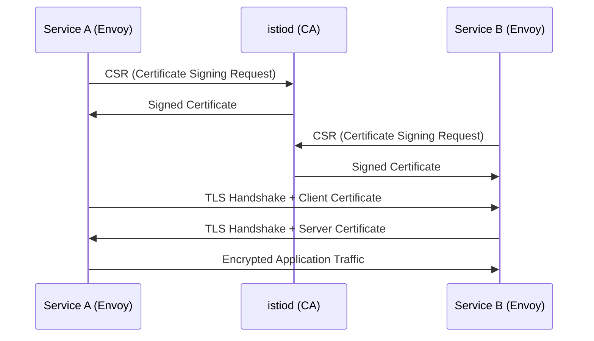

# How to Set Up Mutual Authentication for Microservices with Istio

Author: [nawazdhandala](https://github.com/nawazdhandala)

Tags: Istio, mTLS, Authentication, Security, Kubernetes

Description: Configure mutual TLS authentication between microservices in Istio to verify both client and server identity and encrypt all mesh traffic.

---

Mutual TLS (mTLS) is one of the most powerful security features Istio provides out of the box. In regular TLS, only the server proves its identity to the client. With mutual TLS, both sides present certificates and verify each other. This means every service in your mesh cryptographically proves who it is before communication happens. No more trusting network boundaries - every connection is authenticated and encrypted.

## How Istio mTLS Works

When you install Istio and inject sidecars into your pods, here's what happens behind the scenes:

1. istiod acts as a Certificate Authority and issues X.509 certificates to each workload
2. Each Envoy sidecar gets a certificate tied to the pod's service account identity
3. When service A calls service B, both sidecars exchange certificates and verify them
4. The connection is encrypted with TLS and both identities are established

The identity format follows SPIFFE (Secure Production Identity Framework for Everyone):
`spiffe://cluster.local/ns/<namespace>/sa/<service-account>`



## Enabling Strict mTLS

Istio has three mTLS modes:

- **PERMISSIVE** - accepts both plain text and mTLS traffic (default after installation)
- **STRICT** - only accepts mTLS traffic
- **DISABLE** - no mTLS

The default PERMISSIVE mode is great for migration because services can communicate whether or not they have sidecars. But for production, you want STRICT mode.

To enable strict mTLS across the entire mesh:

```yaml
apiVersion: security.istio.io/v1
kind: PeerAuthentication
metadata:
  name: default
  namespace: istio-system
spec:
  mtls:
    mode: STRICT
```

Applying this in the `istio-system` namespace makes it a mesh-wide policy. Every service must now present a valid mTLS certificate to communicate.

## Namespace-Level mTLS

You might not want strict mTLS everywhere at once, especially during a migration. You can set policies per namespace:

```yaml
apiVersion: security.istio.io/v1
kind: PeerAuthentication
metadata:
  name: default
  namespace: production
spec:
  mtls:
    mode: STRICT
---
apiVersion: security.istio.io/v1
kind: PeerAuthentication
metadata:
  name: default
  namespace: staging
spec:
  mtls:
    mode: PERMISSIVE
```

Production gets strict mTLS while staging stays permissive. This lets you roll out mTLS incrementally.

## Workload-Specific mTLS

Sometimes a specific workload needs different settings. Maybe it receives traffic from an external service that can't do mTLS. You can target individual workloads:

```yaml
apiVersion: security.istio.io/v1
kind: PeerAuthentication
metadata:
  name: legacy-api-exception
  namespace: production
spec:
  selector:
    matchLabels:
      app: legacy-api
  mtls:
    mode: PERMISSIVE
```

You can even set different modes per port:

```yaml
apiVersion: security.istio.io/v1
kind: PeerAuthentication
metadata:
  name: mixed-mode-service
  namespace: production
spec:
  selector:
    matchLabels:
      app: payment-service
  mtls:
    mode: STRICT
  portLevelMtls:
    8080:
      mode: STRICT
    9090:
      mode: PERMISSIVE
```

Port 8080 requires mTLS while port 9090 accepts plain text. This is useful when a service has an internal API (mTLS) and a health check endpoint (plain text from a load balancer that can't do mTLS).

## Configuring DestinationRule for mTLS

PeerAuthentication controls the server side (what the service accepts). DestinationRule controls the client side (what the caller sends). For mTLS to work, both sides need to agree.

Istio auto-configures the client side when you use auto mTLS (enabled by default). But you can also set it explicitly:

```yaml
apiVersion: networking.istio.io/v1
kind: DestinationRule
metadata:
  name: payment-service-mtls
  namespace: production
spec:
  host: payment-service.production.svc.cluster.local
  trafficPolicy:
    tls:
      mode: ISTIO_MUTUAL
```

The `ISTIO_MUTUAL` mode tells Envoy to use the certificates issued by Istio's CA. You don't need to specify certificate paths - Istio handles that automatically.

For services outside the mesh that use regular TLS (not Istio-issued certs):

```yaml
apiVersion: networking.istio.io/v1
kind: DestinationRule
metadata:
  name: external-service-tls
  namespace: production
spec:
  host: external-api.example.com
  trafficPolicy:
    tls:
      mode: MUTUAL
      clientCertificate: /etc/certs/client.pem
      privateKey: /etc/certs/client-key.pem
      caCertificates: /etc/certs/ca.pem
```

## Verifying mTLS is Working

After enabling mTLS, verify it's actually being enforced:

```bash
# Check the mTLS status of your services
istioctl x describe pod <pod-name> -n production
```

This shows whether the pod is using mTLS and which policies apply.

You can also check from the Envoy admin interface:

```bash
# Port-forward to the sidecar admin port
kubectl port-forward <pod-name> 15000:15000 -n production

# Check the clusters configuration
curl localhost:15000/clusters | grep transport_socket
```

Look for `transport_socket_matches` entries that show `tls` - this confirms mTLS is active.

Another way to verify is to try connecting without mTLS from a pod without a sidecar:

```bash
# Deploy a test pod without sidecar injection
kubectl run test-pod --image=curlimages/curl --restart=Never \
  --labels="sidecar.istio.io/inject=false" \
  -- sleep 3600

# Try to call a service with strict mTLS
kubectl exec test-pod -- curl -v http://payment-service.production:8080/health
```

If strict mTLS is working, this request should fail with a connection reset because the test pod can't present a valid certificate.

## Authorization Based on mTLS Identity

Once mTLS establishes service identity, you can write authorization policies based on those identities:

```yaml
apiVersion: security.istio.io/v1
kind: AuthorizationPolicy
metadata:
  name: payment-service-access
  namespace: production
spec:
  selector:
    matchLabels:
      app: payment-service
  rules:
    - from:
        - source:
            principals:
              - cluster.local/ns/production/sa/checkout-service
              - cluster.local/ns/production/sa/order-service
      to:
        - operation:
            methods:
              - POST
              - GET
            paths:
              - /api/payments/*
```

Only the checkout and order services can access the payment service API. Any other service, even with a valid mTLS certificate, gets denied. This is real zero-trust networking - identity-based access control at the network layer.

## Migrating to Strict mTLS

If you're adding Istio to an existing cluster, jumping straight to strict mTLS will break things. Here's a safe migration path:

1. Install Istio with default PERMISSIVE mode
2. Gradually inject sidecars into your workloads
3. Monitor traffic to see what's using mTLS and what's not:

```bash
istioctl experimental authz check <pod-name> -n production
```

4. Once all services have sidecars, switch namespaces to STRICT one at a time
5. After verifying everything works, apply mesh-wide STRICT policy

Keep an eye on the `istio_requests_total` metric filtered by `connection_security_policy`. This tells you whether connections are using `mutual_tls` or `none`:

```promql
sum(rate(istio_requests_total{connection_security_policy="mutual_tls"}[5m])) by (destination_service)
/
sum(rate(istio_requests_total[5m])) by (destination_service)
```

This gives you the percentage of mTLS traffic per service. When it's 100% for all services, you're safe to go strict.

## Troubleshooting mTLS Issues

The most common problem after enabling strict mTLS is services without sidecars failing to connect. Check if the calling pod has a sidecar:

```bash
kubectl get pod <pod-name> -n production -o jsonpath='{.spec.containers[*].name}'
```

If you don't see `istio-proxy` in the container list, the pod doesn't have a sidecar and can't do mTLS.

Another issue is certificate expiration. Check certificate status:

```bash
istioctl proxy-config secret <pod-name> -n production
```

This shows the certificate chain, expiration times, and whether the certificates are valid.

Mutual authentication with Istio gives you encrypted, identity-verified communication between every service in your mesh. Start with PERMISSIVE mode, migrate carefully, and use the identity information for fine-grained authorization policies. It's one of the biggest security wins you get from running a service mesh.
