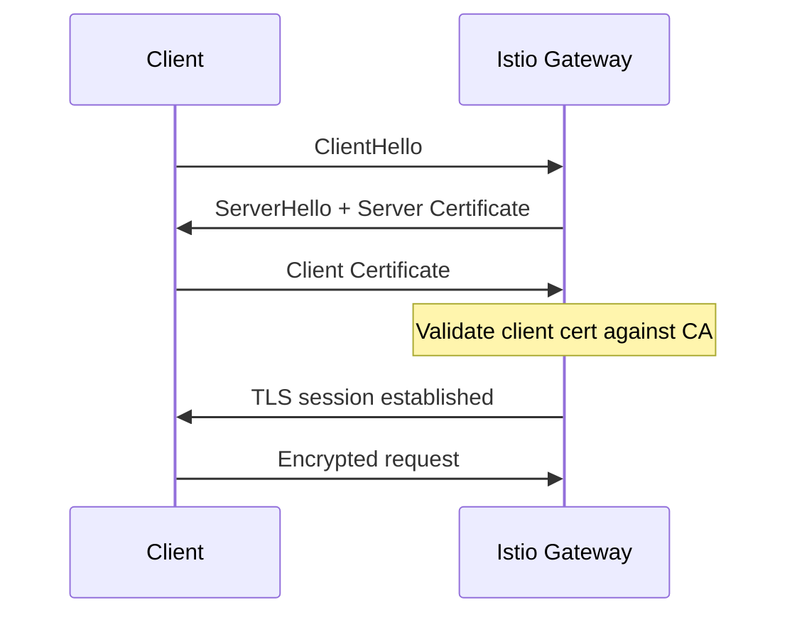

# How to Set Up Mutual TLS at Istio Ingress Gateway

Author: [nawazdhandala](https://github.com/nawazdhandala)

Tags: Istio, Mutual TLS, mTLS, Gateway, Security, Kubernetes

Description: Complete guide to configuring mutual TLS at the Istio Ingress Gateway for client certificate authentication.

---

Mutual TLS (mTLS) at the Istio Ingress Gateway means both the server and the client present certificates during the TLS handshake. The server proves its identity to the client (like regular TLS), and the client also proves its identity to the server. This is commonly used for API-to-API communication, IoT devices, and any scenario where you need strong client authentication at the network level.

## How Mutual TLS Differs from Regular TLS

In standard TLS, only the server presents a certificate. The client validates the server but the server does not verify the client. With mutual TLS, both sides exchange and validate certificates.



If the client does not present a valid certificate signed by the expected CA, the gateway rejects the connection before any traffic reaches your services.

## Setting Up Certificates

For mutual TLS, you need three things:

1. A server certificate and key for the gateway
2. A CA certificate that was used to sign client certificates
3. Client certificates signed by that CA

Generate a CA:

```bash
openssl req -x509 -sha256 -nodes -days 365 -newkey rsa:2048 \
  -subj '/O=MyOrg/CN=MyCA' \
  -keyout ca.key \
  -out ca.crt
```

Generate the server certificate:

```bash
openssl req -out server.csr -newkey rsa:2048 -nodes \
  -keyout server.key \
  -subj "/CN=api.example.com/O=MyOrg"

openssl x509 -req -sha256 -days 365 \
  -CA ca.crt -CAkey ca.key -CAcreateserial \
  -in server.csr \
  -out server.crt
```

Generate a client certificate:

```bash
openssl req -out client.csr -newkey rsa:2048 -nodes \
  -keyout client.key \
  -subj "/CN=my-client/O=MyOrg"

openssl x509 -req -sha256 -days 365 \
  -CA ca.crt -CAkey ca.key -CAcreateserial \
  -in client.csr \
  -out client.crt
```

## Creating Kubernetes Secrets

You need two secrets. The first holds the server certificate:

```bash
kubectl create secret tls api-server-credential \
  --cert=server.crt \
  --key=server.key \
  -n istio-system
```

The second holds the CA certificate used to validate client certificates. This needs to be a generic secret with a specific key name:

```bash
kubectl create secret generic api-server-credential-cacert \
  --from-file=ca.crt=ca.crt \
  -n istio-system
```

Important: The CA secret name must follow the pattern `<credentialName>-cacert`. Istio looks for this naming convention to find the CA certificate for client validation.

## Configuring the Gateway for Mutual TLS

Set the TLS mode to `MUTUAL`:

```yaml
apiVersion: networking.istio.io/v1
kind: Gateway
metadata:
  name: mtls-gateway
spec:
  selector:
    istio: ingressgateway
  servers:
  - port:
      number: 443
      name: https
      protocol: HTTPS
    hosts:
    - "api.example.com"
    tls:
      mode: MUTUAL
      credentialName: api-server-credential
```

The `mode: MUTUAL` tells the gateway to require client certificates. Istio automatically looks for the CA certificate in the `api-server-credential-cacert` secret.

## Creating the VirtualService

The VirtualService is the same as any other HTTPS configuration:

```yaml
apiVersion: networking.istio.io/v1
kind: VirtualService
metadata:
  name: api-vs
spec:
  hosts:
  - "api.example.com"
  gateways:
  - mtls-gateway
  http:
  - route:
    - destination:
        host: api-service
        port:
          number: 8080
```

## Testing Mutual TLS

Test with a valid client certificate:

```bash
export GATEWAY_IP=$(kubectl -n istio-system get service istio-ingressgateway \
  -o jsonpath='{.status.loadBalancer.ingress[0].ip}')

curl -v --resolve "api.example.com:443:$GATEWAY_IP" \
  --cacert ca.crt \
  --cert client.crt \
  --key client.key \
  "https://api.example.com/"
```

Now test without a client certificate - this should fail:

```bash
curl -v --resolve "api.example.com:443:$GATEWAY_IP" \
  --cacert ca.crt \
  "https://api.example.com/"
```

You should see a TLS handshake error because the gateway requires a client certificate and none was provided.

## Optional Mutual TLS

If you want client certificates to be validated when present but not required, use `OPTIONAL_MUTUAL`:

```yaml
apiVersion: networking.istio.io/v1
kind: Gateway
metadata:
  name: optional-mtls-gateway
spec:
  selector:
    istio: ingressgateway
  servers:
  - port:
      number: 443
      name: https
      protocol: HTTPS
    hosts:
    - "api.example.com"
    tls:
      mode: OPTIONAL_MUTUAL
      credentialName: api-server-credential
```

With `OPTIONAL_MUTUAL`, clients without certificates can still connect but clients that do present certificates have them validated against the CA. This is useful for gradual migration to mutual TLS.

## Accessing Client Certificate Information

After the gateway validates the client certificate, it can forward certificate details to your service via headers. Istio adds these headers automatically:

- `X-Forwarded-Client-Cert` (XFCC) - Contains the client certificate details

Your application can read this header to determine the client identity:

```bash
# The XFCC header contains fields like:
# By=<server cert URI>;Hash=<cert hash>;Subject="CN=my-client,O=MyOrg";URI=<client URI>
```

You can use this in your application for fine-grained authorization based on the client identity.

## Using Multiple Client CAs

If you have clients with certificates from different CAs, bundle all CA certificates into a single file:

```bash
cat ca1.crt ca2.crt ca3.crt > combined-ca.crt

kubectl create secret generic api-server-credential-cacert \
  --from-file=ca.crt=combined-ca.crt \
  -n istio-system
```

The gateway will accept client certificates signed by any of the CAs in the bundle.

## Revoking Client Certificates

Istio does not natively support Certificate Revocation Lists (CRLs) or OCSP at the gateway level. If you need to revoke a client certificate, your options are:

1. Remove the CA that signed it from the CA bundle (affects all certs from that CA)
2. Use short-lived certificates and stop issuing new ones for revoked clients
3. Implement application-level checking of the client identity from the XFCC header

Short-lived certificates with automated rotation (using tools like cert-manager or Vault) are generally the best approach.

## Troubleshooting Mutual TLS

**Error: "certificate required"**

The client is not sending a certificate. Make sure you pass `--cert` and `--key` in curl.

**Error: "certificate verify failed"**

The client certificate was not signed by a CA in the `cacert` secret. Verify the chain:

```bash
openssl verify -CAfile ca.crt client.crt
```

**Secret naming issues**

Double check that your CA secret follows the naming pattern. If your `credentialName` is `api-server-credential`, the CA secret must be `api-server-credential-cacert`.

```bash
kubectl get secrets -n istio-system | grep api-server
```

**Check gateway logs**

```bash
kubectl logs deploy/istio-ingressgateway -n istio-system --tail=50
```

Look for TLS-related errors in the log output.

Mutual TLS at the ingress gateway is one of the strongest forms of client authentication you can implement. It prevents unauthorized clients from even establishing a connection, which is significantly more secure than relying on API keys or tokens alone. The overhead is manageable once you have certificate distribution sorted out, and tools like cert-manager can automate most of the lifecycle.
