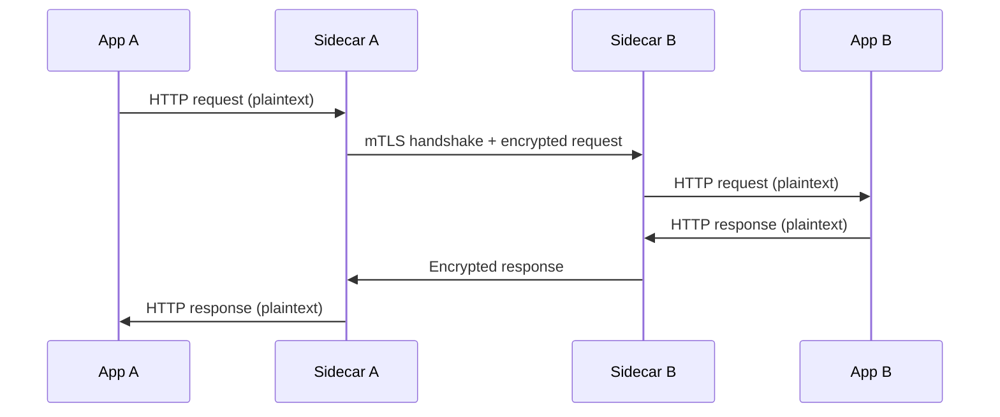

# How to Set Up Mutual TLS Between Services in Istio

Author: [nawazdhandala](https://github.com/nawazdhandala)

Tags: Istio, mTLS, Security, Service Mesh, Zero Trust

Description: A practical walkthrough for setting up mutual TLS between services in Istio, from permissive mode to strict enforcement with troubleshooting tips.

---

Mutual TLS (mTLS) is probably the single most impactful security feature Istio provides. With mTLS, both sides of a connection present certificates and verify each other's identity. This means service A knows it is really talking to service B (and not something pretending to be service B), and service B knows the request really came from service A.

Istio makes mTLS almost automatic. The sidecars handle certificate provisioning, rotation, and the TLS handshake without your application code knowing about it. But "almost automatic" still requires some configuration and understanding to get right, especially during migration.

## How mTLS Works in Istio

When service A calls service B, the following happens:

1. Service A's application sends a plain HTTP request to localhost (the sidecar intercepts it)
2. Service A's sidecar initiates a TLS handshake with service B's sidecar
3. Both sidecars exchange certificates and verify them against the mesh CA
4. The TLS connection is established with both identities verified
5. Service A's sidecar sends the request over the encrypted connection
6. Service B's sidecar receives the request, terminates TLS, and forwards plain HTTP to the application



## Starting with Permissive Mode

When you first install Istio, mTLS is in permissive mode by default. This means sidecars accept both mTLS and plaintext connections. This is essential during migration because not all services will have sidecars immediately.

Check the current mTLS mode:

```bash
kubectl get peerauthentication --all-namespaces
```

If no PeerAuthentication policies exist, the default permissive mode is in effect.

You can explicitly set permissive mode:

```yaml
apiVersion: security.istio.io/v1
kind: PeerAuthentication
metadata:
  name: default
  namespace: istio-system
spec:
  mtls:
    mode: PERMISSIVE
```

## Verifying mTLS is Working

Even in permissive mode, sidecars will use mTLS when talking to other sidecars. Verify this with:

```bash
# Check if mTLS is active between two services
istioctl x describe pod <pod-name> -n <namespace>
```

The output will show something like:

```
Pod: httpbin-xxxx
   Pod Revision: default
   Pod Ports: 8080(httpbin), 15090(istio-proxy)
Suggestion: add 'version' label to pod for Istio telemetry.
--------------------
Service: httpbin
   Port: http 8080/HTTP targets pod port 8080
--------------------
Effective PeerAuthentication:
   default/istio-system (PERMISSIVE)
```

You can also check the actual TLS status of connections:

```bash
istioctl proxy-config cluster <pod-name> -n <namespace> -o json | \
  jq '.[] | select(.name | contains("httpbin")) | {name: .name, transport: .transportSocket.name}'
```

If you see `envoy.transport_sockets.tls`, mTLS is being used for that connection.

## Enabling Strict mTLS

Once all your services have sidecars, switch to strict mode. Start with a single namespace to test:

```yaml
apiVersion: security.istio.io/v1
kind: PeerAuthentication
metadata:
  name: default
  namespace: production
spec:
  mtls:
    mode: STRICT
```

Apply and test:

```bash
kubectl apply -f strict-mtls.yaml

# Test from a pod with a sidecar (should work)
kubectl exec <pod-with-sidecar> -c <container> -- curl http://service-in-production:8080

# Test from a pod without a sidecar (should fail)
kubectl exec <pod-without-sidecar> -- curl http://service-in-production:8080
```

The second command should fail with a connection reset, because the pod without a sidecar cannot provide a client certificate.

## Mesh-Wide Strict mTLS

After testing per-namespace, enable strict mTLS across the entire mesh:

```yaml
apiVersion: security.istio.io/v1
kind: PeerAuthentication
metadata:
  name: default
  namespace: istio-system
spec:
  mtls:
    mode: STRICT
```

This policy in the `istio-system` namespace applies to all namespaces in the mesh.

## Exceptions for Specific Workloads

Some workloads might need exceptions. For example, a service that receives health checks from a Kubernetes component without a sidecar:

```yaml
apiVersion: security.istio.io/v1
kind: PeerAuthentication
metadata:
  name: health-check-exception
  namespace: production
spec:
  selector:
    matchLabels:
      app: my-service
  mtls:
    mode: STRICT
  portLevelMtls:
    8081:
      mode: PERMISSIVE
```

This keeps strict mTLS on all ports except 8081, which accepts both mTLS and plaintext. This is handy for health check endpoints that need to be accessible from the kubelet.

## Configuring the Client Side

With PeerAuthentication, you configure the server side (how sidecars accept connections). The client side is handled automatically by Istio - when a sidecar detects that the destination has mTLS available, it uses mTLS.

If you need to explicitly control the client behavior, use a DestinationRule:

```yaml
apiVersion: networking.istio.io/v1
kind: DestinationRule
metadata:
  name: payment-service
  namespace: production
spec:
  host: payment-service.production.svc.cluster.local
  trafficPolicy:
    tls:
      mode: ISTIO_MUTUAL
```

`ISTIO_MUTUAL` tells the sidecar to use Istio-provisioned certificates for mTLS. You rarely need this explicitly because Istio auto-detects it, but it is useful for debugging or when auto-detection behaves unexpectedly.

## Migration Strategy

The recommended migration path looks like this:

1. Install Istio with default permissive mTLS
2. Gradually add sidecars to all namespaces
3. Verify mTLS is working between sidecar-enabled services
4. Enable strict mTLS per namespace, starting with non-critical namespaces
5. Monitor for connection failures and add exceptions as needed
6. Enable mesh-wide strict mTLS

```bash
# Monitor for mTLS issues during migration
istioctl analyze --all-namespaces 2>&1 | grep -i "mtls\|tls\|authentication"
```

## Troubleshooting mTLS Issues

**Connection refused after enabling strict mTLS**: The most common issue. A client without a sidecar is trying to connect to a service with strict mTLS. Either add a sidecar to the client or create a permissive exception.

```bash
# Find pods without sidecars
kubectl get pods --all-namespaces -o json | \
  jq -r '.items[] | select(.spec.containers | length == 1) | .metadata.namespace + "/" + .metadata.name'
```

**503 errors between services**: Check that both source and destination have valid certificates:

```bash
# Check source certificate
istioctl proxy-config secret <source-pod>

# Check destination certificate
istioctl proxy-config secret <destination-pod>
```

Both should show ACTIVE status with valid certificates.

**mTLS not being used despite configuration**: Verify there is no conflicting DestinationRule:

```bash
kubectl get destinationrules --all-namespaces -o yaml | grep -A5 "tls:"
```

A DestinationRule with `mode: DISABLE` will override PeerAuthentication settings for outbound connections.

**Certificate errors in logs**: Check the istio-proxy container logs:

```bash
kubectl logs <pod-name> -c istio-proxy | grep -i "tls\|cert\|ssl"
```

Common certificate errors include expired certificates (check NTP sync), unknown CA (check root certificate distribution), and certificate SAN mismatch.

## Monitoring mTLS in Production

Track mTLS adoption across your mesh using Prometheus metrics:

```bash
# Query for connections using mTLS
istio_tcp_connections_opened_total{connection_security_policy="mutual_tls"}

# Query for connections NOT using mTLS
istio_tcp_connections_opened_total{connection_security_policy="none"}
```

Set up alerts for any plaintext connections in namespaces where strict mTLS is expected. This catches configuration drift early.

Getting mTLS right in Istio is mostly about patience during migration and thoroughness in testing. Once everything is on strict mode, you have encrypted and authenticated communication across your entire mesh without changing a single line of application code. That is a massive security improvement for relatively little effort.
