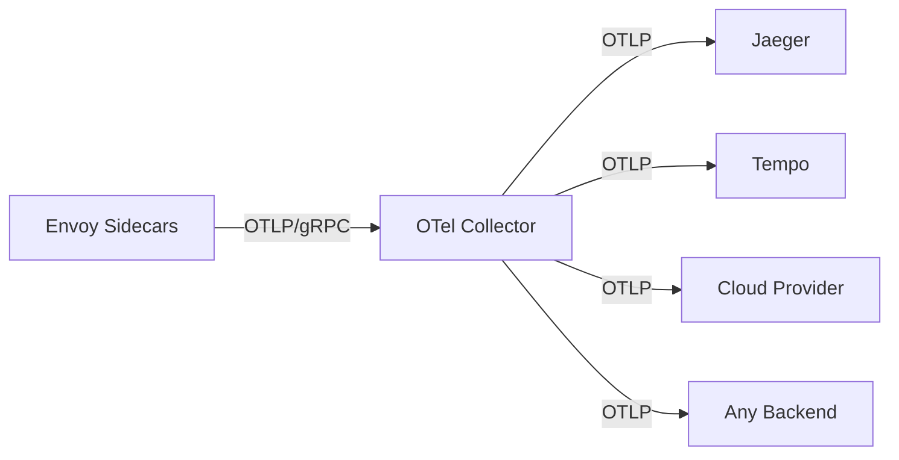

# How to Set Up OpenTelemetry Tracing with Istio

Author: [nawazdhandala](https://github.com/nawazdhandala)

Tags: Istio, OpenTelemetry, Tracing, OTLP, Observability

Description: How to configure Istio to use OpenTelemetry for distributed tracing, including collector setup, OTLP export, and backend integration.

---

OpenTelemetry has become the industry standard for observability instrumentation. Rather than locking yourself into a specific tracing backend's protocol, OpenTelemetry gives you a vendor-neutral way to collect and export traces. Istio supports OpenTelemetry natively, and the combination is powerful - you get automatic span generation from the mesh plus the flexibility to send traces to any backend that speaks OTLP.

## Why OpenTelemetry Instead of Zipkin/Jaeger Directly?

When you configure Istio to send traces directly to Jaeger via the Zipkin protocol, you're coupling your mesh configuration to a specific backend. If you later want to switch to Grafana Tempo, Datadog, or any other system, you need to reconfigure Istio.

With OpenTelemetry, the architecture looks like this:



The OpenTelemetry Collector sits between your mesh and your backends. It can transform, filter, sample, and route traces to multiple destinations simultaneously. Want to send traces to both Jaeger and Datadog? The collector handles that without any changes to Istio.

## Deploying the OpenTelemetry Collector

First, deploy the OpenTelemetry Collector to your cluster:

```yaml
apiVersion: v1
kind: ConfigMap
metadata:
  name: otel-collector-config
  namespace: observability
data:
  config.yaml: |
    receivers:
      otlp:
        protocols:
          grpc:
            endpoint: 0.0.0.0:4317
          http:
            endpoint: 0.0.0.0:4318

    processors:
      batch:
        timeout: 5s
        send_batch_size: 1024
        send_batch_max_size: 2048
      memory_limiter:
        check_interval: 5s
        limit_mib: 512
        spike_limit_mib: 128

    exporters:
      otlp/jaeger:
        endpoint: jaeger-collector.observability:4317
        tls:
          insecure: true
      debug:
        verbosity: basic

    service:
      pipelines:
        traces:
          receivers: [otlp]
          processors: [memory_limiter, batch]
          exporters: [otlp/jaeger, debug]
---
apiVersion: apps/v1
kind: Deployment
metadata:
  name: otel-collector
  namespace: observability
spec:
  replicas: 2
  selector:
    matchLabels:
      app: otel-collector
  template:
    metadata:
      labels:
        app: otel-collector
    spec:
      containers:
        - name: collector
          image: otel/opentelemetry-collector-contrib:0.96.0
          args:
            - --config=/conf/config.yaml
          ports:
            - containerPort: 4317
              name: otlp-grpc
            - containerPort: 4318
              name: otlp-http
          volumeMounts:
            - name: config
              mountPath: /conf
          resources:
            requests:
              cpu: 250m
              memory: 256Mi
            limits:
              cpu: "1"
              memory: 512Mi
      volumes:
        - name: config
          configMap:
            name: otel-collector-config
---
apiVersion: v1
kind: Service
metadata:
  name: otel-collector
  namespace: observability
spec:
  selector:
    app: otel-collector
  ports:
    - name: otlp-grpc
      port: 4317
      targetPort: 4317
    - name: otlp-http
      port: 4318
      targetPort: 4318
```

```bash
kubectl create namespace observability
kubectl apply -f otel-collector.yaml
```

## Configuring Istio for OpenTelemetry

Now configure Istio to send traces via OTLP to the collector:

```yaml
apiVersion: install.istio.io/v1alpha1
kind: IstioOperator
spec:
  meshConfig:
    enableTracing: true
    extensionProviders:
      - name: otel-tracing
        opentelemetry:
          service: otel-collector.observability.svc.cluster.local
          port: 4317
```

Activate it with a Telemetry resource:

```yaml
apiVersion: telemetry.istio.io/v1
kind: Telemetry
metadata:
  name: otel-tracing
  namespace: istio-system
spec:
  tracing:
    - providers:
        - name: otel-tracing
      randomSamplingPercentage: 100
```

For an existing installation, update the mesh config and restart:

```bash
# Edit the configmap
kubectl edit configmap istio -n istio-system

# Restart istiod
kubectl rollout restart deployment/istiod -n istio-system

# Restart workloads to pick up new proxy config
kubectl rollout restart deployment -n my-app
```

## Adding Resource Attributes

You can add custom resource attributes to all spans generated by the mesh. This is useful for identifying the cluster, environment, or any other metadata:

```yaml
apiVersion: install.istio.io/v1alpha1
kind: IstioOperator
spec:
  meshConfig:
    extensionProviders:
      - name: otel-tracing
        opentelemetry:
          service: otel-collector.observability.svc.cluster.local
          port: 4317
          resourceDetectors:
            environment: {}
```

You can also set resource attributes through the Telemetry API:

```yaml
apiVersion: telemetry.istio.io/v1
kind: Telemetry
metadata:
  name: otel-tracing
  namespace: istio-system
spec:
  tracing:
    - providers:
        - name: otel-tracing
      randomSamplingPercentage: 50
      customTags:
        environment:
          literal:
            value: production
        cluster:
          literal:
            value: us-east-1
```

## Multi-Backend Export

One of the biggest advantages of the OTel Collector is sending traces to multiple backends. Update the collector config:

```yaml
exporters:
  otlp/jaeger:
    endpoint: jaeger-collector.observability:4317
    tls:
      insecure: true
  otlp/tempo:
    endpoint: tempo.observability:4317
    tls:
      insecure: true
  otlphttp/datadog:
    endpoint: https://trace.agent.datadoghq.com
    headers:
      DD-API-KEY: ${env:DD_API_KEY}

service:
  pipelines:
    traces:
      receivers: [otlp]
      processors: [memory_limiter, batch]
      exporters: [otlp/jaeger, otlp/tempo, otlphttp/datadog]
```

All three backends receive the same traces without any changes to your Istio configuration.

## Collector-Side Sampling

The OTel Collector can apply tail-based sampling, which is more intelligent than the head-based sampling that Istio does. With tail-based sampling, the collector makes sampling decisions after seeing the complete trace, so it can always keep traces that contain errors:

```yaml
processors:
  tail_sampling:
    decision_wait: 10s
    num_traces: 100000
    expected_new_traces_per_sec: 1000
    policies:
      - name: errors
        type: status_code
        status_code:
          status_codes:
            - ERROR
      - name: slow-traces
        type: latency
        latency:
          threshold_ms: 2000
      - name: percentage
        type: probabilistic
        probabilistic:
          sampling_percentage: 5

service:
  pipelines:
    traces:
      receivers: [otlp]
      processors: [memory_limiter, tail_sampling, batch]
      exporters: [otlp/jaeger]
```

To make this work, set Istio's sampling rate to 100% so all spans reach the collector, then let the collector decide what to keep:

```yaml
apiVersion: telemetry.istio.io/v1
kind: Telemetry
metadata:
  name: otel-tracing
  namespace: istio-system
spec:
  tracing:
    - providers:
        - name: otel-tracing
      randomSamplingPercentage: 100
```

This does mean more data flows from Envoy to the collector, so size your collector appropriately.

## Processing and Filtering Spans

The collector can also modify spans before exporting them:

```yaml
processors:
  attributes:
    actions:
      - key: http.request.header.authorization
        action: delete
      - key: environment
        value: production
        action: upsert
  filter:
    traces:
      span:
        - 'attributes["http.route"] == "/healthz"'
        - 'attributes["http.route"] == "/readyz"'
```

This removes sensitive headers from spans and drops health check traces entirely.

## Verifying the Setup

Check that traces are flowing:

```bash
# Verify the collector is receiving spans
kubectl logs deploy/otel-collector -n observability | grep "TracesExported"

# Check the collector's metrics
kubectl port-forward svc/otel-collector -n observability 8888:8888
curl http://localhost:8888/metrics | grep otelcol_exporter_sent_spans

# Generate test traffic
kubectl exec deploy/sleep -- curl -s http://httpbin:8000/get

# Check the collector logs for the span
kubectl logs deploy/otel-collector -n observability --tail=20
```

## Scaling the Collector

For high-traffic meshes, run the collector as a DaemonSet or scale the Deployment:

```yaml
apiVersion: apps/v1
kind: Deployment
metadata:
  name: otel-collector
  namespace: observability
spec:
  replicas: 5
  selector:
    matchLabels:
      app: otel-collector
  template:
    spec:
      containers:
        - name: collector
          image: otel/opentelemetry-collector-contrib:0.96.0
          resources:
            requests:
              cpu: "1"
              memory: 1Gi
            limits:
              cpu: "2"
              memory: 2Gi
```

Use the `loadbalancing` exporter if you need tail-based sampling across multiple collector instances, since that requires all spans from a trace to arrive at the same instance.

## Troubleshooting

If no spans reach the collector:

```bash
# Check Envoy's tracing config
istioctl proxy-config bootstrap deploy/my-app -o json | grep -A15 opentelemetry

# Verify the collector is listening
kubectl exec deploy/my-app -c istio-proxy -- \
  curl -s http://otel-collector.observability:4317

# Check for gRPC connectivity issues
kubectl logs deploy/my-app -c istio-proxy | grep -i "trace\|otel\|grpc"
```

If spans arrive at the collector but not at the backend, check the collector logs for export errors:

```bash
kubectl logs deploy/otel-collector -n observability | grep -i "error\|failed\|dropped"
```

## Summary

OpenTelemetry with Istio gives you a future-proof tracing setup. The OTel Collector acts as a flexible middleman that can route traces to any backend, apply intelligent sampling, filter sensitive data, and scale independently from your mesh. The initial setup is slightly more involved than a direct Zipkin/Jaeger integration, but the flexibility pays off quickly, especially in environments where observability requirements evolve over time.
