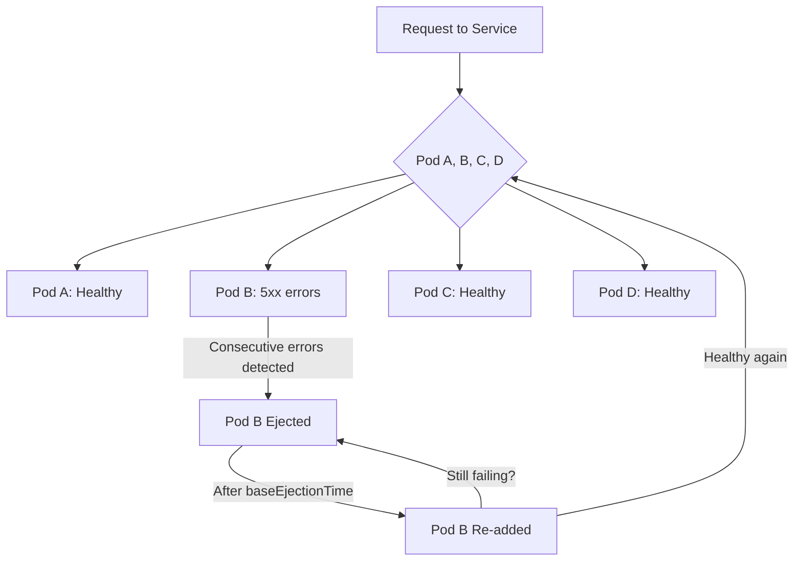

# How to Set Up Outlier Detection in Istio DestinationRule

Author: [nawazdhandala](https://github.com/nawazdhandala)

Tags: Istio, Outlier Detection, DestinationRule, Circuit Breaking, Kubernetes

Description: Configure outlier detection in Istio DestinationRule to automatically eject unhealthy endpoints and improve service reliability.

---

Outlier detection is Istio's mechanism for automatically removing unhealthy pods from the load balancing pool. When a pod starts returning errors or becomes slow, outlier detection detects the problem and temporarily stops sending traffic to it. After a cooldown period, the pod is added back and monitored again.

This is different from Kubernetes readiness probes. Readiness probes check health at the kubelet level, and they take time to react. Outlier detection happens at the Envoy proxy level and can react in seconds. It also looks at actual traffic patterns rather than synthetic health check endpoints.

## How Outlier Detection Works



Envoy tracks the responses from each endpoint. When an endpoint hits the configured error threshold, it gets ejected from the pool. After the ejection time expires, it gets added back. If it keeps failing, the ejection time increases exponentially.

## Basic Configuration

Here is a straightforward outlier detection setup:

```yaml
apiVersion: networking.istio.io/v1
kind: DestinationRule
metadata:
  name: my-service-outlier
spec:
  host: my-service
  trafficPolicy:
    outlierDetection:
      consecutive5xxErrors: 5
      interval: 10s
      baseEjectionTime: 30s
      maxEjectionPercent: 50
```

What each field does:

- **consecutive5xxErrors**: Number of consecutive 5xx errors before a pod is ejected. Set to 5 means the pod must fail 5 times in a row.
- **interval**: How often Envoy evaluates the outlier detection criteria. Every 10 seconds in this example.
- **baseEjectionTime**: How long a pod stays ejected before being added back. Gets multiplied by the number of times the pod has been ejected.
- **maxEjectionPercent**: Maximum percentage of pods that can be ejected at the same time. Setting this to 50 means at least half your pods will always remain in the pool.

## Understanding consecutive5xxErrors

This is the most commonly used detection criterion. Envoy counts consecutive (back-to-back) 5xx responses from an endpoint. The counter resets to zero whenever a successful response comes through.

"Consecutive" is important here. If a pod returns: 200, 500, 200, 500, 200, 500, the consecutive error count never exceeds 1. But if it returns: 200, 500, 500, 500, 500, 500, the count reaches 5 and the pod gets ejected.

The value of `consecutive5xxErrors` is evaluated at each `interval`. So with an interval of 10 seconds and `consecutive5xxErrors: 5`, the pod must have 5 consecutive errors within the time it takes Envoy to check.

## Using consecutiveGatewayErrors

Sometimes you want to only eject pods that return gateway errors (502, 503, 504) rather than all 5xx errors. A 500 Internal Server Error might be a bug in your code that affects all pods equally, but a 503 likely means that specific pod is overloaded:

```yaml
apiVersion: networking.istio.io/v1
kind: DestinationRule
metadata:
  name: my-service-gateway-outlier
spec:
  host: my-service
  trafficPolicy:
    outlierDetection:
      consecutiveGatewayErrors: 3
      interval: 10s
      baseEjectionTime: 30s
      maxEjectionPercent: 50
```

Use `consecutiveGatewayErrors` when your service occasionally returns 500 errors that are not related to the health of a specific pod.

## Ejection Time Escalation

The actual ejection time is calculated as:

```text
actual_ejection_time = baseEjectionTime * number_of_times_ejected
```

If `baseEjectionTime` is 30 seconds:
- First ejection: 30 seconds
- Second ejection: 60 seconds
- Third ejection: 90 seconds
- And so on...

This escalation prevents a flapping pod from being constantly ejected and re-added. Each time it fails again, it stays out longer.

## maxEjectionPercent - Your Safety Net

The `maxEjectionPercent` field prevents outlier detection from ejecting all your pods. If you have 4 pods and `maxEjectionPercent: 50`, at most 2 pods can be ejected at any time.

This is critical for availability. If all pods are having problems (maybe a shared dependency is down), ejecting all of them means zero capacity. Keeping at least some pods in the pool ensures requests can still flow, even if some fail.

For small clusters (2-3 pods), consider setting this lower:

```yaml
maxEjectionPercent: 30
```

For larger clusters (10+ pods), you can be more aggressive:

```yaml
maxEjectionPercent: 70
```

## A Production-Ready Configuration

Here is what I would recommend for a production API service:

```yaml
apiVersion: networking.istio.io/v1
kind: DestinationRule
metadata:
  name: api-service-production
spec:
  host: api-service
  trafficPolicy:
    outlierDetection:
      consecutive5xxErrors: 5
      consecutiveGatewayErrors: 3
      interval: 10s
      baseEjectionTime: 30s
      maxEjectionPercent: 40
    connectionPool:
      tcp:
        maxConnections: 200
      http:
        http1MaxPendingRequests: 50
```

This detects both general 5xx errors and gateway errors, with gateway errors having a lower threshold since they more strongly indicate a pod-specific problem.

## Testing Outlier Detection

Deploy a service where you can control failures:

```bash
kubectl apply -f - <<EOF
apiVersion: apps/v1
kind: Deployment
metadata:
  name: flaky-service
spec:
  replicas: 4
  selector:
    matchLabels:
      app: flaky-service
  template:
    metadata:
      labels:
        app: flaky-service
    spec:
      containers:
      - name: app
        image: nginx:latest
        ports:
        - containerPort: 80
---
apiVersion: v1
kind: Service
metadata:
  name: flaky-service
spec:
  selector:
    app: flaky-service
  ports:
  - name: http
    port: 80
    targetPort: 80
EOF
```

Apply the outlier detection rule:

```bash
kubectl apply -f - <<EOF
apiVersion: networking.istio.io/v1
kind: DestinationRule
metadata:
  name: flaky-service-outlier
spec:
  host: flaky-service
  trafficPolicy:
    outlierDetection:
      consecutive5xxErrors: 3
      interval: 5s
      baseEjectionTime: 15s
      maxEjectionPercent: 50
EOF
```

Now crash one of the pods (exec in and kill nginx) and observe that after 3 consecutive errors, Envoy stops sending traffic to it.

## Monitoring Ejections

Check outlier detection stats:

```bash
kubectl exec <pod> -c istio-proxy -- curl -s localhost:15000/stats | grep outlier
```

Key metrics:
- `outlier_detection.ejections_active` - Currently ejected hosts
- `outlier_detection.ejections_total` - Total ejections since startup
- `outlier_detection.ejections_overflow` - Ejections blocked by maxEjectionPercent
- `outlier_detection.ejections_consecutive_5xx` - Ejections triggered by consecutive 5xx

You can also check endpoint health through istioctl:

```bash
istioctl proxy-config endpoint <pod-name> --cluster "outbound|80||flaky-service.default.svc.cluster.local"
```

Ejected endpoints show as UNHEALTHY in the output.

## Cleanup

```bash
kubectl delete destinationrule flaky-service-outlier
kubectl delete deployment flaky-service
kubectl delete service flaky-service
```

Outlier detection is one of the most valuable features of Istio's traffic management. It automatically protects your service from unhealthy pods without any application code changes. Configure it for every production service, start with conservative thresholds, and tighten them based on your service's behavior.
