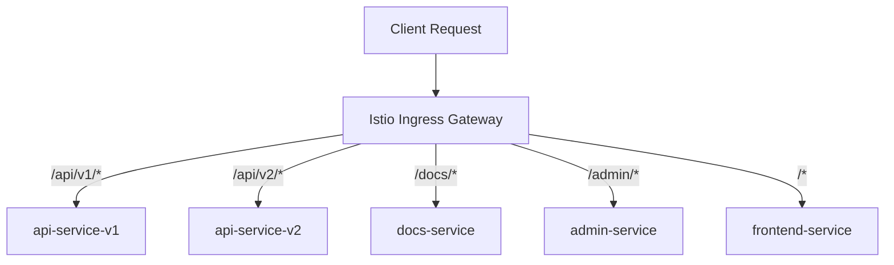

# How to Set Up Path-Based Routing at Istio Ingress Gateway

Author: [nawazdhandala](https://github.com/nawazdhandala)

Tags: Istio, Path-Based Routing, Ingress Gateway, VirtualService, Kubernetes

Description: Configure path-based routing at the Istio Ingress Gateway to route requests to different backend services based on URL path patterns.

---

Path-based routing is one of the most common patterns at the ingress layer. You have a single domain, and different URL paths go to different backend services. The API lives at `/api`, the frontend at `/`, the documentation at `/docs`, and the admin panel at `/admin`. Each of these is a separate service in your cluster, and the Istio Ingress Gateway routes traffic to the right one based on the request path.

This is straightforward to set up with Istio's VirtualService resource, and there are some useful nuances around path matching types, path rewriting, and ordering that are worth understanding.

## Basic Path-Based Routing

Start with a Gateway that accepts traffic for your domain:

```yaml
apiVersion: networking.istio.io/v1
kind: Gateway
metadata:
  name: main-gateway
spec:
  selector:
    istio: ingressgateway
  servers:
    - port:
        number: 80
        name: http
        protocol: HTTP
      hosts:
        - "myapp.example.com"
    - port:
        number: 443
        name: https
        protocol: HTTPS
      tls:
        mode: SIMPLE
        credentialName: myapp-tls
      hosts:
        - "myapp.example.com"
```

Now create a VirtualService with path-based rules:

```yaml
apiVersion: networking.istio.io/v1
kind: VirtualService
metadata:
  name: myapp-routing
spec:
  hosts:
    - "myapp.example.com"
  gateways:
    - main-gateway
  http:
    - match:
        - uri:
            prefix: /api/v1
      route:
        - destination:
            host: api-service-v1
            port:
              number: 80
    - match:
        - uri:
            prefix: /api/v2
      route:
        - destination:
            host: api-service-v2
            port:
              number: 80
    - match:
        - uri:
            prefix: /docs
      route:
        - destination:
            host: docs-service
            port:
              number: 80
    - match:
        - uri:
            prefix: /admin
      route:
        - destination:
            host: admin-service
            port:
              number: 80
    - match:
        - uri:
            prefix: /
      route:
        - destination:
            host: frontend-service
            port:
              number: 80
```

```bash
kubectl apply -f main-gateway.yaml
kubectl apply -f myapp-routing.yaml
```

Now:
- `myapp.example.com/api/v1/users` goes to api-service-v1
- `myapp.example.com/api/v2/users` goes to api-service-v2
- `myapp.example.com/docs/getting-started` goes to docs-service
- `myapp.example.com/admin/dashboard` goes to admin-service
- `myapp.example.com/anything-else` goes to frontend-service

## Path Matching Types

Istio supports three types of path matching:

### Prefix Match

Matches any path that starts with the given string:

```yaml
- match:
    - uri:
        prefix: /api
```

This matches `/api`, `/api/`, `/api/users`, `/api/users/123`, and even `/api-docs` (because the string `/api-docs` starts with `/api`).

### Exact Match

Matches the exact path string:

```yaml
- match:
    - uri:
        exact: /health
```

This only matches `/health`. It does not match `/health/`, `/health/deep`, or `/healthz`.

### Regex Match

Matches against a regular expression:

```yaml
- match:
    - uri:
        regex: "/api/v[0-9]+/.*"
```

This matches `/api/v1/users`, `/api/v2/orders`, `/api/v99/anything`, and so on.

Use regex sparingly. Prefix and exact matches are more efficient because Envoy can optimize them with a prefix tree, while regex requires pattern evaluation for each request.

## Rule Ordering Matters

Istio evaluates rules from top to bottom and uses the first match. This means more specific rules must come before more general ones:

```yaml
http:
  # Specific path first
  - match:
      - uri:
          prefix: /api/v2
    route:
      - destination:
          host: api-v2-service
  # More general path second
  - match:
      - uri:
          prefix: /api
    route:
      - destination:
          host: api-v1-service
  # Catch-all last
  - match:
      - uri:
          prefix: /
    route:
      - destination:
          host: frontend-service
```

If you put the `/api` rule before `/api/v2`, all v2 requests would match the `/api` rule and go to the wrong service.

## Path Rewriting

Sometimes your backend service expects a different path than what the client sends. For example, clients request `/api/v1/users`, but the backend service just expects `/users`.

```yaml
- match:
    - uri:
        prefix: /api/v1
  rewrite:
    uri: /
  route:
    - destination:
        host: api-service-v1
        port:
          number: 80
```

With this config, a request to `/api/v1/users` gets rewritten to `/users` before being sent to api-service-v1. The `rewrite.uri` replaces the matched prefix.

More specific rewrite examples:

```yaml
# /api/v1/users -> /users
- match:
    - uri:
        prefix: /api/v1
  rewrite:
    uri: /
  route:
    - destination:
        host: api-service

# /docs/getting-started -> /getting-started
- match:
    - uri:
        prefix: /docs
  rewrite:
    uri: /
  route:
    - destination:
        host: docs-service

# /old-path/page -> /new-path/page
- match:
    - uri:
        prefix: /old-path
  rewrite:
    uri: /new-path
  route:
    - destination:
        host: backend-service
```

## Combining Path and Header Matching

You can match on both path and headers simultaneously:

```yaml
- match:
    - uri:
        prefix: /api
      headers:
        x-api-key:
          exact: "internal-key-123"
  route:
    - destination:
        host: internal-api-service
        port:
          number: 80
- match:
    - uri:
        prefix: /api
  route:
    - destination:
        host: public-api-service
        port:
          number: 80
```

API requests with the internal key go to a different service than public API requests.

## Path-Based Traffic Splitting

You can combine path matching with weight-based routing for canary deployments on specific paths:

```yaml
- match:
    - uri:
        prefix: /api/v2
  route:
    - destination:
        host: api-service-v2-stable
        port:
          number: 80
      weight: 90
    - destination:
        host: api-service-v2-canary
        port:
          number: 80
      weight: 10
```

90% of traffic to `/api/v2` goes to the stable version, and 10% goes to the canary.

## Routing Architecture



## Adding Timeouts and Retries Per Path

Different paths might need different timeout and retry settings:

```yaml
- match:
    - uri:
        prefix: /api/v1/reports
  timeout: 60s
  retries:
    attempts: 2
    perTryTimeout: 30s
  route:
    - destination:
        host: api-service-v1
        port:
          number: 80
- match:
    - uri:
        prefix: /api/v1
  timeout: 5s
  retries:
    attempts: 3
    perTryTimeout: 2s
  route:
    - destination:
        host: api-service-v1
        port:
          number: 80
```

The reports endpoint gets a longer timeout (60 seconds) because reports take time to generate. Regular API endpoints get a 5-second timeout with 3 retries.

## Testing Path Routing

Verify routing is working for each path:

```bash
INGRESS_IP=$(kubectl get svc -n istio-system istio-ingressgateway -o jsonpath='{.status.loadBalancer.ingress[0].ip}')

curl -H "Host: myapp.example.com" http://$INGRESS_IP/api/v1/health
curl -H "Host: myapp.example.com" http://$INGRESS_IP/api/v2/health
curl -H "Host: myapp.example.com" http://$INGRESS_IP/docs/
curl -H "Host: myapp.example.com" http://$INGRESS_IP/admin/
curl -H "Host: myapp.example.com" http://$INGRESS_IP/
```

Check the routing configuration on the gateway:

```bash
istioctl proxy-config route <gateway-pod> -n istio-system -o json
```

This shows all the route rules Envoy has loaded, including path matching and destination information.

## Troubleshooting

**404 Not Found for a path:**

Check that the VirtualService is attached to the correct gateway and that the host matches:

```bash
istioctl analyze -n default
```

**Wrong service receiving traffic:**

Check rule ordering. More specific rules must come before general ones.

**Path rewrite not working:**

Make sure the `rewrite.uri` field is on the same rule as the `match`. Also check that the backend actually serves content at the rewritten path.

**Regex match too slow:**

Replace regex with prefix matching where possible. If you must use regex, keep the patterns simple.

Path-based routing at the Istio Ingress Gateway is the foundation of a well-organized microservices setup. It lets you present a single domain to users while routing to many different services behind the scenes. Get the rule ordering right, use path rewriting when needed, and you have a clean, maintainable routing configuration.
