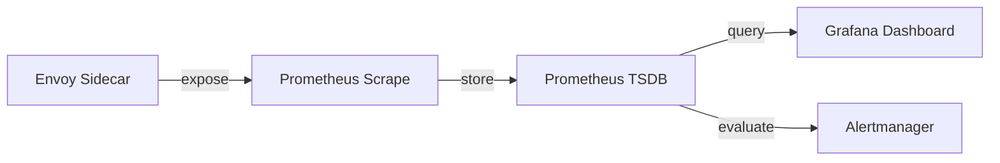

# How to Set Up Real-Time Monitoring with Istio Metrics

Author: [nawazdhandala](https://github.com/nawazdhandala)

Tags: Istio, Real-Time Monitoring, Prometheus, Grafana, Observability

Description: How to build a real-time monitoring setup for Istio service mesh with live dashboards, streaming metrics, and fast alerting.

---

When something goes wrong in production, you want to know about it right now, not in five minutes. Real-time monitoring with Istio means getting metrics from your Envoy sidecars to your dashboards and alert systems as fast as possible, while keeping the system stable and not overwhelming your infrastructure.

This guide covers how to tune your entire Istio metrics pipeline for real-time visibility.

## The Metrics Pipeline

To understand where latency enters your monitoring pipeline, consider the full path a metric takes:



Each step introduces delay:
1. Envoy updates metrics counters immediately on each request
2. Prometheus scrapes endpoints at a configured interval (default: 15s)
3. Prometheus evaluates rules at a configured interval (default: 15s)
4. Grafana refreshes dashboards at a configured interval (default: varies)

The total delay from a request happening to seeing it on a dashboard can be 30-60 seconds with default settings. Here is how to bring that down.

## Tuning Prometheus Scrape Interval

The biggest source of delay is the Prometheus scrape interval. To reduce it:

```yaml
apiVersion: monitoring.coreos.com/v1
kind: Prometheus
metadata:
  name: prometheus
  namespace: monitoring
spec:
  scrapeInterval: 10s
  evaluationInterval: 10s

  additionalScrapeConfigs:
    name: additional-scrape-configs
    key: prometheus-additional.yaml
```

For the Istio-specific scrape job:

```yaml
# prometheus-additional.yaml
- job_name: 'istio-proxy'
  scrape_interval: 10s
  scrape_timeout: 8s
  kubernetes_sd_configs:
    - role: pod
  relabel_configs:
    - source_labels: [__meta_kubernetes_pod_container_name]
      action: keep
      regex: istio-proxy
    - source_labels: [__address__]
      action: replace
      regex: ([^:]+)(?::\d+)?
      replacement: $1:15090
      target_label: __address__
    - source_labels: [__meta_kubernetes_namespace]
      target_label: namespace
    - source_labels: [__meta_kubernetes_pod_name]
      target_label: pod
    - source_labels: [__meta_kubernetes_pod_label_app]
      target_label: app
  metric_relabel_configs:
    - source_labels: [__name__]
      regex: 'istio_requests_total|istio_request_duration_milliseconds_bucket|istio_request_duration_milliseconds_sum|istio_request_duration_milliseconds_count'
      action: keep
```

The `metric_relabel_configs` section is critical for real-time setups. By only keeping the metrics you actually need, you reduce scrape time and storage load, which lets you scrape more frequently without performance issues.

Going below 10 seconds for scrape interval is generally not recommended. At 5s, the load on Prometheus increases substantially, especially in large meshes. If you need sub-10-second visibility, consider a streaming approach instead.

## Configuring Fast Rule Evaluation

Alert rules should evaluate at the same frequency as your scrape interval:

```yaml
apiVersion: monitoring.coreos.com/v1
kind: PrometheusRule
metadata:
  name: istio-realtime-alerts
  namespace: monitoring
spec:
  groups:
    - name: istio-realtime
      interval: 10s
      rules:
        - record: istio:realtime_error_rate
          expr: |
            sum(rate(istio_requests_total{response_code=~"5.."}[1m])) by (destination_service)
            /
            sum(rate(istio_requests_total[1m])) by (destination_service)

        - record: istio:realtime_request_rate
          expr: |
            sum(rate(istio_requests_total[1m])) by (destination_service)

        - record: istio:realtime_p99
          expr: |
            histogram_quantile(0.99,
              sum(rate(istio_request_duration_milliseconds_bucket[1m])) by (destination_service, le)
            )

        - alert: IstioRealtimeErrorSpike
          expr: |
            istio:realtime_error_rate > 0.05
            and
            istio:realtime_request_rate > 5
          for: 30s
          labels:
            severity: critical
          annotations:
            summary: "Real-time error spike: {{ $labels.destination_service }}"
            description: "Error rate is {{ $value | humanizePercentage }}"
```

Note the `for: 30s` on the alert. With a 10s evaluation interval, this means the condition must be true for 3 consecutive evaluations before firing, which filters out single-scrape anomalies.

## Grafana Real-Time Dashboard Configuration

### Auto-Refresh Settings

Set your Grafana dashboard to refresh every 10 seconds. In the dashboard settings, set the refresh interval to `10s` and the default time range to "Last 15 minutes".

### Streaming Queries

For truly real-time panels, use Grafana's streaming data source if your Prometheus implementation supports it. Standard Prometheus does not support streaming, but Mimir and Thanos have experimental support.

For standard Prometheus, configure panels with:

```promql
# Use a 1m rate window for responsive graphs
istio:realtime_request_rate
```

Use `$__rate_interval` for automatic window sizing:

```promql
sum(rate(istio_requests_total[$__rate_interval])) by (destination_service)
```

### Key Dashboard Panels

**Live Request Rate:**

```promql
sum(rate(istio_requests_total[1m])) by (destination_service)
```

Panel type: Time series. Set to show only the last 15 minutes with 10s refresh.

**Live Error Rate Billboard:**

```promql
istio:realtime_error_rate{destination_service=~"$service"} * 100
```

Panel type: Stat. Set thresholds with red > 5%, yellow > 1%, green otherwise. Use "Last" as the reduction function.

**Live P99 Latency:**

```promql
istio:realtime_p99{destination_service=~"$service"}
```

Panel type: Stat with sparkline enabled. Set the unit to milliseconds.

**Service Status Grid:**

Create a grid showing all services with color-coded status:

```promql
# Green if error rate < 0.1%, yellow < 1%, red > 1%
istio:realtime_error_rate * 100
```

Panel type: State timeline or Status history. This gives you an at-a-glance view of the entire mesh.

## Live Tail with Istio Access Logs

For real-time debugging, combine metrics with live access log tailing:

```bash
# Stream access logs from a specific service
kubectl logs -f deploy/my-service -c istio-proxy --tail=0
```

Or use a label selector to stream logs from all pods of a service:

```bash
kubectl logs -f -l app=my-service -c istio-proxy --tail=0 --max-log-requests=20
```

## Setting Up Alertmanager for Fast Notifications

Fast scraping and evaluation do not help if your alerts are slow to deliver. Configure Alertmanager for fast notification:

```yaml
apiVersion: v1
kind: ConfigMap
metadata:
  name: alertmanager-config
  namespace: monitoring
data:
  alertmanager.yml: |
    global:
      resolve_timeout: 1m

    route:
      receiver: 'slack-critical'
      group_by: ['alertname', 'destination_service']
      group_wait: 10s
      group_interval: 30s
      repeat_interval: 4h
      routes:
        - match:
            severity: critical
          receiver: 'pagerduty-critical'
          group_wait: 0s
          group_interval: 10s

    receivers:
      - name: 'slack-critical'
        slack_configs:
          - api_url: 'https://hooks.slack.com/services/...'
            channel: '#alerts'
            title: '{{ .GroupLabels.alertname }}'
            text: '{{ range .Alerts }}{{ .Annotations.description }}{{ end }}'

      - name: 'pagerduty-critical'
        pagerduty_configs:
          - service_key: '<YOUR_PD_KEY>'
```

Key settings for fast alerting:
- `group_wait: 0s` for critical alerts - send immediately, do not wait to batch
- `group_interval: 10s` - check for new alerts in the group every 10 seconds
- `resolve_timeout: 1m` - resolve alerts quickly once the condition clears

## Resource Considerations

Running a real-time monitoring stack requires more resources than a relaxed setup:

- **Prometheus CPU** increases roughly linearly with scrape frequency. Halving the scrape interval doubles the load.
- **Prometheus memory** increases with the number of active time series. Filtering metrics early keeps this manageable.
- **Network bandwidth** between pods and Prometheus increases with scrape frequency.
- **Grafana** can struggle with many panels refreshing every 10 seconds. Keep real-time dashboards focused with fewer panels.

A reasonable resource allocation for a real-time Istio monitoring stack in a 100-service mesh:

```yaml
# Prometheus
resources:
  requests:
    cpu: 2
    memory: 8Gi
  limits:
    memory: 12Gi

# Grafana
resources:
  requests:
    cpu: 500m
    memory: 512Mi
```

## When Real-Time Matters (and When It Does not)

Not everything needs 10-second monitoring. Save real-time scraping for:

- Customer-facing API gateways
- Payment processing services
- Authentication services
- Critical data pipeline endpoints

Internal batch jobs, cron tasks, and development namespaces can stick with 30-60 second scrape intervals. This two-tier approach gives you fast monitoring where it counts without blowing up your monitoring infrastructure costs.

Real-time Istio monitoring is about tuning every stage of the pipeline - from scrape interval to dashboard refresh to alert delivery. Get each piece right and you will have sub-minute visibility into your entire mesh.
