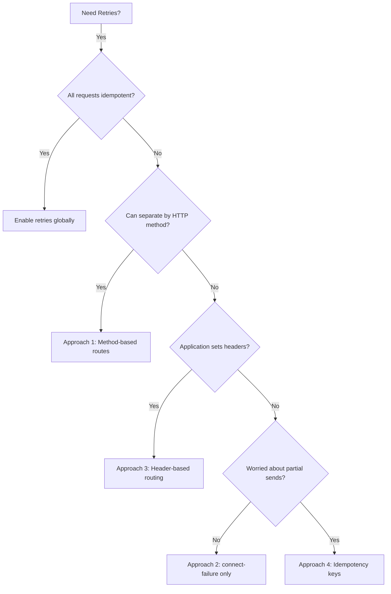

# How to Set Up Retries for Idempotent Requests Only in Istio

Author: [nawazdhandala](https://github.com/nawazdhandala)

Tags: Istio, Service Mesh, Retries, Idempotency, Kubernetes

Description: How to configure Istio to only retry idempotent HTTP methods like GET and PUT while avoiding dangerous retries on non-idempotent POST requests.

---

Retrying a failed GET request is harmless. Retrying a failed POST that creates an order? That could mean double-charging a customer. Istio does not natively distinguish between idempotent and non-idempotent requests in its retry configuration, but you can set things up so that only safe-to-retry requests actually get retried. This post covers several approaches.

## Why Idempotency Matters for Retries

An idempotent operation produces the same result whether you run it once or ten times. GET, PUT, DELETE, and HEAD are considered idempotent by the HTTP specification. POST and PATCH are not - calling them multiple times can produce different results each time.

When a POST request to create a payment fails with a 503, the server might have processed the request before crashing. Retrying means the payment could go through twice. This is the kind of bug that keeps engineers up at night.

## Approach 1: Separate Routes by HTTP Method

The cleanest approach is to define separate HTTP routes in your VirtualService for different HTTP methods. Retries apply per-route, so you can configure retries only on routes that match idempotent methods.

```yaml
apiVersion: networking.istio.io/v1beta1
kind: VirtualService
metadata:
  name: payment-service
  namespace: default
spec:
  hosts:
    - payment-service
  http:
    # Route for idempotent methods - retries enabled
    - match:
        - method:
            exact: GET
      route:
        - destination:
            host: payment-service
            port:
              number: 8080
      retries:
        attempts: 3
        perTryTimeout: 2s
        retryOn: "gateway-error,connect-failure,refused-stream"
    - match:
        - method:
            exact: PUT
      route:
        - destination:
            host: payment-service
            port:
              number: 8080
      retries:
        attempts: 3
        perTryTimeout: 2s
        retryOn: "gateway-error,connect-failure,refused-stream"
    - match:
        - method:
            exact: DELETE
      route:
        - destination:
            host: payment-service
            port:
              number: 8080
      retries:
        attempts: 2
        perTryTimeout: 2s
        retryOn: "gateway-error,connect-failure"
    # Route for non-idempotent methods - no retries
    - match:
        - method:
            exact: POST
      route:
        - destination:
            host: payment-service
            port:
              number: 8080
      retries:
        attempts: 0
    # Default route - no retries (safe default)
    - route:
        - destination:
            host: payment-service
            port:
              number: 8080
      retries:
        attempts: 0
```

This gives you full control. GET, PUT, and DELETE requests get retries. POST requests and anything else go through without retries.

## Approach 2: Retry Only on Connection Failures for All Methods

A middle-ground approach is to only retry on connection failures rather than HTTP errors. The reasoning is that if the TCP connection never got established, the server never received the request, so it is safe to retry regardless of the HTTP method.

```yaml
apiVersion: networking.istio.io/v1beta1
kind: VirtualService
metadata:
  name: order-service
  namespace: default
spec:
  hosts:
    - order-service
  http:
    - route:
        - destination:
            host: order-service
            port:
              number: 8080
      retries:
        attempts: 2
        perTryTimeout: 2s
        retryOn: "connect-failure"
```

With `connect-failure` as the only retry condition, retries only happen when the TCP connection itself fails. This means the request body was never sent to the server, making it safe to retry even POST requests.

This is not perfect - there are edge cases where a connection failure happens after the request was partially sent - but it covers the vast majority of scenarios.

## Approach 3: Header-Based Retry Control

You can use custom headers to signal whether a request is safe to retry. Your application sets a header indicating idempotency, and you use Istio's header matching to route accordingly.

```yaml
apiVersion: networking.istio.io/v1beta1
kind: VirtualService
metadata:
  name: api-service
  namespace: default
spec:
  hosts:
    - api-service
  http:
    # Requests marked as idempotent get retries
    - match:
        - headers:
            x-idempotent:
              exact: "true"
      route:
        - destination:
            host: api-service
            port:
              number: 8080
      retries:
        attempts: 3
        perTryTimeout: 2s
        retryOn: "gateway-error,connect-failure,refused-stream"
    # Everything else - no retries
    - route:
        - destination:
            host: api-service
            port:
              number: 8080
      retries:
        attempts: 0
```

Your application code would then include the header on requests it knows are safe to retry:

```bash
# This request will be retried on failure
curl -H "x-idempotent: true" http://api-service:8080/users/123

# This request will NOT be retried
curl -X POST http://api-service:8080/orders
```

This approach gives the application full control over retry behavior per-request, which is more flexible than per-method rules.

## Approach 4: Idempotency Keys for POST Requests

Sometimes you want to retry POST requests too, but safely. The standard pattern for this is idempotency keys. The client generates a unique key and sends it with the request. If the server sees the same key twice, it returns the result from the first attempt.

While idempotency key handling is an application-level concern, you can use Istio to enable retries on POST requests that carry an idempotency key:

```yaml
apiVersion: networking.istio.io/v1beta1
kind: VirtualService
metadata:
  name: payment-service
  namespace: default
spec:
  hosts:
    - payment-service
  http:
    # POST with idempotency key - safe to retry
    - match:
        - method:
            exact: POST
          headers:
            idempotency-key:
              regex: ".+"
      route:
        - destination:
            host: payment-service
            port:
              number: 8080
      retries:
        attempts: 2
        perTryTimeout: 3s
        retryOn: "gateway-error,connect-failure"
    # POST without idempotency key - no retries
    - match:
        - method:
            exact: POST
      route:
        - destination:
            host: payment-service
            port:
              number: 8080
      retries:
        attempts: 0
    # GET, PUT, DELETE - retries enabled
    - route:
        - destination:
            host: payment-service
            port:
              number: 8080
      retries:
        attempts: 3
        perTryTimeout: 2s
        retryOn: "gateway-error,connect-failure,refused-stream"
```

The regex match `.+` checks that the `idempotency-key` header exists and has a non-empty value. If it does, retries are enabled for that POST request.

## Decision Flow

Here is a way to think about which approach to use:



## Testing Your Setup

Verify that retries work as expected for different HTTP methods:

```bash
# Test GET request - should retry
kubectl exec deploy/sleep -- curl -v http://payment-service:8080/payments/123

# Test POST request - should NOT retry
kubectl exec deploy/sleep -- curl -v -X POST \
  -d '{"amount": 100}' \
  http://payment-service:8080/payments

# Check Envoy stats for retries
kubectl exec deploy/sleep -c istio-proxy -- \
  curl -s localhost:15000/stats | grep retry
```

The right approach depends on your specific situation, but the important thing is to think about it at all. The default behavior of retrying everything is fine for read-heavy services, but it can cause real damage for services that handle writes and state changes.
